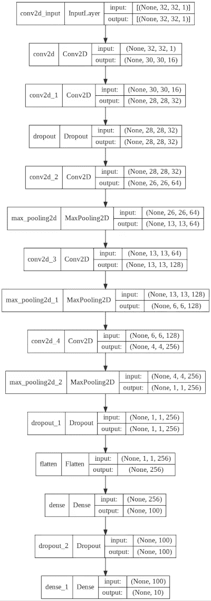

# 快速开始您的联合学习之旅

> 原文：<https://towardsdatascience.com/a-quick-start-on-your-journey-to-federated-learning-c54ef27bc031>

## 使联合学习适应您自己的数据集


照片由 [DeepMind](https://unsplash.com/@deepmind?utm_source=unsplash&utm_medium=referral&utm_content=creditCopyText) 在 [Unsplash](https://unsplash.com/s/photos/large-data?utm_source=unsplash&utm_medium=referral&utm_content=creditCopyText) 上拍摄

在我早先的[帖子](https://medium.com/towards-data-science/how-critical-is-it-for-a-data-scientist-to-adapt-federated-machine-learning-1cd2aaa214ea)中，我从数据科学家的角度描述了联邦学习的重要性。现在，我将使用您自己的数据集让您开始学习 FL。有几个可用的 FL 框架，以及教程和用户指南。然而，在您自己的数据集上调整这些框架并不是一项简单的任务。在这篇文章中，我将为你提供一个简洁的解决方案，用一个流行的框架开始你的外语之旅，那就是 [OpenFL](https://github.com/intel/openfl) 。

# 基础模板

OpenFL 为学习 FL 提供了很好的教程。我们将使用他们的 Keras MNIST [教程](https://github.com/intel/openfl/blob/develop/openfl-tutorials/Federated_Keras_MNIST_Tutorial.ipynb)作为我们的起点。这将是我们进一步实验的模板。我建议你在你的机器上运行本教程，以确保 FL 设置。虽然很多定制是可能的，但我会给你这个模板中需要改变的关键区域，以便开始你的外语之旅。具体来说，我将向您展示:

*   使用另一个影像数据集代替 MNIST。
*   如何搭建自己的 ANN 架构？这是优化您自己的数据集的模型性能所必需的。
*   如何设置联合学习的协作者(参与者)数量？

# 用 CIFAR 代替 MNIST

当您决定在模板中使用另一个数据集时，加载和处理数据的代码就会改变。与 MNIST 一样，CIFAR 在 Keras 中作为内置数据集提供。因此，将这个数据集加载到您的项目中是很简单的。只需将它导入到您的项目中，并调用 *load_data* 方法。

```
from keras.datasets import cifar10
(X_train, y_train), (X_test, y_test) =cifar10.load_data()
```

CIFAR 图像的尺寸为 32x32，而 MNIST 图像的尺寸为 28x28。在数据准备中，您可以将图像缩放到您的人工神经网络输入所需的大小。

```
for index in range(len(images)):
img_list.append(np.resize(tf.image.rgb_to_grayscale(images[index]),(32,32)))
```

CIFAR 的班级数量与 MNIST 相同。因此，没有必要更改 classes 变量的值:

```
classes = 10
```

现在，您已经完成了加载和预处理 CIFAR 数据集的更改，我将向您展示如何更改网络架构。

# 设置网络架构

MNIST 教程在 *build_model* 方法中建立网络架构。我们把它改成外挂我们自己的架构。

```
from tensorflow.keras.layers import MaxPool2D
from tensorflow.keras.layers import Dense, Dropout, Flatten, Conv2D
from tensorflow.keras.layers import MaxPool2D, Activation, MaxPooling2D

def build_model(input_shape,classes):
  model = Sequential()
  model.add(Conv2D(16, kernel_size = 3,kernel_initializer=’he_normal’, activation=’relu’, input_shape = (32, 32, 1)))
  model.add(Conv2D(32, kernel_size = 3,kernel_initializer=’he_normal’, activation=’relu’))
  model.add(Dropout(0.2))
  model.add(Conv2D(64, kernel_size = 3, kernel_initializer=’he_normal’, strides=1, activation=’relu’))
  model.add(MaxPooling2D((2, 2)))
  model.add(Conv2D(128, kernel_size = 3, strides=1, kernel_initializer=’he_normal’ ,padding=’same’, activation=’relu’))
  model.add(MaxPooling2D((2, 2)))
  model.add(Conv2D(256, kernel_size = 3,kernel_initializer=’he_normal’, activation=’relu’))
  model.add(MaxPooling2D((4, 4)))
  model.add(Dropout(0.2))
  model.add(Flatten())
  model.add(Dense(100,kernel_initializer=’he_normal’, activation = “relu”))
  model.add(Dropout(0.1))
  model.add(Dense(10, kernel_initializer=’glorot_uniform’, activation = “softmax”))
  # Compile the model
  model.compile(loss=”categorical_crossentropy”, optimizer=”adam”, metrics=[‘accuracy’])
  return model
```

此处显示的网络图便于您快速查看。



作者图片

您通常会设置自己的体系结构以获得更好的性能以及您正在处理的问题类型。

最后，我将向您展示如何为您的模型训练设置合作者的数量。

# 设置协作者的数量

在联合学习中，最重要的部分是设置将对模型训练做出贡献的参与者的数量。我们只需几行代码就可以做到这一点。

我们在对 *setup* 方法的调用中设置合作者的数量。

```
collaborator_models = fl_model.setup(num_collaborators=5)
```

接下来，您需要为上面指定的 5 个合作者设置合作者数组。

```
collaborators = {‘one’:collaborator_models[0],’two’:collaborator_models[1], ‘three’:collaborator_models[2],’four’:collaborator_models[3],’five’:collaborator_models[4]}
```

数据加载器将整个数据集的适当部分分配给每个模型。您可以使用下面的代码片段检查为模型 4 分配的数据:

```
#Collaborator five’s data
print(f’Collaborator five\’s training data size: {len(collaborator_models[4].data_loader.X_train)}’)
print(f’Collaborator five\’s validation data size: {len(collaborator_models[4].data_loader.X_valid)}\n’)
```

您将看到以下输出:

```
Collaborator five’s training data size: 9000
Collaborator five’s validation data size: 1000
```

现在，您已经为使用联合学习进行模型训练做好了准备。

# 模特培训

在对 training 方法的调用中，您可以将回合数设置为您想要的值。在我的实验中，我把它设定为 20 发。

```
final_fl_model = fx.run_experiment(collaborators,override_config={‘aggregator.settings.rounds_to_train’:20,”data_loader.settings.collaborator_count”: 5})
```

顺便提一下，您模板中的 **plan.yaml** 文件包含几个参数，您可以在 *run_experiment* 方法调用中覆盖这些参数。在上面的语句中，我已经覆盖了 *rounds_to_train* 和 *collaborator_count* 的默认值。

训练模型需要一段时间。训练停止后，保存模型并评估其性能。

整个项目[的源代码](https://github.com/profsarang/Federated-learning-on-custom-dataset)可以在我的 GitHub 上找到。

# 下一步是什么？

要使用您自己的数据集，请将其加载到项目中，进行预处理，设置网络和协作者。完成所有工作后，训练模型。我们在模拟环境中做了这一切。

> 在现实世界中，你如何分享数据和计划？

您需要与每个参与者手动共享 FL 计划和模型代码。我们使用 OpenFL 中的 *export* 命令来完成这项工作。

> 训练重量是如何分摊的？

在联合训练期间，在远程过程调用(RPC)的帮助下，协作者和运行在 OpenFL 后端的聚合器之间进行通信。根据预定义的计划，服务器将特定的任务以及依赖项和初始数据分配给协作者。当协作者完成其训练时，它通过 RPC 与聚合器共享更新的权重。聚合器使用 FL 计划中指定的算法将从各种合作者接收的更新组合成全局模型。然后，服务器与合作者分享新的权重，用于下一轮训练。模型改进过程可以永远继续下去，或者直到我们达到预定的精度水平。

# 结论

当数据隐私非常重要时，联合学习在机器学习中起着至关重要的作用。有几个可用的 FL 框架。现在，您可以使用这样一个流行的框架——OpenFL，快速开始您的 FL 之旅。在本文中，我向您展示了如何在您选择的数据集中使用 OpenFL 提供的基本模板，如何设置自定义 ANN，以及如何设置参与者的数量。为了成功的实际实现，您仍然需要更深入地研究 FL 框架的 API。这份白皮书可能会提供进一步的帮助。祝你好运！

整个项目的[来源](https://github.com/profsarang/Federated-learning-on-custom-dataset)可以在我的 GitHub 上找到。

# 信用

[Jagdish](https://www.linkedin.com/in/jagdish-kharatmol-5abb06190/) Kharatmol(代码开发)

[](https://medium.com/@profsarang/membership) [## 通过我的推荐链接加入 Medium

### 阅读 Poornachandra Sarang(以及媒体上成千上万的其他作家)的每一个故事。您的会员费直接…

medium.com](https://medium.com/@profsarang/membership)