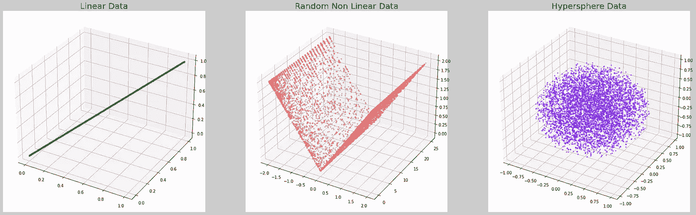
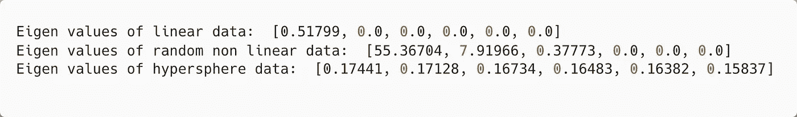
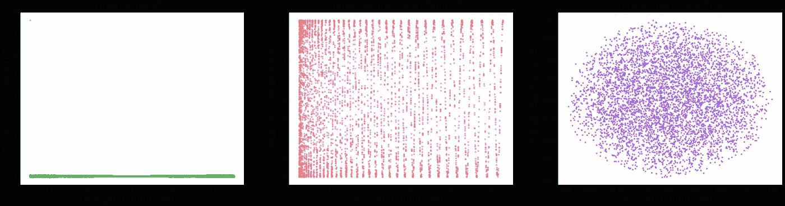

# 检查数据线性的快速方法

> 原文：<https://towardsdatascience.com/a-quick-way-to-check-the-linearity-of-data-9e9cca23f26b>

## 了解如何使用 PCA 来检查数据是线性的还是非线性的

作者图片

当处理新数据时，首先想到的问题是数据的分布。该分布可以是线性的或非线性的。假设我们想将一个 100 维的特征向量压缩到更少的维度。我们可以使用 PCA 或自动编码器来压缩特征。但是，正如我们所知，主成分分析并不适合非线性数据。另一方面，自动编码器可以模拟非线性数据。因此，在数据压缩之前，了解数据是否是线性的是至关重要的。

在这个简短的教程中，我们将看到如何判断数据是否是线性的。利用特征值，我们可以判断数据看起来是线性的还是非线性的。

1.  ***对于线性数据，前几个特征值会明显变大。其余的值将几乎为零。***
2.  ***对于非线性数据，很多主成分会有非零的特征值。特征向量给出了数据最大扩散的方向。现在，如果数据是非线性的，并且不是在单个方向上传播，那么所有的特征向量将具有非零特征值。这是因为没有一个数据传播的大方向。***

为了证明这一点，我们将创建不同的数据分布并计算它们的 PCA。下面是 python 中的一小段代码，用于演示。

**步骤 1:导入 python 库**

**第二步:生成线性数据。**我们将随机生成 6 维线性数据。

**步骤 3:现在，生成随机非线性数据。**

**第四步:** **现在，我们将生成一个 6 维单位超球。**

**第五步:可视化三种数据分布**

原始数据散点图

**第六步:计算 PCA，观察特征值，显示主成分。**

**现在，观察每种情况下的特征值:**

*   *对于线性数据，第一个特征值为 0.51，其余为零。*
*   *对于随机非线性数据，前 3 个特征值具有有效的非零值，然后是零个特征值。*
*   *对于一个单位超球来说，每个方向上的扩散几乎相等。因此，所有特征值都是非零的，并且具有几乎相等的量值。*

原始数据散点图

原始数据的主成分分析散点图

**从该图中我们可以看出线性和非线性数据的 PCA 之间的差异。在线性数据的情况下，图中显示的是一条直线。对于 PC1，PC0 表现出很大的差异。在非线性数据的情况下(中间的和右边的)，在水平和垂直方向上都有扩展。**

完整的代码可以在 GitHub [**这里**](https://github.com/AdityaDutt/PCALinearityCheck) 获得。

我们已经演示了如何通过观察特征值和解释 PCA 图来判断数据是线性还是非线性。

> 我希望这篇文章对你有用！
> 
> 我写这篇文章是因为许多学生发现很难解释 PCA 的输出。要理解算法或模型的工作原理，最好的方法是从观察简单数据集的输出开始。这将有助于获得更多关于算法的直觉。

【https://www.linkedin.com】最初发表于**。**