# NLP 生态系统的悄然转变

> 原文：<https://towardsdatascience.com/a-quiet-shift-in-the-nlp-ecosystem-84672b8ec7af>

## 它已经在运动了…

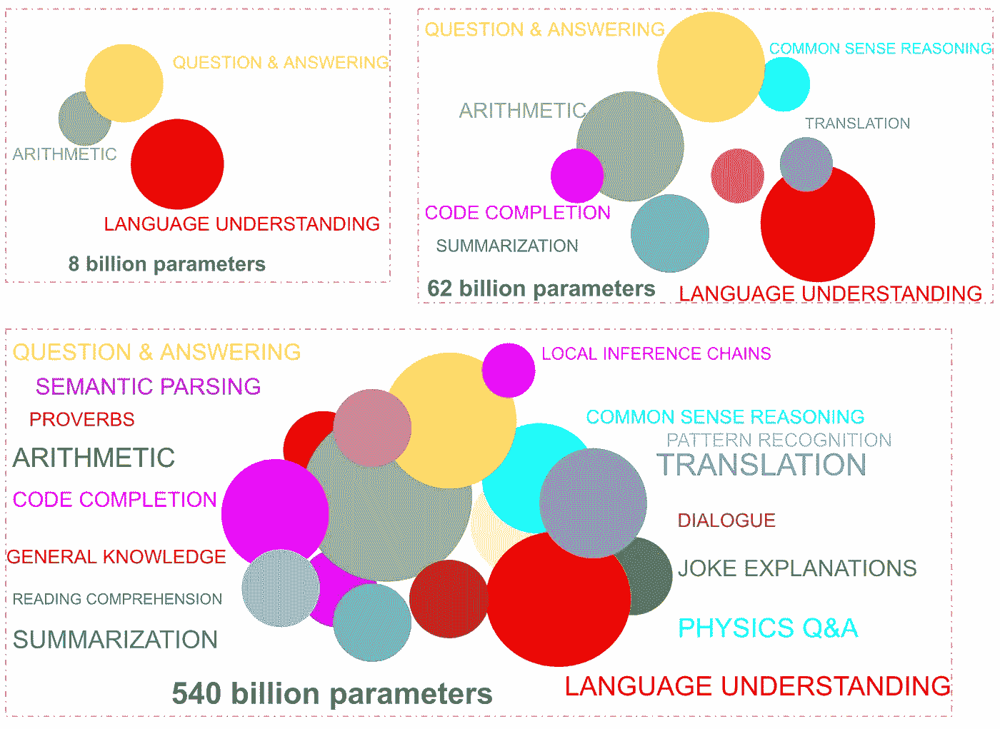

**图一。**随着模型规模的增加，语言模型的**能力的出现和增长的抽象说明。大型语言模型的效用超出了它们生成连贯故事的能力——它们可以用来解决几乎任何 NLP 任务——无论是生成性的还是鉴别性的。这方面的例子有名词短语标注、NER、关系提取、分类、共指消解、语义搜索(句子嵌入)等。此外，对于其中的一些任务，通过微调**，其性能可能足以满足生产用例。** [**作者图片**——使用来自谷歌 PaLM 模型博客](https://ai.googleblog.com/2022/04/pathways-language-model-palm-scaling-to.html)的信息**

# 要旨

几天前发表的一篇论文*(2022 年 6 月 15 日)*提供了对最近大量十亿+参数语言模型令人印象深刻的任务解决能力的关键见解。

> 当满足两个条件时，大型语言模型表现出解决特定任务的能力，这两个条件是:模型参数大小超过 1000 亿，训练量超过 10 次 FLOPS。低于这些阈值，解决这些特定任务的能力实际上是不存在的。

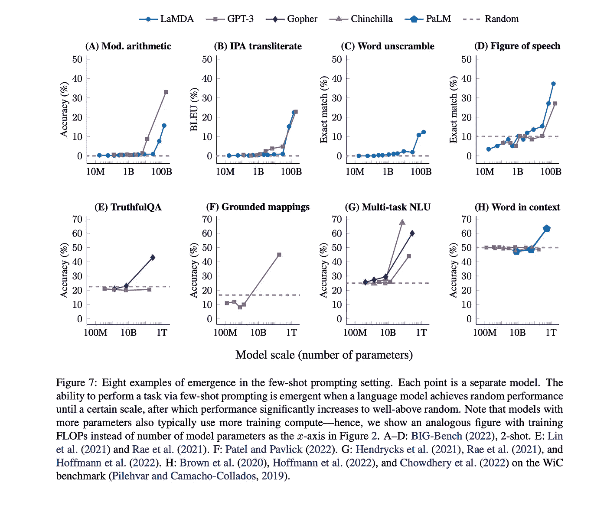

**图二。** [图片来自最近的一篇论文(2022 年 6 月 15 日](https://arxiv.org/pdf/2206.07682v1.pdf)

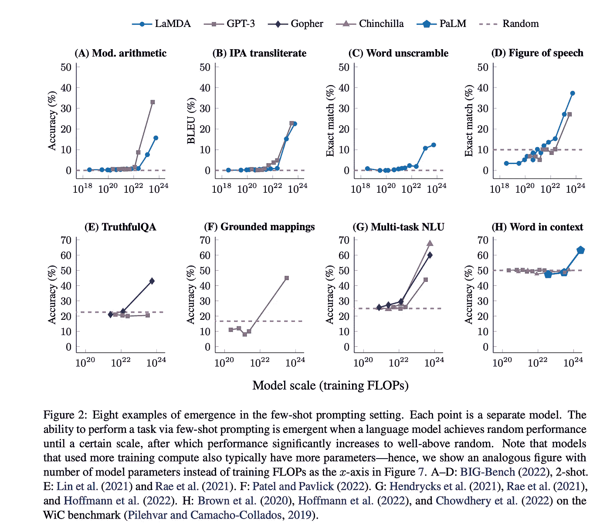

**图 3。来自最近一篇论文的图片(2022 年 6 月 15 日**

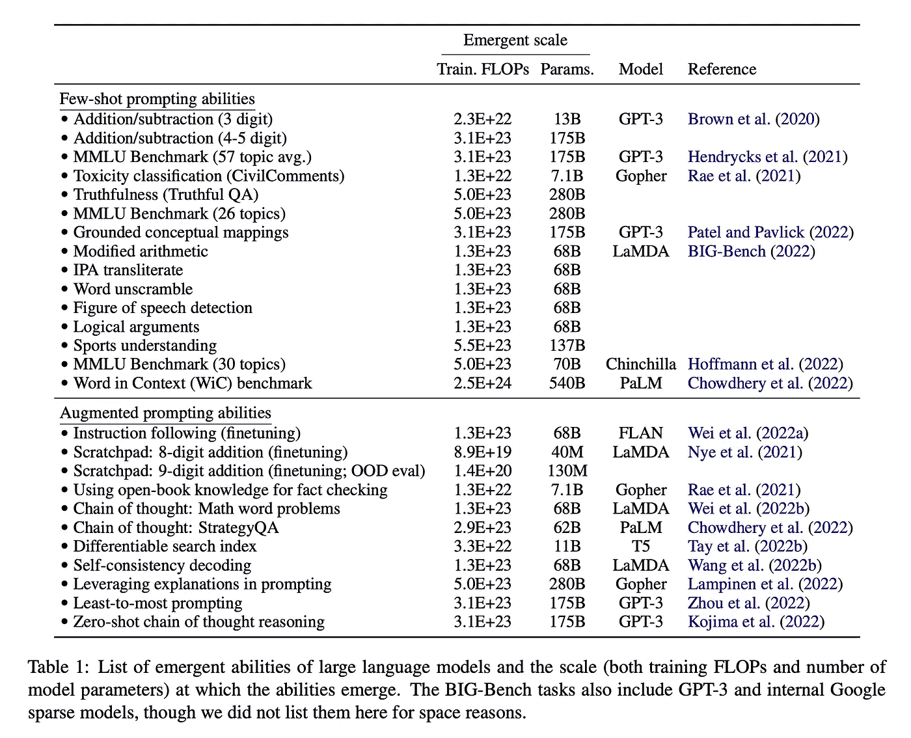

**图 3a。** [图片来自最近的一篇论文(2022 年 6 月 15 日](https://arxiv.org/pdf/2206.07682v1.pdf)

虽然今年早些时候的另一篇论文证实了我们在大型语言模型性能中观察到的情况，即[语言建模性能随着我们增加模型大小、数据大小和计算预算而提高](https://arxiv.org/pdf/2001.08361v1.pdf)，但 6 月 15 日*的这一最新发现(模型大小(和训练 FLOPS)对于某些任务解决能力*的**的出现是必要的)可能会对整个 NLP 生态系统产生影响，该生态系统已经在经历转变以利用这些大型语言模型。**

*   *一个 NLP 从业者必须学会利用这些 LLM*(大型语言模型)*来解决 NLP 任务。例如， **(1)** 如何设计提示以产生任务的最佳性能， **(2)** 用于训练的数据集的最佳大小是多少*(通常是数百个，而传统的 BERT 模型微调是数千个)*以达到期望的性能水平*，* **(3)** 微调的最佳模型选择是什么， 给定特定的任务解决能力，如句子的分类，即使在数亿参数范围内的较小模型中也可以产生期望的模型性能*(模型大小的选择通常是模型性能和训练和推理的成本/时间之间的工程权衡)***【4】***如何准备数据和微调这些模型*(模型权重更新可能通过 API 服务完成) —* 考虑到在生产中使用零触发或少触发学习的低效率和成本影响，这是一个必要的步骤， **(5)** 如何在生产中部署这些模型*(同样可能通过 API 服务)*和部署成本 *(API 提供商根据令牌计数收费。 另一种选择是托管一个用于推理的微调模型，即使可用，其本身也可能是每年数万个)。***
*   **NLP 研究人员现在不得不面对这样一个事实，即进行 NLP 研究的能力可能会集中在极少数能够负担得起训练这种模型的商业组织或资金充足的教育机构中，因为训练这些大型模型的成本高达数百万美元，远远高于通常可用于研究的拨款金额。**
*   **以解决自然语言处理任务为主要业务的自然语言处理公司被迫整合这些大型语言模型的功能，否则将面临变得无关紧要的风险。也许这并不奇怪，即使是像 HuggingFace 这样相对较新的 NLP 参赛者，尽管它在短时间内积累了令人印象深刻的 50k+语言和图像模型，也正在进入大型语言模型训练的竞争——自 3 月 26 日以来，在 384 个 GPU 上已经进行了 1760 亿参数[模型训练。此外，HuggingFace 托管了几十亿+参数模型用于推理，如 GPT-2、GPT-J-6B、GPT-Neox-20B*(*](https://bigscience.notion.site/BLOOM-BigScience-176B-Model-ad073ca07cdf479398d5f95d88e218c4)[*GPT-Neox-20B spaces demo*](https://huggingface.co/spaces/Gradio-Blocks/zero-and-few-shot-reasoning)*发布在 HuggingFace 上，声明由于托管这样一个开放公共使用的大型模型的挑战，偶尔会出现错误输出)*。一些初创公司已经开始利用大型语言模型的能力，提供“ *NLP 作为 API 服务*”。为了展示他们的新产品，他们向公众展示了*游乐场*来尝试这些大型模型，因为在大多数情况下，不可能在 Google Colab 或单个 GPU 机器上按需加载它们。例如， [Co:here](https://docs.cohere.ai/) 刚刚推出了一个类似于 [OpenAI 的](https://beta.openai.com/playground)游乐场的游乐场——其中至少有一些模型看起来是经过自回归训练的大型语言模型*(我在这篇文章中接触了他们游乐场中模型的大小，他们的回答是定性/主观比较。他们的“Xlarge”型号堪比* [*GPT-3 达芬奇 175B*](https://blog.eleuther.ai/gpt3-model-sizes/) *而他们的“medium”型号比* [*巴贝奇 1.3B*](https://blog.eleuther.ai/gpt3-model-sizes/) *更强大)。* [AI21 labs](https://www.ai21.com/) ，另一家创业公司也提供 NLP 即服务。他们展示他们的模型尺寸 *(7B，17B，178B-侏罗纪 1)* ，我们可以在他们的[游乐场](https://www.ai21.com/studio)与他们互动。GooseAI 现在通过提供更便宜的 API 服务来与 [OpenAI](https://openai.com/api/) 竞争，利用来自[EleutherAI](https://www.eleuther.ai/)*(GPT-Neox-20B)*的可公开访问的预训练模型。 [NLP Cloud](https://nlpcloud.com/#plans) 是另一种类似 GooseAPI 的服务，从价格、性能和数据隐私的角度来看，它将自己定位为 Huggingface 或 OpenAI 的更好替代者。它利用 [EleutherAI](https://www.eleuther.ai/) LLM 模型*(以及更小的公共 LMs)* 来提供 API 服务。**
*   **鉴于 Nvidia *(A100s)* 是目前唯一可用的选择，像 [Cerebras](https://www.cerebras.net/blog/training-multi-billion-parameter-models-on-a-single-cerebras-system-is-easy) 和 [Sambanova](https://sambanova.ai/solutions/natural-language-processing/) 这样的硬件初创公司完全可以利用这个*淘金热*来培训大型语言模型。 [Graphcore 刚刚宣布了一台机器](https://www.graphcore.ai/posts/graphcore-announces-roadmap-to-ultra-intelligence-ai-supercomputer)，目标是在 2024 年发布，可以训练 500 万亿个参数模型。作为对硬件方法的补充，像 [HPC-AI Tech](https://www.hpcaitech.com/) 这样的初创公司试图提供一种软件解决方案 [*【庞氏人工智能】*](https://www.youtube.com/watch?v=XJEQ_SJIgGI) 来高效地训练和微调大型模型。**
*   **云计算提供商也有机会利用这一优势。例如，模型权重[目标增加到 175B](https://github.com/EleutherAI/gpt-neox) 参数的 GPT-Neox 在 [Coreweave](https://blog.coreweave.com/nlp-as-a-service-the-next-evolution-in-ai?fbclid=IwAR2zV1KLWv-J-2PHdZA9Poe-GUueiK_mPy7MKISCI0LaowpZmRMV6SeVY8c) *提供的计算上进行训练(在 100 个 GPU 上。*[*GPT-Neox 20B*](https://arxiv.org/pdf/2204.06745.pdf)*参数模型* [*是在 96 A100s*](https://blog.eleuther.ai/announcing-20b/) *)* 上训练出来的。像 [Cirrascale](https://cirrascale.com/cirrascale-cloud-pricing.php) 这样的云计算提供商目前除了提供用于训练和推理的 A100s 之外，还提供 Cerebras 和 Sambanovoa 机器。**
*   ****超越 NLP 生态系统**。最后，大型语言模型的影响超出了 NLP 生态系统。多模态研究的进展在通向跨模态通用模型的道路上利用了语言模型——要么通过以冻结的方式直接使用大型语言模型来表示文本*(例如*[*Parti 2022 June 22 with 4B*](https://arxiv.org/abs/2206.10789)*语言模型)。*[*Flamingo 2022 年 4 月*](https://arxiv.org/pdf/2204.14198v1.pdf) *采用 70B param 语言模型，Imagen 2022 年 5 月采用* [*4.6B param T5-XXL 语言模型*](https://arxiv.org/pdf/2205.11487v1.pdf) *)* 或者作为编码器，是文本/图像混合系统的一部分*[*MetaLM*](https://arxiv.org/pdf/2206.06336.pdf)*11****

**现在，对于我们这些习惯于微调预训练语言模型的人来说，比如 BERT，加上一些小的架构添加*(顶部加上一个线性层)*来解决特定的区分任务，比如文档、句子或标记分类，一个问题自然会出现…**

## ***创成式模型如何成为所有 NLP 任务的解决方案？***

**2019 年的 [GPT-2 展示了超越连贯讲故事能力的生成模型的能力](https://ajitrajasekharan.medium.com/gpt-2-a-promising-but-nascent-transfer-learning-method-that-could-reduce-or-even-eliminate-in-some-48ea3370cc21)。如果我们将 NLP 任务设计成一个句子完成问题，那么这个任务就变成了模型在训练中学习做的事情——一次一个单词地完成一个句子*(自回归建模)*。换句话说，我们可以利用自回归模型的生成能力来解决区分性任务，如分类*(在文档、句子或标记级别)*，如果我们将问题作为句子完成问题来处理——这是一个简单的想法，现在有了自己的名字——[提示设计或启动](https://arxiv.org/pdf/2104.08691.pdf)。我们将在下面的下一节中研究这样的例子。**

**这种方法在 GPT-2 中显示了前景，但由于有限的模型大小 *(1.5B)* ，以及其他一些原因，它的任务解决能力无法与像 BERT 这样的微调模型的性能相提并论。GPT-3 用它的 175 个 B 参数在[3000 亿代币](https://arxiv.org/pdf/2203.15556.pdf) *(以及其他几个改进)*上训练，克服了那个不足。不仅模型的“上下文学习能力”*(在没有模型权重更新的情况下，在推理时间内从示例中识别任务的能力)*在零个、一个或几个示例的情况下显著提高，它甚至证明了在一些提示(如“让我们一步一步地思考” [*)的推动下，在一定程度上解决推理任务的能力(2022 年 6 月 9 日的论文在 2022 年 4 月发布的 GPT-3 和 PALM 540B 参数模型上测试了这一点)。这种方法的另一个变体是上下文相关的例子，以句子的形式给出解释，导致结果)*](https://arxiv.org/pdf/2205.11916.pdf) *和* [*方法通过多数表决*](https://arxiv.org/pdf/2203.11171.pdf) *改进了思维链提示。***

**然而，从部署的角度来看，[在针对特定任务的训练集上微调自回归模型](https://openai.com/blog/customized-gpt-3/)，就像我们对 BERT 微调*所做的一样(除了使用少于训练 BERT 模型所需数据一半的数据之外)，*是在推理时给定少量学习开销的首选方法。少量学习要求在每次输入之前都有上下文学习的例子。这增加了推理时间和成本——计量是大多数 API 服务中的令牌数量。**

**因此，微调自回归模型以解决判别性*(和生成性)*任务的一个可能的步骤序列是**

*   **首先将判别式问题作为句子完成问题*(启动)***
*   **然后通过少量学习测试快速迭代不同的提示候选项，并挑选最佳候选项进行微调。**
*   **对于某些任务，可能需要对输出进行额外的后处理，以移除模型输出的拖尾附加物。在提供给模型的上下文内学习示例中的输入示例之间添加停止序列使得这种后处理变得微不足道，因为模型也将输出停止序列( [*一种通常使用的替代方案是挑选 top-k 个记号*](https://arxiv.org/pdf/2203.11171.pdf) )。**

**考虑到大多数任务中需要标记以进行微调的数据量最多只有几千个(如果不是几百个的话),标记的负担通过即时设计得以减轻。因此，可以从一个小的初始训练数据集开始微调一个自回归模型，并继续用额外的数据逐步微调，直到模型性能稳定或下降。**

**需要注意的一点是，虽然某些能力的出现只发生在 100b 参数之后，但实际上，这并不像论文所声称的那样是[二进制的。](https://arxiv.org/pdf/2206.07682v1.pdf)**

*   **一些能力出现在更小的模型中——几十亿甚至更小。例如在【2022 年 6 月 22 日的论文 Parti 中，该模型展示了在 20B 参数下在图像内的生成文本中拼写单词的能力**

**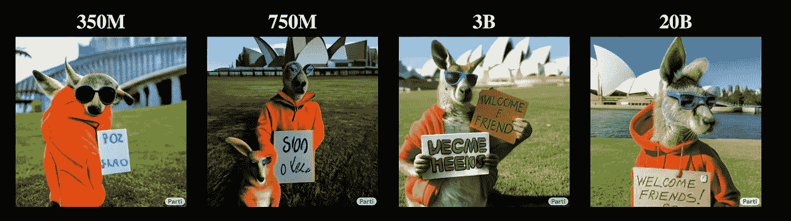**

****图四。**为文本"*生成的图像一张袋鼠的肖像照片，穿着橙色连帽衫，戴着蓝色太阳镜，站在悉尼歌剧院前的草地上，胸前举着一个牌子，上面写着欢迎朋友！"。请注意，该模型在 20B 处正确显示了图像“欢迎朋友”中的文本。* **图像从纸张上** [**文字到图像的模型 Parti**](https://parti.research.google/)**

*   **对于某些任务，小模型表现出一种特殊的能力，并且这种能力的性能随着模型的大小而不断提高。**
*   **在某些情况下，给定两个不同大小的模型，随着我们增加训练数据集大小，大型模型*(如 gp T3–175B)*的性能可能会达到峰值，但较小模型*(如 6B 参数)*的性能可能会继续增长，使较小模型更适合我们的任务。**

**因此，可以考虑的一种方法是，在我们收敛于一个或多个提示之后，选择一组不同大小的模型*(我们可以通过少量学习迭代来完成)*，然后在一个数据集上训练所有模型，增加数据集大小，直到我们达到期望的性能。然后，我们选择适合我们在推理预算成本、性能等之间权衡的模型。**

**但是，根据提示微调模型的缺点是会创建模型副本。这意味着我们在部署时需要为每个任务建立一个大的模型。相反，在上下文学习中，尽管有前面提到的缺陷，也不需要创建副本。[几种方法](https://www.youtube.com/watch?v=TwE2m6Z991s)介于 0%模型更新*(在上下文学习中)*到 100 %模型更新*(微调)*这两个极端之间，例如[前缀调整](https://aclanthology.org/2021.acl-long.353.pdf) (2%更新)、适配器调整(2–4%更新)、顶层 k 层调整、[提示调整](https://arxiv.org/pdf/2104.08691.pdf)、 [p 调整](https://arxiv.org/pdf/2103.10385.pdf)、[输入相关提示调整](https://arxiv.org/pdf/2204.10019.pdf)等。这些方法旨在用于展示上下文学习的大型自回归模型。也有人试图通过使用提示模板来微调更小的模型 *( < 1B)* 来模拟提示完成功能，这种方法如 [PET](https://arxiv.org/pdf/2001.07676.pdf) 、 [iPET](https://arxiv.org/pdf/2009.07118.pdf) 和 [ADAPET](https://arxiv.org/pdf/2103.11955.pdf) ，在本文中没有讨论，因为在那些小模型*中实际上不存在上下文学习(将伯特的填充掩码预测能力称为“上下文学习”，这只是 MLM 损失的直接结果)***

**尽管存在创建副本的缺点，但微调自回归模型可能比微调 BERT 模型具有优势，因为对于预训练和微调自回归模型，损失函数是相同的*(下一个令牌预测)*。相比之下，对于像 BERT 这样的模型，情况并非如此——它们不仅有附加层*(其权重在微调过程中被重新学习)*这样的架构附加物，在模型附属和微调过程中，损失函数也是不同的。这在一定程度上可以解释为什么 MLM 预训练模型尽管缺乏生成能力，却不能像自回归模型 *(GPT)* 一样自然地进行上下文学习，但也可以解释 MLM 模型不能被微调的事实*(开箱即用，没有额外的方法，如* [*PET*](https://arxiv.org/pdf/2001.07676.pdf) *、*[*iPET*](https://arxiv.org/pdf/2009.07118.pdf)*和* [*ADAPET】*](https://arxiv.org/pdf/2103.11955.pdf)**

## **使用生成模型(如 GPT-3)解决 NLP 任务的示例**

**NLP 任务可以分为三大类**

*   ****序→序。**这方面的例子有内容创作*(博客文章、电子邮件副本)*、抽象概括、翻译、问题回答&等。**
*   ****序列→令牌**。这可以是文档或句子的分类。关系提取可以作为一个分类问题来处理，其中提示输入对关系操作数标记以及要分类的句子进行编码——提示完成将是一个是/否布尔标记。也可以认为是输入序列不小于输出序列的序列→序列问题。**
*   ****利用嵌入的任务**。句子相似度，语义搜索。**

**某些传统的自然语言处理任务，如词性标注或 NER，可能被认为是*序列→序列*，可能没有意义直接映射到生成任务，其中输入中的每个标记都有相应的输出标签*(尽管原则上可以这样做)*。相反，可以使用自回归模型来输出句子中的名词或实体，如下所示。**

**下图是来自 [OpenAI](https://beta.openai.com/playground) 、 [AI21](https://studio.ai21.com/playground) 、 [Co:here](https://os.cohere.ai/playground/small/generate) 和 [GooseAPI](https://www.goose.ai/playground) 曝光的操场的零投/少投学习*(无权重更新)*例子。这四个都可以免费测试。GooseAPI 是开放使用的，不需要注册，而其他三个需要注册。此外，还有其他几个十亿参数语言模型，如 [PaLM (540B)](https://ai.googleblog.com/2022/04/pathways-language-model-palm-scaling-to.html) 、[威震天-图灵 NLG (530B](https://arxiv.org/pdf/2201.11990.pdf) )、 [Gopher (280B)](https://www.deepmind.com/blog/language-modelling-at-scale-gopher-ethical-considerations-and-retrieval) 、 [OPT-175B](https://github.com/facebookresearch/metaseq/tree/main/projects/OPT) 、*(参见下面的参考资料，获取大型模型列表的链接)。然而，他们还没有开放的游乐场。***

**虽然下面显示的例子被选择来说明不同的 NLP 任务是如何通过精心制作合适的提示来解决的，但是在一些例子中的难度水平，特别是只有零镜头/少镜头学习，是为了说明模型如何处理这种情况。从模型的角度来看，用数百个样本进行微调可能会降低难度，并提高性能。这也可能使我们在下面的零镜头/少镜头设置中看到的模型性能的差异变得均匀。**

****序列→序列任务****

****总结****

****

****图 5。在这种情况下，模特被要求在没有例子的情况下完成一项任务，只有任务的描述。有人可能会说，没有一个模型能以对二年级学生来说足够简单的形式来解释它。然而，在很少的例子中，模型可能会做得更好，如下例所示。**更新 Co:here 模型的未知尺寸** : Co:here 模型看起来可与达芬奇(175B) **作者图片******

****从命令输入生成电子邮件****

**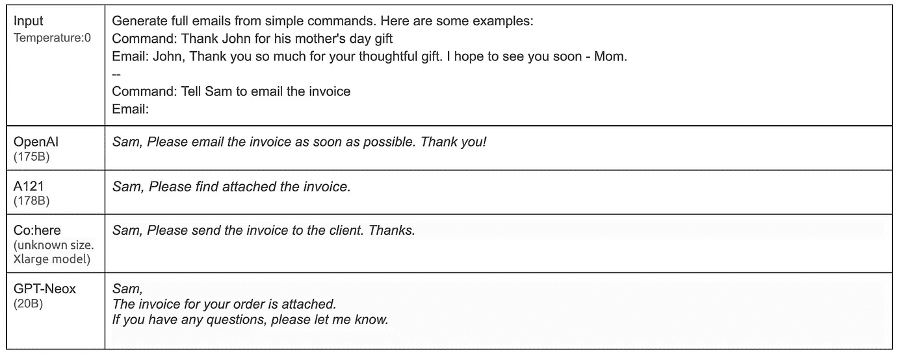**

****图 6** 。在这种情况下，GPT-Neox-20 和 AI21 搞错了命令意图。**更新 Co:here 模型的未知尺寸** : Co:here 模型看起来可与达芬奇(175B) **图片作者****

****名词短语识别 *(POS 标签功能)*****

**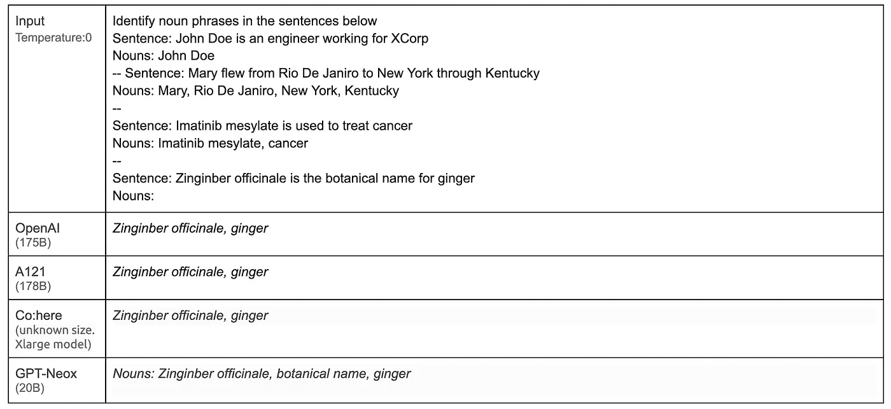**

****图 7。**GPT-尼奥克斯得到三个名词，而其余的得到两个。**更新 Co:here 模特未知尺寸**:Co:here XL 大号模特看起来可与达芬奇(175B)媲美**图片作者****

****识别命名实体(NER 功能)****

**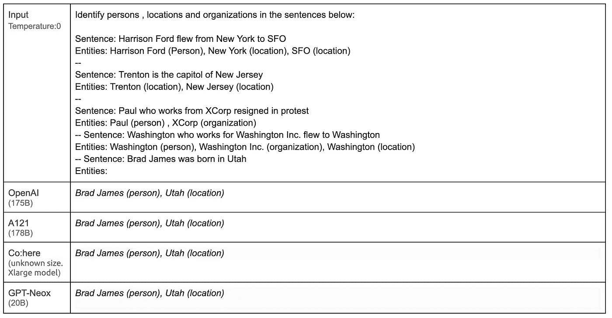**

****图 8** 。四个模特都喜欢这个。**更新 Co:here 模特未知尺寸**:Co:here XL 大号模特看起来可与达芬奇(175B)媲美**图片作者****

****关系提取(带实体信息)****

**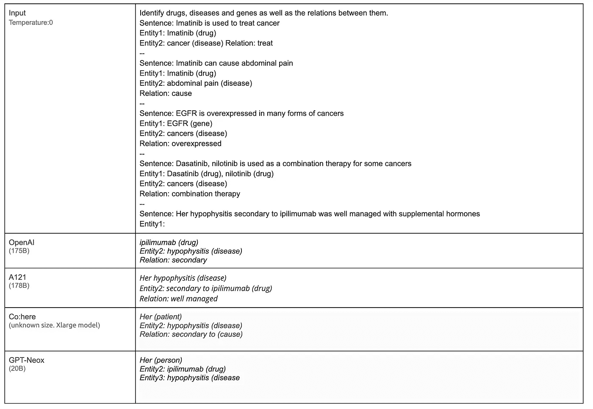**

****图 9** 。该测试有多个实体，不同于用于少量学习的示例。**更新 Co:here 模特未知尺寸** : Co:here Xlarge 模特看起来堪比达芬奇(175B) **图片作者****

****从文档中提取主题****

**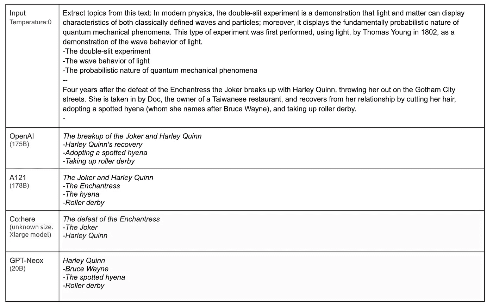**

****图 10。**模型得出的结果存在显著差异。**更新 Co:here 模特的未知尺寸** : Co:here Xlarge 模特看起来可与达芬奇(175B) **图片作者****

****共指消解****

**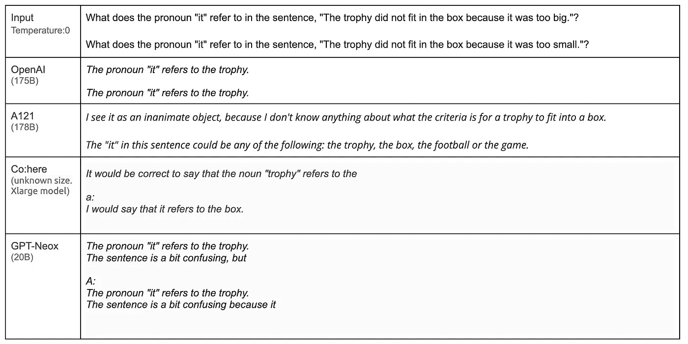**

****图 11。没有一个模型做对了。AI21 的结果相当有趣。**更新 Co:here 模特的未知尺寸**:Co:here XL 大号模特看起来堪比达芬奇(175B) **图片作者******

****序列→令牌任务。****

****句子分类*(其中上下文学习示例没有列出所有分类类别——语言模型从上下文中推断出来)*****

****

****图 12。所有的型号都解决了这个问题，尽管其中一个型号需要对 GPT-奈奥斯进行一些处理。这可以通过几个例子来避免，让模型学习预期的输出格式。**更新 Co:here 模型的未知尺寸** : Co:here Xlarge 模型看起来与达芬奇(175B) I **mage 作者******

****句子分类*(其中上下文学习示例列出了所有类别)*****

**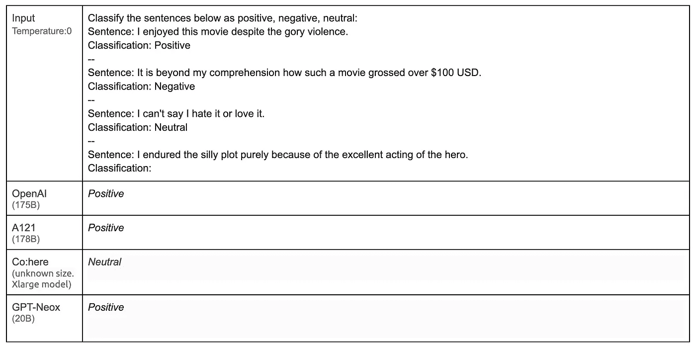**

****图 13。Co:这里的输出虽然不同于其他输出，但也可以说是合理的。**更新** : Co:这里 Xlarge 模型看起来堪比达芬奇(175B) **图片作者******

****open ai、AI21、Co:here 和 GooseAI 展示的各种用例****

**下表显示了所有暴露的操场的共同属性**

*   **大多数任务是终端用户用例，而不是一般的 NLP 任务。例如，OpenAI 在不同的用例中公开了相同的底层 NLP 任务——机场代码提取，提取联系信息传统上被认为是信息提取。菜谱创建者、论文提纲等。传统上被称为生成任务。**
*   **传统 NLP 公司会展示的 NLP 任务，例如命名实体识别、关系提取、依赖解析器、分块器等。都缺席了。相反，它们被隐式地公开为特定的用例任务。这部分是因为，如前所述，以一对一的方式映射这些 NLP 任务可能不是利用这些语言模型的最佳方式，尽管原则上可以*(例如，发出 BIO 或 POS 标签)。*此外，LLM 能够在传统的 NLP 管道中折叠多个步骤，并直接交付输出，这是解决任务的传统方法的一个明显优势。**

**这重申了一个事实，即当利用 LLM 时，从业者必须以新的思路为任务设计解决方案——传统的多步骤管道可能通过 LLM 的一个步骤就可以解决。然后，我们只需为任务设计正确的启动和完成。**

**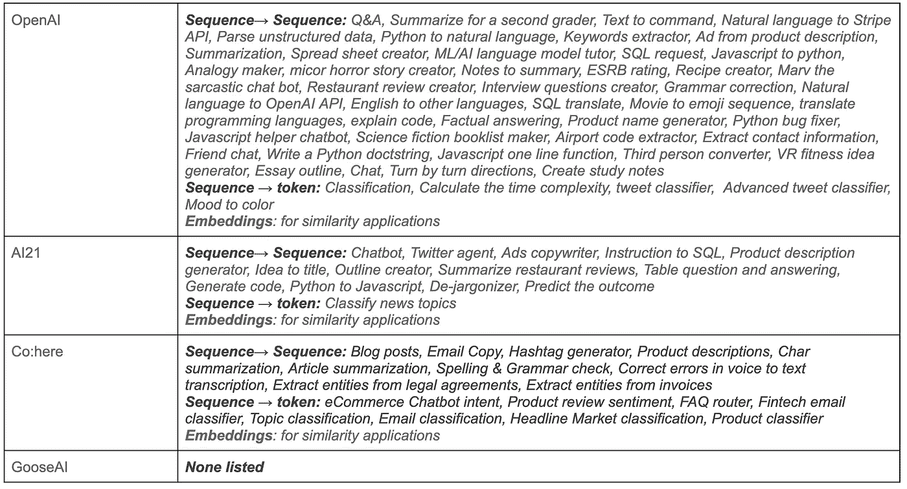**

****图 14。**这些用例涵盖了广泛的 NLP 任务。**作者图片****

## **利用嵌入的任务**

**利用嵌入的任务可以是语义搜索或句子相似性。这里不做嵌入的比较，因为此时只有 OpenAI 和 Co:here 公开了嵌入接口。今年早些时候[对 OpenAI 嵌入进行了一项分析](https://medium.com/@nils_reimers/openai-gpt-3-text-embeddings-really-a-new-state-of-the-art-in-dense-text-embeddings-6571fe3ec9d9)，当时它处于测试模式，嵌入的性能不如使用较小模型的标准已知嵌入方法。句子的嵌入本质上是添加到句子末尾的特殊标记的嵌入。在学习句子嵌入的对比训练方法中，文档中的连续句子对被认为是正对的。**

## **使用 LLM 减轻 LLM 的一个关键缺陷——一种新方法**

**尽管 LLM 解决各种任务的能力令人印象深刻，但考虑到错误率，对于某些用例来说，它不是一个可靠的生产部署选项。例如，虽然我们已经在网上看到了 LLM 解决简单和复杂数学问题的例子，甚至中间步骤也显示了它是如何得到答案的，但在一个简单计算*(如下所示)*上 LLM 的性能很差，一个优秀的老式符号计算器可以可靠地解决这个问题， 强调了使用 LLM 执行如此简单的算术任务的不可靠性——上面 NLP 用例中使用的所有 LLM 在下面的简单计算中都失败了*(提高语言模型在推理任务上的性能的方法已经在本帖发布后发布——例如*[*Minerva——一个关于数学内容的微调 PaLM (540B)模型*](https://ai.googleblog.com/2022/06/minerva-solving-quantitative-reasoning.html) *)。***

****

****图 15。**尽管 OpenAI 得到了错误的答案，但它概述了步骤，甚至出于某种原因将大操作数交换到了左边。Co:这里的延续输出只是因为模型没有看到任务的几个例子。总的来说，我们很可能会看到零触发设置的模型之间的输出差异很大。通过少量拍摄和微调，变化趋于减少。对数百个(如果不是数千个的话)进行微调可能是确定这些模型真实性能的正确方法。**更新 Co:here 模特未知尺寸**:Co:here XL 大号模特看起来可与达芬奇(175B)媲美**图片作者****

**[A121 通过结合两个世界的优点为这个问题提供了一个解决方案](https://www.ai21.com/blog/jurassic-x-crossing-the-neuro-symbolic-chasm-with-the-mrkl-system)——利用可靠的专家模型*(可以是神经网络或非神经网络模块)*的能力和使用 LLM 的能力。他们考虑可以回答任何问题的搜索界面的用例。系统使用 LLM 作为前端来接受用户输入，并将其路由到正确的专家模块(如果存在的话)。如果不存在专家模块，用户输入将作为后备路由到 LLM。然后，这一步的输出再次被馈送到 LLM，以句子的形式构造答案。**

**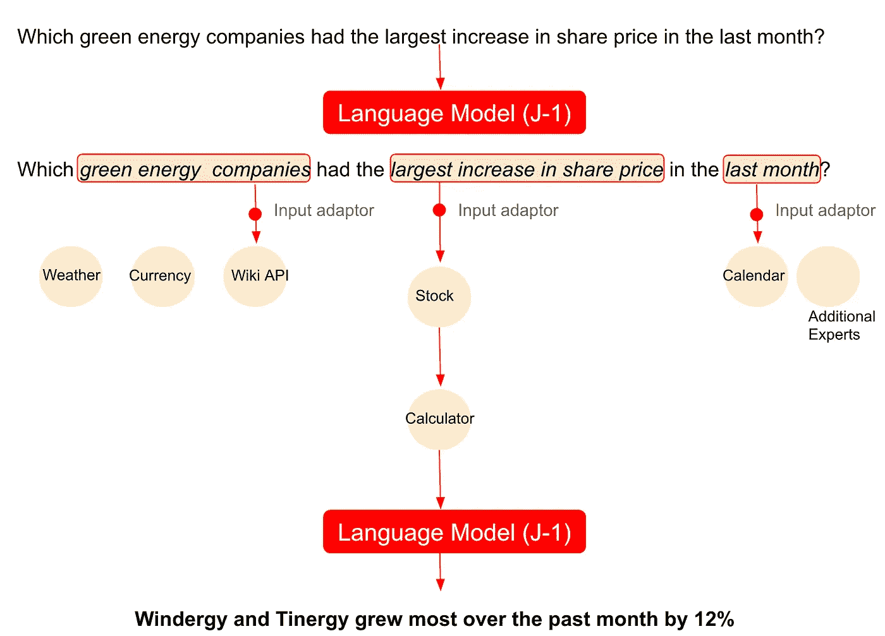**

****图 16。**AI21 提供的混合解决方案。**图片由作者利用** [**AI21 博文**](https://www.ai21.com/blog/jurassic-x-crossing-the-neuro-symbolic-chasm-with-the-mrkl-system) 获得**

**为了实现这样一个可能包含多个 LLM 的系统，他们提供了替代方案，以避免多个 LLM 的微调副本充当特定领域的专家。基本的想法是使用一个冻结的 LLM 来执行多项任务，这些任务使用了本文概述的方法。**

**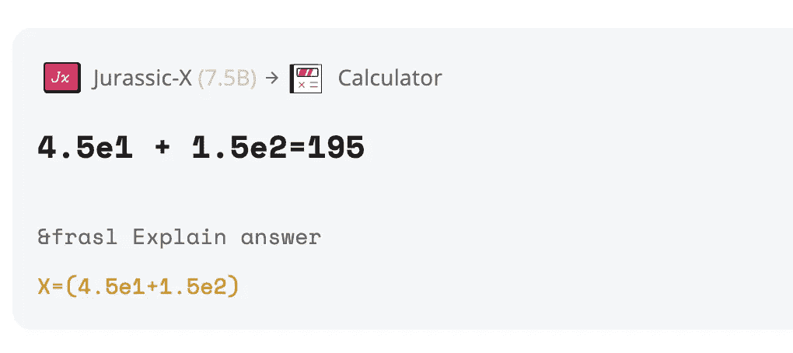**

****图十六。**混合方法不仅有效，而且从生产部署的角度来看，人们可以看到哪个专家(如果有的话)解决了这个问题，并且知道任务何时由 LLM 解决，作为后备方案**。图片由作者根据** [**侏罗纪-X 游乐场**](https://studio.ai21.com/jurassic-x) 的输出创建**

## **混合专家——解决模型规模扩大挑战的一种有前途的方法**

**AI21 利用专家模块完成任务的方法本质上类似于混合专家方法。使用专家混合物(MoE)的想法并不新鲜— [它可以追溯到 2017 年的工作](https://arxiv.org/pdf/1701.06538.pdf)和随后的型号发布，如[Switch](https://arxiv.org/pdf/2101.03961.pdf)2021 年 1 月*(多达一万亿个参数)*。与对每个输入重复使用模型的所有参数的深度学习模型相比，MoE 模型基于具有路由机制的输入示例选择性地使用一部分参数。这导致了稀疏激活的模型，其潜在的总参数数以万亿计，但是具有固定的计算成本。最近的工作，如[Task-MOE](https://arxiv.org/abs/2110.03742)*(2021 年 9 月)*能够从大型稀疏模型中提取随时可用的可部署子网络。这是一项充满希望的工作，解决了部署这些大型模型的挑战。 [GLaM](https://arxiv.org/abs/2112.06905) 特别地，这个万亿参数模型大约是 GPT-3 (175B)参数的 7 倍，但是消耗了用于训练 GPT-3 的 1/3 的能量，以及用于推断的一半计算失败，总体性能优于 GPT-3。混合专家方法也已应用于视觉系统 [(V-MoE)](https://arxiv.org/pdf/2106.05974.pdf) 。虽然 [V-MoE](https://arxiv.org/pdf/2106.05974.pdf) 是迄今为止最大的视觉模型(15B)参数，但它的识别性能与最先进的视觉模型相当，推理时的计算量只有后者的一半。最近[LIMoE(2022 年 6 月](https://ai.googleblog.com/2022/06/limoe-learning-multiple-modalities-with.html))的稀疏 MoE 模型展示了多模态学习(文本和图像)的能力——上面讨论的所有 MOE 模型都是单峰的。该模型包含 5.6B 个参数，但每个令牌仅应用 6.75 亿个参数。**

# **最后的想法**

**利用大型语言模型完成任务仍处于初级阶段，随着模型规模的增加，会出现哪些额外的功能还有待观察。随着新的硬件、软件和云初创公司竞相利用这一优势，整个 NLP 生态系统已经在经历转型。**

**然而，模型大小的增加很大程度上是由变压器的使用所驱动的，变压器已经成为几乎所有模态的公共基础架构。虽然随着模型参数的增加，新的功能不断涌现，[最近的工作*(2022 年 3 月 29 日)*也表明](https://arxiv.org/pdf/2203.15556.pdf)计算高效的模型可以与更大的模型表现一样好，因为大多数大型模型由于只是缩放参数而保持训练数据不变，所以训练不足。[这篇论文声称一个只有 70B 个参数的模型](https://arxiv.org/pdf/2203.15556.pdf)*龙猫*在大范围的下游评估任务中胜过它更大的对手 GPT-3(175B)、侏罗纪-1 (178B)、地鼠(280B)、威震天-图灵 NLG (530B)。此外，混合专家方法既解决了训练大型模型的挑战*(通过只更新每个输入模型的一部分)*，也解决了通过提取较小的子网进行推理的部署挑战。这些工作以及“小模型空间”中的创新可能会产生计算高效模型，甚至是更新的架构，它们不一定像当前模型那样大，以用于任务解决能力的出现和增长。**

**最后，有一种越来越多的期望或误解*(基于个人观点)*，这主要是由最近大型语言模型的成功推动的，**

> **我们可以通过预测序列中的记号来解决一般智力问题，而不需要任何与世界互动的物理经验**

**这种观点有一个对立面，它审视了大型语言模型是解决人工一般智能的解决方案这一预期中的缺陷(AGI)。在最近的*【2022 年 6 月 27 日】*中捕捉到了这一点，它不仅概述了我们需要解决的问题以更接近 AGI，还概述了实现这一目标所需的合理的架构元素。然而，这种替代观点并不排除让我们更接近一般智能的模型变大——只是它不太可能是我们现在拥有的那种大型语言模型，但具有更多参数。**

## **参考**

1.  **[大型语言模型的涌现能力。2022 年 6 月 15 日](https://arxiv.org/pdf/2206.07682v1.pdf)**
2.  **[神经语言模型的标度律。2022 年 1 月 23 日](https://arxiv.org/pdf/2001.08361v1.pdf)**
3.  **[训练计算最佳大型语言模型 2022 年 3 月](https://arxiv.org/abs/2203.15556)**
4.  **[超智能人工智能超级计算机路线图 2022 年 3 月](https://www.graphcore.ai/posts/graphcore-announces-roadmap-to-ultra-intelligence-ai-supercomputer)**
5.  **[站在巨型冰冻语言模型的肩膀上 2022 年 4 月](https://arxiv.org/pdf/2204.10019.pdf)**
6.  **[MRKL 系统公司 2022 年 5 月](https://arxiv.org/pdf/2205.00445.pdf)**
7.  **[OPT-Open 预训练变压器语言模型 2022 年 6 月](https://arxiv.org/pdf/2205.01068.pdf)**
8.  **[GPT-Neox-20B 和开源自回归语言模型 2022 年 4 月](https://arxiv.org/pdf/2204.06745.pdf)**
9.  **[少量参数高效微调优于上下文学习 2022 年 5 月](https://arxiv.org/pdf/2205.05638v1.pdf)**
10.  **[大型语言模型是零射击推理机 2022 年 6 月](https://arxiv.org/pdf/2205.11916v2.pdf)**
11.  **[语言模型是通用接口 2022 年 6 月](https://arxiv.org/pdf/2206.06336v1.pdf)**
12.  **[Unified-IO——视觉、语言和多模态任务的统一模型 2022 年 6 月](https://arxiv.org/pdf/2206.08916v1.pdf)**
13.  **[点亮——锁定图像文本调谐的零拍摄传输，2021 年 11 月](https://arxiv.org/pdf/2111.07991.pdf)**
14.  **[微调语言模型是零射击学习者 2022 年 2 月](https://arxiv.org/pdf/2109.01652.pdf)**
15.  **[Flamingo——用于少量学习的视觉语言模型 2022 年 4 月](https://storage.googleapis.com/deepmind-media/DeepMind.com/Blog/tackling-multiple-tasks-with-a-single-visual-language-model/flamingo.pdf)**
16.  **[扩展语言模型——方法、分析和来自训练 Gopher 的见解 2022 年 1 月](https://arxiv.org/pdf/2112.11446.pdf)**
17.  **[大型语言模型是零射击临床信息提取器 2022 年 5 月](https://arxiv.org/pdf/2205.12689.pdf)**
18.  **[开关变压器—利用简单有效的稀疏性扩展至万亿参数模型 2002 年 1 月 1 日](https://arxiv.org/pdf/2101.03961.pdf) 1**
19.  **[PaLM Pathways 语言模型—扩展到 550B 参数以实现突破性性能 2022 年 4 月](https://ai.googleblog.com/2022/04/pathways-language-model-palm-scaling-to.html)**
20.  **[GLaM 2021 年 12 月推出更高效的情境学习](https://ai.googleblog.com/2021/12/more-efficient-in-context-learning-with.html)**
21.  **[关于 OpenAPI 型号的尺寸](https://blog.eleuther.ai/gpt3-model-sizes/)**
22.  **[LaMDA —对话应用的语言模型—2022 年 2 月](https://arxiv.org/pdf/2201.08239.pdf)**
23.  **[带有链接的大型模型列表](https://docs.google.com/spreadsheets/d/1AAIebjNsnJj_uKALHbXNfn3_YsT6sHXtCU0q7OIPuc4/edit#gid=0)**
24.  **[自我一致性改善语言模型中的思维链推理——2022 年 4 月](https://arxiv.org/pdf/2203.11171.pdf)**
25.  **[Minerva:解决语言模型中的定量推理，2022 年 6 月 30 日](https://storage.googleapis.com/minerva-paper/minerva_paper.pdf)**
26.  **[超越蒸馏:高效推理的任务级专家混合。2021 年 9 月](https://arxiv.org/abs/2110.03742)**
27.  **值得注意的是，图像模型已经经历了一个性能提高的阶段，对于区分性和生成性任务，模型大小都有所增加。但是最近用于无条件和[有条件图像生成](https://benanne.github.io/2022/05/26/guidance.html) *(利用了* [*之前提到的一些多模态*](https://arxiv.org/pdf/2205.11487v1.pdf) *模型)*的最新视觉模型，在参数数量上比它们更大的语言生成对应模型小两个数量级。对于辨别任务，像 [V-MoE](https://arxiv.org/pdf/2106.05974.pdf) 这样的 MoE 模型，尽管是迄今为止最大的视觉模型(15B)，却利用了当前最先进模型一半的计算量来完成识别任务。**
28.  **[最近的一个“小模型空间”创新的例子](https://twitter.com/adityakusupati/status/1541554858829815809?s=20&t=KiVcg9LRSEtlYouPR6O1XQ)即使只针对图像。[2022 年 5 月 Matryoshka 代表自适应部署](https://arxiv.org/abs/2205.13147)**