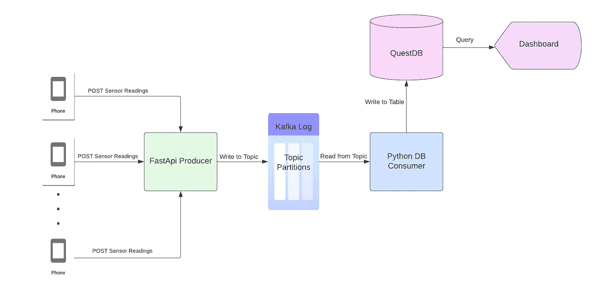
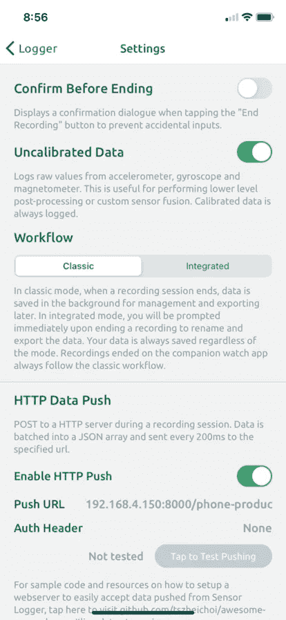
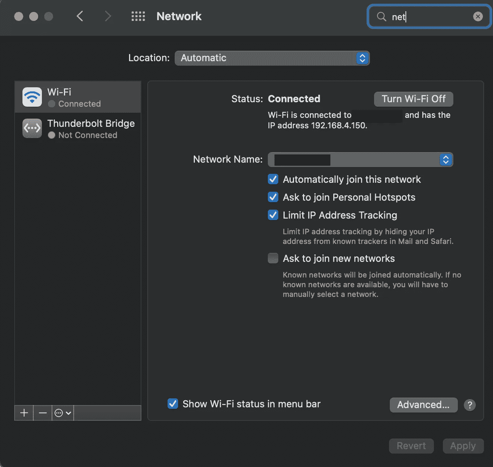
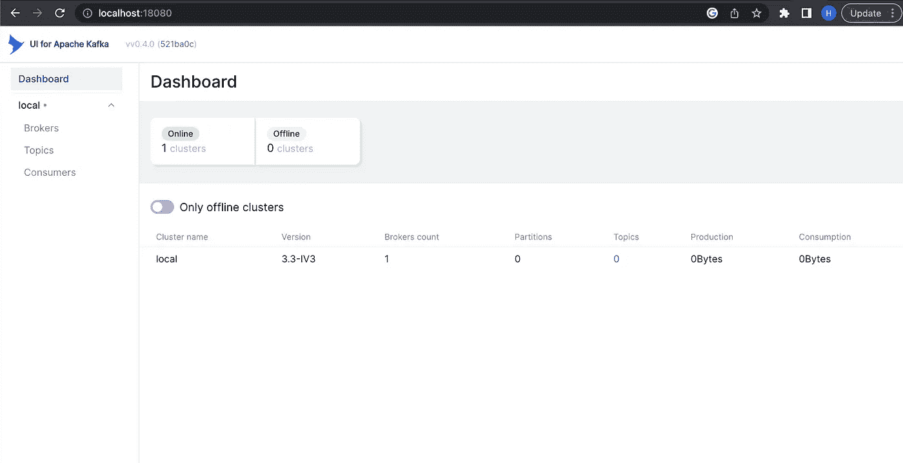
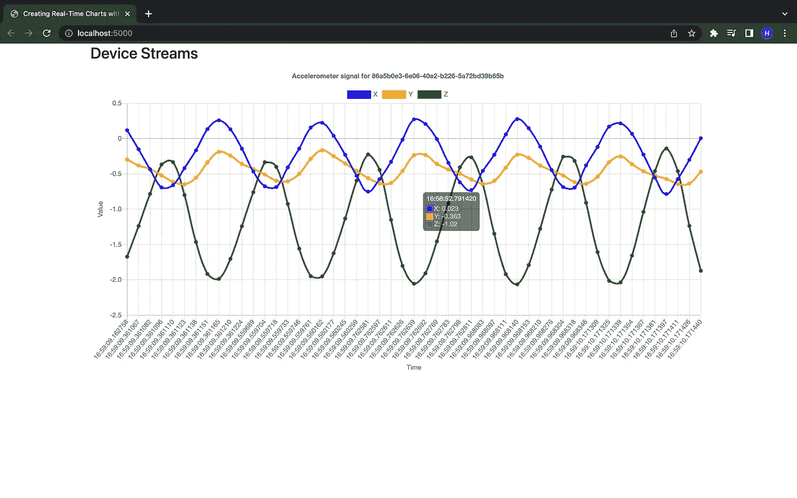

# 智能手机数据的实时流项目

> 原文：<https://towardsdatascience.com/a-real-time-streaming-project-with-smartphone-data-7e838a1b009d>

## 使用 FastAPI、Kafka、QuestDb 和 Docker 消费和处理智能手机传感器数据

设备无处不在。仅举几个例子，智能手机、冰箱、门铃、手表、医疗传感器、安全系统和健身追踪器现在都很常见，并不断记录(潜在的高频)信息。这些设备形成了一个被称为“物联网”或物联网的网络，并提供丰富的数据源。

最近，我对这些数据是如何摄取、处理和存储的产生了兴趣。虽然关于这个主题的资源很多，但很少有人给出任何人都可以获得的真实数据的例子。当我一篇接一篇地搜索以了解像 Apache Kafka 这样的[事件驱动](https://aws.amazon.com/event-driven-architecture/)系统和流媒体技术时，我遇到了一个智能手机应用程序，[传感器记录器](https://apps.apple.com/us/app/sensor-logger/id1531582925)，它允许用户通过手机上与运动相关的传感器传输数据。因为我有一部智能手机，这似乎是学习的完美方式，于是“智能手机 _ 传感器 _ 流”项目诞生了。该项目利用 FastAPI、Kafka、QuestDB 和 Docker 在仪表板上可视化实时传感器数据。

在这篇文章中，我们将在一个高层次上检查这个项目的所有主要组件。在本地运行项目所需的一切都可以在 [GitHub](https://github.com/hfhoffman1144/smartphone_sensor_stream) 上获得，快速演示可以在 [YouTube](https://www.youtube.com/shorts/zRUVvz5vsl8) 上获得。作为一个免责声明，我是一个事件驱动系统的初学者，非常感谢反馈来进一步丰富我的知识。尽情享受吧！

[](https://github.com/hfhoffman1144/smartphone_sensor_stream) [## GitHub-hfhoffman 1144/smart phone _ sensor _ Stream:用 FastAPI，Kafka 流智能手机数据…

### 从传感器记录器流式传输智能手机数据(参见…

github.com](https://github.com/hfhoffman1144/smartphone_sensor_stream) [](https://youtube.com/shorts/zRUVvz5vsl8?feature=share) [## 使用 FastAPI、Kafka、QuestDB 和 Docker 流式传输智能手机数据

### 该视频演示了使用 FastAPI、Kafka、QuestDB 和…的实时智能手机传感器数据的可视化

youtube.com](https://youtube.com/shorts/zRUVvz5vsl8?feature=share) 

# 项目架构

让我们先来看看这个项目的架构(例如，数据将如何从智能手机流向仪表板):



项目架构。图片由作者提供(由 Lucidchart 制作)。

每个智能手机通过 POST 请求向 FastAPI 应用程序发送传感器读数(加速度计、陀螺仪和磁力计)。生产者 FastAPI 将传感器读数作为 JSON(来自请求体的数据)异步写入 Kafka 主题。每个 JSON 对象都由 python 进程(消费者)接收，并存储在 QuestDB 表中。一旦数据进入数据库，依赖于它的任何下游服务或应用程序都可以访问它。对于本项目的第 1 部分，我们将使用服务器发送的事件(SSE)在仪表板上绘制传感器读数。

# 目录结构和 Docker 组成

这个项目是一个小型服务[的集合，这些服务相互连接，将数据从智能手机传输到仪表盘。下面是目录结构:](https://microservices.io/)

```
|-producer
 | |-app
 | | |-core
 | | | |-config.py
 | | |-__init__.py
 | | |-schemas
 | | | |-sensors.py
 | | |-main.py
 | |-requirements.txt
 | |-Dockerfile
 | |-entrypoint.sh
|-db_consumer
 | |-app
 | | |-core
 | | | |-config.py
 | | |-models
 | | | |-sensors.py
 | | |-db
 | | | |-ingress.py
 | | |-main.py
 | |-requirements.txt
 | |-Dockerfile
 | |-entrypoint.sh
|-ui_server
 | |-app
 | | |-core
 | | | |-config.py
 | | |-models
 | | | |-sensors.py
 | | |-static
 | | | |-js
 | | | | |-main.js
 | | |-db
 | | | |-data_api.py
 | | |-templates
 | | | |-index.html
 | | |-main.py
 | |-requirements.txt
 | |-Dockerfile
 | |-entrypoint.sh
|-README.md
|-.gitignore
|-.env
|-docker-compose.yml
```

我们将编写三个服务:生产者、消费者和 UI。每个服务都打包了一个 docker 文件，并通过 docker-compose[编排](https://www.vmware.com/topics/glossary/content/container-orchestration.html#:~:text=Container%20orchestration%20is%20the%20automation,networking%2C%20load%20balancing%20and%20more.)。Docker-compose 允许我们通过外部服务(Kafka、Zookeeper 和 QuestDB)运行我们编写的服务，作为通过内部网络连接的独立容器。我们在这个项目中编排服务所需的一切都在 docker-compose 文件中:

docker-为项目撰写文件。

注意四个我们自己不写的服务(谢天谢地):Zookeeper、Kafka、QuestDB 和 Kafka-UI。这些服务与生产者、消费者和 UI 一起创建项目。我们将逐个介绍每个服务，但是首先，我们需要理解数据源。

# **传感器记录器**

[传感器记录器](https://github.com/tszheichoi/awesome-sensor-logger/)是一款 iOS 和 Android 应用，允许用户记录智能手机上与运动相关的传感器读数。用户可以查看实时传感器读数，将数据导出为文件，并通过 HTTP 将实时数据推送到服务器。这个项目利用 HTTP 功能来提取传感器读数。要配置传感器记录器，首先确保选择了以下所有传感器:


选择传感器。图片作者。

我们将从手机的加速度计、陀螺仪和磁力计获取读数。接下来，我们需要配置传感器记录器的设置，以便它知道将数据推送到哪里:



传感器记录器设置。图片作者。

最关键的部分是确保“推送 URL”是正确的——这是 FastAPI 生成器的端点，它通过 POST 请求接受原始传感器读数。我们将使用我们的计算机作为服务器，所以我们需要识别相应的 IP 地址。在 Mac 上，这位于“系统偏好设置”->“网络”下:



找到 Mac 的 IP 地址。图片作者。

请注意，电脑的 IP 地址通常对于 WI-FI 网络是唯一的，这意味着每次电脑连接到新网络时都会分配一个新的 IP 地址。因此，智能手机和主机在同一个网络上至关重要。FastAPI 生成器接受以下位置的传感器读数:

> [*http://{你的 ip 地址}:8000/phone-producer*](http://{your_ip_address}:8000/phone-producer)

将上述网址粘贴到“推送网址”框中，传感器记录器应该可以使用了！

# 卡夫卡和动物园管理员

由于平台上有许多可用的[资源](https://kafka.apache.org/)，这篇文章不会详细介绍卡夫卡。然而，作为一个总结，Kafka 是一个高性能的存储和读取流数据的框架。Kafka 的基本数据结构是**日志**。将消息写入日志的应用程序被称为**生产者**。与队列不同，日志中的消息即使在被读取后也是持久的——这允许多个应用程序(称为**消费者**)从不同的位置同时读取。为了简单起见，这个项目只有一个生产者(将原始传感器读数写入 Kafka 的 FastAPI 应用程序)和一个消费者(从 Kafka 读取消息并在数据库中格式化它们的 python 进程)。Zookeeper 是一个帮助管理 Kafka 各种组件的服务。

只需要两个 docker 映像就可以让 Kafka 和 Zookeeper 在本地运行:

为卡夫卡和动物园管理员作曲。

我们将使用卡夫卡和动物园管理员的 Bitmani 发行版。Kafka-UI 映像允许用户通过 web 应用程序与 Kafka 集群进行交互，但这不是本项目所必需的。将上述 docker-compose 文件保存为 *docker-compose.yml，*运行 docker-compose up，在[http://localhost:18080/](http://localhost:18080/)上应该可以看到类似如下的 GUI:



卡夫卡 UI。图片作者。

随着组件被添加到系统中，关于经纪人、主题和消费者的信息将被添加到这个仪表板中。

# 制片人

到目前为止，我们已经将传感器记录器配置为向服务器发送原始传感器读数，Kafka 实例准备好接收这些读数。下一步是在原始数据和卡夫卡——制作者——之间建立一座桥梁。这个项目中的生产者是一个 [FastAPI](https://fastapi.tiangolo.com/) 应用程序，它接受从智能手机发送的数据并将其写入 Kafka 日志。以下是制作方的布局:

```
|-producer
 | |-app
 | | |-core
 | | | |-config.py
 | | |-__init__.py
 | | |-schemas
 | | | |-sensors.py
 | | |-main.py
 | |-requirements.txt
 | |-Dockerfile
 | |-entrypoint.sh
```

由于 GitHub 上的所有内容都是可用的，所以我们不会仔细检查 producer 目录中的每个文件。而是让我们来看看`main.py`(制作方 API 的驱动脚本):

生成器的 main.py 文件

第 9 行实例化了一个 FastAPI 对象。第 11–17 行用 [Aiokafka](https://aiokafka.readthedocs.io/en/stable/) 创建了一个 Kafka 生产者对象的实例。Aiokafka 允许我们异步地向 kafka [写消息](https://docs.python.org/3/library/asyncio.html)，这意味着我们不必等待 Kafka 接收和处理消息(在第 45 行)就可以进入下一行代码。相反，Aiokafka 将当前信息发送给 kafka，并几乎立即准备好产生另一个信息。第 27–55 行定义了接收原始传感器读数的路线。为了更好地理解这一点，让我们看一下这个路由期望的请求体格式(参数`data`):

```
{"messageId": 20,
 "sessionId": "4bf3b3b9-a241-4aaa-b1d3-c05100df9976",
 "deviceId": "86a5b0e3-6e06-40e2-b226-5a72bd39b65b",
 "payload": [{"name": "accelerometeruncalibrated",
              "time": "1671406719721160400",
              "values": {"z": -0.9372100830078125,
                         "y": -0.3241424560546875, 
                         "x": 0.0323486328125}},
             {"name": "magnetometeruncalibrated",
              "time": "1671406719726579500",
              "values": {"z": -5061.64599609375,
                         "y": 591.083251953125,
                         "x": 3500.541015625}},
             {"name": "gyroscopeuncalibrated",
              "time": "1671406719726173400",
              "values": {"z": -0.004710599314421415,
                         "y": -0.013125921599566936,
                         "x": 0.009486978873610497}}, 
...
]}
```

每个请求体都是一个 JSON 对象，带有条目“messageId”、“sessionId”、“deviceId”和“payload”。智能手机通过其“设备 Id”进行唯一识别。每当手机开始一个新的流，一个新的“会话 Id”被创建。“messageId”条目指示消息在当前会话序列中的顺序。“payload”条目是一个 JSON 对象数组，包含传感器记录器中配置的每个传感器的读数。每个“有效载荷”条目都有传感器的名称、记录读数的时间(在 [unix 时间](https://en.wikipedia.org/wiki/Unix_time)中)以及读数本身。我们专门使用三轴传感器，因此每个传感器都应该有与三个空间维度相对应的“x”、“y”和“z”读数。

FastAPI 路由将原始请求体直接写入 Kafka 主题(第 45 行)，元数据被记录并在第 47–55 行返回。此路由在 [*公开 http://{ your _ IP _ address }:8000/phone-producer*](http://%7Byour_ip_address%7D:8000/phone-producer)*，*如传感器记录器部分所述。所有请求都由 [Pydantic](https://docs.pydantic.dev/) `SensorReading`对象验证(即任何不符合传感器记录器格式的请求都不会被路由处理):

生成器的 sensors.py 文件。

生产者的配置通过 Pydantic `BaseSettings`对象读入的环境变量来处理:

生成器的 config.py 文件。

环境变量存储在. env 文件中:

```
# Kafka config
PROJECT_NAME=phone_stream_producer
TOPIC_NAME=raw-phone-stream
KAFKA_HOST=kafka
KAFKA_PORT=9092
```

并在 docker-compose 文件中传递给生产者(下面的第 9 行):

docker-为制作人撰写部分。

请注意，启动命令中的主机参数是 0.0.0.0。这使得本地网络上的任何设备都可以通过生产者的 IP 地址对其进行访问。

# 消费者

我们现在有了将传感器数据从智能手机传输到 FastAPI 生产商和 Kafka 的基础设施。下一步是创建一个进程(消费者),它从 Kafka 读取数据并对数据做一些事情。消费者可以负责与读取和操作存储在日志中的数据相关的任何事情。该项目的消费者将用于转换原始传感器读数，并将它们存储在名为 [QuestDB](https://questdb.io/) 的时间序列数据库中。下面是消费者的目录结构:

```
|-db_consumer
 | |-app
 | | |-core
 | | | |-config.py
 | | |-models
 | | | |-sensors.py
 | | |-db
 | | | |-ingress.py
 | | |-main.py
 | |-requirements.txt
 | |-Dockerfile
 | |-entrypoint.sh
```

在创建消费者之前，我们需要建立一个 QuestDB 实例。QuestDB 是一个高性能的开源时间序列数据库，具有 Postgres 兼容的 API。这意味着我们可以查询 QuestDB 表，就像它们是面向行的 Postgres 表一样，同时获得面向列的表的好处。我们可以使用 docker 运行 QuestDB:

docker-为 QuestDB 撰写部分。

请注意，在第 5–8 行中，我们公开了端口 9000、9009 和 9003。这些端口，特别是端口 9000，用于将数据写入 QuestDB 表。通过将这些端口包含在`expose`部分中，而不是在`ports`部分中，我们确保只有运行在相同 Docker 网络中的容器才能写入数据。端口 8812 可从 Docker 网络外部访问，用于查询数据。环境变量`QDB_PG_USER`和`QDB_PG_PASSWORD`以及其他与 QuestDB 相关的变量被设置在`.env`文件中:

```
# Questdb config
DB_USER=admin
DB_PASSWORD=quest
DB_HOST=questdb
DB_PORT=8812
DB_IMP_PORT=9000
DB_NAME=qdb
DB_TRIAXIAL_OFFLOAD_TABLE_NAME=device_offload
```

消费者的驾驶代码在`main.py`中:

消费者的 main.py 文件。

这里有很多东西需要解开，但是核心逻辑发生在第 35–39 行。消费者异步遍历指定 Kafka 主题中的消息。只要主题被更新，这个循环就会不断地消耗消息。使用以下函数将消息格式化并写入 QuestDB 表:

函数将传感器有效负载写入表中。

使用`StringIO`将整个有效载荷格式化并保存为内存中的 CSV 文件。从那里，CSV 通过 POST 请求发送到 QuestDB 写端口。这有助于使用单个连接和请求将整个有效负载快速写入 QuestDB。

存储传感器数据的表旨在平衡快速写入和快速读取。下面是在 QuestDB 中创建表的查询:

```
CREATE TABLE IF NOT EXISTS device_offload (
    device_id TEXT,
    session_id TEXT,
    device_timestamp TEXT,
    recorded_timestamp TEXT,
    sensor_name TEXT,
    x REAL,
    y REAL,
    z REAL
)
```

如前所述，`device_id`和`session_id`字段直接来自原始有效载荷的前两个条目。`device_timestamp`是在设备上收集传感器数据的单个样本的时间，而`recorded_timestamp`是样本到达数据库的时间。因此，我们可以测量数据样本从设备到数据库需要多长时间。由于我们只使用三轴传感器，我们可以将它们的值存储在`x`、`y`和`z`字段中，并在`sensor_name`字段中指定每个样本属于哪个传感器。这种模式使我们能够在一次写操作中将来自有效负载中每个传感器的数据写入同一个表中(而不是需要多次写操作才能写入多个表)。

需要注意的是，在现实环境中，这个 QuestDB 表可能不是数据的最终存储目的地。相反，这个表将充当一个缓冲区，使应用程序能够方便地访问结构化格式的数据。高频传感器数据(本例中为 50 hz)快速增长，变得难以维护。我们可能会引入另一个 Kafka 管道，负责将旧数据从 QuestDB 移出并移入归档。

该消费者的最后一步是添加相应的 docker-compose 命令:

docker-为消费者撰写部分。

# **仪表盘**

我们已经做好了将传感器数据写入 QuestDB 的一切准备。为此，我们需要建立另一个 FastAPI 应用程序来轮询数据库，并使用[服务器发送的事件(SSE)](https://en.wikipedia.org/wiki/Server-sent_events#:~:text=Server%2DSent%20Events%20%28SSE%29,client%20connection%20has%20been%20established.) 来更新 HTML 页面。下面是要检查的最后一个目录结构:

```
|-ui_server
 | |-app
 | | |-core
 | | | |-config.py
 | | |-models
 | | | |-sensors.py
 | | |-static
 | | | |-js
 | | | | |-main.js
 | | |-db
 | | | |-data_api.py
 | | |-templates
 | | | |-index.html
 | | |-main.py
 | |-requirements.txt
 | |-Dockerfile
 | |-entrypoint.sh
```

和以前一样，`main.py`是这个应用程序的驱动程序:

仪表板的 SSE 路线。

每隔 0.1 秒(第 90 行)，`message_stream`函数将查询数据库以获得最近一秒的传感器读数(第 62 行)。在仪表板的这个迭代中，只查询和显示加速度计数据。`max_lookback_seconds`参数设置为 60——这意味着任何在过去 60 秒内没有发送数据的手机都将在查询中被过滤掉。因此，这个仪表板将显示所有在最后一分钟发送数据的手机的最新一秒的加速度计数据。以下是查询逻辑:

查询以获取仪表板的数据。

将所需的行添加到 docker-compose 文件:

仪表板的 Docker-Compose 部分。

仪表板应该可以在[找到 http://localhost:5000:](http://localhost:5000:)



显示实时传感器数据的仪表板。图片作者。

# 最后的想法

本文给出了一个实时流项目的高级概述，该项目使用大多数人都可以访问的数据源(智能手机)。虽然这里有许多活动的部分，但我们只是窥视了数据流的世界。也许在未来的文章中，我们可以改进这个项目，并添加更多的消费者。一如既往，非常感谢您的反馈。感谢阅读！

*喜欢我的文章吗？请我喝杯咖啡:*[*https://www.buymeacoffee.com/HarrisonfhU*](https://www.buymeacoffee.com/HarrisonfhU)

## 参考

> **阿帕奇卡夫卡:**https://kafka.apache.org/
> 
> **事件驱动架构——队列 vs 日志:**[https://jack-van lightly . com/blog/2018/5/20/Event-Driven-Architectures——队列 vs 日志](https://jack-vanlightly.com/blog/2018/5/20/event-driven-architectures-the-queue-vs-the-log)
> 
> **卢西德哈特:**[https://www.lucidchart.com/](https://www.lucidchart.com/pages/landing?utm_source=google&utm_medium=cpc&utm_campaign=_chart_en_us_mixed_search_brand_exact_&km_CPC_CampaignId=1457964857&km_CPC_AdGroupID=57044764032&km_CPC_Keyword=lucidchart&km_CPC_MatchType=e&km_CPC_ExtensionID=&km_CPC_Network=g&km_CPC_AdPosition=&km_CPC_Creative=442433231228&km_CPC_TargetID=aud-552508845082:kwd-33511936169&km_CPC_Country=9026996&km_CPC_Device=c&km_CPC_placement=&km_CPC_target=&gclid=Cj0KCQiAkMGcBhCSARIsAIW6d0CWGMutQsstwP9ldA4dNOtZFA1Rx74z64sS-PRobNhZ_vyLMUMrESIaAslAEALw_wcB)
> 
> **Kafka Poc 使用 FastApi:**【https://github.com/GavriloviciEduard/fastapi-kafka 
> 
> **地缘流——卡夫卡:**[https://github.com/iwpnd/geo-stream-kafka](https://github.com/iwpnd/geo-stream-kafka)
> 
> **2022 年最受欢迎的 18 款物联网设备:**[https://www . software testing help . com/IoT-Devices/#:~:text = Smart % 20 mobiles % 2C % 20 Smart % 20 冰箱% 2C % 20 智能手表，还有% 20 by % 20 the % 20 year % 202022% 3F](https://www.softwaretestinghelp.com/iot-devices/#:~:text=Smart%20Mobiles%2C%20smart%20refrigerators%2C%20smartwatches,there%20by%20the%20year%202022%3F)
> 
> **FastAPI:**[https://fastapi.tiangolo.com/](https://fastapi.tiangolo.com/)
> 
> **QuestDB:**[https://questdb.io/docs/](https://questdb.io/docs/)
> 
> **面向行与面向列的数据库:**[https://data school . com/data-modeling-101/Row-vs-Column-Oriented-Databases/](https://dataschool.com/data-modeling-101/row-vs-column-oriented-databases/)