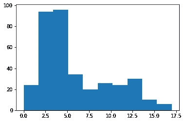
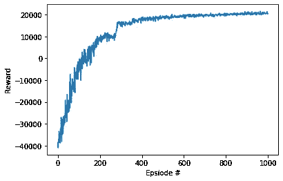
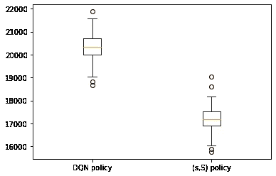
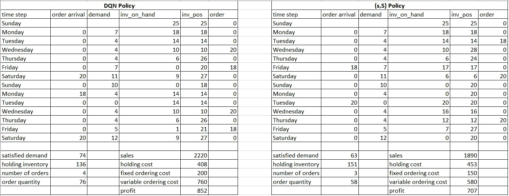

# 库存优化的强化学习系列 I:单一零售商的强化学习模型

> 原文：<https://towardsdatascience.com/a-reinforcement-learning-based-inventory-control-policy-for-retailers-ac35bc592278>

## 建立深度 Q 网络(DQN)模型来优化单个零售商的库存运作


唐·达斯卡洛在 [Unsplash](https://unsplash.com?utm_source=medium&utm_medium=referral) 上的照片

更新:本文是我的博客系列*库存优化的强化学习*的第一篇文章。下面是同一系列中其他文章的链接。如果你感兴趣，请去看看。

[*库存优化强化学习系列之二:多级网络的 RL 模型*](https://medium.com/towards-data-science/reinforcement-learning-for-inventory-optimization-series-ii-an-rl-model-for-a-multi-echelon-921857acdb00)

[*库存优化强化学习系列之三:RL 模型的虚拟到真实传递*](https://medium.com/towards-data-science/reinforcement-learning-for-inventory-optimization-series-iii-sim-to-real-transfer-for-the-rl-model-d260c3b8277d)

库存优化是供应链管理的一个重要方面，它涉及优化企业的库存运作。它使用数学模型来回答关键问题，如何时下补货订单以满足客户对产品的需求，以及订购多少数量。当今供应链行业中采用的主要库存控制策略是经典的静态策略，在这种意义上，何时订购或订购多少的决策在整个计划范围内是固定的，除非策略被更新。然而，当需求变化很大时，这种静态政策可能会有所不足。不仅基于库存位置，而且基于相关的未来需求信息，能够自适应地调整何时订购以及订购多少的决策的动态策略将是更有利的。在本文中，我将使用一个销售可乐的小型零售店作为示例，来说明我们如何利用强化学习(RL)技术——深度 Q 网络(DQN)来构建库存控制策略，以优化库存运营并获得比经典静态库存控制策略更多的利润。

# **经典库存控制策略**

1.  ( *R* ， *Q* )策略:该策略规定当库存低于 *R* 单位时，我们需要订购固定数量的 *Q* 单位的产品。这里， *R* 被称为再订购点， *Q* 是订购数量*。*在实践中，通常在每天开始或结束时检查库存位置。
2.  ( *T* ， *S* )政策:这个政策说我们每 *T* 天下一个订单来补充库存到 *S* 单位。这里， *T* 是审核周期，它决定了我们审核库存水平的频率，而 *S* 被称为符合订单水平。
3.  ( *s* ， *S* )政策:该政策规定，当库存位置低于 *s* 单位时，我们需要下订单补充库存至 *S* 单位。这里， *s* 可以被认为是再订购点，而 *S* 可以被认为是合格级别。
4.  基本库存策略:该策略相当于( *S* -1， *S* )策略，意思是如果在特定的一天有任何需求消耗库存，我们会立即下订单补充库存，直到 *S* 单位。

上述不同的策略适用于不同的需求模式，但共同点是它们都假定要么有一个固定的再订购点，固定的订货量，固定的最大订货量或两个订单之间的固定时间间隔。此外，这些策略中的大多数仅依赖于当前的库存状况来做出订购决策，而没有利用与未来需求相关的其他可能信息来帮助做出更明智的决策。这限制了政策的灵活性，这潜在地破坏了政策对高需求的响应性(导致销售损失)或在需求低时导致过多的库存(导致库存持有成本)。如果我们去掉这个限制，我们能做得更好吗？我们如何建立一个模型来获得一个没有这种限制的库存控制策略？一种可能的方法是强化学习(RL)。

# 库存优化的强化学习

RL 是机器学习的一个子领域，涉及决策制定。它使智能代理能够通过与环境的交互，学习如何根据过去的经验做出最佳决策。RL 因其广泛的应用而广受欢迎，包括自动驾驶汽车、机器人控制、游戏等..

**公式化马尔可夫决策过程**

为了利用 RL，必须首先将决策问题公式化为马尔可夫决策过程(MDP)。MDP 是一个数学框架来模拟决策问题，其中决策是在离散的时间步骤顺序作出的。MDP 有 4 个核心要素:状态、行动、奖励、转移概率。状态 *s_t* 表示代理在时间 *t* 的情况。动作 *a_t* 是代理在时间 *t* 做出的决定。奖励 *r_t* 是环境的反馈，告诉代理人某个动作是好是坏。转移概率 *P(s_(t+1)|s_t，a_t)* 决定了当代理在状态 *s_t* 采取动作 *a_t* 时，它落入状态 *s_(t+1)* 的概率。在大多数真实世界环境中，转移概率不可能是已知的。

库存优化问题自然适合 MDP 的框架，因为它的顺序决策结构。可能有多种方式来定义库存优化问题的状态、行动和回报。理论上，状态的定义应包括所有可能有助于采取合理行动的相关信息，行动的定义应足够灵活，以代表决策的所有可能选项，奖励的定义应反映问题的目标(例如，最小化成本，最大化利润)。因此，状态、动作和奖励定义可能因情况而异。

在本文中，我们假设客户需求遵循一种特殊的结构:混合正态分布，其中周一至周四的需求遵循具有最低均值的正态分布，周五的需求遵循具有中等均值的正态分布，周六至周日的需求遵循具有最高均值的正态分布。这一假设是基于这样一个事实，即人们更倾向于在周末而不是工作日购买食品杂货(也更经常在周五而不是其他工作日)。让我们进一步假设，作为零售店的老板，我们想在一段时间内最大化销售可乐的利润。所考虑的成本包括库存持有成本、固定订购成本(如运输成本)和可变订购成本(如从供应商处购买可乐的单位成本)。这里不考虑延期交货成本，因为我们假设如果顾客在商店里没有看到任何剩余的可乐，他们会去其他商店购买可乐。他们不会在店里下单，等着订单将来履行。

根据上面的假设，下面是状态、行动和奖励的定义。

1.  State: ( *i_pt* ， *dow_t* )，其中 *i_pt* 是第 *t* 天结束时的库存位置(现有库存+即将订单)，而 *dow_t* 是使用一个热编码*表示第 *t* 天的一周中的一天的 *6-* 维向量。*我们希望订购决策不仅基于库存状况，还基于一周中的某一天的信息。
2.  动作: *a_t* ，其中 *a_t* 表示第天结束时的订单数量。如果 *a_t* 是正数，我们订购 *a_t* 台。如果 *a_t* = 0，我们不下单。行动空间受到最大订货量的限制，最大订货量由供应商或运输车辆的容量决定。
3.  奖励: *r_t = min(d_t，I _ t)* p-I _ t * h-I(a _ t>0)* f-a _ t * v，*其中 *d_t* 为( *t+1* )第日*白天发生的需求，i_t* 为库存月 *I(a_t > 0)* 是一个指标函数，取1 如果*a _ t>0*0*否则*，f* 是每个订单发生的固定订货成本*，*和 *v* 是每单位的可变订货成本。 很容易看出，奖励 *r_t* 就是在第 *t* 个决策时期获得的利润。*

***求解马尔可夫决策过程***

*上面公式化的 MPD 的一个显著特性是转移概率是未知的。在特定时间 *t* ， *dow_(t+1)* 是确定的，但是 *i_p(t+1)* 不是由 *a_t 唯一确定的。*人们可以选择使用历史需求数据来拟合需求分布，尝试推断转移概率，然后使用基于模型的 RL 技术来解决这个问题。然而，这可能导致模拟环境和真实世界之间的巨大差距，因为拟合完美的需求分布非常具有挑战性(特别是在需求遵循混合分布的情况下)。因此，最好采用能够固有地处理未知转移概率的无模型 RL 技术。*

*有多种无模型 RL 技术来解决这个 MDP。在本文中，作为第一次尝试，我采用深度 Q 网络(DQN)作为解决工具。DQN 是 Q 学习的一种变体，它利用深度神经网络来建立 Q 函数的近似。为了节省篇幅，我省略了 DQN 的详细说明，因为这不是本文的重点。有兴趣的读者可参考[这篇文章](https://unnatsingh.medium.com/deep-q-network-with-pytorch-d1ca6f40bfda)。*

# *数值实验*

*为了比较 DQN 学习的库存控制策略和经典库存控制策略的性能，让我们考虑如下的数值实验。*

*假设有一家小零售店向顾客出售可乐。每次商店想要补充库存以满足客户需求时，商店都必须订购整数箱可乐(一箱 24 罐)。假设可乐的单位销售价格为每箱 30 美元，持有成本为每晚每箱 3 美元，固定订购成本为每订单 50 美元，可变订购成本为每箱 10 美元，商店的库存容量为 50 箱，每订单允许的最大订购量为 20 箱，在一个周日结束时初始库存为 25 箱，提前期(下订单和订单到达之间的时间间隔)为 2 天。这里我们假设周一到周四的需求服从正态分布 *N* (3，1.5)，周五的需求服从正态分布 *N* (6，1)，周六到周日的需求服从正态分布 *N* (12，2)。我们从这种混合分布中生成 52 周的历史需求样本，并将其用作 DQN 模型的训练数据集。*

*作为基准，我们将使用用于训练 DQN 模型的相同数据集来优化经典( *s* ， *S* )库存控制策略，并在测试集中将其性能与 DQN 进行比较。*

## *为 DQN 模型定型的代码*

*首先，生成训练数据集并查看历史需求直方图。请注意，非整数需求数据会四舍五入为最接近的整数。*

```
*import numpy as np
import matplotlib.pyplot as plt
np.random.seed(0)
demand_hist = []
for i in range(52):
    for j in range(4):
        random_demand = np.random.normal(3, 1.5)
        if random_demand < 0:
            random_demand = 0
        random_demand = np.round(random_demand)
        demand_hist.append(random_demand)
    random_demand = np.random.normal(6, 1)
    if random_demand < 0:
        random_demand = 0
    random_demand = np.round(random_demand)
    demand_hist.append(random_demand)
    for j in range(2):
        random_demand = np.random.normal(12, 2)
        if random_demand < 0:
            random_demand = 0
        random_demand = np.round(random_demand)
        demand_hist.append(random_demand)
plt.hist(demand_hist)*
```

**

*历史需求数据的直方图(图片由作者提供)*

*然后，我们定义了库存优化问题的环境，以便 DQN 代理与之交互。*

```
*class InvOptEnv():
    def __init__(self, demand_records):
        self.n_period = len(demand_records)
        self.current_period = 1
        self.day_of_week = 0
        self.inv_level = 25
        self.inv_pos = 25
        self.capacity = 50
        self.holding_cost = 3
        self.unit_price = 30
        self.fixed_order_cost = 50
        self.variable_order_cost = 10
        self.lead_time = 2
        self.order_arrival_list = []
        self.demand_list = demand_records
        self.state = np.array([self.inv_pos] + self.convert_day_of_week(self.day_of_week))
        self.state_list = []
        self.state_list.append(self.state)
        self.action_list = []
        self.reward_list = []

    def reset(self):
        self.state_list = []
        self.action_list = []
        self.reward_list = []
        self.inv_level = 25
        self.inv_pos = 25
        self.current_period = 1
        self.day_of_week = 0
        self.state = np.array([self.inv_pos] + self.convert_day_of_week(self.day_of_week))
        self.state_list.append(self.state)
        self.order_arrival_list = []
        return self.state

    def step(self, action):
        if action > 0:
            y = 1
            self.order_arrival_list.append([self.current_period+self.lead_time, action])
        else:
            y = 0
        if len(self.order_arrival_list) > 0:
            if self.current_period == self.order_arrival_list[0][0]:
                self.inv_level = min(self.capacity, self.inv_level + self.order_arrival_list[0][1])
                self.order_arrival_list.pop(0)  
        demand = self.demand_list[self.current_period-1]
        units_sold = demand if demand <= self.inv_level else self.inv_level
        reward = units_sold*self.unit_price-self.holding_cost*self.inv_level - y*self.fixed_order_cost \
                 -action*self.variable_order_cost    
        self.inv_level = max(0,self.inv_level-demand)
        self.inv_pos = self.inv_level
        if len(self.order_arrival_list) > 0:
            for i in range(len(self.order_arrival_list)):
                self.inv_pos += self.order_arrival_list[i][1]
        self.day_of_week = (self.day_of_week+1)%7
        self.state = np.array([self.inv_pos] +self.convert_day_of_week(self.day_of_week))
        self.current_period += 1
        self.state_list.append(self.state)
        self.action_list.append(action)
        self.reward_list.append(reward)
        if self.current_period > self.n_period:
            terminate = True
        else: 
            terminate = False
        return self.state, reward, terminate

    def convert_day_of_week(self,d):
        if d == 0:
            return [0, 0, 0, 0, 0, 0]
        if d == 1:
            return [1, 0, 0, 0, 0, 0] 
        if d == 2:
            return [0, 1, 0, 0, 0, 0] 
        if d == 3:
            return [0, 0, 1, 0, 0, 0] 
        if d == 4:
            return [0, 0, 0, 1, 0, 0] 
        if d == 5:
            return [0, 0, 0, 0, 1, 0] 
        if d == 6:
            return [0, 0, 0, 0, 0, 1]* 
```

*现在我们开始用 PyTorch 构建 DQN 模型。本部分 DQN 的代码实现基于[这篇文章](https://unnatsingh.medium.com/deep-q-network-with-pytorch-d1ca6f40bfda)。*

```
*import torch 
import torch.nn as nn
import torch.nn.functional as F

class QNetwork(nn.Module):
    """ Actor (Policy) Model."""
    def __init__(self, state_size, action_size, seed, fc1_unit=128,
                 fc2_unit = 128):
        """
        Initialize parameters and build model.
        Params
        =======
            state_size (int): Dimension of each state
            action_size (int): Dimension of each action
            seed (int): Random seed
            fc1_unit (int): Number of nodes in first hidden layer
            fc2_unit (int): Number of nodes in second hidden layer
        """
        super(QNetwork,self).__init__() ## calls __init__ method of nn.Module class
        self.seed = torch.manual_seed(seed)
        self.fc1= nn.Linear(state_size,fc1_unit)
        self.fc2 = nn.Linear(fc1_unit,fc2_unit)
        self.fc3 = nn.Linear(fc2_unit,action_size)

    def forward(self,x):
        # x = state
        """
        Build a network that maps state -> action values.
        """
        x = F.relu(self.fc1(x))
        x = F.relu(self.fc2(x))
        return self.fc3(x)

import random 
from collections import namedtuple, deque 

##Importing the model (function approximator for Q-table)
# from model import QNetwork

import torch
import torch.nn.functional as F
import torch.optim as optim
from torch.optim import lr_scheduler 

BUFFER_SIZE = int(5*1e5)  #replay buffer size
BATCH_SIZE = 128      # minibatch size
GAMMA = 0.99            # discount factor
TAU = 1e-3             # for soft update of target parameters
LR = 1e-4            # learning rate
UPDATE_EVERY = 4      # how often to update the network

device = torch.device("cuda:0" if torch.cuda.is_available() else "cpu")

class Agent():
    """Interacts with and learns form environment."""

    def __init__(self, state_size, action_size, seed):
        """Initialize an Agent object.

        Params
        =======
            state_size (int): dimension of each state
            action_size (int): dimension of each action
            seed (int): random seed
        """

        self.state_size = state_size
        self.action_size = action_size
        self.seed = random.seed(seed)

        #Q- Network
        self.qnetwork_local = QNetwork(state_size, action_size, seed).to(device)
        self.qnetwork_target = QNetwork(state_size, action_size, seed).to(device)

        self.optimizer = optim.Adam(self.qnetwork_local.parameters(),lr=LR)

        # Replay memory 
        self.memory = ReplayBuffer(action_size, BUFFER_SIZE,BATCH_SIZE,seed)
        # Initialize time step (for updating every UPDATE_EVERY steps)
        self.t_step = 0

    def step(self, state, action, reward, next_step, done):
        # Save experience in replay memory
        self.memory.add(state, action, reward, next_step, done)

        # Learn every UPDATE_EVERY time steps.
        self.t_step = (self.t_step+1)% UPDATE_EVERY
        if self.t_step == 0:
            # If enough samples are available in memory, get radom subset and learn

            if len(self.memory)>BATCH_SIZE:
                experience = self.memory.sample()
                self.learn(experience, GAMMA)

    def act(self, state, eps = 0):
        """Returns action for given state as per current policy
        Params
        =======
            state (array_like): current state
            eps (float): epsilon, for epsilon-greedy action selection
        """
        state = torch.from_numpy(state).float().unsqueeze(0).to(device)
        self.qnetwork_local.eval()
        with torch.no_grad():
            action_values = self.qnetwork_local(state)
        self.qnetwork_local.train()

        #Epsilon -greedy action selction
        if random.random() > eps:
            return np.argmax(action_values.cpu().data.numpy())
        else:
            return random.choice(np.arange(self.action_size))

    def learn(self, experiences, gamma):
        """Update value parameters using given batch of experience tuples.
        Params
        =======
            experiences (Tuple[torch.Variable]): tuple of (s, a, r, s', done) tuples
            gamma (float): discount factor
        """
        states, actions, rewards, next_states, dones = experiences
        ## TODO: compute and minimize the loss
        criterion = torch.nn.MSELoss()
        # Local model is one which we need to train so it's in training mode
        self.qnetwork_local.train()
        # Target model is one with which we need to get our target so it's in evaluation mode
        # So that when we do a forward pass with target model it does not calculate gradient.
        # We will update target model weights with soft_update function
        self.qnetwork_target.eval()
        #shape of output from the model (batch_size,action_dim) = (64,4)

        predicted_targets = self.qnetwork_local(states).gather(1,actions)
        with torch.no_grad():
            labels_next = self.qnetwork_target(next_states).detach().max(1)[0].unsqueeze(1)

        # .detach() ->  Returns a new Tensor, detached from the current graph.
        labels = rewards + (gamma* labels_next*(1-dones))
        loss = criterion(predicted_targets,labels).to(device)
        self.optimizer.zero_grad()
        loss.backward()
        self.optimizer.step()

        # ------------------- update target network ------------------- #
        self.soft_update(self.qnetwork_local,self.qnetwork_target,TAU)

    def soft_update(self, local_model, target_model, tau):
        """Soft update model parameters.
        θ_target = τ*θ_local + (1 - τ)*θ_target
        Params
        =======
            local model (PyTorch model): weights will be copied from
            target model (PyTorch model): weights will be copied to
            tau (float): interpolation parameter
        """
        for target_param, local_param in zip(target_model.parameters(),
                                           local_model.parameters()):
            target_param.data.copy_(tau*local_param.data + (1-tau)*target_param.data)

class ReplayBuffer:
    """Fixed -size buffe to store experience tuples."""

    def __init__(self, action_size, buffer_size, batch_size, seed):
        """Initialize a ReplayBuffer object.

        Params
        ======
            action_size (int): dimension of each action
            buffer_size (int): maximum size of buffer
            batch_size (int): size of each training batch
            seed (int): random seed
        """

        self.action_size = action_size
        self.memory = deque(maxlen=buffer_size)
        self.batch_size = batch_size
        self.experiences = namedtuple("Experience", field_names=["state",
                                                               "action",
                                                               "reward",
                                                               "next_state",
                                                               "done"])
        self.seed = random.seed(seed)

    def add(self,state, action, reward, next_state,done):
        """Add a new experience to memory."""
        e = self.experiences(state,action,reward,next_state,done)
        self.memory.append(e)

    def sample(self):
        """Randomly sample a batch of experiences from memory"""

        experiences = random.sample(self.memory,k=self.batch_size)

        states = torch.from_numpy(np.vstack([e.state for e in experiences if e is not None])).float().to(device)
        actions = torch.from_numpy(np.vstack([e.action for e in experiences if e is not None])).long().to(device)
        rewards = torch.from_numpy(np.vstack([e.reward for e in experiences if e is not None])).float().to(device)
        next_states = torch.from_numpy(np.vstack([e.next_state for e in experiences if e is not None])).float().to(device)
        dones = torch.from_numpy(np.vstack([e.done for e in experiences if e is not None]).astype(np.uint8)).float().to(device)

        return (states,actions,rewards,next_states,dones)

    def __len__(self):
        """Return the current size of internal memory."""
        return len(self.memory)*
```

*最后，我们可以训练 DQN 模型。注意，这里动作空间的大小是 21，因为从 0 到最大订货量 20 有 21 个可能的订货量值。*

```
*agent = Agent(state_size=7,action_size=21,seed=0)

def dqn(env, n_episodes= 1000, max_t = 10000, eps_start=1.0, eps_end = 0.01,
       eps_decay=0.995):
    """Deep Q-Learning

    Params
    ======
        n_episodes (int): maximum number of training epsiodes
        max_t (int): maximum number of timesteps per episode
        eps_start (float): starting value of epsilon, for epsilon-greedy action selection
        eps_end (float): minimum value of epsilon 
        eps_decay (float): mutiplicative factor (per episode) for decreasing epsilon

    """
    scores = [] # list containing score from each episode
    eps = eps_start
    for i_episode in range(1, n_episodes+1):
        state = env.reset()
        score = 0
        for t in range(max_t):
            action = agent.act(state,eps)
            next_state,reward,done = env.step(action)
            agent.step(state,action,reward,next_state,done)
            ## above step decides whether we will train(learn) the network
            ## actor (local_qnetwork) or we will fill the replay buffer
            ## if len replay buffer is equal to the batch size then we will
            ## train the network or otherwise we will add experience tuple in our 
            ## replay buffer.
            state = next_state
            score += reward
            if done:
                print('episode'+str(i_episode)+':', score)
                scores.append(score)
                break
        eps = max(eps*eps_decay,eps_end)## decrease the epsilon
    return scores

env = InvOptEnv(demand_hist)
scores= dqn(env)

plt.plot(np.arange(len(scores)),scores)
plt.ylabel('Reward')
plt.xlabel('Epsiode #')
plt.show()

torch.save(agent.qnetwork_local.state_dict(), desired_path)*
```

*下图是 DQN 模型训练 1000 集后每集获得的总奖励。我们看到回报曲线逐渐改善，最终趋于一致。*

**

*每次训练获得的奖励(图片由作者提供)*

## *用于优化(S，S)策略的代码*

*由于 *s* 和 *S* 都是离散值，在这个问题中可能的( *s* ， *S* ) 组合数量有限。我们不会考虑将 *s* 设置为低于 0 *，*，因为仅在缺货时再订购没有意义。所以 *s* 的值可以从 0 到 *S* -1。对于 *S* 的值，我们给出了一点额外的空间，允许 *S* 到*取高于容量的值。由于订单不会立即到达，并且在提前期内可能会有需求到达，因此产能不应成为 *S* 的限制。这里我们让 *S* 从 1 到 60。**

*实际上，我们可以评估历史需求数据集中所有可能的组合，并选择利润最高的组合。得到的最佳( *s* ， *S* )组合为(15，32)。*

```
*def profit_calculation_sS(s,S,demand_records):
    total_profit = 0
    inv_level = 25 # inventory on hand, use this to calculate inventory costs
    lead_time = 2
    capacity = 50
    holding_cost = 3
    fixed_order_cost = 50
    variable_order_cost = 10
    unit_price = 30
    order_arrival_list = []
    for current_period in range(len(demand_records)):
        inv_pos = inv_level
        if len(order_arrival_list) > 0:
            for i in range(len(order_arrival_list)):
                inv_pos += order_arrival_list[i][1]
        if inv_pos <= s:
            order_quantity = min(20,S-inv_pos)
            order_arrival_list.append([current_period+lead_time, order_quantity])
            y = 1
        else:
            order_quantity = 0
            y = 0
        if len(order_arrival_list) > 0:
            if current_period == order_arrival_list[0][0]:
                inv_level = min(capacity, inv_level + order_arrival_list[0][1])
                order_arrival_list.pop(0)
        demand = demand_records[current_period]
        units_sold = demand if demand <= inv_level else inv_level
        profit = units_sold*unit_price-holding_cost*inv_level-y*fixed_order_cost-order_quantity*variable_order_cost
        inv_level = max(0,inv_level-demand)
        total_profit += profit
    return total_profit

s_S_list = []
for S in range(1,61): # give a little room to allow S to exceed the capacity 
    for s in range(0,S):
        s_S_list.append([s,S])  

profit_sS_list = []
for sS in s_S_list:
    profit_sS_list.append(profit_calculation_sS(sS[0],sS[1],demand_hist))

best_sS_profit = np.max(profit_sS_list) 
best_sS = s_S_list[np.argmax(profit_sS_list)]*
```

## *测试 DQN 策略的代码*

*我们首先创建 100 个客户需求数据集进行测试。100 个数据集中的每一个都包含 52 周的需求数据。我们可以将每个数据集视为未来 1 年需求的可能情景。然后，我们在每个需求数据集上评估 DQN 策略，并收集每个数据集的总报酬。*

```
*demand_test = []
for k in range(100,200):
    np.random.seed(k)
    demand_future = []
    for i in range(52):
        for j in range(4):
            random_demand = np.random.normal(3, 1.5)
            if random_demand < 0:
                random_demand = 0
            random_demand = np.round(random_demand)
            demand_future.append(random_demand)
        random_demand = np.random.normal(6, 1)
        if random_demand < 0:
            random_demand = 0
        random_demand = np.round(random_demand)
        demand_future.append(random_demand)
        for j in range(2):
            random_demand = np.random.normal(12, 2)
            if random_demand < 0:
                random_demand = 0
            random_demand = np.round(random_demand)
            demand_future.append(random_demand)
    demand_test.append(demand_future)*
```

```
*model = QNetwork(state_size=7,action_size=21,seed=0)
model.load_state_dict(torch.load(desired_path))
model.eval()

profit_RL = []
actions_list = []
invs_list = []

for demand in demand_test:
    env = InvOptEnv(demand)
    env.reset()
    profit = 0
    actions = []
    invs = []
    done = False
    state = env.state
    while not done:
        state = torch.from_numpy(state).float().unsqueeze(0).to(device)
        with torch.no_grad():
            action_values = model(state)
        action = np.argmax(action_values.cpu().data.numpy())
        actions.append(action)
        next_state, reward, done = env.step(action)
        state = next_state
        invs.append(env.inv_level)
        profit += reward
    actions_list.append(actions)
    invs_list.append(invs)
    profit_RL.append(profit)
RL_mean = np.mean(profit_RL)*
```

## *测试 *(s，S)* 策略的代码*

*我们在同一个测试集上评估( *s* ， *S* )策略。*

```
*profit_sS = []
for demand in demand_test:
    profit_sS.append(profit_calculation_sS(15,32,demand))
sS_mean = np.mean(profit_sS)*
```

## *对数值结果的讨论*

*在 100 个需求数据集上，DQN 保单的平均利润为$20314.53，( *s* ， *S* )保单的平均利润为$17202.08，这表明利润增加了 18.09%。DQN 和( *s* ， *S* )政策在 100 个需求数据集上获得的利润箱线图如下所示。*

**

*测试集中 DQN 策略和(S，S)策略获得的利润的箱线图(图片由作者提供)*

*为了进一步理解 DQN 和( *s* ， *S* )策略之间的差异，我们在测试集中挑选一个需求数据集，并仔细查看 DQN 策略和( *s* ， *S* )策略分别在前两周采取的操作。见下表。*

**

*DQN 和(S，S)政策所采取行动的比较(图片由作者提供)*

*我们看到，DQN 的政策更能响应客户需求，并倾向于下更多的订单，以减少潜在的销售损失。DQN 政策确实会产生更多的订购成本，但是，与销售额的增长相比，订购成本的增长要低得多。*

# *结论*

*在这篇文章中，我提出了一个优化零售商店库存运作的 DQN 模型。DQN 政策优于经典的( *s* ， *S* )政策，因为它在做出订购决定时提供了更多的灵活性，因此更能响应客户的需求。*

*再论 DQN 政策与(*的*，*的*)政策的比较。只有当需求结构足够复杂时，DQN 模型往往优于( *s* ， *S* )策略，因此我们可以利用一些其他信息来推断提前期需求分布在状态定义中是什么样的。例如，这里我们假设客户需求在一周的不同日期遵循不同的分布，因此 DQN 可以利用一周中的日期信息来推断提前期内接下来两天的需求情况。与仅根据库存状况做出决策的( *s* ， *S* )政策相比，这些额外信息有助于我们做出更明智的决策。然而，如果没有这种有用的额外信息被包括在国家定义中，DQN 只能勉强击败( *s* ， *S* )政策。我尝试用略有不同的状态定义来训练 DQN 模型，假设每天的需求都遵循相同的负二项分布。DQN 政策实际上不如 T21 政策。*

*以下是我未来的文章可能会探讨的几个主题。首先，我采用 DQN 来解决这个问题。看看其他 RL 框架(如策略优化类中的那些)是否可以获得更好的性能，因为它们可以输出随机策略，这将是很有趣的。第二，在本文中，我主要关注一个非常简单的供应链模型，它只包含一个零售商。看看如何利用 RL 技术来优化更复杂的供应链模型(如多级网络)也是很有意思的。对于复杂的供应链网络，逆向物流技术可能会显示出更大的优势。*

*感谢阅读！*