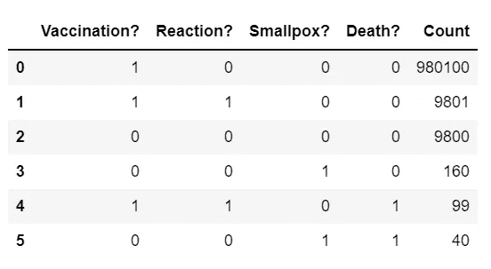
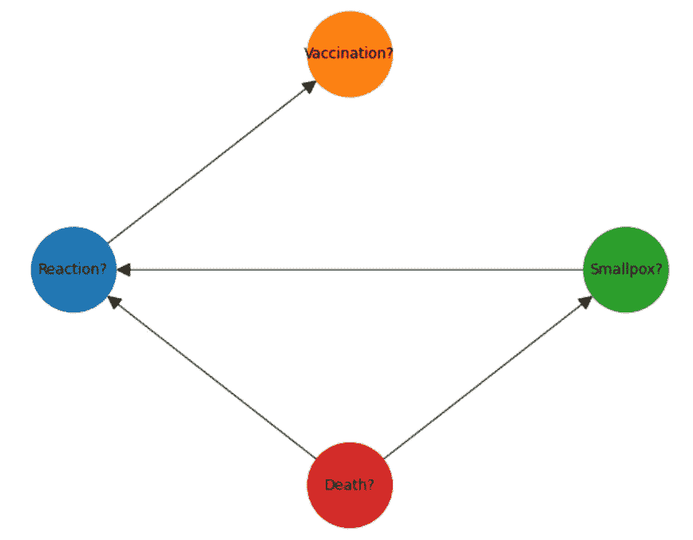
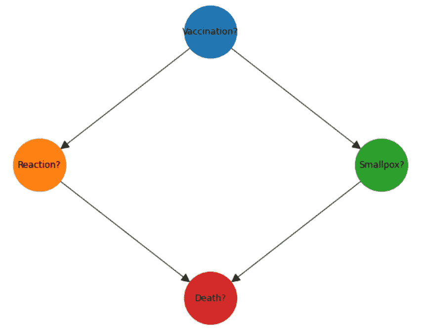

# Python 中因果推理的简单解释

> 原文：<https://towardsdatascience.com/a-simple-explanation-of-causal-inference-in-python-357509506f31>

## 关于如何用 Python 构建端到端因果推理模型的直白解释


Photo by [愚木混株 cdd20](https://unsplash.com/@cdd20?utm_source=unsplash&utm_medium=referral&utm_content=creditCopyText) on [Unsplash](https://unsplash.com/s/photos/question-mark?utm_source=unsplash&utm_medium=referral&utm_content=creditCopyText)

## 背景

当我完成一个商业机器学习分类项目时，我第一次对因果关系感兴趣，客户在演示后问的第一件事是…

> "为什么会发生这种情况，潜在的原因是什么？"

我的第一次尝试是围绕着人工修改分类模型的输入数据，但是效果不是很好。

接下来，我在 Google、Medium 和 Towards Data Science 上搜索关于“因果推理”的文章，我确实找到了一些，但它们很复杂，往往不完整，也不能推广到我自己的数据集。

这促使我探索更广泛的文献和目前可用的各种因果库的文档，这篇文章提出了一个因果推理模型，这是该研究的结果。

## 你将学到什么

> 到本文结束时，您将能够生成表示任何因果推理场景的测试数据，用 Python 代码构建一个因果模型，然后运行“假设”针对模型的查询。

在我们深入因果推理模型之前，请考虑…

[通过我的推荐链接](https://grahamharrison-86487.medium.com/membership)加入 Medium(如果你使用此链接注册，我将收取一定比例的费用)。

[每当我发表一个新故事时，订阅一封免费电子邮件](https://grahamharrison-86487.medium.com/subscribe)。

[快速浏览我之前的文章](https://grahamharrison-86487.medium.com/)。

[下载我的免费战略数据驱动决策框架](https://relentless-originator-3199.ck.page/5f4857fd12)。

访问我的数据科学网站— [数据博客](https://www.the-data-blog.co.uk/)。

## 入门指南

我们需要做的第一件事是导入代码中需要的所有库…

我们需要的第二件事是一个假设的场景来建模-

*   在 100 万名儿童中，990，000 人(99%)接种了疫苗
*   在接种疫苗的人中，9900 人(990000 人中的 1%)有反应
*   在那些有反应的人中，99 人(9900 人中的 1%)死于该反应
*   在没有接种疫苗的人群中，有 200 人(10000 人中的 2%)感染了天花
*   在患天花的人中，40 人(200 人中的 20%)死于这种疾病

我们需要的下一件事是一些测试数据来表示场景的“观察”。要快速构建一百万行代表因果场景的测试数据，请阅读本文…

[](/how-to-generate-synthetic-data-for-any-causal-inference-project-in-less-than-10-lines-of-code-158688a89349) [## 如何用不到 10 行代码为任何因果推理项目生成合成数据

### 如果 99%的人接种了疫苗，1%的人出现反应，2%的人得病，你如何生成有代表性的合成数据？

towardsdatascience.com](/how-to-generate-synthetic-data-for-any-causal-inference-project-in-less-than-10-lines-of-code-158688a89349) 

…查看源代码和对`BinaryDataGenerator`类的解释…

```
(1000000, 4)
```



作者图片

这个网格是一百万行测试数据的总结。第一行是说 100 万“观察”中的 980，100 人接种了疫苗，没有反应，没有感染天花，没有死亡等。

## 进退两难

从下面的总结中，我们可以看到疫苗项目的一个反直觉的结果…

```
Deaths caused by Vaccination: 99
Deaths caused by Smallpox: 40
```

疫苗导致的死亡比疾病还多！那么，为了拯救生命，疫苗项目应该取消吗？

为了解决这个问题，我们需要问这样一个问题:“如果我们没有实施疫苗计划，会发生什么？”。这是一个反事实的问题，也就是说，它要求我们想象一个不同的世界，在那里我们做出了不同的关键选择，并找出这会产生什么影响。

我将在未来的文章中详细讨论反事实，但现在足以说反事实使这成为一个不太适合机器学习技术的因果推理模型，因为它是因果关系而不是相关性。

本文的剩余部分将解释如何使用 Python 代码来解决这个问题，这些代码已经被编写得易于遵循和理解…

## 第一步:因果图

在《为什么》一书中，Pearl 认为因果推理引擎的关键组成部分之一是“因果模型”,它可以是因果图、结构方程、逻辑陈述等。但是在因果图上珍珠被“强烈销售”。

[](https://www.amazon.co.uk/Book-Why-Science-Cause-Effect/dp/0241242630) [## 为什么之书:因果的新科学

### 购买由珀尔，朱迪亚，麦肯齐，达纳(ISBN: 9780241242636)所著的《为什么:因果的新科学》一书

www.amazon.co.uk](https://www.amazon.co.uk/Book-Why-Science-Cause-Effect/dp/0241242630) 

目前，大多数的库和文章都称之为“有向无环图”(DAGs 它们本质上是一样的。

作为一名数据科学家，我的直觉是，通过识别和解决数据中的模式，问题是可以解决的，当然，有算法可以从数据中构建因果图，现在我们有 100 万行测试数据(我们的“观察”)，我们可以轻松地尝试这一点…



作者图片

结果不是很满意！

根据 NOTEARS 算法结果天花导致疫苗接种反应，死亡导致天花和反应，反应导致疫苗接种！(更多关于 NOTEARS 不合适的信息可以在[这里](https://www.causalens.com/research-paper/unsuitability-of-notears-for-causal-graph-discovery/)找到。

我尝试了几个公开可用的库，得到了类似的结果，那么我们如何创建因果推断图呢？

嗯，Pearl 提出了一个强有力的案例，因果图需要领域专业知识，不能简单地从数据中推断出来，这确实有直观的意义。

如果我们要收集一只小公鸡啼叫和太阳升起的观察结果，那么肯定会有相关性，但是关于小公鸡的啼叫不会导致太阳升起的知识不能仅仅从数据中凭直觉得出。

根据天花图，我们知道疫苗接种先于反应，而时间知识会帮助我们纠正这个图，但是就像公鸡在太阳升起前啼叫一样，即使这样也帮不了我们！

那么我们需要的是通过与领域专家互动、向他们学习和提问而获得的领域知识(然后接受批判性的挑战！)来建立有效的因果图。

以下是 Python 代码…



作者图片

这看起来好多了！

## 步骤 2:条件概率表

接下来需要的是一组条件概率表(CPT ),描述图中节点之间转移的概率。

这听起来很复杂，但这些概率都可以在我们的 100 万行数据(代表假设观察)中获得，并且`pgmpy`库可以在一行代码中完成所有必要的计算，并增加一行代码来验证模型...

```
True
```

...并且 CPT 可以容易地打印出来...

```
+-----------------+------+
| Vaccination?(0) | 0.01 |
+-----------------+------+
| Vaccination?(1) | 0.99 |
+-----------------+------+
+--------------+-----------------+-----------------+
| Vaccination? | Vaccination?(0) | Vaccination?(1) |
+--------------+-----------------+-----------------+
| Reaction?(0) | 1.0             | 0.99            |
+--------------+-----------------+-----------------+
| Reaction?(1) | 0.0             | 0.01            |
+--------------+-----------------+-----------------+
+--------------+-----------------+-----------------+
| Vaccination? | Vaccination?(0) | Vaccination?(1) |
+--------------+-----------------+-----------------+
| Smallpox?(0) | 0.98            | 1.0             |
+--------------+-----------------+-----------------+
| Smallpox?(1) | 0.02            | 0.0             |
+--------------+-----------------+-----------------+
+----------+-------------+-------------+-------------+-------------+
| Reaction?| Reaction?(0)| Reaction?(0)| Reaction?(1)| Reaction?(1)|
+----------+-------------+-------------+-------------+-------------+
| Smallpox?| Smallpox?(0)| Smallpox?(1)| Smallpox?(0)| Smallpox?(1)|
+----------+-------------+-------------+-------------+-------------+
| Death?(0)| 1.0         | 0.8         | 0.99        | 0.5         |
+----------+-------------+-------------+-------------+-------------+
| Death?(1)| 0.0         | 0.2         | 0.01        | 0.5         |
+----------+-------------+-------------+-------------+-------------+
```

完整的模型，即因果推断图加上条件概率表可以更容易地可视化如下…


作者图片

为了完善我们的理解…

*   顶部的表格显示，人口接种疫苗的概率为 99%
*   左边的表格显示，如果接种疫苗= 0，反应概率为 0%，如果接种疫苗= 1，反应概率为 1%
*   右边的表格是说，如果接种疫苗= 0，天花的概率是 2%，如果接种疫苗= 1，天花的概率是 0%
*   下表显示，如果天花= 1，反应= 0，死亡概率为 20%，如果天花= 0，反应= 1，死亡概率为 1%

注意:在这个例子中，最后一列没有意义；它是由`.fit()`添加的，以确保所有的值都存在，但是在同一行中没有 reaction = 1 和天花= 1 的数据。

## 步骤 3:查询模型

**基本查询**

首先，我们需要一个简单的助手函数来对模型执行查询…

第一个查询将使用模型显示发生的死亡总数…

```
+-----------+---------------+
| Death?    |   phi(Death?) |
+===========+===============+
| Death?(0) |        0.9999 |
+-----------+---------------+
| Death?(1) |        0.0001 |
+-----------+---------------+
Number of deaths: 139
```

下一个问题是问一个反事实的问题——“如果没有疫苗接种计划，会发生什么？”也就是说，如果我们将`Vaccination?`的证据改为 0，会对变量`Death?`产生什么影响？...

```
+-----------+---------------+
| Death?    |   phi(Death?) |
+===========+===============+
| Death?(0) |        0.9960 |
+-----------+---------------+
| Death?(1) |        0.0040 |
+-----------+---------------+
Number of deaths: 4000.0
Lives saved by vaccine program: 3861
```

现在我们有问题的答案了！尽管疫苗接种导致 99 人死亡，但疫苗接种计划挽救了 3，861 人的生命(如果你想看到答案的验证，请查阅“为什么之书”第 44 页，其中仅使用概率就解决了问题)。

**更复杂的查询**

但如果我们想回答一个更复杂的问题，比如“如果疫苗接种率是 50%，而不是 99%，会发生什么？”。

基本的`query()`方法只能接受关于特征概率为 1 或 0 的参数，50 / 50 问题要求条件概率表中的“疫苗接种？”当前包含的 99 / 1 被替换。

同样，这听起来很复杂，但是非常简单…

```
+-----------------+------+
| Vaccination?(0) | 0.01 |
+-----------------+------+
| Vaccination?(1) | 0.99 |
+-----------------+------+
```

```
+-----------------+-----+
| Vaccination?(0) | 0.5 |
+-----------------+-----+
| Vaccination?(1) | 0.5 |
+-----------------+-----+
```

```
+-----------+---------------+
| Death?    |   phi(Death?) |
+===========+===============+
| Death?(0) |        0.9980 |
+-----------+---------------+
| Death?(1) |        0.0021 |
+-----------+---------------+
Number of deaths: 2050
```

50%的疫苗接种方案仍可挽救 2050 条生命，但相比挽救了 3861 条生命的 100%疫苗接种方案，将失去 1811 条生命。

## 结论

因果推理是机器学习和人工智能中的一个热门话题，吸引了越来越多的文章和库。

然而，这些文章通常很复杂，很难理解，而且没有一个库像监督学习的`scikit-learn`一样成为因果推理的“首选”。

当然，人类直觉上擅长因果推理。我们能够想象如果我们在过去做出不同的决定，今天会是什么样子，我们可以将这种历史经验应用于想象的未来状态，但机器学习算法不擅长这项任务。

本文通过展示一个简单、直接的例子，说明了如何用 Python 构建因果模型(因果推断图和条件概率表)以及如何针对该模型执行基本和更复杂的查询，从而打破了因果推断的一些复杂性。

在以后的文章中，我将探索反事实、“do”操作符、混淆以及这个迷人的新兴主题的其他方面。

同时，如果你喜欢这篇文章，请考虑…

[通过我的推荐链接](https://grahamharrison-86487.medium.com/membership)加入 Medium(如果你使用这个链接注册，我将收取一定比例的费用)。

[](https://grahamharrison-86487.medium.com/membership) [## 通过我的推荐链接加入媒体-格雷厄姆哈里森

### 阅读格雷厄姆·哈里森(以及媒体上成千上万的其他作家)的每一个故事。增强您的数据知识…

grahamharrison-86487.medium.com](https://grahamharrison-86487.medium.com/membership) 

每当我发表新故事时，订阅一封免费电子邮件。

[快速浏览我之前的文章](https://grahamharrison-86487.medium.com/)。

[下载我的免费战略数据驱动决策框架](https://relentless-originator-3199.ck.page/5f4857fd12)。

访问我的数据科学网站— [数据博客](https://www.the-data-blog.co.uk/)。