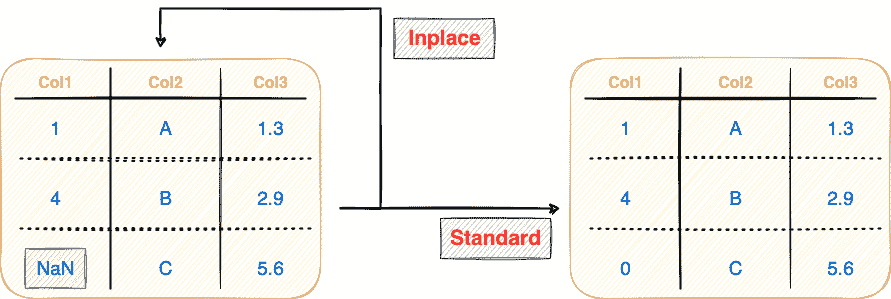
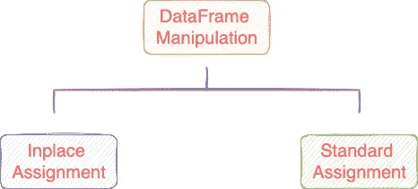
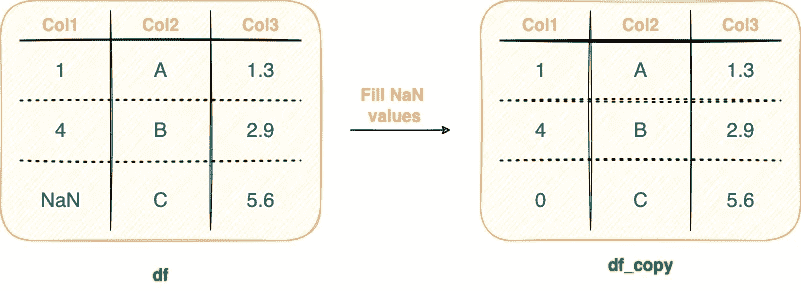
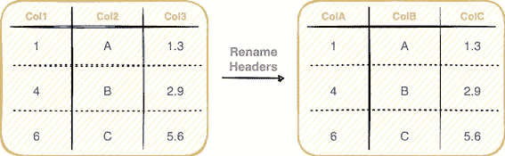
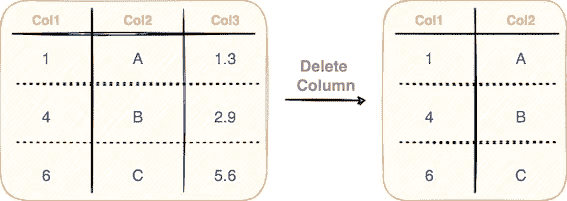
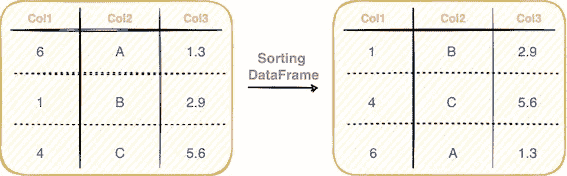
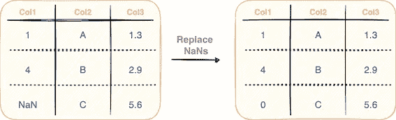
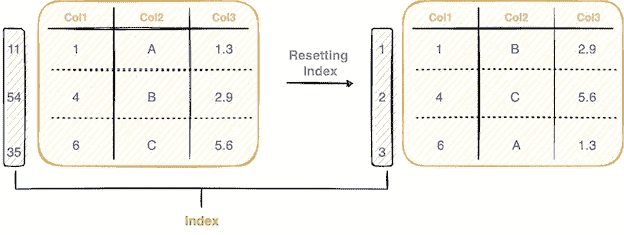

# 大熊猫就地手术简单指南

> 原文：<https://towardsdatascience.com/a-simple-guide-to-inplace-operations-in-pandas-7a1d97ecce24>

## 介绍熊猫的原位手术，探索普遍支持的方法和常见的误解

照片由[西格蒙德](https://unsplash.com/@sigmund?utm_source=medium&utm_medium=referral)在 [Unsplash](https://unsplash.com?utm_source=medium&utm_medium=referral) 上拍摄

在转换熊猫数据帧时，就地赋值操作非常普遍。顾名思义，原地赋值背后的核心思想是避免每次连续修改都创建新的数据帧对象，而是对原始数据帧本身进行更改。

原地和标准赋值操作(图片由作者提供)

就地赋值操作在内存极度受限的应用程序中特别有用。这是因为对现有数据帧(或源数据帧)进行了修改，而没有创建任何中间数据帧。

这篇文章是对就地操作的介绍，特别是对熊猫数据帧的介绍。我们将讨论就地运算与标准的赋值运算有何不同。最后，我将介绍一些最常用的支持熊猫原地赋值的方法。

文章的亮点如下:

[**在位赋值简介**](#fbf8)[**在位赋值的常见误解**](#5266)[**支持在位赋值的常用函数**](#0b7b)[**运行时比较**](#c5cc)[**结论**](#379f)

我们开始吧🚀！

# 就地分配简介

一旦我们将数据帧加载到 Python 环境中，我们通常会对该数据帧执行大范围的转换，不是吗？这些包括添加新列、重命名标题、删除列、改变单元格值、替换 NaN 值等等。

通常可以通过两种方式执行这些操作，如下图所示:

熊猫数据帧操作的分类(图片由作者提供)。

## 标准分配

如果应用的转换返回数据帧的新副本，在 Pandas 中它被称为**“非就地”**或**“标准赋值”**操作。

默认情况下，Pandas 总是求助于标准赋值并返回数据帧的修改副本，而不改变原始数据帧。

您可能已经猜到，这实际上会占用额外的内存空间，最终会导致内存限制。下图演示了标准的赋值操作，并在下图后面的代码块中实现:

从给定的数据帧创建新的数据帧(图片由作者提供)。

作为上面显示的填充 NaN 值的标准赋值操作的结果，两个不同的熊猫对象将存在于程序的范围内— `df`和`df_copy`。

## 就地分配

与标准/传统赋值相反，如果生成的中间数据帧(如上面的`df_copy`)对你没有用，执行**就地赋值**是继续的理想方式。下面演示了这一点:

执行就地操作(Gif 由作者提供)

> 另一方面，你应该知道，在熊猫之外的许多功能中也存在就地分配。例如，当您使用`append()`方法将一个元素添加到 Python 列表中时，这是一个就地操作，因为该元素被添加到源列表中。类似地，Python 列表上的`sort()`方法也执行就地排序。

Pandas 中的就地操作要求将`inplace`参数作为`True`传递给被调用的方法。例如，我们可以用上述数据帧*中的`0`代替*中的 NaN 值，如下所示:

# 关于就地分配的常见误解

这里，有人可能会说，我们可以通过将新数据帧重新分配给原始数据帧的名称来优化内存，如下所示:

尽管上述赋值操作在语法上没有问题，但是您应该理解，采用这种方法不可避免地会在赋值操作期间创建一个新的数据帧，从而导致内存利用率暂时增加。

我们可以使用 Python 中的`id()`方法验证新 DataFrame 对象的创建，如下所示:

源数据帧的 ID(或地址)和新数据帧的 ID(或地址)是不同的，这意味着创建了熊猫数据帧的新实例。

另一方面，如果您用`inplace=True`参数执行一个就地操作，它不会创建一个新的数据帧。对原始数据帧本身进行修改。这可以通过以下方式验证:

# 支持就地赋值的常用函数

在熊猫身上有一些方法与就地操作是内在兼容的。下面展示了一些最常用的函数:

## #1 重命名数据帧标题

每个列都有一个特定的列标题，用于定义列的名称。您可以更改部分/全部列的名称，如下所示:

重命名数据帧的标题(图片由作者提供)

要重命名数据帧的列，可以在 Pandas 中使用`[rename()](https://pandas.pydata.org/docs/reference/api/pandas.DataFrame.rename.html)`方法，如下所示:

标准赋值返回一个新的数据帧。因此，您必须将它赋给一个变量。但是，由于就地赋值修改了源数据帧本身，因此它不会返回任何内容。

## #2 删除列

假设您想要从现有数据框架中移除不需要的列，如下图所示:

从数据帧中删除列(图片由作者提供)

要删除数据帧的列，可以在 Pandas 中使用`[drop()](https://pandas.pydata.org/docs/reference/api/pandas.DataFrame.drop.html)`方法，如下所示:

您应该将想要删除的列作为列名列表传递给`drop()`方法的`columns`参数。

## #3 排序数据帧

分类操作是熊猫广泛使用的另一种方法。顾名思义，这里的想法是根据一列或多列中的值对数据帧进行排序，如下所示:

对数据帧排序(按作者排序的图像)

您可以使用`[sort_values()](https://pandas.pydata.org/docs/reference/api/pandas.DataFrame.sort_values.html)`方法对数据帧进行排序，如下所示:

## #4 替换 NaN 值

在现实世界的数据集中，缺失值的存在是不可避免的。对于 Pandas，您有一系列方法来处理丢失的数据并用确定的值替换它们，如下所示:

替换数据帧中的 NaN 值(图片由作者提供)

要替换 NaN 值，使用如下所示的`[fillna()](https://pandas.pydata.org/docs/reference/api/pandas.DataFrame.fillna.html)`方法:

## #5 重置索引，等等。

如果您想重置 DataFrame 的索引值，您可以在 Pandas 中使用`[reset_index()](https://pandas.pydata.org/docs/reference/api/pandas.DataFrame.reset_index.html)`方法。下图演示了这一操作:

重置数据帧的索引(图片由作者提供)

# 运行时比较

接下来，我们将在上面讨论的五个熊猫函数— `drop()`、`rename()`、`fillna()`、`reset_index()`和`sort_values()`上实验性地比较标准和就地赋值操作的运行时性能。

下面的代码块演示了我测量运行时间的实现:

为了给你一个要点，上面的实现通过在虚拟数据帧`df`上迭代执行这些操作，找到了标准赋值和就地赋值的平均运行时间。

要查找其他方法的运行时性能，我们可以用感兴趣的方法(`drop()`、`rename()`、`fillna()`和`sort_values()`)来替换`reset_index()`方法。

下面的柱状图描述了获得的结果。

标准赋值和就地赋值的运行时比较(图片由作者提供)

在上面的条形图中，我将标准分配作为参考点，并相应地调整了就地分配的性能。换句话说，如果标准赋值用了 100 秒来执行，那么上面的每个黄色条代表与就地赋值方法相对应的缩放运行时间。

总的来说，原地赋值操作总是比标准操作执行得更好。

# 结论

总之，在这篇文章中，我们讨论了熊猫原地行动背后的核心思想，以及它们与标准任务行动的不同之处。此外，我还介绍了一些最常用的支持熊猫原位赋值的方法。

虽然就地手术在熊猫中很受欢迎，但你应该知道与它们相关的利弊。由于时间关系，我没有在这篇文章中讨论它们，我将很快发布另一篇博客！

**感谢阅读！**

[🧑‍💻**成为数据科学专家！获取包含 450 多个熊猫、NumPy 和 SQL 问题的免费数据科学掌握工具包。**](https://subscribepage.io/450q)

✉️ [**注册我的电子邮件列表**](https://medium.com/subscribe/@avi_chawla) 不要错过另一篇关于数据科学指南、技巧和提示、机器学习、SQL、Python 等的文章。Medium 会将我的下一篇文章直接发送到你的收件箱。