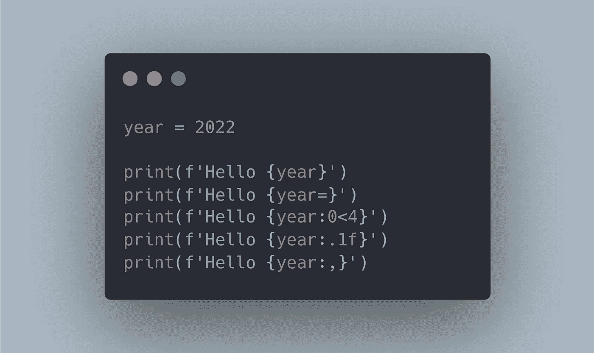

# 使用 f 字符串在 Python 中格式化字符串的简单指南

> 原文：<https://towardsdatascience.com/a-simple-guide-to-string-formatting-in-python-using-f-strings-39e5c39589c3>

## 使用 f-strings 将字符串格式提高到一个新的水平



作者图片

如果你已经学习 Python 有一段时间了，可能你会使用`" "`在 Python 中创建字符串。

这没什么不好。毕竟，我们的第一行 Python 代码是一个简单的`print(“Hello World”)`。也就是说，如果你想让你的 Python 字符串更上一层楼，你应该使用 f 字符串。

f-strings 是在 Python 3.6 中引入的，它提供了一种更好的格式化字符串的方法。在本指南中，我们将了解如何使用 f 字符串在 Python 中格式化字符串。我们将学习如何添加变量、逗号分隔符、左/右零填充、日期等等。

# 格式化

按照这个教程，确保你有 Pytho 3.6 或更高版本，否则 f-string 将无法工作。

## 简单格式化

f-string 为向字符串添加变量提供了更好的语法。

让我们用 Python 中的 f-string 打印两条消息。为此，我们必须在用于创建常规字符串的`‘’`前面添加`f`。我们还必须添加`{}`来在我们的字符串中插入一个变量。

```
**age** = 20
**python_version** = 3.8

>>> **print**(f'Your age is {age}')
Your age is 20>>> **print**(f'python_version={python_version}')
python_version=3.8
```

如你所见，使用 f-string 添加变量比使用常规字符串和`+`操作符更简单。

f-string 也使得调试更加容易。我们不需要像上面对`python_version`那样打印变量名和它的值，使用 f-string 我们只需要在 f-string 中写这个:`{variable_name=}`

```
**age** = 20
**python_version** = 3.8>>> **print**(f'{**age=**}')
age=20>>> **print**(f'{**python_version=**}')
python_version=3.8
```

太好了！现在让我们看看更多高级格式。对于下面的部分，我们将使用下面的语法。

```
**Syntax**: **{:[width][.precision][type]}**Type:
**d**: integers
**f**: floating point numbers
**You need to specify precision only in case of floating point numbers*
```

# 排列

在极少数情况下，您需要将单词/文本向右或向左对齐，但这是完全理解如何向数字的左/右添加零的基础，这在格式化数字时非常有用。

## 向右对齐

假设我们有一个数字，我们想把它向右对齐。我们可以使用上面的语法做到这一点。在这种情况下，我们只需要添加`width`元素。

如果我们想要添加 6 个空格并将文本右对齐，我们只需要添加 8 的宽度(默认行为是将文本右对齐)

```
number = 20>>> **print**(f'{number}')
20>>> **print**(f'{number**:8**}')
      20>>> **print**(f'{number:**>8**}')
      20
```

如果我们想更具体一些，我们添加了`>`来表示文本应该向右对齐。

## 向左对齐

现在让我们将文本向左对齐，但现在让我们使用`_`作为填充字符。

```
number = 20>>> **print**(f'{number:**<8**}')
20 >>> **print**(f'{number:**_<8**}')
20______
```

为了完成 8 的宽度，我们使用上面的代码添加了 6 个“_”。

# 用零填充

现在是时候使用我们在上一节中学到的知识来设置数字的格式了，在左边/右边加零。

## 右填充零

正如我们之前看到的，我们可以选择填充字符。在这种情况下，我们将选择`0`作为填充字符，在下面的浮动中有 5 位小数。

```
x = 20.123>>> **print**(f'{x:**0<8**}')
20.12300
```

这很酷，但有时使用`width`会使事情变得复杂，因为我们必须在添加 0 之后计算数字的最终宽度。

相反，更简单的方法是考虑我们想要的小数位数。

我们可以使用前面显示的语法中的`.precision`得到这个。让我们添加 0，直到我们有 5 个小数。

```
>>> **print**(f'{x:**.5f**}')
20.12300
```

在上面的代码中，`5`代表精度，`f`代表浮点数。

## 用零填充左侧

现在让我们在左边加上 0。当我们需要使用 numbers 创建自定义格式时，这非常有用。

假设我们想要获得以下格式:`*YYYYMMDD*` 并且我们有从 1 到 9 的常规数字。在这种情况下，我们需要在月和日的左边加上 0。

以下是用 f 弦做这件事的两种方法。

```
year = 2022
month = 1
day = 5

*# YYYYMMDD*
>>> **print**(f'{year}{month:**0>2**}{day:**0>2**}')
20220105>>> **print**(f'{year}{month:**02d**}{day:**02d**}')
20220105
```

# 圆形浮子

## 四舍五入到“n”位小数

当涉及到将浮点数舍入到“n”位小数时，使用`.precision`和`f`类型更实用。

让我们把下面的数字四舍五入到小数点后一位数。

```
x = 20.123>>> **print**(f'{x:**.1f**}')
20.1
```

## 将浮点格式设置为百分比

现在我们把数字四舍五入，加上`%`符号。

```
x = 20.123>>> **print**(f'{x:**.1f**}%')
20.1%
```

## 使用逗号作为千位分隔符

我们也可以添加一个逗号作为千位分隔符。我们只需要加上`,`

```
x = 1000000>>> **print**(f'{x:**,**}')
1,000,000
```

# 日期格式

最后但同样重要的是，我们可以导入`datetime`并使用 f 字符串中的特殊字符来获得正确的数据格式。

```
**import** datetimenow = datetime.datetime.now()

>>> **print**(f'Today is {now:**%B**} {now:**%-d**}, {now:**%Y**}')
Today is May 20, 2022>>> **print**(f'{now=:**%m-%d-%Y**}')
now=05-20-2022
```

[这里有一个包含更多字符的 cheasheet，您可以用它来格式化 Python 中的日期变量。](https://strftime.org/)

用 Python 学习数据科学？ [**通过加入我的 10k+人电子邮件列表，获取我的免费 Python for Data Science 备忘单。**](https://frankandrade.ck.page/26b76e9130)

如果你喜欢阅读这样的故事，并想支持我成为一名作家，可以考虑报名成为一名媒体成员。每月 5 美元，让您可以无限制地访问数以千计的 Python 指南和数据科学文章。如果你使用[我的链接](https://frank-andrade.medium.com/membership)注册，我会赚一小笔佣金，不需要你额外付费。

[](https://frank-andrade.medium.com/membership) [## 通过我的推荐链接加入媒体——弗兰克·安德拉德

### 作为一个媒体会员，你的会员费的一部分会给你阅读的作家，你可以完全接触到每一个故事…

frank-andrade.medium.com](https://frank-andrade.medium.com/membership)