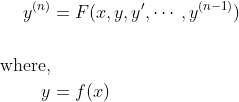
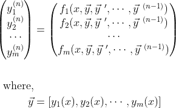
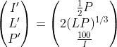
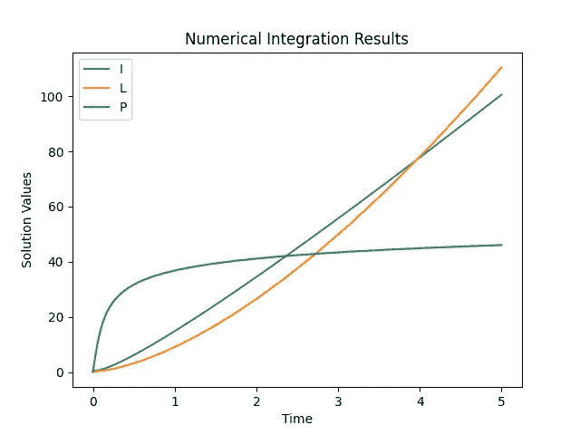

# Python 中数值积分的一种简单方法

> 原文：<https://towardsdatascience.com/a-simple-method-for-numerical-integration-in-python-579f785d7a93>

## 常微分方程系统近似解的分步编码示例


Sanjeevan SatheesKumar 在 [Unsplash](https://unsplash.com?utm_source=medium&utm_medium=referral) 上拍摄的照片

数值积分是一种用来近似求解常微分方程的技术。有一系列数值积分的方法；这些在速度、准确性和复杂性方面有所不同。举几个例子，有欧拉法、龙格-库塔法和梯形法则。幸运的是，作为一名程序员或工程师，您不需要知道这些方法如何工作的确切细节，就可以获得一个好的 ODE 或 ODE 系统的解决方案。

在开始编写代码之前，让我们先简要介绍一下什么是常微分方程以及数值积分是如何工作的。这些微分方程的形式如下:



这里， *y* 是 *x* 的未知函数(我们试图在某些 *x* 值上逼近这个函数)，而 *F* 是 *x* 、 *y* 的函数，以及 *y* 的导数(我们已有的或已给的)。 *n* 代表微分方程的阶或最高导数。函数， *F* ，通常是一个由物理学家、数学家、科学家等导出的著名方程。例如，给定一个质点的速度函数，你可以求解该质点的位置。在这个例子中，时间将等于上面等式中的 *x* ，速度将等于 *F* 。

类似地，你可以有一个你想要解决(或近似)的常微分方程系统。这些方程将采用以下形式:



在这里，我们有一组我们感兴趣的 *y* 值(数量为 *m* )，每个值都有自己的导数和未知解。

涉及常微分方程的最常见问题之一是初值问题(IVPs)。在这些问题中，你会得到一个初始值和一个上面给出的 ODE。通常，您将使用一阶 ODE。对于一阶常微分方程，数值方法采用常微分方程并将其视为斜率。利用这个斜率和 *x* 上的一个非常小的增量，可以将 *y* 的初始值增加到接近 *y* 的下一个值。重复这个过程，直到你找到所有你感兴趣的值。如果仔细选择 *x* 的步长，那么近似可以产生非常精确的结果。这也适用于颂诗系统。

对于本文，我们先解一组三( *m* )阶( *n* )阶常微分方程。这些等式是任意的，所以根据需要用你自己的来代替。



这里，刻度线表示变量的一次导数。我们将把我们的常微分方程系统作为一个初值问题来解决。这意味着我们将把 *I* 、 *L* 和 *P* 的初始值传递给我们的数值积分器。使用这些值，我们的数值积分器将在时间上采取小步骤，并在每个时间步骤使用导数来求解我们的变量。我将在编码部分更详细地介绍数字积分器及其功能。让我们直接进入代码吧！

## **导入库**

这里，我们只是导入必要的库和函数来运行这段代码。

*   来自*的`solve_ivp`SciPy*库用于解决初值问题和数值积分
*   *matplotlib* 中的`*pyplot*` 用于绘制数值积分的结果(为便于调用，定义为`plt`)

```
# Importing Packages
from scipy.integrate import solve_ivp
import matplotlib.pyplot as plt
```

## **创建用户自定义函数**

下一步是将我们的 ODEs 系统定义为一个名为`model`的用户自定义 Python 函数。这将允许`solve_ivp`在数值积分时使用该功能。你会在下面的代码中看到，我们首先从传入函数的 *Y* 向量中拉出 *I* 、 *L* 和 *P* 变量(`solve_ivp`在幕后传递 *t* 和 *Y* )。然后，我们使用这些值来求解我们在本文前面定义的时间导数。我们为这些衍生品创建一个列表并返回它们。

```
# Model for solve_ivp
def model(t, Y):
    I = Y[0]
    L = Y[1]
    P = Y[2]
    dIdt = 1/2*P
    dLdt = 2*(L*P)**(1/3)
    dPdt = 100/I
    dYdt = [dIdt, dLdt, dPdt]
    return dYdt
```

## **数值积分求解**

如本文前面所述，我们将使用`solve_ivp`对我们的 ODEs 系统进行数值积分。`solve_ivp`函数有两个必需的参数:用户定义的函数`model`、时间跨度元组`tspan`和一组初始条件`Y0`。时间跨度和初始条件是随机选择的，所以你可以随意摆弄它们，看看你会得到什么结果。我们还可以传入额外的可选参数，这些参数将帮助我们定义我们希望我们的解决方案具有什么样的数值方法和精度。我们将选择 5(4)阶的龙格-库塔方法和 1/10 ⁰.的相对容差(相对精度)`solve_ivp`还有很多其他选择。点击查看文档[。](https://docs.scipy.org/doc/scipy/reference/generated/scipy.integrate.solve_ivp.html)

```
# Initial Conditions
Y0 = [0.5, 0.2, 0.1]  # [I0, L0, P0]

# Time Span of Interest
tspan = (0, 5)  # (t0, tf)

# Solving ODE
sol = solve_ivp(model, tspan, Y0, method='RK45', rtol=1e-10)
I_sol, L_sol, P_sol = sol.y
time = sol.t
```

一旦我们运行数值积分器，我们将把结果存储在变量`sol`中。然后，我们可以使用点运算符提取变量 *I* 、 *L* 和 *P* 的时间历程或近似解。此外，我们可以提取变量求解的时间步长。

## **绘图结果**

最后，我们可以使用 *Pyplot* 来可视化`solve_ivp`的输出。使用我们收集的时间和时间历史数据，我们可以在同一个图上绘制每个变量。没有标题、轴标签或图例的图是不完整的，所以我们也将包括它们。

```
# Plotting Results
plt.plot(time, I_sol)
plt.plot(time, L_sol)
plt.plot(time, P_sol)
plt.title('Numerical Integration Results')
plt.xlabel('Time')
plt.ylabel('Solution Values')
plt.legend(['I', 'L', 'P'])
plt.show()
```

这部分代码的输出显示了使用数字积分器时 I *、L* 和 P 的近似解。



数值积分结果[由作者创建]

至此，我们已经使用`solve_ivp`成功地解决了我们的原始常微分方程组。如你所见，过程相对简单；您所需要的就是为数值积分器设置参数。一旦你这样做了，就一帆风顺了。

关于 Python 中 ODEs 数值积分的简单方法的文章到此结束。希望你学到了一些东西，并能应用到你的项目中。有问题就留言评论吧！如果你还没有，请留下你的掌声并跟随！谢谢大家！