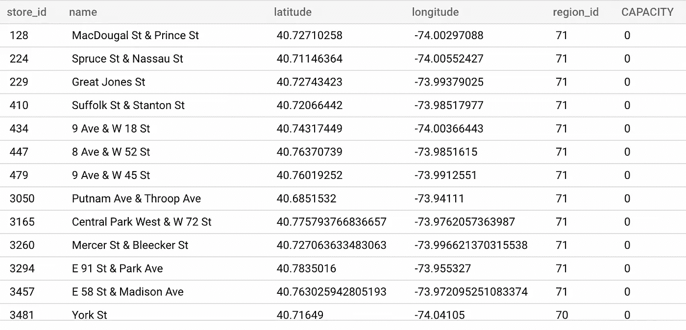
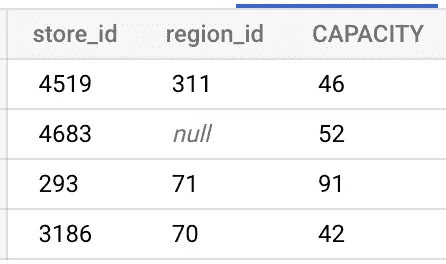
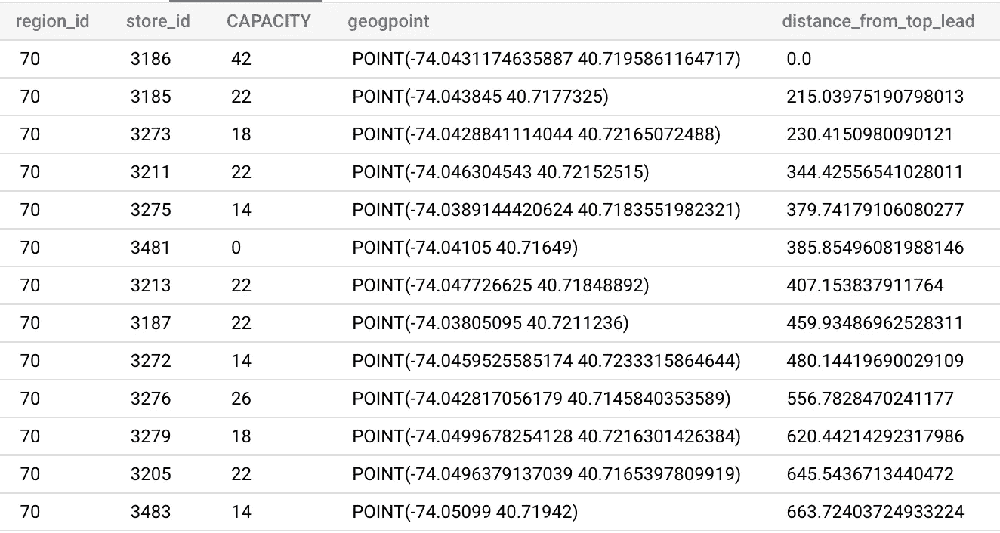
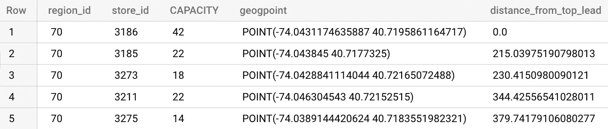
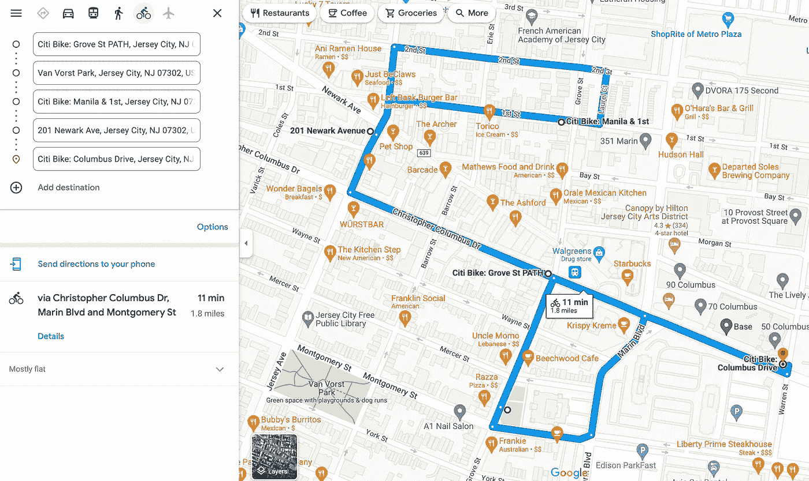
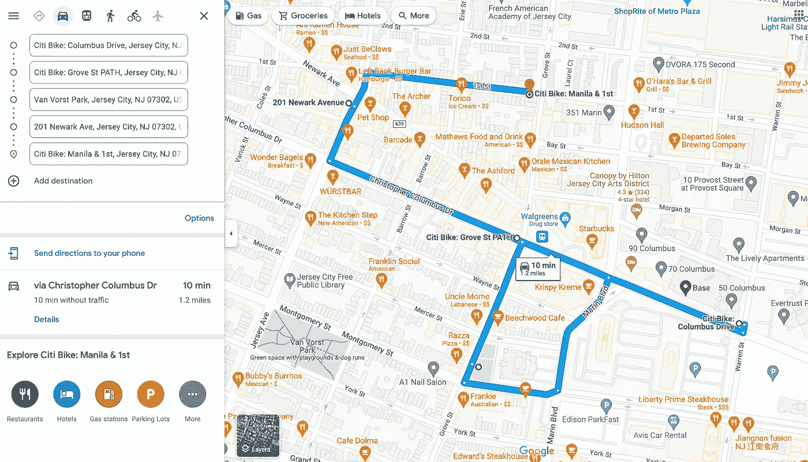

# 一个简单的路线优化使用谷歌大查询(和谷歌地图)

> 原文：<https://towardsdatascience.com/a-simple-route-optimization-using-google-bigquery-and-google-maps-3d2264951816>

## **最少的努力**快速帮助您的线下销售团队寻找潜在的销售线索

何塞·马丁·拉米雷斯·卡拉斯科在 [Unsplash](https://unsplash.com?utm_source=medium&utm_medium=referral) 拍摄的照片

# 介绍

简单有时更好。保持事情简单有助于你更加关注最重要的事情，即价值。你总是可以使用新奇的东西(更好的算法，机器学习等等)，但是当你使用它们的时候，*很容易尝试一些不相关的东西*，这些东西不会让你的工作价值增加那么多。当然，您还需要保持解决方案的质量。

在本文中，我想向您展示一些很酷的东西，通过利用 BigQuery，您可以使用一个简单的解决方案来实现这些东西。您只需要熟悉一些可用的 BigQuery 分析函数。如果你还没有检查我的其他职位。

  

我们将使用公共数据集，但问题陈述在类似的企业中应该相对相同。记住这一点，我希望你能有另一个灵感来解决你的组织正面临的类似问题。让我们直接开始吧！

# 问题陈述

我只是为了举例而编的，尽可能简单。

你在一家向商店销售商品的公司工作(b2b)。你的公司有一些人作为**线下销售团队，他们将接触这些商店作为潜在的销售线索**。

您的数据库中已经有一些可用的销售线索数据，但是您必须以某种方式对它们进行优先排序，以便**优化销售团队获得这些数据所需的成本和时间**。

我将使用 BigQuery 中提供的**new _ York _ Citi bike . Citi bike _ stations**公共数据集。对于这个例子，我将把电台 id 改为商店 id。

查询以获取销售线索数据

线索数据示例(作者图片)

# 简单溶体

我们可以通过使用一种简单的方法来优化销售操作，让我们来分解一下。

## 按地区排列优先级

正如您在数据集中已经注意到的，商店位于几个区域，因此我们按区域优化路线是合理的。您还可以在我们的数据库中看到字段`capacity`，让我们假设它是一个数字，显示我们可以向他们销售多少潜在产品。

我们这一步的逻辑相当简单:`select stores with most capacity in each region`。

查询以按区域获取主要销售线索

按区域排列的顶级销售线索，将空区域 id 假装为另一个 region_id(按作者排列的图片)

现在，我们的线下销售团队应该首先拜访每个地区的主要销售线索。继续下一步。

## 选择要拜访的下一个潜在客户

接下来，我们必须决定我们的线下销售团队接下来应该拜访哪些销售线索。非常简单，只需选择距离上一条引线最近的下一条引线。

最终查询

解释:

*   我们创建一个只包含我们需要的数据的基础 CTE。我们还根据容量给它一个等级，就像我们在上一步中做的那样。还要注意，我们将坐标转换成了地理点对象(如果你想了解更多，请阅读[这个](https://cloud.google.com/bigquery/docs/reference/standard-sql/geography_functions#st_geogpoint))。
*   我们创建了一个 top_leads CTE，仅收集基于能力的顶级销售线索。
*   最后，我们通过使用 inner join by region 来计算顶部引线和每个引线之间的距离。最后一步是根据计算的距离(以米为单位)对它们进行分类。

基于距离的优先线索(图片由作者提供)

## 销售线索分配

最后一步是给每个销售人员分配一些销售线索。任务的数量可能取决于线下销售团队的数量，但假设他们每个人每天可以处理约 5 个销售线索(1 次线下拜访)。

所以我们的步骤就是分解我们的线索来匹配数字。选择前 5 个销售线索，将其分配给销售人员，并继续操作，直到分配完所有销售线索。

但是有一个重要的步骤可以确保我们交付的工作质量足够好。假设这 5 个销售线索分配给了销售人员 A:

分配给销售人员 A 的销售线索(按作者排序的图片)

到目前为止，我们的解决方案只计算距离，没有考虑实际的道路。因此，每次销售人员想要访问潜在客户时，他们都需要在谷歌地图中相应地调整他们的路线(实际上，他们可能会使用谷歌地图或其他类型的导航，因此这不会增加他们的工作量)。

首先，只需输入所有目的地:

未优化的路线(图片由作者提供)

第二，根据道路调整路线:

手动优化路线(图片由作者提供)

注意:*此手动调整取决于国家、位置、道路类型等。这也取决于销售人员如何决定参观，但至少我们可以帮助他们确定一天内需要参观的最近的 5 个地点。*

*链接上例:* [*这里*](https://www.google.com/maps/dir/40.7183551982321+-74.0389144420624+/40.7195861,-74.0431175/40.7177325+-74.043845+/40.72152515+-74.046304543+/40.72165072488+-74.0428841114044+/@40.7196498,-74.0449258,17z/data=!3m1!4b1!4m19!4m18!1m3!2m2!1d-74.0389144!2d40.7183552!1m0!1m3!2m2!1d-74.043845!2d40.7177325!1m3!2m2!1d-74.0463045!2d40.7215252!1m3!2m2!1d-74.0428841!2d40.7216507!3e0)

# 结论

我们利用了一些有用的 BigQuery 函数(分析和地理)来帮助我们为业务问题提供一个简单的解决方案。现在，就看你能否将解决方案传达给利益相关者或业务人员了。您的解决方案的简单性可能会对您解释如何完成这一点有很大帮助！

在我作为一名数据从业者的日常活动中，我研究过许多这种简单而有价值的解决方案。我希望通过与你分享这篇文章，读者也能启发你更多地关注最重要的事情。

一如既往，快乐学习！！🚀🚀