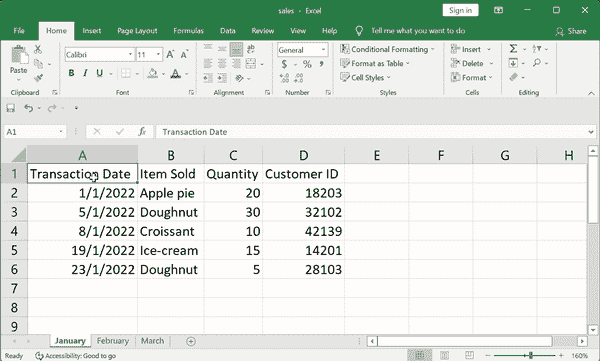
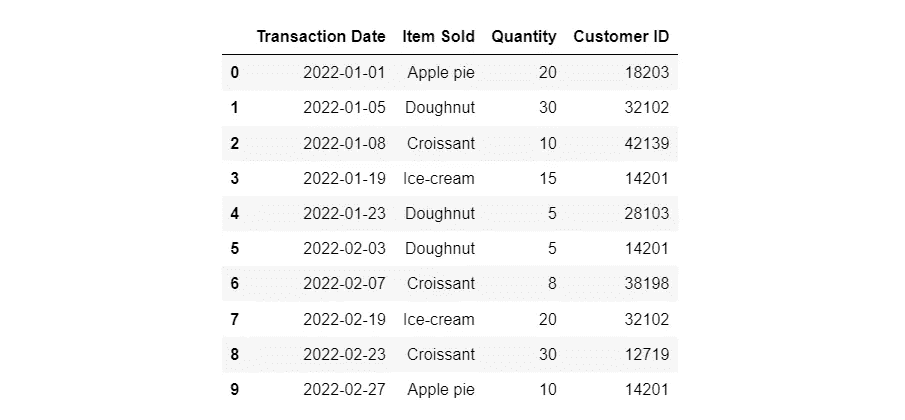
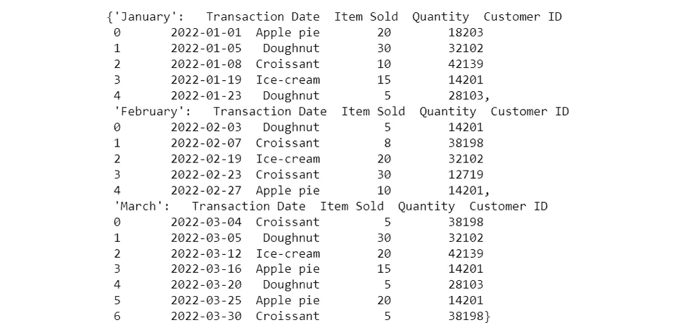
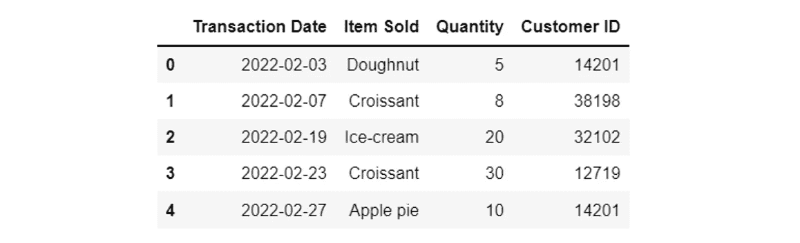
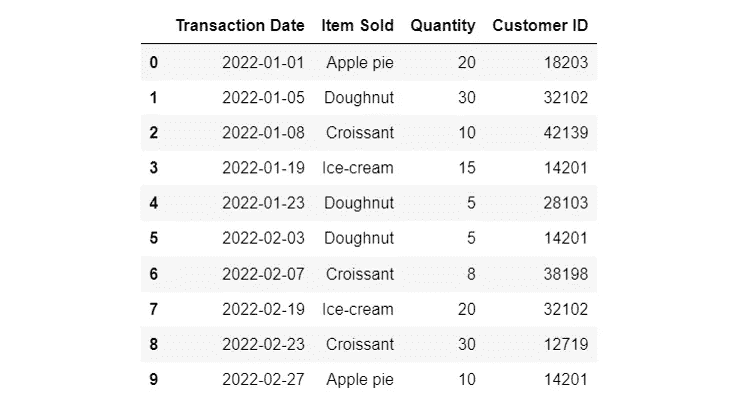
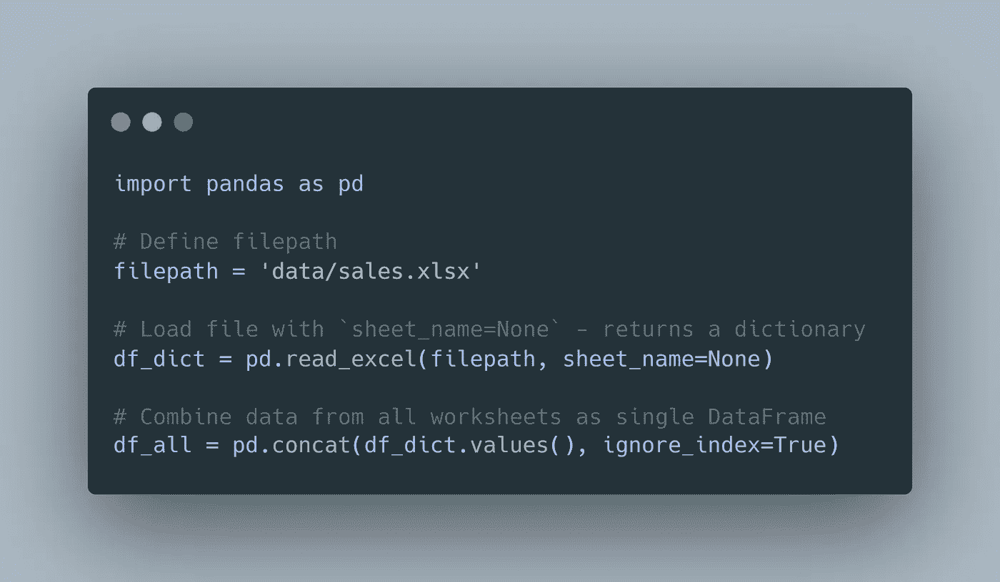

# 在 Pandas 中加载多个 Excel 工作表的简单技巧

> 原文：<https://towardsdatascience.com/a-simple-trick-to-load-multiple-excel-worksheets-in-pandas-3fae4124345b>

## 高效加载包含多个工作表的 Excel 文件的快速指南

照片由[像素](https://pixabay.com/photos/notebook-typing-coffee-computer-1850613/)上的[像素](https://pixabay.com/users/pexels-2286921/)拍摄

在我的日常工作中，我经常使用 Excel 文件——获取 Excel 文件，其中大部分包含多个工作表，并使用 Pandas 将它们加载到 Python 中以完成各种任务。我发现这个过程相当繁琐，直到一位同事(感谢[多嘴多舌的林](https://medium.com/u/b0e2eea1e573?source=post_page-----3fae4124345b--------------------------------)！)教会了我一个简单的技巧，从此以后，我可以更直观、更有效地完成这项任务。允许我在这篇文章里转发一下！🙂

*本文给出的代码可以在这个*[*GitHub repo*](https://github.com/zeyalt/My-Articles/tree/master/Python%20Tips/A%20Simple%20Trick%20To%20Load%20Multiple%20Excel%20Worksheets%20in%C2%A0Pandas)*找到。*

# 数据

在进入症结之前，让我们先看看下面的 Excel 文件，这是我创建的，并将用于举例说明。

包含多个工作表的 Excel 文件(作者提供的 GIF)

它包含连续三个月(1 月到 3 月)的虚构(非常简单)销售数据。每个月的销售数据显示在单独的工作表中。

# 我以前做过的事情及其局限性

假设我的目标是将所有工作表中的数据组合成一个 Pandas 数据框架。为了完成这个任务，我过去常常做以下事情:

1.  使用`openpyxl`或`pandas`获得所有工作表的名称列表。
2.  遍历每个工作表，将每个工作表解析为一个 Pandas 数据帧，并将每个数据帧追加到另一个列表中。
3.  使用`pd.concat`将所有内容合并成一个数据帧。

我的代码应该是这样的:

作者图片

可以想象，这种方法存在一些问题:

*   **你做一个简单的任务**至少有 8 行代码，效率相当低。
*   **你不能在不知道工作表名称的情况下将 Excel 文件加载到 Python** 中。您需要一点逆向工程——在您相应地在`pd.read_excel()`函数中指定`sheet_name`参数之前，您首先需要弄清楚工作表的名称。
*   **您需要指定想要加载的工作表的确切名称**。如果从单个工作表加载数据或者工作表的名称很简单，这可能很简单，但是如果有多个工作表或者工作表名称很复杂，这就容易出错。

# 诀窍是

现在，为了解决这些问题，这里有一个技巧——只需在`pd.read_excel()`函数中将`sheet_name`参数指定为`None`。是的，就这么简单！让我们走一遍。

通过在`pd.read_excel()`函数中指定`sheet_name=None`，您将得到一个熊猫数据帧的字典，其中键是工作表的名称，值是每个工作表中作为熊猫数据帧的数据。

作者图片

现在，如果您希望分析特定工作表中的数据，比如“二月”工作表，您只需执行以下操作:

作者图片

请注意，这将返回一个 Pandas DataFrame 对象。

或者，如果您希望合并多个工作表中的数据，您可以这样做:

作者图片

在这里，我们在`pd.concat()`中指定`ignore_index=True`，以便结果数据帧的索引按顺序运行。

# TL；速度三角形定位法(dead reckoning)

简而言之，完整的代码片段如下所示:

或者您可以下载并保存以供将来参考的格式:

图片由作者使用[碳](https://carbon.now.sh/)

现在，您有了更少的代码行，这也转化为更高效和可读的代码。

在我结束之前，请注意`pd.read_excel()`函数中的微小差异:

*   对于 Pandas 版本≥ 0.21.0: `pd.read_excel(filename, sheet_name=None)`
*   对于熊猫版< 0.21.0: 【

# Conclusion

So, there you have it — a simple trick to load Excel files with multiple worksheets using Pandas! Depending on your use-cases and the type of Excel files you are working with, this approach may or may not be better than how you are used to doing this task. Nonetheless, I hope this article helps to shed light on this subtle, little-known trick and offers you an alternative method.

👇️*这张照片总结了我的同事教给我这个技巧后我的感受，所以如果你也发现它很有用，请随时在评论中与我击掌！*

照片由 [krakenimages](https://unsplash.com/@krakenimages?utm_source=medium&utm_medium=referral) 在 [Unsplash](https://unsplash.com?utm_source=medium&utm_medium=referral) 上拍摄

就是这样。感谢阅读！

> **在你走之前……**
> 
> 如果这篇文章有价值，并且你希望支持我作为一个作家，请考虑注册一个中级会员。作为会员，你可以无限制地阅读媒体上发表的故事。如果你使用[这个链接](https://zeyalt.medium.com/membership)注册，我将获得一小笔佣金。如果你想在我发表文章时得到通知，也可以随时加入我的[邮件列表](https://zeyalt.medium.com/subscribe)。