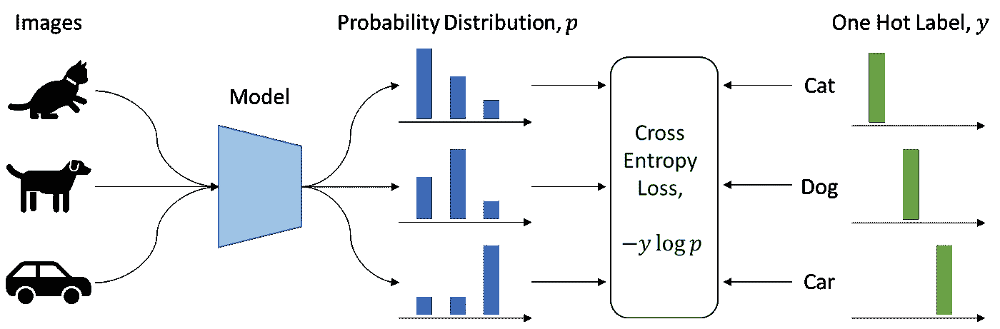
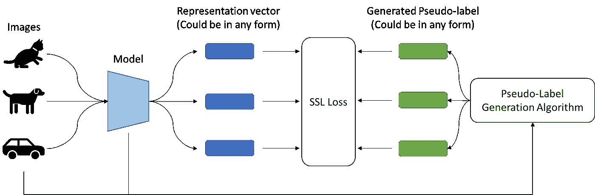
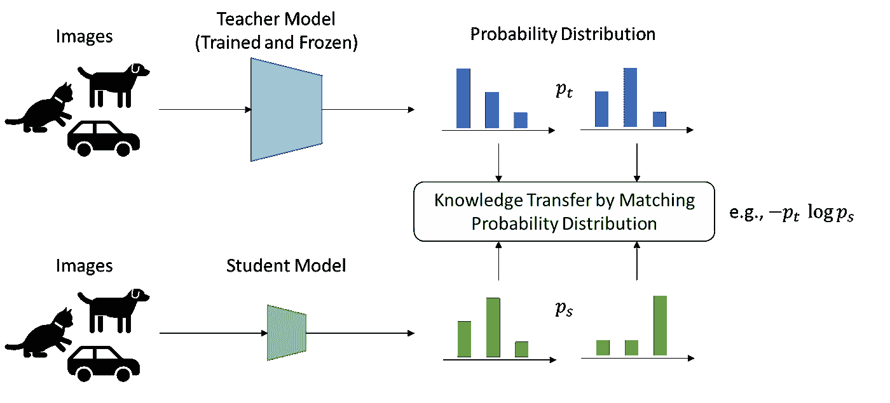
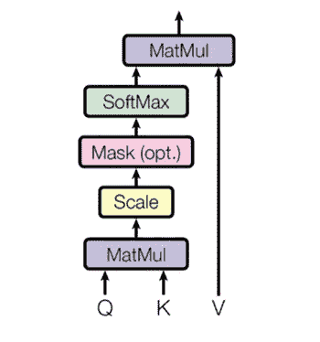
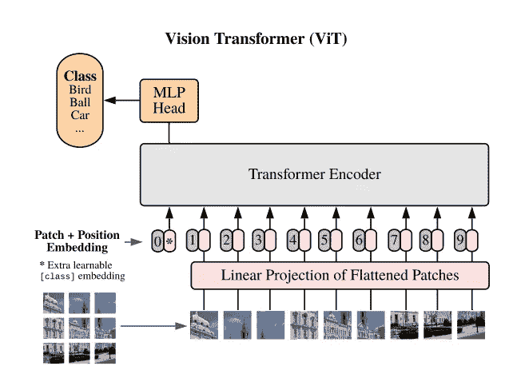
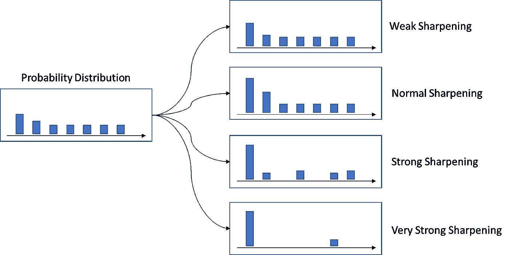
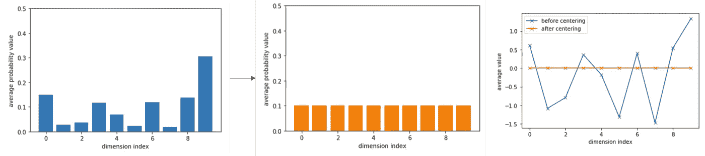
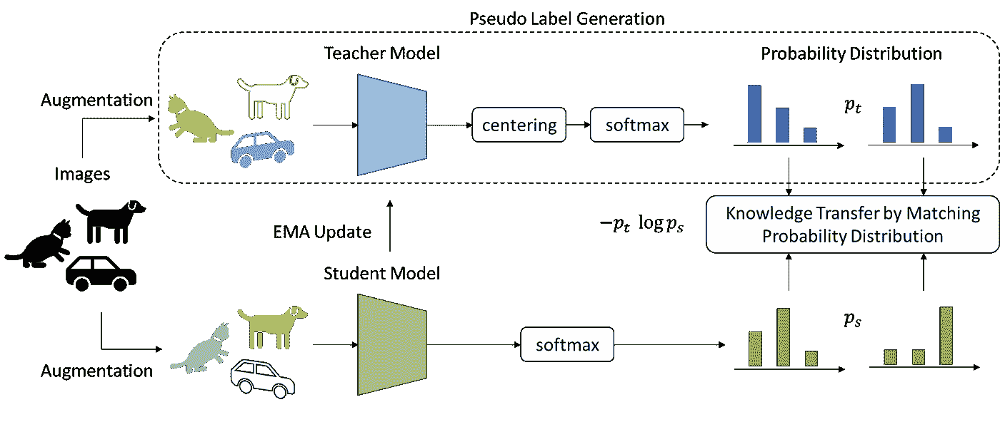
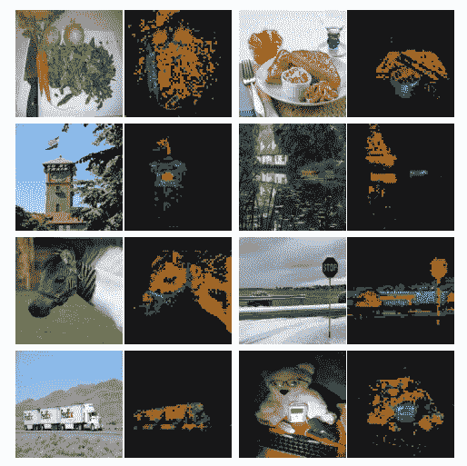

# 从大型训练集中学习的简单方法:DINO

> 原文：<https://towardsdatascience.com/a-simple-way-to-learn-generally-from-a-large-training-set-dino-95ecd76e9677>

## 这篇文章描述了一种自我监督的学习方法:带**号**标签的自我 **di** 静止(DINO)

虽然方法(DINO [1])本身简单明了，但理解该方法有一些先决条件，即 1)监督学习，2)自监督学习，3)知识提取，和 4)视觉转换器。如果你都知道，你可以在这里跳到。

## 监督学习

监督学习很简单。我们有一堆图像，每个图像都有一个标签。然后，我们通过告诉它哪个图像属于哪个标签来训练一个模型。在这种情况下，我们称之为图像分类，学习目标是独热标签和预测概率分布之间的交叉熵损失。通过取概率分布的最大值的索引，我们获得图像的预测标签。

图像分类的监督学习。图片作者。

但是监督学习的问题是，该模型通常会将图像中包含的丰富视觉信息减少到从几千个类别的预定义集合中选择的单一类别中。换句话说，学习信号只是预测一个标签。

## 自我监督学习

自我监督学习(SSL)与监督学习略有不同。我们设计了一种可以生成“伪标签”的算法，然后我们像使用监督学习方法一样训练该模型。

具有自定义损失和自定义伪标签的自监督学习。图片作者。

这种 SSL 方法被称为鉴别方法，包括实例分类(考虑到每个图像都是不同的类别，[2])、对比学习(学习比较(像一个连体网络)而不是分类，[3])或聚类(首先对图像进行聚类，获得伪标签，继续监督学习方法，[4])。在实践中，这是缓慢和内存密集型的，因为只有大批量可以学习正确而不崩溃。最近的方法已经表明，不区分图像的 SSL 也是可能的，也就是说，改为匹配类似度量学习的表示(例如，BYOL [5])。这样，大批量问题就解决了。

使用 SSL 训练的模型通常更“通用”，因为这是从数百万张图像中学习的，而没有告诉它具体要学习什么。因此，该模型可以保持图像的更有用的表示。

最后，我们可以使用这种通常自我监督的预训练模型作为初始化，通过通常的监督学习(这通常称为下游任务)对小数据集进行微调。这通常会提高下游任务的性能，因为模型不太可能在小数据集上过度拟合，并且学习到的特征更有用。因此，线性分类或对象检测等下游任务通常被用作 SSL 方法的评估。

## 知识蒸馏

考虑一个预训练的模型，它有一个沉重的主干，如 ViT-Large，我们想要一个轻量级的模型，它有更少的参数和计算 FLOPS，同时能够输出相同的特征(或类概率)，给定相同的输入(以**模仿**沉重模型的输出)。

知识蒸馏。图片作者。

原因是从零开始训练轻量级模型可能不能像预先训练的重度模型一样好地执行，但是模仿预先训练的重度模型的输出可以确保性能将尽可能保持原样。这就是所谓的知识蒸馏，我们将“知识”从重模型(我们通常称之为教师模型)中“蒸馏”到轻量模型(学生模型)中。通过这种方式，我们可以得到一个快速的压缩模型，并且能够执行与原始模型相同的功能。

注意:学生模型通常比教师模型小，但是也有可能与教师模型具有相同的架构(例如，共蒸馏[6])。

## 视觉变压器

“Transformer”本身是 NLP 领域中引入的一种体系结构，它利用了注意力机制。我们可以输入一个有 N 个标记的句子，然后转换器将首先为每个标记计算一个关注向量和一个嵌入向量(作为一个矩阵，大小分别为 NxN 和 NxD)，然后通过执行关注矩阵和嵌入矩阵的点积(NxN 点 NxD -> NxD)为每个标记获得一个新的嵌入向量。这意味着每个新的嵌入向量被计算为所有原始嵌入向量的加权和，并且权重是注意力矩阵。

变压器中的注意机制。图片由[关注是你所需要的](http://arxiv.org/abs/1706.03762v5)

然后，为类似于“变形金刚”的计算机视觉领域引入了“视觉变形金刚”(ViT)，但 N 个令牌变成了 N 个补丁。

视觉变压器。图片作者[一张图片相当于 16x16 个字:大规模图像识别的变形金刚](https://arxiv.org/abs/2010.11929v2)

我们通常使用 CNN 来计算图像表示，vit 只是一种替代架构。与 CNN 的两个关键区别是 1)注意力机制 2)和捕捉全局关系(意味着在计算表示之前看到所有补丁)。CNN 只看到本地补丁，即只看到邻居)。

## 带**号**标签的自 **Di** 剧照(DINO)

有了前提，我们终于到达了主要焦点——**迪诺**。基本上，**它是计算机视觉的通用 SSL 方法，可以应用于任何架构。**本文表明，Vision Transformer 的注意力机制很好地解释了 DINO 所学的知识，这有利于图像分割，并且能够实现与专门为自我监督学习设计的最佳 CNN 相当的性能。

正如前面提到的 SSL，我们需要定义一个“伪标签”和一个基于定义的伪标签的学习目标，以便网络可以从中学习。DINO 将伪标签定义为“教师的表征”，而不是单一的歧视标签，学习目标是将“学生的表征”与教师的表征相匹配。

从技术上讲，这种学习方式被称为知识升华，我们训练一个学生网络来匹配给定教师网络的输出。在 DINO 中，教师和学生网络具有相同的架构，但参数不同。给定一幅图像，两个网络将输出 K 维(预定义的超参数)、Pt(教师输出)和 Ps(学生输出)上的概率分布。

通过固定教师的参数，学生网络通过使用随机梯度下降最小化交叉熵损失(关于学生的参数)，H(Pt，Ps)来学习匹配分布，其中 H(a，b) = -a log b。

在计算概率分布时，网络的输出被传递到 softmax 函数中，然后被“锐化”。锐化类似于软聚类。如果锐化力度足够强，那么输出就变成了一热标签。

锐化示例。图片作者。

因为我们只知道图像本身就是图像本身，所以许多 SSL 方法利用了这一优势，生成图像的不同“视图”(意味着不同的放大)。然后教导模型区分两个视图是来自同一图像还是不同图像。模型将试图找出两个视图之间的差异，并选择保留或丢弃表示。在 DINO 中，使用了相同的策略。即两个视图分别传入老师和学生网，那么匹配目标会要求学生网输出与老师输出相同的值(锐化强度强，匹配目标就像要求学生网预测老师网的标签)。

DINO 中使用了更多技巧来防止崩溃，例如 1)多作物策略，2)教师网络的动量编码器(即学生网络的 EMA)以及教师输出的标准化。

对于多裁剪策略，图像的许多较小裁剪被传递到学生网络(想象学生网络仅看到一小部分，但是被要求预测整个图像)。

对于动量编码器，参数通常是学生网络的 EMA，这就像将过去的许多学生网络堆叠为一个教师网络。这个好处大概和刻薄老师有关。许多最近的 SSL 方法也应用了相同的实践。

对于教师输出的规范化，它与批量规范化非常相似。在批次标准化中，我们执行减去一个值以使批次的均值为零，并缩放一个值以使批次的方差为 1。教师归一化也类似，既包括居中(零均值)，也包括锐化(缩放)。居中防止一个维度占主导地位，但鼓励崩溃到均匀分布(意味着每个维度，是一个零均值，我们肯定有正值和负值，然后 exp(正)~1，exp(负)~0)。锐化则相反(意味着每个维度，我们只希望有一个高的正值)。

居中的效果。图片作者。

恐龙的插图。图片作者。

## 下游任务前有多好

经过训练后，教师网络作为计算表征的网络(因为教师网络是过去许多学生网络的叠加)。通过对这些特征进行 k-NN，DINO 已经可以执行接近纯监督的学习。例如，被监督人的 k-NN 分数是 79.3(在 ResNet50 上)，而迪诺的分数是 67.5。请注意，这是一个非常好的成就，因为我们没有使用单个标签，但仍然能够正确地对图像进行分类和分组。

当使用 Vision Transformer 进行训练时，计算出的注意力地图具有惊人的可解释性，能够专注于不同的对象或部分。

来自 ViT 的注意地图。图像由[自我监督视觉变压器中的新兴特性](https://arxiv.org/abs/2104.14294v2)

这意味着用 DINO 训练的 ViT 可以在没有监督的情况下自然地做分割。

## 结论:新兴属性有哪些？

虽然 DINO 是一种通用的 SSL 方法，但这篇论文的名称是“自监督视觉转换器中的新兴属性”。我猜这是因为作者想表明 DINO 学习的 SSL ViT 具有以下性质:1)k-NN 分类中特征的质量 2)有利于弱监督图像分割的特征中存在关于场景布局的信息。

这个帖子跳过了很多数学和实验。我推荐读者如果感兴趣的话，可以阅读原文[1]。

我个人认为 DINO 是一个非常简单有效的 SSL 方法。最近，脸书发布了一个通用的 SSL 框架— data2vec [7]。我有一个简短的阅读，data2vec 实际上是 DINO 和 Masked Autoencoder (MAE) [8]的组合，表明这种学习机制不仅对图像，而且对语音和文本等其他领域都有好处。

## 参考

1.  玛蒂尔德·卡隆、乌戈·图夫龙、伊桑·米斯拉、埃尔韦·杰古、朱利安·马亚尔、彼得·博亚诺夫斯基和阿曼德·茹林。自监督视觉转换器的新兴特性。
2.  、熊、余、林大华。通过非参数实例鉴别的无监督特征学习。在 2018 年的 CVPR。
3.  陈婷、西蒙·科恩布鲁斯、穆罕默德·诺鲁齐和杰夫·弗雷·辛顿。视觉表征对比学习的简单框架。
4.  谢，罗斯·吉斯克和阿里·法尔哈迪。用于聚类分析的无监督深度嵌入。2016 年在 ICML。
5.  Jean-Bastien Grill、Florian Strub、Florent Altche、Corentin Tallec、Pierre H Richemond、Elena Buchatskaya、Carl Doersch、Bernardo Avila Pires、Daniel Guo、Moham- mad Gheshlaghi Azar、Bilal Piot、Koray Kavukcuoglu、Remi Munos 和 Michal Valko。引导你自己的潜能:自我监督学习的新方法。在 NeurIPS，2020 年。
6.  罗汉·阿尼尔、加布里埃尔·佩雷拉、亚历山大·帕索斯、罗伯特·奥尔-曼迪、乔治·达尔和杰弗里·欣顿。通过在线蒸馏训练大规模分布式神经网络。
7.  阿列克谢·巴夫斯基、许伟宁、许千彤、阿伦·巴布、·古和迈克尔·奥利。data2vec:语音、视觉和语言自我监督学习的一般框架。
8.  何、陈、谢赛宁、李、Piotr dollar 和 Ross Girshick。屏蔽的自动编码器是可扩展的视觉学习器。