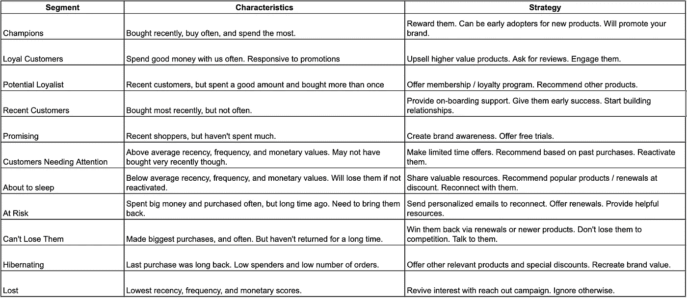
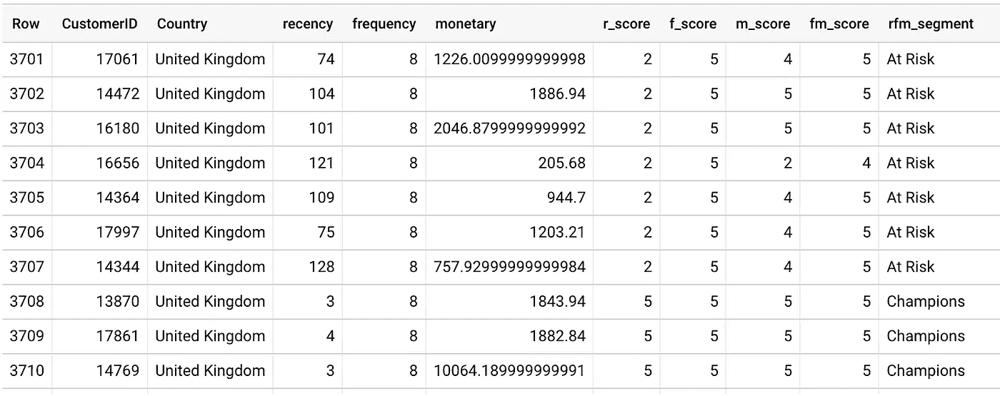
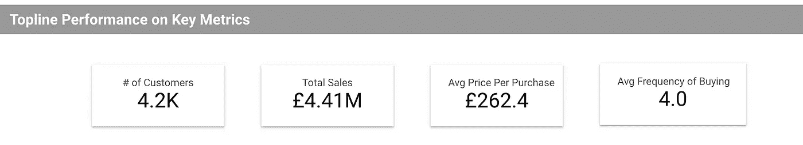
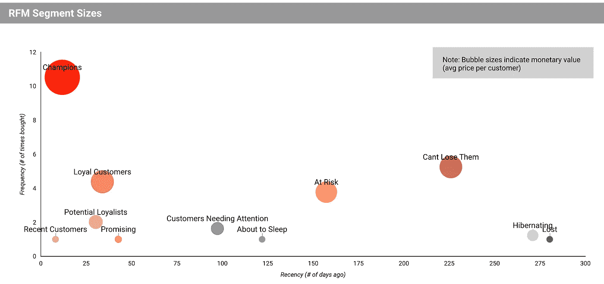
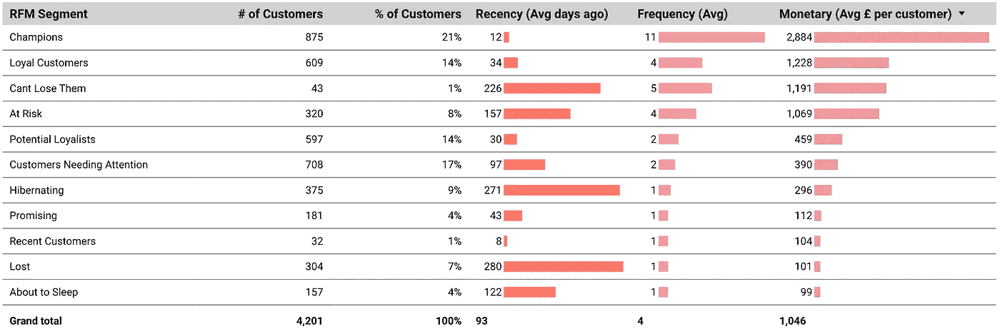
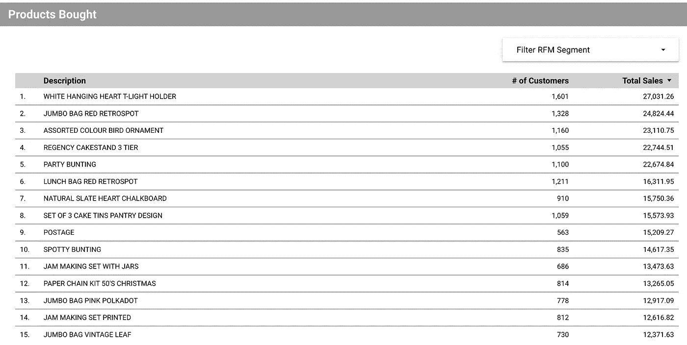

# 使用 Google BigQuery 和 Data Studio 对客户进行细分的简单方法

> 原文：<https://towardsdatascience.com/a-simple-way-to-segment-customers-using-google-bigquery-and-data-studio-f31c8896cc52>

# 使用 Google BigQuery 和 Data Studio 对客户进行细分的简单方法

## RFM 分割和结果段可视化指南


亚采克·迪拉格在 [Unsplash](https://unsplash.com?utm_source=medium&utm_medium=referral) 上的照片

迎合成千上万的顾客可能很难——每个顾客都有他们自己的需求，满足他们似乎是一个永无止境的挑战。这就是市场细分能够带来好处的地方。

[市场细分是指根据客户的需求和偏好，将一组客户划分为多个客户子群。](https://hbr.org/2014/07/what-you-need-to-know-about-segmentation)属于同一细分市场的客户会有大致相似的需求和偏好。这种分析使公司更容易定制产品和服务，以满足每个细分市场的需求。

有多种方法可以对客户进行细分，从简单的按人口统计数据分组(如男性与女性、年龄组或世代)以及按国家分组，到更复杂的多元统计技术(如聚类分析)不等。在本文中，我将演示一个使用百分位数的简单方法，它可以应用于任何零售购买数据。

除了细分分析之外，我还将展示一种可视化细分的方法，这种方法对于公司决策者来说是可行的。为了给出一个预览，下面是我用 Google Data Studio 创建的仪表板:

# **什么是 RFM 分割？**

RFM 代表近期、频率和货币。分析了以下购买行为:

*   最近——最近一次交易的时间。我们希望不断吸引最近的购买者，并发现为什么最近的购买者会流失。
*   频率——客户从我们这里购买的次数。
*   货币——每位客户为我们的产品和服务支付的金额。

使用这三条信息，我们可以得出一个分组，这将有助于通知战略业务决策。例如，[英国数据&营销协会(DMA)布局了 11 个细分市场，并根据各自的特点指定了营销策略](https://dma.org.uk/article/use-rfm-modelling-to-generate-successful-customer-segments):



来源:[英国数据&营销协会](https://dma.org.uk/article/use-rfm-modelling-to-generate-successful-customer-segments)

请注意，这种类型的细分侧重于实际的购买行为，而忽略了消费者在动机、意图和生活方式上的差异。尽管如此，RFM 仍是一个有用的起点，而且由于其简单性，可以以自动化的方式快速执行，让企业有能力迅速采取行动并决定商业战略。

# **数据集**

本演示使用的数据是来自 UCI 机器学习库的[在线零售数据集。它是一个数据集，包含来自在线零售店的交易。包含销售和订单日期的任何其他数据集都可以用于进行相同的分析。](https://archive.ics.uci.edu/ml/datasets/Online+Retail#)

这些数据是从网站上下载的，然后手动上传到 Google BigQuery，这是一个可扩展的、具有成本效益的数据仓库。如果您的数据来自在线商店，可以设置集成，以便数据从商店流向第三方连接器，然后流向您的 BigQuery 仓库。如果您有这样的设置，数据将定期刷新，确保您获得关于您的业务的最新见解。

我不会详细介绍如何建立数据仓库，因为我打算更多地关注分析和可视化，但 BigQuery 有相当广泛的文档[在这里](https://cloud.google.com/bigquery/docs#training-and-tutorials)，以供参考。

用于此分析的数据已经过清理，删除了异常值和负销售值。

# **big query 中的 RFM 分割**

可以使用以下四个步骤来执行 RFM 分割:

1.  计算每个客户的近期、频率和货币价值
2.  确定每个 RFM 度量的五分位数
3.  为每个 RFM 指标分配分数
4.  使用步骤 3 中的分数定义 RFM 细分市场

在这里可以访问整个代码[](https://github.com/noemistatcat/Data_Viz_Portfolio/blob/main/online_retail_rfm.sql)****，但是我将详细介绍每一步并解释 SQL 代码块。****

******第 1 步:计算每个客户的近期、频率和货币价值******

****对于货币来说，这只是销售额的简单总和，而对于频率来说，这是每个客户的不同发票号码的计数。****

****对于最近，我选择了一个参考日期，即数据集中最近的购买日期。在其他情况下，可以选择分析数据的日期。****

****选择参考日期后，我们得到每个客户的参考日期和最后购买日期之间的日期差。这是特定客户的最近值。****

****以下是用于计算的代码片段:****

```
**WITH 
--Compute for F & M
t1 AS (
    SELECT  
    CustomerID,
    Country,
    MAX(InvoiceDate) AS last_purchase_date,
    COUNT(DISTINCT InvoiceNo) AS frequency,
    SUM(Sales) AS monetary 
    FROM `online_retail_preprocessed_nooutliers`
    GROUP BY CustomerID, Country 
),--Compute for R
t2 AS (
    SELECT *,
    DATE_DIFF(reference_date, last_purchase_date, DAY) AS recency
    FROM (
        SELECT  *,
        MAX(last_purchase_date) OVER () + 1 AS reference_date
        FROM t1
    )  
),**
```

******第二步:确定每个 RFM 指标的五分位数******

****下一步是根据客户的 RFM 价值将他们分成五等份[组](https://www.investopedia.com/terms/q/quintile.asp)——我们根据他们在 RFM 指标中得分的高低将客户分成五等份。我们对每个客户的新近性、频率和货币价值都这样做。我使用 BigQuery 的 APPROX_QUANTILES()来实现这一点:****

```
**t3 AS (
SELECT 
    a.*,
    --All percentiles for MONETARY
    b.percentiles[offset(20)] AS m20, 
    b.percentiles[offset(40)] AS m40,
    b.percentiles[offset(60)] AS m60, 
    b.percentiles[offset(80)] AS m80,
    b.percentiles[offset(100)] AS m100,    
    --All percentiles for FREQUENCY
    c.percentiles[offset(20)] AS f20, 
    c.percentiles[offset(40)] AS f40,
    c.percentiles[offset(60)] AS f60, 
    c.percentiles[offset(80)] AS f80,
    c.percentiles[offset(100)] AS f100,    
    --All percentiles for RECENCY
    d.percentiles[offset(20)] AS r20, 
    d.percentiles[offset(40)] AS r40,
    d.percentiles[offset(60)] AS r60, 
    d.percentiles[offset(80)] AS r80,
    d.percentiles[offset(100)] AS r100
FROM 
    t2 a,
    (SELECT APPROX_QUANTILES(monetary, 100) percentiles FROM
    t2) b,
    (SELECT APPROX_QUANTILES(frequency, 100) percentiles FROM
    t2) c,
    (SELECT APPROX_QUANTILES(recency, 100) percentiles FROM
    t2) d
),**
```

******第三步:为每个 RFM 指标分配分数******

****现在我们知道了每个客户相对于其他客户在 RFM 值方面的表现，我们现在可以从 1 到 5 打分。****

****请记住，虽然对于 F 和 M，我们对更高的五分位数给予更高的分数，但 R 应该反过来，因为最近的客户在这一指标中应该得到更高的分数。****

```
**t4 AS (
    SELECT *, 
    CAST(ROUND((f_score + m_score) / 2, 0) AS INT64) AS fm_score
    FROM (
        SELECT *, 
        CASE WHEN monetary <= m20 THEN 1
            WHEN monetary <= m40 AND monetary > m20 THEN 2 
            WHEN monetary <= m60 AND monetary > m40 THEN 3 
            WHEN monetary <= m80 AND monetary > m60 THEN 4 
            WHEN monetary <= m100 AND monetary > m80 THEN 5
        END AS m_score,
        CASE WHEN frequency <= f20 THEN 1
            WHEN frequency <= f40 AND frequency > f20 THEN 2 
            WHEN frequency <= f60 AND frequency > f40 THEN 3 
            WHEN frequency <= f80 AND frequency > f60 THEN 4 
            WHEN frequency <= f100 AND frequency > f80 THEN 5
        END AS f_score,
        --Recency scoring is reversed
        CASE WHEN recency <= r20 THEN 5
            WHEN recency <= r40 AND recency > r20 THEN 4 
            WHEN recency <= r60 AND recency > r40 THEN 3 
            WHEN recency <= r80 AND recency > r60 THEN 2 
            WHEN recency <= r100 AND recency > r80 THEN 1
        END AS r_score,
        FROM t3
        )
),**
```

******第四步:使用第三步**中的分数定义 RFM 细分市场****

****下一步是结合我们从第 4 步中获得的分数来定义每个客户将属于的 RFM 细分市场。****

****由于 R、F 和 M 指标各有 5 组，因此有 125 种可能的排列，这个数字对于营销策略来说太大了，难以管理。为此，我将参考在 [DMA 指南](https://dma.org.uk/article/use-rfm-modelling-to-generate-successful-customer-segments)中定义的 11 个角色，这也是本文前面介绍的。****

****减少细分排列的一种方法是根据平均将频率和货币方面的得分结合起来(因为无论如何它们都表示购买量)。之后，我使用 DMA 中的 11 个人物角色作为指导，并相应地定义了 R 与 FM 的分数。****

****比如**冠军**细分市场，客户应该是最近买的，经常买的，花的最多的。因此，他们的 R 分数应该是 5，他们的组合 FM 分数应该是 4 或 5。另一方面，**不能失去他们**客户进行了最大的采购，而且经常，但是很长时间都没有退货。因此，他们的 R 分数应该是 1，FM 分数应该是 4 或 5。****

****下面是这一步的代码片段，其余的定义也可以在这里找到:****

```
**t5 AS (
    SELECT 
        CustomerID, 
        Country,
        recency,
        frequency, 
        monetary,
        r_score,
        f_score,
        m_score,
        fm_score,
        CASE WHEN (r_score = 5 AND fm_score = 5) 
            OR (r_score = 5 AND fm_score = 4) 
            OR (r_score = 4 AND fm_score = 5) 
        THEN 'Champions'
        WHEN (r_score = 5 AND fm_score =3) 
            OR (r_score = 4 AND fm_score = 4)
            OR (r_score = 3 AND fm_score = 5)
            OR (r_score = 3 AND fm_score = 4)
        THEN 'Loyal Customers'
        WHEN (r_score = 5 AND fm_score = 2) 
            OR (r_score = 4 AND fm_score = 2)
            OR (r_score = 3 AND fm_score = 3)
            OR (r_score = 4 AND fm_score = 3)
        THEN 'Potential Loyalists'
        WHEN r_score = 5 AND fm_score = 1 THEN 'Recent Customers'
        WHEN (r_score = 4 AND fm_score = 1) 
            OR (r_score = 3 AND fm_score = 1)
        THEN 'Promising'
        WHEN (r_score = 3 AND fm_score = 2) 
            OR (r_score = 2 AND fm_score = 3)
            OR (r_score = 2 AND fm_score = 2)
        THEN 'Customers Needing Attention'
        WHEN r_score = 2 AND fm_score = 1 THEN 'About to Sleep'
        WHEN (r_score = 2 AND fm_score = 5) 
            OR (r_score = 2 AND fm_score = 4)
            OR (r_score = 1 AND fm_score = 3)
        THEN 'At Risk'
        WHEN (r_score = 1 AND fm_score = 5)
            OR (r_score = 1 AND fm_score = 4)        
        THEN 'Cant Lose Them'
        WHEN r_score = 1 AND fm_score = 2 THEN 'Hibernating'
        WHEN r_score = 1 AND fm_score = 1 THEN 'Lost'
        END AS rfm_segment 
    FROM t4
)**
```

****在此步骤之后，每个客户都应该有一个 RFM 细分市场分配，如下所示:****

********

****作者图片****

# ****将 BigQuery 连接到 Data Studio****

****现在我们有了所有需要的数据。下一步是在 Data Studio 仪表板中可视化这些部分。要做到这一点，我们需要将 BigQuery 连接到 Data Studio，并在 Data Studio 中创建一个数据源。以下是实现这一点的步骤:****

1.  ****在 Data Studio 主页上，单击 Create。选择数据源。****
2.  ****会出现各种各样的谷歌连接器。选择 BigQuery。****
3.  ****为事务性数据选择 BigQuery 项目和数据集。****
4.  ****单击连接。****
5.  ****数据中的所有字段都将出现。检查数据格式是否正确，并在需要时添加自定义计算字段。****
6.  ****单击创建报告。****

****一个空白的仪表板将会出现，你现在已经准备好了有趣的部分——可视化 RFM 部分！****

# ****创建仪表板****

****我创建的 RFM 仪表板包含以下关键元素:****

*   ****页面过滤器****
*   ****关键指标的最高表现****
*   ****RFM 片段大小****
*   ****详细的近期、频率和货币数据****
*   ****购买的特定产品****

******关键指标的最高表现******

****这一部分给出了业务健康状况的背景，并提供了与每个部门的绩效进行比较的基准。简单的记分卡应满足本部分的要求。****

********

****作者图片****

******RFM 航段尺寸******

****在进行市场细分时，将每个细分市场的相对规模可视化是一个很好的做法。这将为战略和优先顺序提供信息。例如，了解哪些细分市场对员工人数和销售额的贡献更大，可以让我们知道应该向谁寻求忠诚度优惠。****

****使用气泡图作为一种可视化方法使我们能够一次显示三种信息:货币(气泡的大小)、频率(y 轴)和最近(x 轴)。这样做，我们可以看到这些片段彼此之间有多么不同。****

****在本例中，我们看到冠军企业的收入相对较高，在频率方面位于 y 轴的上端，在最近频谱的左端。另一端是休眠和流失的客户，在图表的右下部分。****

********

****作者图片****

******详细的近期、频率和货币数据******

****这一部分总结了每个细分市场在几个关键指标方面的表现:属于每个细分市场的客户数量和百分比，以及每个细分市场的平均最近值、频率和货币值。****

********

****作者图片****

******购买的产品******

****这一部分将让您确定某个细分市场最有可能购买的特定产品。同样，这将让我们了解大多数细分市场*不关心购买哪些产品。*****

********

****作者图片****

****对于这一部分，我必须将 RFM 细分结果连接到包含每个订购产品的主数据集。下面是我用来做这件事的代码:****

```
**SELECT  a.*,
rfm_segment
FROM `online_retail_preprocessed_nooutliers` aLEFT JOIN(SELECT CustomerID, 
rfm_segment
FROM `online_retail_rfm`) bON a.CustomerID = b.CustomerID**
```

# ****摘要****

****在本文中，我演示了一种简单的方法来执行 RFM 分割，并将结果显示在仪表板中。这种类型的分析旨在帮助企业快速了解不同的客户角色，并为每个角色制定有针对性的营销行动。****

****这种类型的分析可以应用于其他零售和销售数据，只要我们有关于每个客户的近期、频率和货币行为的信息。****

****同样，这只是进行市场细分的几种方法之一。例如，[在这篇中型文章](/rfm-analysis-using-bigquery-ml-bfaa51b83086)中，作者使用了一种更先进的统计方法(k-means 算法)并利用 BigQuery ML 来进行分割。根据数据复杂性和时间表，由分析师和业务利益相关者决定哪种方法最合适。最后，细分市场应该足够清晰和可行，以使分析对业务有益。****

****我希望你喜欢创建自己的市场细分分析！****

****我为本文创建的所有代码都可以在我的 [**GitHub**](https://github.com/noemistatcat/Data_Viz_Portfolio) 上找到。****

****Google Data Studio 和 Big Query 的有用资源:****

*   ****[Analytics Academy 对 Data Studio 的介绍](https://analytics.google.com/analytics/academy/course/10)****
*   ****[营销分析师 big query](https://www.qwiklabs.com/quests/70)****
*   ****[BigQuery 文档](https://cloud.google.com/bigquery/docs#training-and-tutorials)****

****特别感谢以下资源在撰写本文时给予的指导和启发:****

*   ****[DMA 文章:使用 RFM 建模生成成功的客户群](https://dma.org.uk/article/use-rfm-modelling-to-generate-successful-customer-segments)****
*   ****[中型文章:使用 BigQuery ML 的 RFM 分析](/rfm-analysis-using-bigquery-ml-bfaa51b83086)****