# 一个用于营销组合建模的小型 Python 库:MaMiMo

> 原文：<https://towardsdatascience.com/a-small-python-library-for-marketing-mix-modeling-mamimo-100f31666e18>

## [营销分析](https://medium.com/tag/marketing-analytics)

## 以 scikit-learn 方式创建营销组合模型


克里斯·劳顿在 [Unsplash](https://unsplash.com?utm_source=medium&utm_medium=referral) 上的照片

你好！我注意到人们对我关于营销组合建模的文章非常感兴趣，这就是为什么我为您创建了一个小礼物:一个帮助您自己创建简单营销组合模型的小库！在本文中，我将向您展示如何使用它。

> ***⚠义不容辞的警告⚠:*** *我尽了最大的努力让这个库尽可能的扎实无错。然而，仍然可能有错误，所以在向利益相关者报告任何事情之前，请总是做一些理智检查。如果你发现了一个错误或者请求了一个特性，就给我发一条消息，或者——更好的是——在 Github* *上创建一个* [*拉取请求！😉*](https://github.com/Garve/mamimo)

如果你不知道什么是营销组合建模:想象你在一家销售东西的公司。为了卖更多的东西，你做广告。在某些时候，你想知道你的广告在每个渠道的表现有多好，如电视、广播、网页横幅广告……并回答这样的问题:“那周我在电视广告中投入的 1000 €，增加了我多少收入？”。营销组合建模是做到这一点的简单方法。你可以在我的文章中找到更多相关信息:

</introduction-to-marketing-mix-modeling-in-python-d0dd81f4e794>  </an-upgraded-marketing-mix-modeling-in-python-5ebb3bddc1b6>  

我创建的库被创造性地命名为 [**马米莫**](https://github.com/Garve/mamimo) ，如果你知道如何使用 scikit-learn，你也可以使用这个库。让乐趣从简单的

> `pip install mamimo`

# 一个小例子

如果你已经阅读了这两篇顶级文章——我想从现在开始——你可能记得我们在那里使用了一个人工数据集。然后，我们定义了一些饱和度和结转转换来进行营销组合建模。我将一个类似但稍微复杂一点的示例数据集放入 mamimo 中，以帮助您入门:

```
from mamimo.datasets import load_fake_mmm

data = load_fake_mmm()

X = data.drop(columns=['Sales'])
y = data['Sales']
```

这为我们提供了一个数据集，它包含每周的日期索引、三个媒体渠道和一个我们想要解释的销售列。

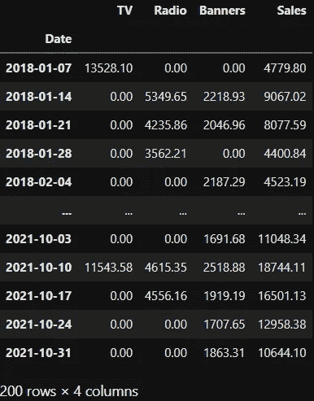

图片由作者提供。

让我们绘制销售图，看看发生了什么:

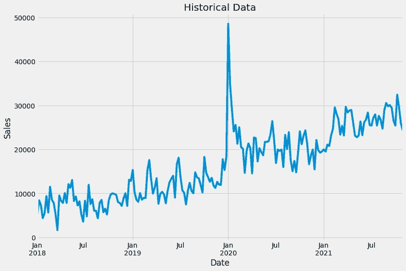

图片由作者提供。

在这里，我们可以看到一个总体上升的趋势。也可能有季节性，但光看很难判断。让我们也来看看房间里的大象:2020 年 1 月第一周的这个大峰值。我们会假设这是对我们的产品非常重要的一天，而**不是**只是一个例外。

然而，让我们暂时保持简单，只是尝试使用电视、广播和横幅广告来解释销售。[与第二篇文章](/an-upgraded-marketing-mix-modeling-in-python-5ebb3bddc1b6)一样，我们想要构建以下模型:

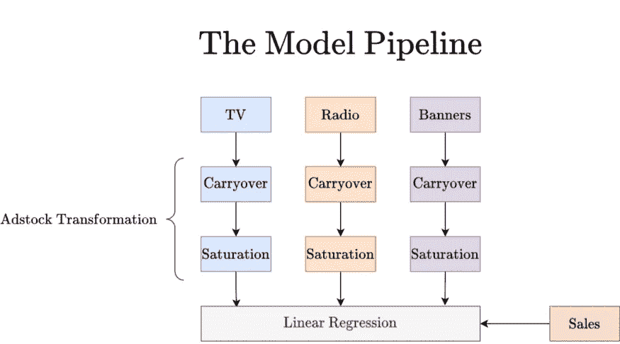

图片由作者提供。

## 开始

我们可以使用 mamimo 的结转和饱和子模块，以及比 scikit-learn 版本更灵活的`LinearRegression`以一种简单的方式实现这条管道。我们需要 scikit-learn 的是流水线功能。

> ***提醒:*** `*ColumnTransformer*` *对不同的列应用不同的管道。我们需要它对不同的通道有不同的超参数。*

```
from mamimo.carryover import ExponentialCarryover
from mamimo.saturation import ExponentialSaturation
from mamimo.linear_model import LinearRegression
from sklearn.compose import ColumnTransformer
from sklearn.pipeline import Pipeline

adstock = ColumnTransformer(
    [
     ('tv_pipe', Pipeline([
            ('carryover', ExponentialCarryover()),
            ('saturation', ExponentialSaturation())
     ]), ['TV']),
     ('radio_pipe', Pipeline([
            ('carryover', ExponentialCarryover()),
            ('saturation', ExponentialSaturation())
     ]), ['Radio']),
     ('banners_pipe', Pipeline([
            ('carryover', ExponentialCarryover()),
            ('saturation', ExponentialSaturation())
     ]), ['Banners']),
    ]
)

model = Pipeline([
    ('adstock', adstock),
    ('regression', LinearRegression(positive=True))
])
```

这样产生的模型本身并不是很好，因为它仍然需要超参数调整。

```
print(model.fit(X, y).score(X, y))

# Output:
# 0.10985072579909416
```

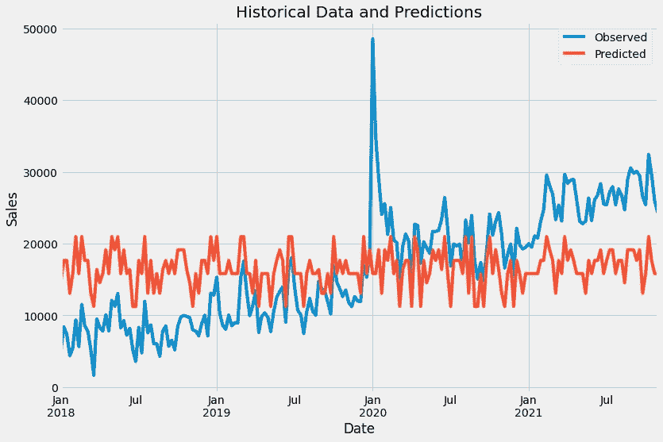

甚至在同一套设备上进行培训和评估**(从不👏做👏那👏在👏生产👏)**产生了一个相当糟糕的结果——我们**欠配**。因此，让我们调整一些超参数。

## 超参数调谐

今天就让我们用 sklearn 的`RandomSearchCV`来调一下超参数。我们将分别调整所有通道的饱和指数以及残留强度和长度。例如，您可以通过`adstock__radio_pipe__carryover__window`设置**无线电传输长度**。

```
from scipy.stats import uniform, randint
from sklearn.model_selection import RandomizedSearchCV, TimeSeriesSplit

tuned_model = RandomizedSearchCV(
    model,
    param_distributions={
        'adstock__tv_pipe__carryover__window': randint(1, 10),
        'adstock__tv_pipe__carryover__strength': uniform(0, 1),
        'adstock__tv_pipe__saturation__exponent': uniform(0, 1),
        'adstock__radio_pipe__carryover__window': randint(1, 10),
        'adstock__radio_pipe__carryover__strength': uniform(0, 1),
        'adstock__radio_pipe__saturation__exponent': uniform(0, 1),
        'adstock__banners_pipe__carryover__window': randint(1, 10),
        'adstock__banners_pipe__carryover__strength': uniform(0, 1),
        'adstock__banners_pipe__saturation__exponent': uniform(0,1),
    },
    cv=TimeSeriesSplit(),
    random_state=0,
    n_iter=100
)
```

这基本上是试图找到 0 到 1 范围内携带污染强度和饱和指数的最佳超参数，以及 1 到 10(周)范围内携带污染长度的整数。该算法尝试`n_iter=100`不同的随机超参数组合，并使用 sklearn 的`TimeSeriesSplit()`使用 **5 倍扩展窗口时间序列分割**来评估 ***r*** 。如果我们喜欢，我们也可以使用 [MAPE](https://en.wikipedia.org/wiki/Mean_absolute_percentage_error) ，因为业务人员喜欢这个指标，使用`scoring='neg_mean_absolute_percentage_error'`关键字。

训练后，我们可以检查最佳超参数:

```
print(tuned_model.best_params_)

# Output:
# 'adstock__banners_pipe__carryover__strength': 0.6817399450693612,
# 'adstock__banners_pipe__carryover__window': 1,
# 'adstock__banners_pipe__saturation__exponent': 0.097493384215085,
# 'adstock__radio_pipe__carryover__strength': 0.8518536993666015,
# 'adstock__radio_pipe__carryover__window': 1,
# 'adstock__radio_pipe__saturation__exponent': 0.1598452868541913,
# >>> 'adstock__tv_pipe__carryover__strength': 0.04680635471218875,
# >>> 'adstock__tv_pipe__carryover__window': 4,
# 'adstock__tv_pipe__saturation__exponent': 0.0038603515102610952
```

因此，该模型认为，例如，电视结转效应持续 4 周，约 4.68%的效应结转到下周。像这样的声明是商业的黄金。

> 这个输出让您以简单易懂的方式向涉众解释您的模型。

尽管如此，这个模型还是很糟糕，所以我不会相信目前为止发现的超参数。

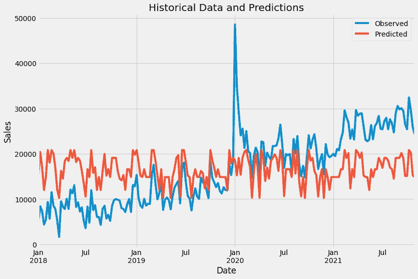

图片由作者提供。

输出和以前有同样的问题:没有趋势，峰值也无法解释。

> 在这种时候，我们应该加入更多可以解释销售的特征。这可以是产品的价格，时间特征，谷歌趋势，天气，假期，以及任何你想要的东西。

我们现在将通过给它一个趋势，一个热点编码月份以及 2020 年 1 月第一周发生的事情的信息来增强该模型。

## 融入时间特征

我还添加了一些方便的功能来增加更多的功能。看看这个:

```
from mamimo.time_utils import add_time_features, add_date_indicators

X = (X
     .pipe(add_time_features, month=True)
     .pipe(add_date_indicators, special_date=["2020-01-05"])
     .assign(trend=range(200))
)
```

这增加了

*   月份列(1 到 12 之间的整数)，
*   一个名为`special_date`的二进制列，在 2020 年 1 月 5 日为 1，在其他地方为 0，并且
*   一个(到目前为止是线性的)趋势，只从 0 到 199 递增。

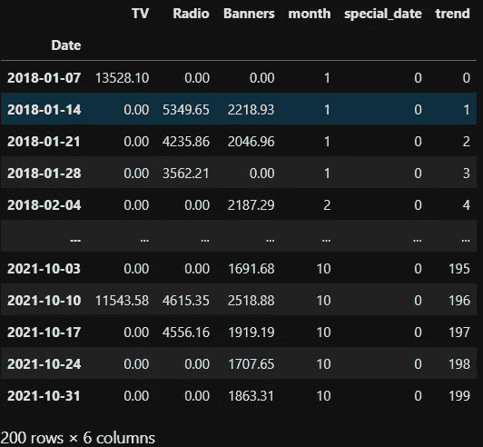

图片由作者提供。

当我们构建下一个模型时，所有这些特性都将得到完善。除了媒体频道，我们将对新功能进行以下预处理:

*   月份被一次性编码
*   线性趋势可以被提升到某个幂，例如二次增长趋势的趋势(商业将是快乐的)
*   这个特殊的日期也会产生延期效应，也就是说，我们认为不仅 2020 年 1 月 5 日这一周很重要，之后的几周也很重要，这与媒体渠道延期的逻辑相同

```
from mamimo.time_utils import PowerTrend
from mamimo.carryover import ExponentialCarryover
from mamimo.saturation import ExponentialSaturation
from sklearn.linear_model import LinearRegression
from sklearn.preprocessing import OneHotEncoder
from sklearn.compose import ColumnTransformer
from sklearn.pipeline import Pipeline

cats =  [list(range(1, 13))] # different months, known beforehand

preprocess = ColumnTransformer(
    [
     ('tv_pipe', Pipeline([
            ('carryover', ExponentialCarryover()),
            ('saturation', ExponentialSaturation())
     ]), ['TV']),
     ('radio_pipe', Pipeline([
            ('carryover', ExponentialCarryover()),
            ('saturation', ExponentialSaturation())
     ]), ['Radio']),
     ('banners_pipe', Pipeline([
            ('carryover', ExponentialCarryover()),
            ('saturation', ExponentialSaturation())
     ]), ['Banners']),
    ('month', OneHotEncoder(sparse=False, categories=cats), ['month']),
    ('trend', PowerTrend(), ['trend']),
    ('special_date', ExponentialCarryover(), ['special_date'])
    ]
)

new_model = Pipeline([
    ('preprocess', preprocess),
    ('regression', LinearRegression(
        positive=True,
        fit_intercept=False) # no intercept because of the months
    )
])
```

拟合这个仍未调整的模型显示了更好的性能:

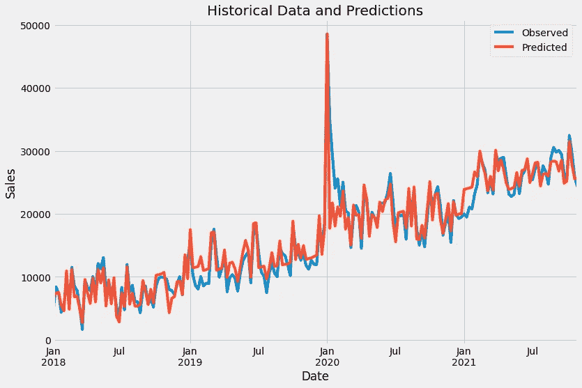

图片由作者提供。

哇！这是**已经近乎完美的合体**。想象一下我们调整超参数后会发生什么。似乎在 2020 年 1 月 5 日添加趋势和指标已经很有帮助了。

## 最后一首曲子

让我们也调整新的超参数。也许线性趋势不是我们能做到的最好的。此外，到目前为止，所有的结转都不存在，因为如果不提供超参数，这是`ExponentialCarryover`的默认行为。我们现在将再创建一个超参数优化作业:

```
from scipy.stats import randint, uniform
from sklearn.model_selection import RandomizedSearchCV, TimeSeriesSplit

tuned_new_model = RandomizedSearchCV(
  new_model,
  param_distributions={
    'preprocess__tv_pipe__carryover__window': randint(1, 10),
    'preprocess__tv_pipe__carryover__strength': uniform(0, 1),
    'preprocess__tv_pipe__saturation__exponent': uniform(0, 1),
    'preprocess__radio_pipe__carryover__window': randint(1, 10),
    'preprocess__radio_pipe__carryover__strength': uniform(0,1),
    'preprocess__radio_pipe__saturation__exponent': uniform(0, 1),
    'preprocess__banners_pipe__carryover__window': randint(1, 10),
    'preprocess__banners_pipe__carryover__strength': uniform(0, 1),
    'preprocess__banners_pipe__saturation__exponent': uniform(0, 1),
    'preprocess__trend__power': uniform(0, 2),           # new
    'preprocess__special_date__window': randint(1, 10),  # new
    'preprocess__special_date__strength': uniform(0, 1), # new
  },
  cv=TimeSeriesSplit(),
  random_state=0,
  n_iter=1000, # some more iterations, takes more time
)

tuned_model.fit(X, y)
```

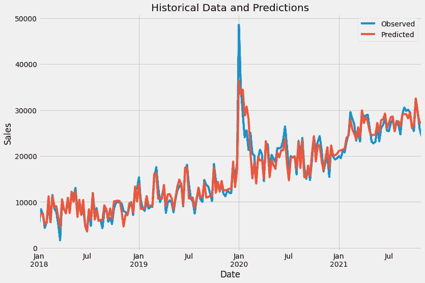

图片由作者提供。

尖峰信号的建模变得更糟，但我认为其余部分现在看起来好多了。也许我们可以通过尝试更多的超参数组合来更好地模拟尖峰信号，但让我们假设我们现在对结果感到满意。让我们得到超参数:

```
print(tuned_new_model.best_params_)

# Output:
# 'preprocess__banners_pipe__carryover__strength': 0.98037507922965,
# 'preprocess__banners_pipe__carryover__window': 1,
# 'preprocess__banners_pipe__saturation__exponent': 0.1763329074644,
# 'preprocess__radio_pipe__carryover__strength': 0.9417421432655166,
# 'preprocess__radio_pipe__carryover__window': 1,
# 'preprocess__radio_pipe__saturation__exponent': 0.069184804692642,
# 'preprocess__special_date__strength': 0.8667029791268241,
# 'preprocess__special_date__window': 6,
# > 'preprocess__trend__power': 1.463860555363072,
# 'preprocess__tv_pipe__carryover__strength': 0.3422263312509606,
# 'preprocess__tv_pipe__carryover__window': 1,
# 'preprocess__tv_pipe__saturation__exponent': 0.3591065076533001
```

太好了，所以趋势不是线性的，而是 t^1.464 的形式，这意味着甚至**比线性的**更强。

如果您也对线性回归系数感兴趣，可以通过

```
import pandas as pd

best_model = tuned_new_model.best_estimator_
pd.Series(
    best_model.named_steps['regression'].coef_,
    index=best_model[:-1].get_feature_names_out()
)

# Output:
# tv_pipe__TV                    3389.936227
# radio_pipe__Radio              2278.722723
# banners_pipe__Banners          2455.014524
# month__month_1                 2724.333162
# month__month_2                 2991.294009
# month__month_3                 4080.414741
# month__month_4                 4542.696378
# month__month_5                 3484.384654
# month__month_6                 3785.648376
# month__month_7                 2497.006415
# month__month_8                 2068.016338
# month__month_9                 1883.746572
# month__month_10                2179.914547
# month__month_11                2135.526582
# month__month_12                2233.341158
# trend__trend                      9.801207
# special_date__special_date    96822.051131
```

# 计算渠道贡献

现在我们有了一个训练有素的模型，我们想知道每个渠道每周对销售额的贡献。为了方便起见，我创建了一个`breakdown`函数来做这件事。

```
from mamimo.analysis import breakdown

contributions = breakdown(tuned_new_model.best_estimator_, X, y)
ax = contributions.plot.area(
    figsize=(16, 10),
    linewidth=1,
    title="Predicted Sales and Breakdown",
    ylabel="Sales",
    xlabel="Date",
)

handles, labels = ax.get_legend_handles_labels()
ax.legend(
    handles[::-1],
    labels[::-1],
    title="Channels",
    loc="center left",
    bbox_to_anchor=(1.01, 0.5),
)
```

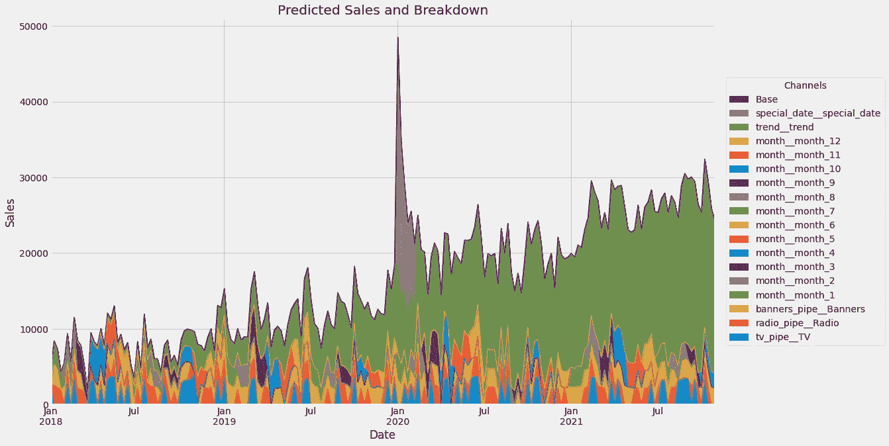

图片由作者提供。

唷，那是一堆颜色——非常难以理解。这是因为分组过于精细，没有必要，例如，我们每个月都有一种颜色。

根据模型，我们可以将所有的`month__`变量和`trend__trend`变量放入**基线**，即不考虑媒体支出的情况下我们的销售额。我们可以通过分解函数来总结这些细粒度的贡献，如下所示:

```
group_channels = {
    'Baseline': [f'month__month_{i}' for i in range(1, 13)] + ['Base', 'trend__trend']
} # read: 'Baseline consists of the months, base and trend.'
  # You can add more groups!

contributions = breakdown(
    tuned_new_model.best_estimator_,
    X,
    y,
    group_channels
)
```

这将产生一个较小的数据帧

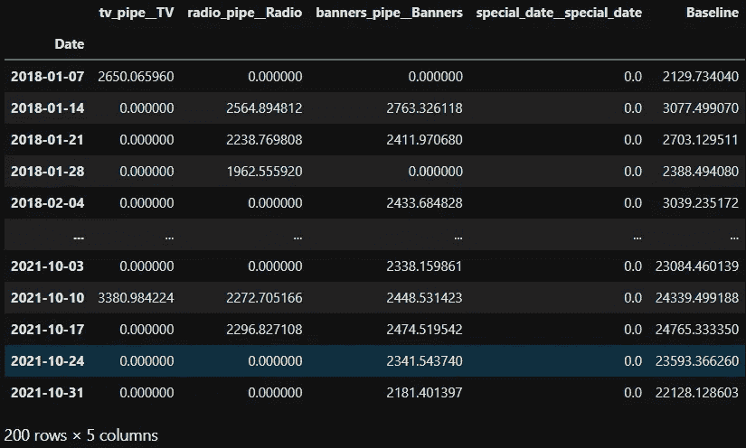

图片由作者提供。

让我们再次给这个数据框起一个更好的名字

```
contributions.columns = [
    'TV', 'Radio', 'Banners',
    'Special Date', 'Baseline'
]
```

然后绘图

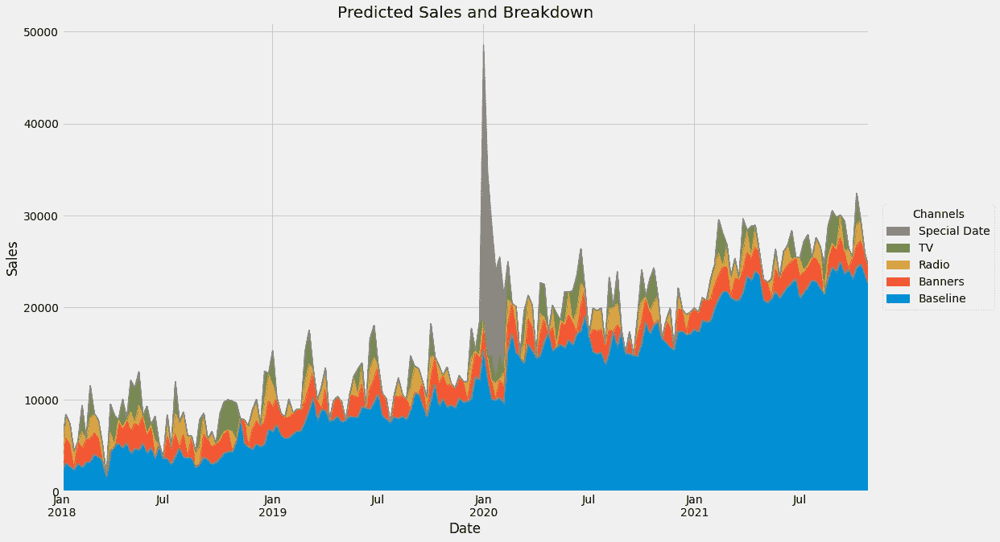

太棒了。内容现在相当容易理解:

*   基线随着时间的推移而增加，似乎也有季节性
*   电视、广播和标语都有一定的贡献
*   我们可以看到*特殊日期*的效果

## **计算投资回报**

我没有为此创建一个方便的函数(还没有？)但您也可以计算每个通道的 ROI，如下所示:

```
for channel in ['TV', 'Radio', 'Banners']:
    roi = contributions[channel].sum() / X[channel].sum()
    print(f'{channel}: {roi:.2f}')

# Output: 
# TV: 0.33
# Radio: 0.47
# Banners: 1.23
```

从这里看，电视和广播似乎表现不佳，因为投资回报率低于 1，也就是说，我们在过去 200 周内在电视(广播)上花费的每欧元平均只产生 0.33 € (0.47 €)的回报**。**

**横幅广告的平均表现很好，我们在那里花的每一欧元都变成了 1.23 €。**

> *****注:*** *如果我们考虑其他时间段，即仅 2019 年或仅 2020 年，这些陈述可能会改变。例如，对于 2019 年，我们可以这样计算***

```
for channel in ['TV', 'Radio', 'Banners']:
    roi = contributions.loc['2019-01-01':'2019-12-31', channel].sum() / X.loc['2019-01-01':'2019-12-31', channel].sum()
    print(f'{channel}: {roi:.2f}')

# Output:
# TV: 0.36
# Radio: 0.50
# Banners: 1.22
```

**那都是乡亲们！**

# **结论**

**我向你展示了我的新库 MaMiMo，让你的营销组合建模生活更容易。它与 scikit-learn 和类似的库集成得很好，它允许您做以下事情(到目前为止！):**

*   **定义饱和度(指数、希尔、Adbudg、BoxCox)**
*   **定义结转(指数、高斯)**
*   **添加时间功能(日、月、月中的周、…、趋势)**
*   **改变趋势**
*   **通过检查渠道贡献来分析模型**

**通过`pip install mamimo`安装！**

**我希望你今天学到了新的、有趣的、有用的东西。感谢阅读！**

****作为最后一点，如果你****

1.  ****想支持我多写点机器学习和****
2.  ****无论如何，计划获得一个中等订阅，****

****为什么不做** [**通过这个环节**](https://dr-robert-kuebler.medium.com/membership) **？这将对我帮助很大！😊****

**透明地说，给你的价格不变，但大约一半的订阅费直接归我。**

****非常感谢，如果你考虑支持我！****

> ***如有问题，在*[*LinkedIn*](https://www.linkedin.com/in/dr-robert-k%C3%BCbler-983859150/)*上写我！***