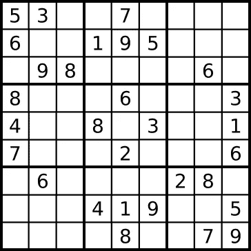
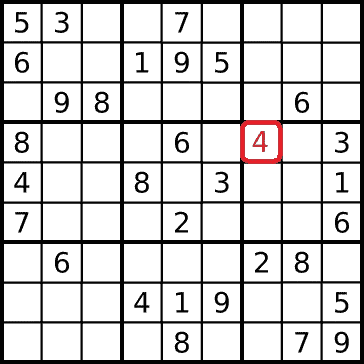
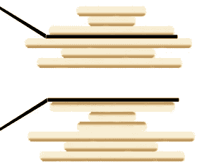
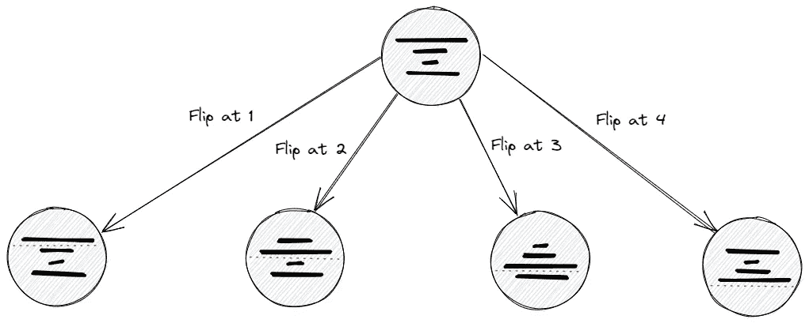
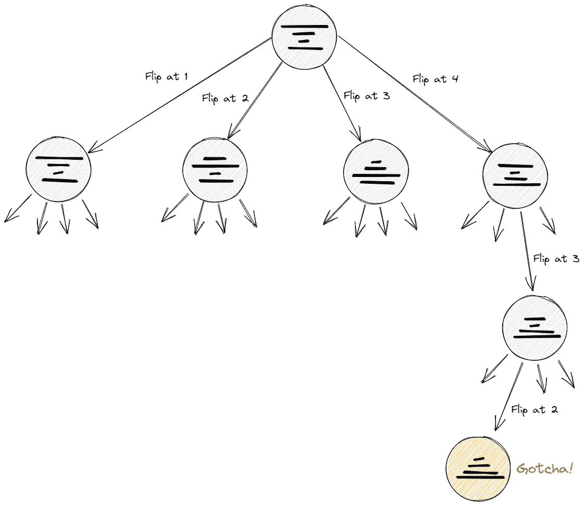
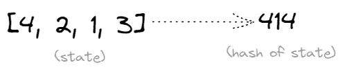
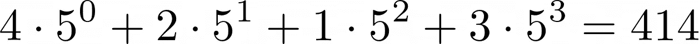
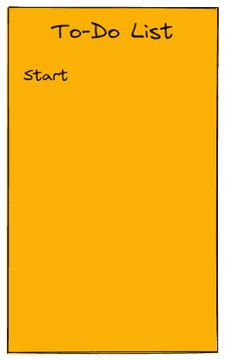

# 经典人工智能的一点味道:解决搜索问题

> 原文：<https://towardsdatascience.com/a-small-taste-of-classical-ai-solving-search-problems-aab1a1984a24>

## 学习如何以系统和通用的方式解决搜索问题


照片由[梅姆](https://unsplash.com/@picoftasty?utm_source=medium&utm_medium=referral)在 [Unsplash](https://unsplash.com?utm_source=medium&utm_medium=referral) 上拍摄

在广阔的人工智能领域，有一个令人兴奋的分支**状态空间搜索问题**，里面充满了你最喜欢的谜题:

*   [数独](https://en.wikipedia.org/wiki/Sudoku)，
*   [滑动拼图](https://en.wikipedia.org/wiki/Sliding_puzzle)，又称 8 字拼图、15 字拼图、…、
*   河内的[塔](https://en.wikipedia.org/wiki/Tower_of_Hanoi)(递归讲座倒叙，有人吗？),
*   后面我们作为例子的[煎饼排序问题](https://en.wikipedia.org/wiki/Pancake_sorting)，
*   [*n* 蚁后问题](https://en.wikipedia.org/wiki/Eight_queens_puzzle)
*   还有很多。

也许你不得不编写算法来解决这类或那类搜索问题。对于这些问题中的每一个，你都有一个独特的算法，这是非常乏味的。

在这篇文章中，我想向你展示

1.  这些(以及其他)问题是如何联系在一起的
2.  如何编写一个元算法来解决所有这些问题。

> ***剧透:找到*** [***上的代码我的 Github***](https://github.com/Garve/search_problems/blob/main/search_problems.ipynb) ***。***

# **状态空间搜索问题**

上述问题——从现在起我也称之为**游戏**——不像国际象棋、围棋或任何高级电脑游戏那样复杂。尽管如此，研究它们还是很有趣的，并且解决其中的一些问题可能已经是 [NP-hard](https://en.wikipedia.org/wiki/NP-hardness) 了，也就是说，通常可能不存在多项式时间算法来解决它们。

**我来速写一下我们现在要解决哪种游戏。**

游戏有几个**游戏状态，**其中一个是**初始状态**，我们会在开始问题时找到。一个游戏状态就是所有关于游戏状态的*必要*信息。在数独游戏中，这可能是包含所有数字的字段。例如，它可以方便地表示为一个 9×9 的矩阵，用数字填充，用 0 表示空字段。



来自[维基百科](https://commons.wikimedia.org/wiki/File:Sudoku_Puzzle_by_L2G-20050714_standardized_layout.svg)。

你可以采取**动作**将一个游戏状态改变为另一个游戏状态。在数独游戏中，你只能填写数字。你必须指定一个空的单元格和一个数字，然后将数字写入指定的单元格，改变游戏状态。



由作者编辑。数字 4 被写入一个单元格。

还有一个我们试图达到的**目标状态**，它让我们**赢得游戏**。在数独游戏中，每一行、每一列和每一个方块都必须恰好显示一次所有的数字 1-9。

# 解决搜索问题

好吧，如果你已经看了上面的一些问题和困惑，你可能已经注意到它们看起来都很不同。我们如何将它们结合成一个单一的框架？好吧，以下是唯一的秘密:

> 解决搜索问题归结为**图遍历**。

那是什么意思？我希望你听说过像[深度优先搜索](https://en.wikipedia.org/wiki/Depth-first_search)和[广度优先搜索(BFS)](https://en.wikipedia.org/wiki/Breadth-first_search) 这样的算法。这些算法允许你系统地遍历一个图，就像我们想要系统地解决这些难题一样。如果你是新手，请继续读下去，因为现在你将了解它们。让我们以煎饼排序问题为例，因为它没有数独复杂，而且你可以看到游戏状态和动作的不同设置。

## 煎饼分类🥞

这个问题可以这样描述:

> 你有一堆杂乱的大小不一的煎饼。你想用抹刀翻动一堆煎饼的一部分，将这一堆(最小的放在上面，最大的放在下面)分类。

请看下图，这是一个可能的操作示例:



来自[维基百科](https://commons.wikimedia.org/wiki/File:Pancake_sort_operation.png)。

让我们根据煎饼的大小给它们编号，1 是最小的，6 是最大的。上图中，我们处于**游戏状态(2，1，4，6，3，5)** ，从上到下。使用**动作“在位置 3 翻转”**，我们可以将旧的游戏状态转换为新的游戏状态( **4，1，2** ，6，3，5)，即前 3 个煎饼的顺序颠倒。

## 4 个煎饼的系统解决方案

假设我们从初始博弈状态(4，2，1，3)开始。还是那句话，4 是最大的煎饼，1 是最小的。我从上到下记录游戏状态。


图片由作者提供。状态为(4，2，1，3)。

我们现在取这个状态，并列举所有可能的下一个状态。我们称这一步**为扩展**当前状态。



图片由作者提供。4 个煎饼总是有 4 种可能的动作。

*注意，我们可以放弃“翻转 1”动作，因为它只是空转，即它会再次导致相同的状态。*

你现在可能知道该怎么做了。我们不断扩展四个新节点，直到找到我们的目标状态:


图片由作者提供。目标，而不是 Spotify 的标志。

最后，它可能看起来像这样，省略了许多状态:



图片由作者提供。找到了。

很好，对吧？而且最好的一点是，这个方法不需要任何关于煎饼问题的特别之处。它需要**状态和**动作，就是这样。我们也可以把 9×9 的数独字段放在节点、棋盘(针对 *n* 皇后问题)或者任何我们想要的地方。重要的事情如下:

1.  我们需要一种方法来**识别目标状态**。
2.  给定一个状态，我们需要一种方法来**枚举下一个状态**。

我们现在将形式化这个算法。

# Python 中的一般实现

首先，让我们定义一个`SearchProblem`基类来商定搜索问题应该具有的接口。这个类仍然会有缺失的功能，它仅仅是一个模板。我们将从中派生出具体的类，然后实现缺失的功能。我们开始吧:

```
class SearchProblem:
    def __init__(self, state):
        self.state = state

    def is_solution(self):
        # Implement me!
        pass

    def get_next_states(self):
        # Implement me!
        pass

    def __hash__(self):
        # Implement me!
        pass

    def __repr__(self):
        return str(self.state)

    def __eq__(self, other):
        return self.state == other.state
```

`__hash__`、`__eq__`和`__repr__`(还有`__init__`)是所谓的**魔法函数**或**邓德方法**的例子。实现`__hash__`允许我们在这个类的对象上使用 Python `hash`函数。作为一个例子，键入`hash((1, 2, 3))`，它给出了元组`(1, 2, 3)`的哈希值。

> ***哈希函数:*** *直观上，哈希函数应该是将对象映射到整数。虽然这是一个确定性的过程(即相同的输入导致相同的输出)，但当我们向一个散列函数提供许多不同的对象时，散列值的最终分布应该看起来是* ***均匀分布*** *。*

我们为什么需要这个？我们需要这两种方法，因为我们的问题求解算法必须将搜索问题对象作为关键字放入字典才能有效工作，并且**关键字** **必须是可散列的**，即`hash(our_object)`不应抛出错误。

实现`__eq__`让我们比较两个不同的对象，即它们是否相等。通常，我们只是检查状态是否相等，因此我已经给出了一个具体的实现。

实现`__repr__`只是在打印时给出了该类对象的一个很好的表示。通常，只打印州名就可以了。

太好了，所以一个一般的搜索问题可以被初始化，并分配一个(开始)状态。我们还可以通过检查两个问题的状态是否相等来检查它们是否相同，并且可以很好地打印出来。但最重要的细节仍有待充实，并在很大程度上取决于问题。

## 回到煎饼上

让我们再次回到煎饼排序问题，给出`is_solution`、`get_next_states`和`__hash__`的具体实现。

> ***我们的约定:*** *状态会是由整数 1 到* n *组成的列表。整数代表煎饼大小。列表中的第一个元素是最上面的煎饼。一个例子可以是[4，2，1，3]。*

```
class PancakeSortingProblem(SearchProblem):
    def is_solution(self):
        for i in range(len(self.state)-1):
            if self.state[i] > self.state[i+1]:
                return False
        return True

    def get_next_states(self):
        for i in range(2, len(self.state)+1):
            upper = self.state[:i]
            lower = self.state[i:]
            next_state = upper[::-1] + lower
            yield PancakeSortingProblem(next_state)

    def __hash__(self):
        n = max(self.state) + 1
        return sum([x*n**i for i, x in enumerate(self.state)])
```

我认为`is_solution`和`get_next_states`的实现应该不会太复杂而难以理解。`is_solution`实际上只是检查一个数组是否排序。`get_next_states`获取一个状态(列表)并通过翻转每个可行位置的 pancake 堆栈的上半部分来返回以下所有状态。让我们试试这个:

```
p = PancakeSortingProblem([4, 2, 1, 3]) # start state = [4, 2, 1, 3]

for next_state in p.get_next_states():
    print(next_state)
```

```
# Output (thanks to the __repr__ method!):
# [2, 4, 1, 3]
# [1, 2, 4, 3]
# [3, 1, 2, 4]
```

> ***注:*** *我跳过了四个下一状态中的一个，因为“在位置 1 翻转”动作基本上是一个“什么都不做”的动作。它只是增加了复杂性，因此我们放弃了它。*

让我们解决房间里的大象:**那个杂碎**。我在那里做什么？目标是将一个状态转换成一个整数，即*哈希值*。



图片由作者提供。

我如何到达那里？通过计算



图片由作者提供。

我就实现了这么多。基本上，我将状态[4，2，1，3]视为五进制(类似二进制，只是基数为 5 而不是 2)数 3124 (4213 反转)，并将其转换回十进制。这使得两个不同的状态具有两个不同的散列值( ***技术细节:*** *)，只要结果小于 2⁶* ，这对于性能来说很好。我们就到此为止吧。

你也可以自己编另一个 hash 函数，只要试着创建一个在大多数时候给不同 hash 值分配不同状态的东西**，不使用随机性**。做这样的事情在技术上是可能的:

```
def __hash__(self):
    return 1
```

但是这会导致算法速度变慢，所以要避免这样做。太好了，我们有一个工作问题类，所以我们现在可以处理解决方案了！

## 定义搜索问题解决程序类

让我们用文字来描述这个算法。

1.  我们获取起始状态(以问题对象的形式)并将其放入一个名为`frontier`的列表中。
2.  我们**弹出**一个状态(即将其从列表中移除)并且**检查**是否是目标。如果没有，我们就**扩大**它。
3.  我们将所有尚未看到的下一个状态**添加到`frontier`中。这可以防止我们绕圈子。**
4.  **然后重复第 2 步和第 3 步，直到找到目标，即弹出、检查、扩展、弹出、检查、扩展……**

**基本上，我们用我们遇到的所有状态填充一个列表(最初用起始状态填充)。这是要探索的状态列表。每当这个列表为空时，就没有什么可探索的了。如果到那时我们还没有找到目标，那就没有解决方案。**

**因为我们最多将每个可能的状态插入列表一次，所以算法将终止。**

**在代码中，它可能是这样的:**

```
class SearchProblemSolverDFS:
    def solve(self, start_problem):
        frontier = [start_problem]
        self.backlinks = {start_problem: None}
        self.solution = None

        while frontier and self.solution is None:
            current_state = frontier.pop()

            if current_state.is_solution():
                self.solution = current_state

            for next_state in current_state.get_next_states():
                if next_state not in self.backlinks:
                    self.backlinks[next_state] = current_state
                    frontier.append(next_state)

    def print_solution(self):
        current_state = self.solution
        result = []
        while current_state is not None:
            result.append(current_state)
            current_state = self.backlinks[current_state]

        return result[::-1]
```

****关于代码的一些注释:****

**在`solve`方法中，我还引入了`backlinks`字典。这有两个不同的目的:**

1.  **记录访问过的州，正如你在`if next_state not in self.backlinks`一行中看到的。**
2.  **记录如何到达每个状态，即存储前置任务。起始状态没有前身，因此我将其初始化为`{start_problem: None}`。**

**我还创建了一个`print_solution`方法，输出如何从开始状态到达目标状态。**

**酷，让我们试试吧！**

## ****运行代码****

**我们已经做了这么多工作，但是看看现在应用一切是多么容易:**

```
four_pancakes = PancakeSortingProblem([4, 2, 1, 3])
solver = SearchProblemSolverDFS()

solver.solve(four_pancakes)
solver.print_solution()

# Output:
# [[4, 2, 1, 3], [3, 1, 2, 4], [2, 1, 3, 4], [1, 2, 3, 4]]
```

**这对应于我们在上图中看到的解决方案。不错！尝试用更多的煎饼，如**

```
PancakeSortingProblem([4, 2, 1, 3, 5, 7, 6, 8])
```

**解决方法是 loooooooooooong，我马上会告诉你为什么。**

# **一些评论**

**我们实现`SearchProblemSolver`的方式是通过深度优先搜索(DFS)。它之所以有这个名字，是因为它倾向于深度，而不是试图找到最短的解决方案。它之所以如此，是因为我们使用了一个**堆栈**数据结构来实现`frontier`。我们总是**在列表的末尾插入新的状态，并从那里弹出元素(后进先出或 LIFO 原则)**。这就是为什么新的州会立即被探索。想象一下`frontier`是一个待办事项列表，新的事情有更高的优先级——你写在列表上的最后一件事会被首先处理。**

****

**DFS 待办事项列表。图片由作者提供。**

**直到状态*下一个(a)* 和*下一个(b)* 被探测到需要很长时间，尽管它们在从开始状态开始的**单个动作**内是可到达的。**

**我们可以不同地实现 frontier，例如作为一个 [**队列**](https://en.wikipedia.org/wiki/Queue_(abstract_data_type)) 。使用这种数据结构，我们可以**在列表的末尾插入新的状态(和以前一样)，但是从列表的开始弹出元素(先进先出或 FIFO 原则)**。**

****

**BFS 待办事项列表。图片由作者提供。**

**一种低效而廉价的方法是用`frontier.pop(0)`代替`frontier.pop()`。不过这是一个比较慢的操作( *O* ( *n* )如果列表中有 *n* 个元素的话)，用指定的数据结构实现队列比较好( *O* (1)那么)。参考资料，[见此处](https://wiki.python.org/moin/TimeComplexity)。**

**一种方法是使用[队列](https://docs.python.org/3/library/collections.html#collections.deque):**

```
from collections import deque
```

```
class SearchProblemSolverBFS:       
    def solve(self, start_problem):
        frontier = deque([start_problem])
        ...

        while frontier and self.solution is None:
            current_state = frontier.popleft()

            ...

    ...
```

**这个简单的变化创造了广度优先搜索(BFS)，它专注于最短的解决方案。让我们试一试:**

```
eight_pancakes = PancakeSortingProblem([4, 2, 1, 3, 5, 7, 6, 8])
solver = SearchProblemSolverBFS()
solver.solve(eight_pancakes)
solver.print_solution()

# Output:
# [[4, 2, 1, 3, 5, 7, 6, 8],
# [3, 1, 2, 4, 5, 7, 6, 8],
# [2, 1, 3, 4, 5, 7, 6, 8],
# [1, 2, 3, 4, 5, 7, 6, 8],
# [6, 7, 5, 4, 3, 2, 1, 8],
# [7, 6, 5, 4, 3, 2, 1, 8],
# [1, 2, 3, 4, 5, 6, 7, 8]]
```

**又好又短！然而，BFS 的缺点是它使用更多的内存，这可能是相当令人失望的。还有一个 BFS 和 DFS 的混合体叫做[迭代深化深度优先搜索](https://en.wikipedia.org/wiki/Iterative_deepening_depth-first_search)。这在不浪费太多内存的情况下找到了最短的解决方案，但是它使用了更多的运行时间。**

# **结论**

**在本文中，我们看到了如何使用图搜索系统地解决搜索问题，如数独、滑动拼图或煎饼排序问题。**

**我们编写的求解器是通用的，我们只需创建一个问题类，在其中定义问题如何工作，即**

*   **目标是什么样的**
*   **以及我们可以从任何给定的州到达哪些州。**

**不过，我们没有谈到的一件有趣的事情是，有些行动可能比其他行动成本更高。我们还不能最优地解决这些问题，因为我们的 BFS 求解器只最小化了步骤的**绝对数量**，这意味着我们使用了一个隐含的恒定成本，例如 1。**

**在煎饼的情况下，不均匀成本可能意味着在位置 *k* 翻转煎饼堆的成本可能是 *k，*直觉是，我们一次翻转的煎饼越多，翻转就越困难。我们可能需要一个解决方案来最小化这些成本的总和。在这种情况下，也有获得最优解的方法，我们可以在另一篇文章中朝这个方向看一看。目前的关键词:**统一成本搜索**(又名 **Dijkstra** )和 **A*** 。**

**您现在可以创建更多的问题类并解决它们，而无需更改我们的问题解决程序类。下一个简单的问题可能是[烤焦的煎饼问题](https://en.wikipedia.org/wiki/Pancake_sorting#The_burnt_pancake_problem)(因为为什么不呢🔥🥞).这里，煎饼有烧焦的一面和没烧焦的一面。它们不仅要整齐，而且所有煎饼烧焦的一面都要在底部。您可以将状态表达为[[4，0]，[2，0]，[1，1]，[3，1]]，这意味着我们又有了煎饼[4，2，1，3]，但是煎饼 1 和 3 烧焦的一面在上面。为此，您只需稍微修改 pancake 类代码。**

**祝解谜愉快！**

**我希望你今天学到了新的、有趣的、有用的东西。感谢阅读！**

****作为最后一点，如果你****

1.  ****想支持我多写点机器学习和****
2.  ****无论如何，计划获得一个中等订阅，****

****为什么不做** [**通过这个环节**](https://dr-robert-kuebler.medium.com/membership) **？这将对我帮助很大！😊****

***说白了，给你的价格不变，但是大约一半的订阅费直接归我。***

**非常感谢，如果你考虑支持我的话！**

> ***有问题就在* [*LinkedIn*](https://www.linkedin.com/in/dr-robert-k%C3%BCbler-983859150/) *上写我！***