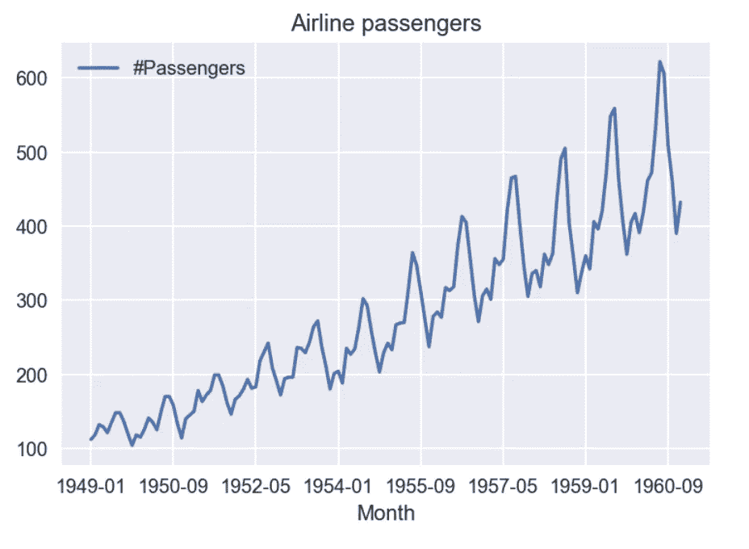
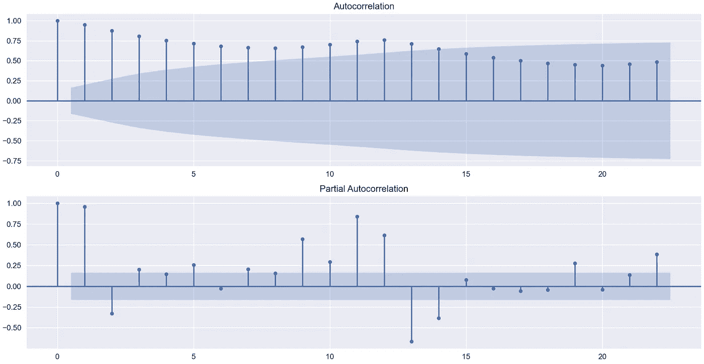
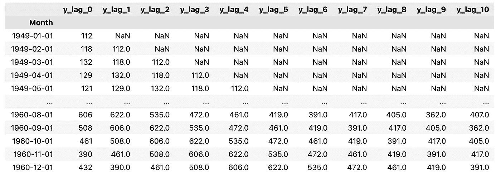
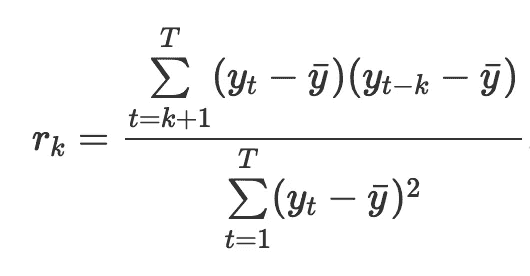

# 计算自相关和偏自相关的分步指南

> 原文：<https://towardsdatascience.com/a-step-by-step-guide-to-calculating-autocorrelation-and-partial-autocorrelation-8c4342b784e8>


照片由 [Lucas Santos](https://unsplash.com/@_staticvoid?utm_source=unsplash&utm_medium=referral&utm_content=creditCopyText) 在 [Unsplash](https://unsplash.com/s/photos/clock?utm_source=unsplash&utm_medium=referral&utm_content=creditCopyText) 上拍摄

# 计算自相关和偏自相关的分步指南

## 如何在 Python 中从头开始计算 ACF 和 PACF 值

如果您从事过任何时间序列任务，我相信您曾经研究过识别时间序列中关系本质的方法——自相关测量。例如，您可能已经使用 ACF 和 PACF 图来确定 ARMA 模型的阶数。

然而，你真的想知道这些相关系数是如何计算出来的吗？如果没有，这篇文章是适合你的地方。我们将简要描述这两个度量是什么，然后逐步展示如何在 Python 中计算它们。

为了管理预期，我们将重点关注系数背后的计算，而不是它们的解释以及如何使用它们进行时间序列建模的细节。这将是另一篇文章的主题。

# 设置

像往常一样，我们快速导入所需的库。我们将使用`statsmodels`中的函数作为基准来确保我们的计算是正确的。

# 数据

在本文中，我们将使用一个简单的经典时间序列数据集——航空乘客数据集。你可以在`seaborn`库(`sns.load_dataset("[flights.csv](https://github.com/mwaskom/seaborn-data/blob/master/flights.csv)")`)中找到数据集，或者从我的 [GitHub](https://github.com/erykml/medium_articles/blob/master/data/air_passengers.csv) 中下载稍微预处理的版本。对于我们的计算，我们将使用一个名为`y`的`pandas`系列，它包含每月的航空乘客人数。



作者图片

我敢肯定你已经非常熟悉上面的图:)然后，我们生成两个包含 ACF/PACF 值的图。虽然我们不会显式地复制这些图(虽然我们可以)，但我们关注的是由图上的点(和垂直线)表示的值。



作者图片

**注意:**虽然我们不会在本文中明确涉及，但蓝色阴影区域是置信区间。区间内的 ACF/PACF 值在 5%水平(默认设置，我们可以更改)不被视为具有统计学意义。

# 自相关

让我们从两者中较简单的开始。简而言之，自相关是时间序列与其滞后时间序列的相关性。最简单的例子——滞后 1——将告诉我们本月的航空乘客数量与上个月的相关程度。自然，我们可以用任意数量的滞后来重新表述这个句子。

简单回顾之后，让我们使用`statsmodels`来计算基准。我们之前生成的图使用了 24 个滞后，但是为了方便起见，我们将考虑 10 个滞后。计算 ACF 的值就像下面的代码片段一样简单。

```
acf(df, nlags=10)
```

这将生成以下数组:

```
array([1\.        , 0.94804734, 0.87557484, 0.80668116, 0.75262542,        0.71376997, 0.6817336 , 0.66290439, 0.65561048, 0.67094833,        0.70271992])
```

我们知道自相关是时间序列与其滞后值的相关性。因此，对于我们的计算，我们可以很容易地创建一个数据框架，在不同的列中包含原始和滞后序列，然后使用`corr`方法来计算皮尔逊相关系数。让我们试一试。

我们从生成数据帧开始:

这将生成下表:



作者图片

`lag_0`栏是原来的系列，其他的都做了适当的移动。然后，我们计算相关矩阵并打印原始系列的列—它显示原始系列如何与数据帧的所有列相关。

```
acf_df.corr()["y_lag_0"].values
```

它返回以下数组:

```
array([1\.        , 0.96019465, 0.89567531, 0.83739477, 0.7977347 ,        0.78594315, 0.7839188 , 0.78459213, 0.79221505, 0.8278519 ,        0.8827128 ])
```

有些不对劲，值与我们的基准不符。原因是什么呢？通常情况下，细节决定成败。让我们来看看自相关公式:



来源:[预测:原理与实践第三版](https://otexts.com/fpp3/acf.html)

这里有几件事需要我们注意:

*   公式中的所有数列都被贬低了，也就是说，平均值已经从它们中减去了。我们没有明确地这样做，但是在`corr`方法中，这是在幕后发生的。
*   和一般的相关公式有什么不同——我们总是在减去原始序列的均值！因为我们创建了滞后，所以原始序列和滞后序列的平均值不会相同。
*   在分母中，我们除以原始序列的方差。在皮尔逊相关系数中，我们将除以两个考虑变量的标准偏差的乘积。

现在让我们用上面的公式计算 ACF 值。

它返回以下数组:

```
array([1\.        , 0.94804734, 0.87557484, 0.80668116, 0.75262542,        0.71376997, 0.6817336 , 0.66290439, 0.65561048, 0.67094833,        0.70271992])
```

这与我们使用`statsmodels`中的`acf`函数计算的结果完全吻合。

另外，这个公式可能来自关于时间序列预测的最好的书——《预测:原则与实践》。我强烈推荐给任何对这个话题感兴趣的人。你可以在这里阅读我的观点/评论:

[](/the-best-book-to-start-learning-about-time-series-forecasting-69fcc618b6bb) [## 开始学习时间序列预测的最佳书籍

### 更妙的是，它是免费的！

towardsdatascience.com](/the-best-book-to-start-learning-about-time-series-forecasting-69fcc618b6bb) 

# 偏自相关

偏相关有点难理解。再一次，它描述了时间序列和它的滞后对应物之间的关系，然而，这一次去除了所有的中间效应。例如，我们可以使用偏相关来确定本月的乘客人数*与 6 个月前的人数*有什么直接关系。在本例中，当计算 PACF 时，我们将删除有关 6 个月前的值如何影响 5 个月前的值的信息，然后是第 5 个滞后和第 4 个滞后之间的影响，依此类推，直到最近一个月。

这也意味着第一部分自相关与第一自相关相同，因为没有中间效应要消除。

更有趣的是，有很多计算偏相关的方法。`statsmodels`中的函数提供了 3 种方法:尤尔-沃克方法、OLS(普通最小二乘法)方法和列文森-德宾递归方法。此外，每个选项都有一些可选的变体(总共有 7+种不同的组合)。

在本文中，我们将重点放在 OLS 方法，这是基于自回归(AR)模型。该算法的细节描述如下。

首先，我们创建一个滞后值的矩阵(或 DaraFrame ),直到第 N 个*。在这一点上，我们不删除任何观察，即使它们在技术上是不可用的(由于产生滞后的方式)。然后，对于 2 和 *N* 之间的每次迭代(表示为 *k* ):*

*   *我们拟合一个线性回归模型(带截距),使用原始序列作为目标，使用滞后序列直到第 *k* 个滞后作为特征。在此步骤中，我们使用从第 *k* 个开始的观测值，因为并非所有的观测值都适用于滞后特性。*
*   *第 *k* 个变量的系数就是第 *k* 个偏自相关系数。*

*这种方法背后的想法是，中间时间点解释的方差可以从滞后系数中排除。下面我们描述`statsmodels`中可用的两种 OLS 方法之间的差异。如果描述过于专业，或者您只想直接动手，请随意跳过。*

> *准确地说，我们描述的是`statsmodels`所说的“有效的”OLS 方法，也是默认的 OLS 方法。“低效”方法非常相似，只是做了一些小的调整。首先，在创建滞后值矩阵之前，我们贬低原始系列。然后，在创建滞后矩阵之后，我们移除第一个 *N* 观察值(在有效的方法中，我们迭代地减少观察值的数量，而不是在最开始移除多余的观察值)。这有明显的实际含义。让我们假设您使用了两次低效的方法，第一次是获得 2 号之前的滞后系数，然后重复这个过程直到 4 号。在这种情况下，在第一次计算中获得的第二部分自相关系数将不等于来自后一次计算的相应第二系数。这是因为基础回归使用了不同数量的观察值。您可以在附带的笔记本中看到该示例(文章末尾的链接)。*

*好了，这些技术细节已经足够了，让我们来计算一下航空乘客时间序列的部分自相关。和以前一样，我们从使用来自`statsmodels`的`pacf`函数创建基准开始。*

```
*pacf(df, nlags=10, method="ols")*
```

*这将生成以下数组:*

```
*array([ 1\.        ,  0.95893198, -0.32983096,  0.2018249 ,  0.14500798,         0.25848232, -0.02690283,  0.20433019,  0.15607896,  0.56860841,         0.29256358])*
```

*然后，我们使用上述步骤计算偏自相关系数。*

*代码应该是不言自明的，因为它几乎是将编写的步骤逐字翻译成 Python 代码。唯一可能是新的是来自`statsmodels`的`lagmat`功能。我们可以使用这个方便的函数，而不是手动创建滞后序列——就像我们之前在 ACF 示例中所做的那样。它有很多方便的特性，例如，它允许我们自动删除包含无效值的前几个观察值。有关更多信息，请查看[文档](https://www.statsmodels.org/dev/generated/statsmodels.tsa.tsatools.lagmat.html)。*

*我们的代码生成以下偏自相关系数，这些系数等于我们之前使用`pacf`函数生成的系数。*

```
*array([ 1\.        ,  0.95893198, -0.32983096,  0.2018249 ,  0.14500798,         0.25848232, -0.02690283,  0.20433019,  0.15607896,  0.56860841,         0.29256358])*
```

*注意:在这篇[文章](https://timeseriesreasoning.com/contents/partial-auto-correlation/)中，您可以找到计算偏自相关系数的另一种方法的逐步介绍，这次是基于残差的相关性。*

# *外卖食品*

*   *自相关函数描述了时间序列与其滞后对应序列之间的关系，*
*   *偏相关描述了一种直接关系，也就是说，它消除了中间滞后值的影响，*
*   *有多种计算偏自相关系数的方法，也许最简单的一种是基于使用 OLS 估计自回归(AR)模型的方法。*

*您可以在我的 [GitHub](https://github.com/erykml/medium_articles/blob/master/Time Series/acf_and_pacf_explained.ipynb) 上找到本文使用的代码。此外，欢迎任何建设性的反馈。你可以在[推特](https://twitter.com/erykml1?source=post_page---------------------------)或评论中联系我。*

*喜欢这篇文章吗？成为一个媒介成员，通过无限制的阅读继续学习。如果你使用[这个链接](https://eryk-lewinson.medium.com/membership)成为会员，你将支持我，而不需要额外的费用。提前感谢，再见！*

*您可能还会对以下内容感兴趣:*

*[](/one-thing-you-might-not-have-known-about-linear-regression-634446de7559) [## 关于线性回归，有一点你可能不知道

### 如何训练具有多个输出的单个模型

towardsdatascience.com](/one-thing-you-might-not-have-known-about-linear-regression-634446de7559) [](/the-easiest-way-to-identify-holidays-in-python-58333176af4f) [## 用 Python 识别假日的最简单方法

### 如何快速将假期要素添加到数据集中

towardsdatascience.com](/the-easiest-way-to-identify-holidays-in-python-58333176af4f) [](/8-more-useful-pandas-functionalities-for-your-analyses-ef87dcfe5d74) [## 用于分析的 8 个更有用的熊猫功能

### 它们可以让你的日常工作更轻松、更快捷

towardsdatascience.com](/8-more-useful-pandas-functionalities-for-your-analyses-ef87dcfe5d74) 

# 参考

*   [https://www.statsmodels.org/stable/index.html](https://www.statsmodels.org/stable/index.html)
*   Hyndman，R.J .，& Athanasopoulos，G. (2021) *预测:原则与实践*，第三版，原文:澳大利亚墨尔本。OTexts.com/fpp3.于 2022 年 1 月 28 日登陆。
*   [https://www.statsmodels.org/stable/](https://www.statsmodels.org/stable/)*