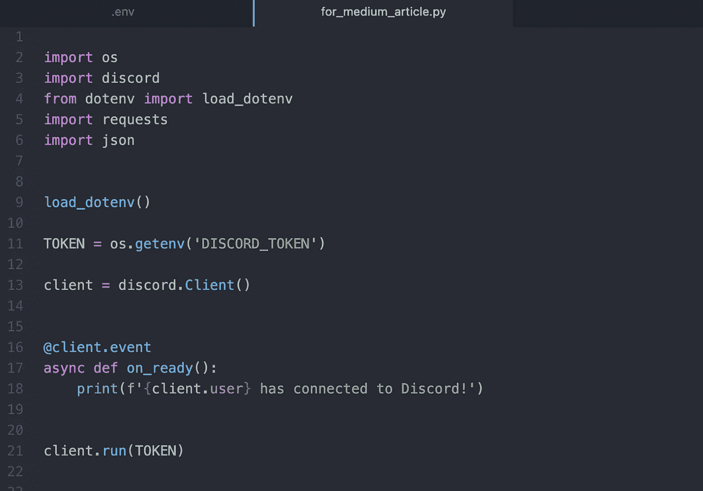
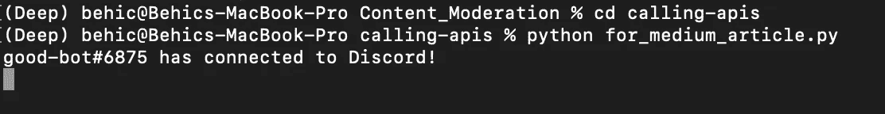
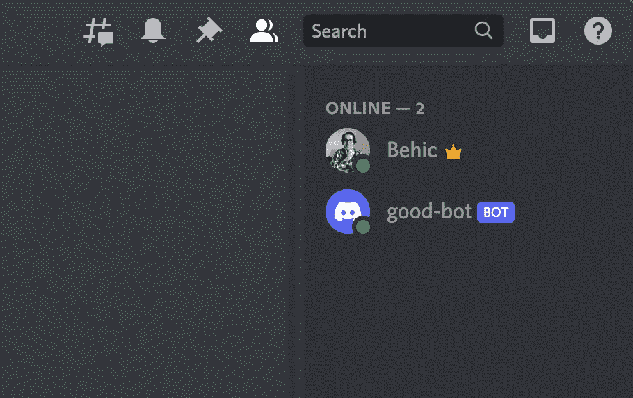
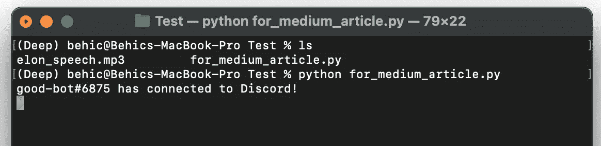
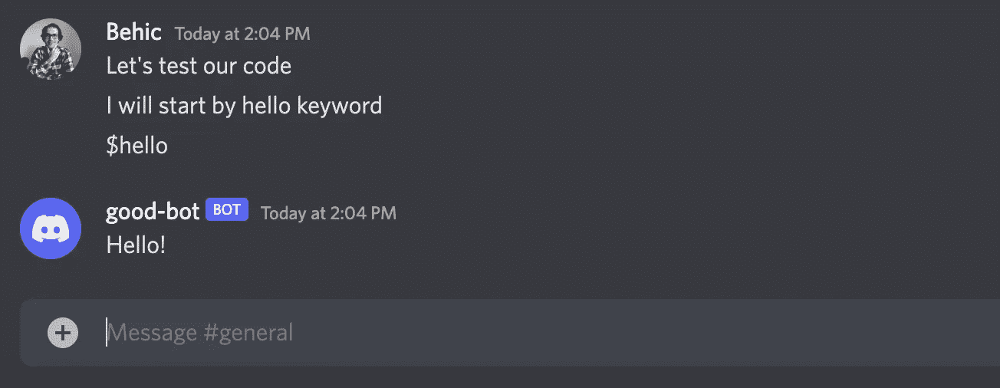
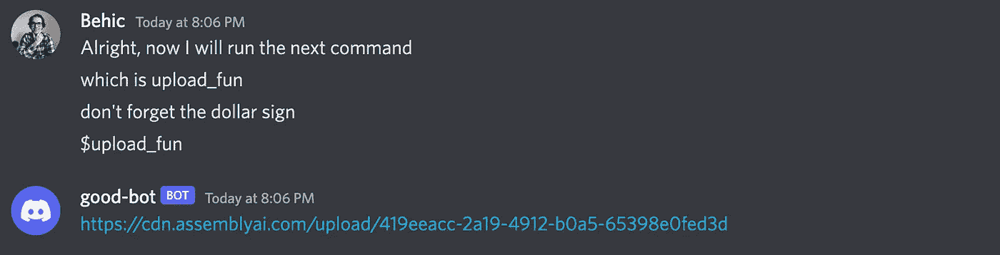
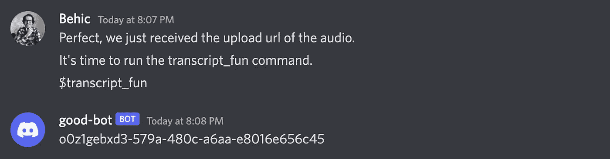
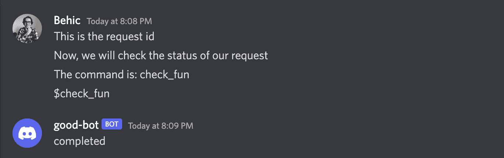
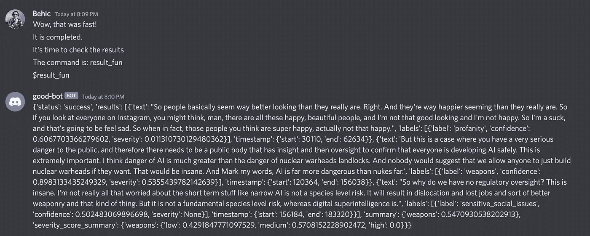

# 创建内容安全检测机器人的分步指南

> 原文：<https://towardsdatascience.com/a-step-by-step-guide-to-creating-a-content-safety-detection-bot-for-discord-bea2444e834a>

## 实践教程

## 使用人工智能的内容调节


照片由[艾拉·唐](https://unsplash.com/@elladon?utm_source=medium&utm_medium=referral)在 [Unsplash](https://unsplash.com?utm_source=medium&utm_medium=referral) 拍摄

在这篇文章中，我们将学习如何编写一个不和谐机器人，可以为我们调节频道的内容。对于不同类型的人相互联系的公共空间来说，内容适度是必不可少的。当我们在网络平台上时，我们感到安全。*在线交流*是一个需要更多关注和重视的重要课题。

内容适度是许多社交媒体平台的常见做法，尤其是当平台的用户主要生成内容时。内容审核正在一些领域积极使用，如社交媒体、市场、约会应用和在线论坛。

在这个项目中，我们的重点将是基于语音平台的内容调节。不和谐频道将是实施我们的内容版主的最佳场所之一。有许多类型的内容版主，从真人到自动版主。你可以从这篇文章的标题中了解到，我们的内容版主将是一个人工智能机器人。

## 目录:

*   *入门*
*   *步骤 1 —库*
*   *步骤 2—将机器人连接到不和谐频道*
*   *步骤 3—功能*
*   *步骤 4—不一致命令*
*   *最后一步——测试程序*

# 入门指南

在这个项目中，我们将学习如何通过像 Discord 这样的软件使用在线 API。我们将使用 AssemblyAI 的[语音转文本 API](https://www.assemblyai.com) 对 Discord 频道上共享的音频消息执行内容审核。换句话说，通过内容安全检测，AssemblyAI 可以检测出我们的音频/视频文件中可能存在的不安全内容，并准确返回这些内容是在什么时候说的。

经过训练的模型可以识别十几个不同的主题；有些可以列为赌博、仇恨言论、毒品、负面新闻等等。看看它的表现会很有趣。如果你想了解更多，这里的是内容审核模块的文档。

让我们从图书馆开始。

# 步骤 1 —库

对于这个项目，我们将致力于代码编辑器。这些库将被安装，然后导入 python 程序。我们需要五个库: *os、Discord、dotenv、requests 和 JSON* 。

在使用它们之前，我们必须安装它们。Python 已经安装了 OS 和 JSON。因此，我们已经用 PIP 安装了其他三个库。PIP 是一个 python 库管理器。我们可以在一行代码中安装多个库。在您的终端窗口中运行以下行:

```
pip install python-dotenv requests discord.py
```

此外，以下是这些主要库的官方文档链接:

*   [Python-dotenv](https://github.com/theskumar/python-dotenv)
*   [请求](https://requests.readthedocs.io/en/latest/)
*   [Discord.py](https://github.com/Rapptz/discord.py)

现在，让我们导入它们。

```
import os
import discord
from dotenv import load_dotenv
import requests
import json
```

# *步骤 2——将机器人连接到不和谐频道*

这一步将涵盖如何创建和连接一个机器人不和谐。对于 bot 创建部分我在这里就不赘述了，但是如果你想了解更多，有一篇 Eric Chi 写的很优秀的文章:[用 Python 构建一个不和谐的 Bot](https://betterprogramming.pub/coding-a-discord-bot-with-python-64da9d6cade7)。

bot 过程完成后，我们将进入我们的项目文件夹，创建一个新文件，并将其重命名为*. env . .*该文件将存储我们的 API 密钥。看起来是这样的:

```
DISCORD_TOKEN = {Your Discord API Key}DISCORD_GUILD = {your-guild-name}
```

现在，让我们回到我们的主程序。到目前为止，我们只是导入了库。是时候加载我们刚刚创建的环境文件了。

```
load_dotenv()TOKEN = os.getenv('DISCORD_TOKEN')client = discord.Client()
```

然后，我们将编写一个异步函数来与 Discord API 同步。当我们的 bot 连接到我们的 Discord 通道时，我们将在终端窗口中打印一条消息。

```
@client.event
async def on_ready():
    print(f'{client.user} has connected to Discord!')client.run(TOKEN)
```

这是我们的项目文件在这一步结束时的截图。



图片由作者提供。

您可以继续运行这个 python 程序。在进入下一步之前，让我们确保我们的机器人连接没有任何问题。

当您看到以下两个标志时，这意味着您的机器人已经准备好了:



图片由作者提供。



图片由作者提供。

# 第 3 步—功能

创建一个机器人并将其连接到我们的 Discord 服务器有点复杂，但这一步会容易得多。我们将有一个如何使用 API 云服务的想法。

在这一步，我们将编写三个函数。以下是函数列表及其作用:

*   **upload_audio** :该功能将音频文件从项目文件夹上传到 AssemblyAI 的云存储中。API 的响应为我们提供了上传音频的 URL 地址。我们将在云上运行语音转文本时使用它。
*   **get_transcript** :这个函数是我们打开内容审核功能的地方。我们在函数内部的 JSON 字典下传递带有真值*的 *content_safety* 键。来自 API 的响应将具有请求 URL，这是我们跟踪请求状态并获得结果的方式。*
*   **check_result** :这个函数帮助我们检查在前一个函数中发送的请求的状态。如果请求被完成，它将为我们在内容安全方面有结果。

下面是函数。在本文的最后一步，我们将看到它们的实际应用。

## 上传音频

```
def upload_audio():
    audio_data = "audio_message.mp4"
    endpoint = "[https://api.assemblyai.com/v2/upload](https://api.assemblyai.com/v2/upload)" def up_audio(audio_data, chunk_size=5242880):
        with open(audio_data, 'rb') as audio_file:
            while True:
                data = audio_file.read(chunk_size)
                if not data:
                    break
                yield data headers = {
        "authorization": "API Key"
     }
    response = requests.post(endpoint, headers=headers, data=up_audio(audio_data))
    return response
```

## 获取转录

```
def get_transcript():
    endpoint = "[https://api.assemblyai.com/v2/transcript](https://api.assemblyai.com/v2/transcript)" json = {
        "audio_url": upload_url,
        "content_safety": True
    }
    headers = {
        "authorization": "API Key",
        "content-type": "application/json"
    }
    response = requests.post(endpoint, json=json, headers=headers)return response
```

## 检查结果

```
def check_result(request_id):
    request_url = "[https://api.assemblyai.com/v2/transcript/](https://api.assemblyai.com/v2/transcript/)" + str(request_id)headers = {
        "authorization": "API Key"
    }response = requests.get(request_url, headers=headers)return response
```

# 步骤 4 —不一致命令

在这一步，我们要做一些有趣的事情。我们将定义触发这些功能的命令。而且，这些命令会来自不和谐聊天。这意味着我们的代码将同时监听聊天框中写的对话。当一个特定的单词通过时，它将调用定义的函数。因为我们想让它在程序运行时一直监听，所以我们将使用一个异步函数。让我们开始吧。

首先，我们必须在函数之外定义两个变量。它们将是全局变量；我们希望在函数被多次调用时存储它们的值。

其次，我们正在编写 *on_message* 函数。这是我定义的特定关键字的列表。我还添加了一个美元符号，以便与普通消息区分开来；请随意用不同的词替换它们。

*   **$你好**:机器人会回应“你好！”在聊天框里。只是为了测试一下。
*   **$upload_fun** :机器人会运行*upload _ audio*函数，然后打印出聊天框中音频的 URL。
*   **$ transcription _ fun**:bot 将运行 *get_transcription* 函数，并在聊天框中打印出 request-id。
*   **$check_fun** :机器人会运行 check_result 函数来检查状态，并为我们打印出来。我们将运行这个单词，直到我们看到状态显示为 completed。
*   **$result_fun** :看到 API 完成了我们的请求后，就该得到结果了。

```
response_id = ""
upload_url = "" @client.event
async def on_message(message): if message.author == client.user:
        return if message.content.startswith('$hello'):
        await message.channel.send('Hello!') if message.content.startswith('$upload_fun'):
        response = upload_audio()
        global upload_url
        upload_url = response.json()['upload_url']
        await message.channel.send(upload_url) if message.content.startswith('$transcript_fun'):
        response = get_transcript()
        global response_id
        response_id = response.json()['id']
        await message.channel.send(response_id) if message.content.startswith('$check_fun'):
        response = check_result(response_id)
        response_status = response.json()['status']
        await message.channel.send(response_status) if message.content.startswith('$result_fun'):
        response = check_result(response_id)
        response_transcript = response.json()['content_safety_labels']
        await message.channel.send(response_transcript)
```

# 最后一步— *测试程序*

完美！到目前为止，理论上一切都很好。让我们看看他们的行动吧！

这是一个场景:你通过 Discord 接收音频，在听之前，你想运行一个内容安全检查来了解音频记录。

我从埃隆·马斯克关于社交媒体的播客中选了一个短片，作为我们的测试。这里的是 YouTube 上的视频版本。我已经将录音重命名并格式化为“ *elon_speech.mp3* ”。它和我们的主程序在同一个项目文件夹中。现在，让我们从终端运行我们的主程序。

当我们看到下面的消息时，这个机器人已经加入了我们的不和谐游戏。



图片由作者提供。

现在，让我们转到我们的 Discord 应用程序，开始给机器人发消息。然后，按顺序运行命令，查看机器人的响应:

## $你好



图片由作者提供。

## $上传 _ 乐趣



图片由作者提供。

## $抄本 _ 乐趣



图片由作者提供。

## $检查 _ 乐趣



图片由作者提供。

## $result_fun



图片由作者提供。

那么，我们在看什么？

嗯，这里发生了很多事情。首先，讲话的文本版本包含潜在的安全危险信号。此外，就在文本之后，我们看到标签；在这种情况下，它说“亵渎。”然后我们有了置信度得分和这个演讲经过的时间标记。

我们的机器人已经从这个视频中识别出三个不安全的部分。确定的内容有亵渎、武器、敏感的社会问题。

## 结论

恭喜你。在本文中，我们学习了如何构建一个 Discord bot，并将其与基于云的语音转文本 API 相连接。我们的程序已经返回了讨论潜在不安全话题的标签和时间戳。这个项目可以通过添加从原始视频中裁剪出检测到的时间帧的功能来改进。

从事这些项目是将我们的机器学习和人工智能技能应用到我们日常生活中的一个很好的方式。希望你喜欢阅读本指南，并在今天学到一些新东西。如果您有任何问题，请随时联系。

> 我是[贝希克·居文](https://medium.com/u/a073b4360020?source=post_page-----bea2444e834a--------------------------------)，我喜欢分享关于编程、教育和生活的故事。[订阅](https://lifexplorer.medium.com/membership)我的内容，保持灵感。泰，

如果你想知道我发表了什么样的文章，这里有一些:

*   [使用 Python 构建人脸识别器](/building-a-face-recognizer-in-python-7fd6630c6340)
*   [使用 Python 进行实时语音识别](/speech-recognition-in-real-time-using-python-fbbd62e6ff9d)
*   [分步指南—用 Python 构建预测模型](/step-by-step-guide-building-a-prediction-model-in-python-ac441e8b9e8b)