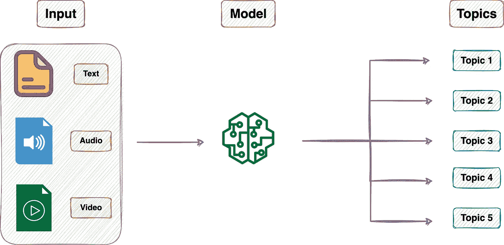
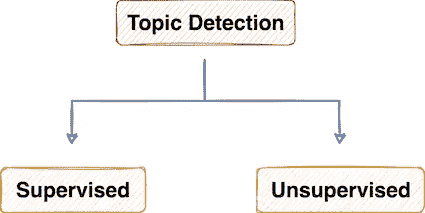
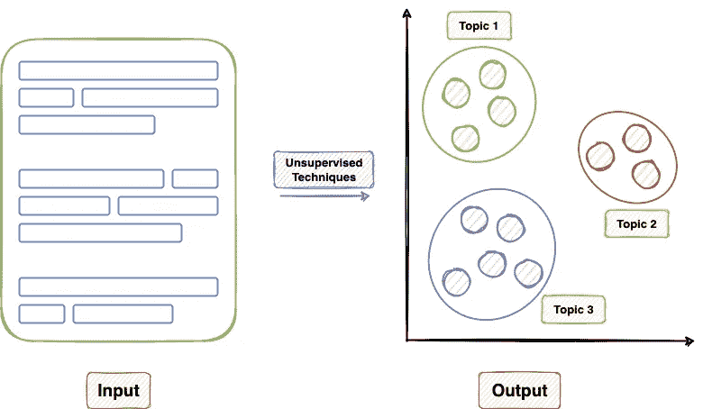

# 检测音频文件中的主题的分步指南

> 原文：<https://towardsdatascience.com/a-step-by-step-guide-to-detecting-topics-in-an-audio-file-69d7b72c0549>

## 话题检测变得简单


[梁杰森](https://unsplash.com/@ninjason?utm_source=medium&utm_medium=referral)在 [Unsplash](https://unsplash.com?utm_source=medium&utm_medium=referral) 上的照片

```
**·** [**Introduction**](#e4f5) **·** [**Introduction to Topic Detection**](#75f4) **·** [**Detecting Topics from an Audio File**](#ee94) **·** [**Insights**](#f2b4) **·** [**Conclusion**](#a4d1)
```

# 介绍

主题检测(也称为主题建模)是一种识别给定信息中广泛主题的技术。

在自然语言处理中，主题建模有时会被误解为摘要。然而，它们是不同的。

使用摘要，目的是生成手边信息的可解释和可读的文本摘要。

而主题建模的目标是预测与输入相对应的主题。

从构建数据驱动的智能机器学习系统的角度来看，这里的目标是用问题中定义的主题类列表自动标注给定的信息。



主题检测管道的高级工作流(图片由作者提供)

从适用性的角度来看，主题建模在推动关键业务决策方面有着巨大的潜力。这是因为它允许企业从大量数据中产生关键的洞察力。

此外，随着智能的引入，该流程已被大规模应用——提高了业务产出和效率。

虽然用于主题建模的机器学习模型可以使用监督和非监督学习方法来构建，但是前者在构建准确和定制的主题标记模型中更为普遍。

因此，在这篇文章中，我将演示如何从音频文件中提取主题。为了实现这一点，我们将使用 AssemblyAI API 并在 Python 中构建一个主题提取器。

我们开始吧🚀！

# 话题检测简介

如上所述，主题检测包括自然语言处理中的一组技术，以识别给定信息片段中的潜在主题。

从构建智能嵌入式话题检测系统的技术角度来看，用于解决该问题的技术可以大致分为两类:



主题检测技术的分类(图片由作者提供)

## 监督主题建模

顾名思义，监督技术需要用于检测主题的标记数据来训练主题检测模型——这使其更像是一个分类问题。

在这种方法中，主题标签有一个预定义的符号，并且与手头的问题相关。


监督主题检测(图片由作者提供)

因此，模型的输出是完全可解释的，并且很容易评估监督主题建模方法的性能。

## **无监督**主题建模

与监督学习方法相比，非监督技术使用未标记的数据来生成主题。

一般来说，用于以无监督方式提取主题的技术属于传统聚类算法及其变体的范畴。



无监督的主题检测(图片由作者提供)

在这种方法中，主题标签没有预定义的符号，由模型的熟练程度来识别潜在的主题，这使得很难评估性能。

# 从音频文件中检测主题

现在，我们已经对这个问题以及如何使用机器学习解决这个问题有了一个简单的了解，在本节中，我将演示如何使用 AssemblyAI API 从输入音频文件中提取主题。

AssemblyAI API 采用受监督的方法进行主题建模，能够从输入音频/视频中识别 698 个潜在的分类主题。(阅读更多:[此处](https://www.assemblyai.com/docs/audio-intelligence#topic-detection-iab-classification))

对于本教程，我将使用[这个音频文件](https://download.ted.com/products/146256.mp4)。

从音频文件中提取主题的步骤如下所示:

## 步骤 1:导入依赖关系

要在 Python 中运行该项目，您应该导入以下库:

## 步骤 2:获取 API 令牌

接下来，要访问 AssemblyAI 服务，您应该生成一个 API 访问令牌。

在 [AssemblyAI](https://app.assemblyai.com/signup) 网站上创建一个帐户并获取访问令牌。

对于这个项目，我们姑且定义为`assemblyai_auth_key`。

## 步骤 3:定义转录端点和输入 URL。

`headers`字典保存 API 访问令牌，而`transcription_endpoint`定义了用于转录音频文件的 API 端点。

## 步骤 4:转录后请求

作为该方法的一个参数，我们传递输入 URL。在提交转录请求时，我们在`json`对象中将`iab_categories`指定为`True`。

接下来，我们将转录请求发送到 AssemblyAI 的`transcription_endpoint`。一旦我们创建了一个请求，我们就返回请求标识符(`id`)，稍后我们可以用它来检索结果。

## 步骤 5:获取转录结果

该过程的下一步是检索转录的结果。

我们定义了上面的`get_transcription_result()`方法，它将`post_transcription_request()`方法返回的`transcription_id`作为参数。

一旦请求的状态变为`completed`或`unavailable`(表示有错误)，我们就返回结果。

## 步骤 6:执行管道

既然已经定义了函数和其他变量，我们就可以执行主题检测管道了。

AssemblyAI 返回的转录结果(`results`)是一个 JSON 响应，包含在输入文件中检测到的主题。

我们可以参考`iab_categories_result`键查看主题建模结果。

下面，让我们来了解一下这个键(`iab_categories_result`)包含的信息。

*   `results`:这是模型预测的主题列表，以及生成主题的相应文本。
*   `results.text`:在`results`键内，`text`键描绘转录文本。
*   `results.labels`:在`results`键内，`labels`键保存已识别的主题列表。此外，相关性关键字是置信度得分(在 0 和 1 之间),以估计对应于文本的每个标签的相关性。
*   `summary`:保存输入文件中识别的所有独特主题及其与整个输入音频文件的相关性。

# 洞察力

一旦结果准备就绪，我们就可以执行下面的分析，以了解检测到的主题的质量和分布。

为了更好的可读性，让我们收集来自`iab_categories_result`键的结果，并将它们转换成 Pandas 数据帧。

接下来，让我们为音频结果中的`summary`标签生成一个类似的数据帧。

*   **所有主题标签的分布**

音频主要围绕政治新闻，包括战争和冲突、选举等话题。

*   **与音频最相关的主题**

我们可以使用`nlargest()`方法找到与音频最相关的三个主题，如下所示:

# 结论

最后，在这篇文章中，我们讨论了 AssemblyAI API 的一个流行的自然语言处理用例。

具体来说，我们看到了如何从预先录制的音频文件中提取主题，并解释获得的结果。

感谢阅读！

[🚀**订阅每日数据科学。在这里，我分享关于数据科学的优雅技巧和诀窍，一天一个技巧。每天在你的收件箱里收到这些提示。**](https://avichawla.substack.com/)

[🧑‍💻**成为数据科学专业人士！获取包含 450 多个熊猫、NumPy 和 SQL 问题的免费数据科学掌握工具包。**](https://subscribepage.io/450q)

✉️ [**注册我的电子邮件列表**](https://medium.com/subscribe/@avi_chawla) 不要错过另一篇关于数据科学指南、技巧和提示、机器学习、SQL、Python 等的文章。Medium 会将我的下一篇文章直接发送到你的收件箱。