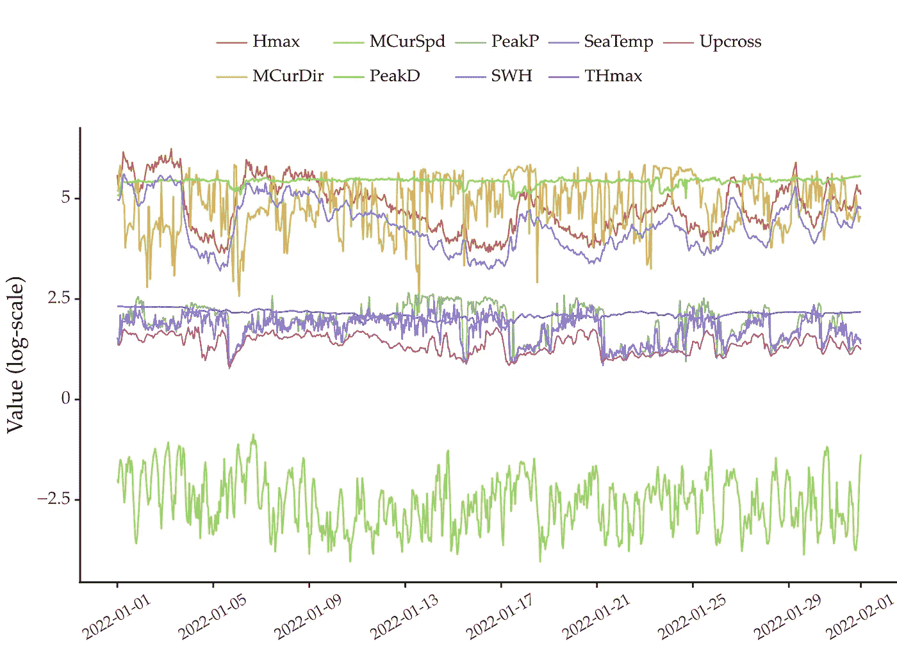
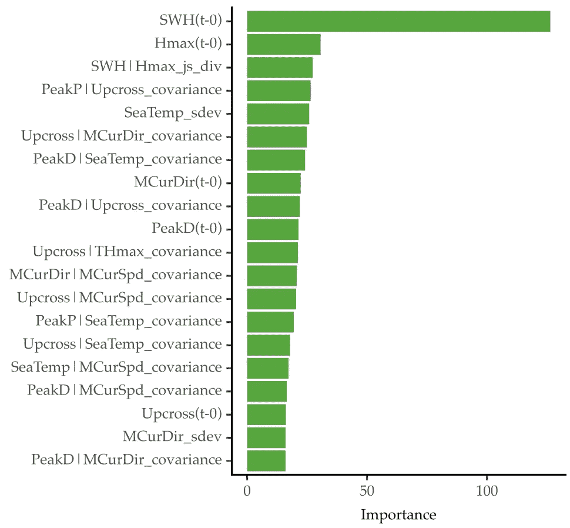

# 多元时间序列特征工程分步指南

> 原文：<https://towardsdatascience.com/a-step-by-step-guide-to-feature-engineering-for-multivariate-time-series-162ccf232e2f>

## 使用 Python 添加基于汇总统计数据的新要素


Artem Maltsev 在 [Unsplash](https://unsplash.com?utm_source=medium&utm_medium=referral) 上拍摄的照片

这是一个分步指南，介绍[多元时间序列预测](/machine-learning-for-forecasting-supervised-learning-with-multivariate-time-series-b5b5044fe068)的特征工程。您将学习如何计算几个滚动统计数据。将这些添加到解释变量中通常会导致更好的预测性能。

# 介绍

## 自动回归

多元时间序列包含两个或多个变量。下面是一个例子。通常，研究这些数据集的目的是预测这些变量中的一个或多个。



图 1:包含 9 个变量的多元时间序列。这些代表了智能浮标捕捉到的海洋状况。[数据公开可用【1】(CC BY 4.0 License)](https://erddap.marine.ie/erddap/tabledap/IWaveBNetwork.html)。图片作者。

大多数预测模型是基于自回归的。这相当于解决监督学习回归任务。[序列的未来值是目标变量。输入解释变量是每个变量最近的过去值。](/machine-learning-for-forecasting-supervised-learning-with-multivariate-time-series-b5b5044fe068)

自动回归在一个主要假设下工作。最近的过去值包含了足够的关于未来的信息。但这可能不是真的。

你可以试着从最近的数据中提取更多的信息。例如，滚动汇总统计有助于描述最近的动态。

## 自动化特征工程

特征工程包括提取和管理解释变量。这是任何数据科学项目的关键阶段。特征的质量是模型性能的一个重要方面。正因为如此，数据科学家在这个过程中花费了大量的时间。

然而，特征工程通常是一个特别的过程。数据科学家根据他们的领域知识和专业技能创建要素。因此，这个过程的自动化部分是从业者所希望的。

让我们看看如何对多元时间序列进行这种处理。

# 多元时间序列的特征工程

## 读取数据

我们将使用从智能浮标收集的多元时间序列[作为案例研究【1】。这个浮标位于爱尔兰海岸。它捕捉了与海洋条件相关的 9 个变量。这些包括](https://erddap.marine.ie/erddap/tabledap/IWaveBNetwork.html)[海水温度、海浪高度、海水流速](https://erddap.marine.ie/erddap/info/IWaveBNetwork/index.html)等等。上面的图 1 显示了 2022 年第一个月的情况。

以下是如何使用 pandas 读取这些数据的方法:

```
import pandas as pd

# skipping second row, setting time column as a datetime column
# dataset available here: https://github.com/vcerqueira/blog/tree/main/data
buoy = pd.read_csv('data/smart_buoy.csv', 
                   skiprows=[1], 
                   parse_dates=['time'])

# setting time as index
buoy.set_index('time', inplace=True)
# resampling to hourly data
buoy = buoy.resample('H').mean()
# simplifying column names
buoy.columns = [
    'PeakP', 'PeakD', 'Upcross',
    'SWH', 'SeaTemp', 'Hmax', 'THmax',
    'MCurDir', 'MCurSpd'
]
```

上面的图 1 显示了 2022 年第一个月的情况。

目标是预测 SWH(有效波高)变量的未来值。这个变量通常用于量化海浪的高度。[这个问题的一个用例是估算海浪产生的能量](https://medium.com/towards-data-science/an-introduction-to-exceedance-probability-forecasting-4c96c0e7772c)。这种能源是不可再生能源越来越受欢迎的替代品。

## 自回归模型

时间序列是多元的。因此，您可以使用 ARDL(自回归分布滞后)方法来解决这个任务。这个方法你可以在[我之前的帖子](/machine-learning-for-forecasting-supervised-learning-with-multivariate-time-series-b5b5044fe068)里了解更多。

下面是实现这个方法的方法。

```
import pandas as pd

from sklearn.model_selection import train_test_split
from sklearn.metrics import mean_absolute_percentage_error as mape
from sklearn.multioutput import MultiOutputRegressor
from lightgbm import LGBMRegressor

# https://github.com/vcerqueira/blog/blob/main/src/tde.py
from src.tde import time_delay_embedding

target_var = 'SWH'

colnames = buoy.columns.tolist()

# create data set with lagged features using time delay embedding
buoy_ds = []
for col in buoy:
    col_df = time_delay_embedding(buoy[col], n_lags=24, horizon=12)
    buoy_ds.append(col_df)

# concatenating all variables
buoy_df = pd.concat(buoy_ds, axis=1).dropna()

# defining target (Y) and explanatory variables (X)
predictor_variables = buoy_df.columns.str.contains('\(t\-')
target_variables = buoy_df.columns.str.contains(f'{target_var}\(t\+')
X = buoy_df.iloc[:, predictor_variables]
Y = buoy_df.iloc[:, target_variables]

# train/test split
X_tr, X_ts, Y_tr, Y_ts = train_test_split(X, Y, test_size=0.3, shuffle=False)

# fitting a lgbm model without feature engineering
model_wo_fe = MultiOutputRegressor(LGBMRegressor())
model_wo_fe.fit(X_tr, Y_tr)

# getting forecasts for the test set
preds_wo_fe = model_wo_fe.predict(X_ts)

# computing the MAPE error
mape(Y_ts, preds_wo_fe)
# 0.238
```

首先，将时间序列转化为自回归问题。这是通过函数 *time_delay_embedding* 完成的。预测目标是预测 SWH 接下来的 12 个值( *horizon=12* )。解释变量是序列中每个变量过去的 24 个值( *n_lags=24* )。

使用直接方法为每个预测范围训练 LightGBM。[*直接*方法是一种多步提前预测](https://medium.com/towards-data-science/6-methods-for-multi-step-forecasting-823cbde4127a)的常用方法。它在 scikit-learn 中实现，名为 *MultiOutputRegressor。*

上面的代码构建并测试了一个自回归模型。解释变量仅包括每个变量最近的过去值。这导致平均绝对百分比误差为 *0.238* 。让我们看看这个分数是否可以用特征工程来提高。

本指南包括两种从多元时间序列中提取特征的方法:

*   **单变量特征提取。**计算每个变量的滚动统计量。例如，滚动平均可用于消除虚假观察；
*   **二元特征提取。**计算变量对的滚动统计量，以总结它们的相互作用。例如，两个变量之间的滚动协方差。

## 单变量特征提取

你可以总结每个变量最近的值。例如，计算滚动平均值来总结最近的水平。或滚动离差，以了解最近的离差程度。

```
import numpy as np

SUMMARY_STATS = {
    'mean': np.mean,
    'sdev': np.std,
}

univariate_features = {}
# for each column in the data
for col in colnames:
    # get lags for that column
    X_col = X.iloc[:, X.columns.str.startswith(col)]

    # for each summary stat
    for feat, func in SUMMARY_STATS.items():
        # compute that stat along the rows
        univariate_features[f'{col}_{feat}'] = X_col.apply(func, axis=1)

# concatenate features into a pd.DF
univariate_features_df = pd.concat(univariate_features, axis=1)
```

您可能想再添加一些统计数据。您可以通过向 SUMMARY_STATS 字典添加函数来实现这一点。将这些函数放在一个字典中可以保持代码整洁。

## 二元特征提取

单变量统计遗漏了不同变量之间的潜在相互作用。您可以使用二元特征提取过程来获取这些信息。

这个想法是计算不同变量对的特征。所以，你用二元统计总结这些对的联合动力学。

有两种方法可以做到这一点:

*   **滚动二元统计。**计算以变量对为输入的统计数据。例如，滚动协方差或滚动相关；
*   **滚动二元变换后跟单变量统计。**将一对变量转化为一个变量，并对这个变量进行汇总。例如，计算元素间的互相关，然后取其平均值。

滚动二元统计的例子包括协方差、相关性或相对熵。

有许多二进制转换的可能性。例如，变量对之间的百分比差、互相关或线性卷积。然后，这些转换用统计数据进行总结，如平均值或标准偏差。

下面是用于一次性完成这两个提取过程的脚本。

```
import itertools

import pandas as pd

from scipy.spatial.distance import jensenshannon
from scipy import signal
from scipy.special import rel_entr

from src.feature_extraction import covariance, co_integration

BIVARIATE_STATS = {
    'covariance': covariance,
    'co_integration': co_integration,
    'js_div': jensenshannon,
}

BIVARIATE_TRANSFORMATIONS = {
    'corr': signal.correlate,
    'conv': signal.convolve,
    'rel_entr': rel_entr,
}

# get all pairs of variables
col_combs = list(itertools.combinations(colnames, 2))

bivariate_features = []
# for each row
for i, _ in X.iterrows():
    # feature set in the i-th time-step
    feature_set_i = {}
    for col1, col2 in col_combs:
        # features for pair of columns col1, col2

        # getting the i-th instance for each column
        x1 = X.loc[i, X.columns.str.startswith(col1)]
        x2 = X.loc[i, X.columns.str.startswith(col2)]

        # compute each summary stat
        for feat, func in BIVARIATE_SUMMARY_STATS.items():
            feature_set_i[f'{col1}|{col2}_{feat}'] = func(x1, x2)

        # for each transformation
        for trans_f, t_func in BIVARIATE_TRANSFORMATIONS.items():

            # apply transformation
            xt = t_func(x1, x2)

            # compute summary stat
            for feat, s_func in SUMMARY_STATS.items():
                feature_set_i[f'{col1}|{col2}_{trans_f}_{feat}'] = s_func(xt)

    bivariate_features.append(feature_set_i)

bivariate_features_df = pd.DataFrame(bivariate_features, index=X.index)
```

同样，您可以添加额外的转换或统计。这是通过将它们包含在字典 BIVARIATE_TRANSFORMATIONS 或 BIVARIATE_STATS 中来实现的。

提取所有特征后，将它们连接到原始解释变量。然后，培训和测试周期就像你之前做的一样。

```
# concatenating all features with lags
X_with_features = pd.concat([X, univariate_features_df, bivariate_features_df], axis=1)

# train/test split
X_tr, X_ts, Y_tr, Y_ts = train_test_split(X_with_features, Y, test_size=0.3, shuffle=False)

# fitting a lgbm model with feature engineering
model_w_fe = MultiOutputRegressor(LGBMRegressor())
model_w_fe.fit(X_tr, Y_tr)

# getting forecasts for the test set
preds_w_fe = model_w_fe.predict(X_ts)

# computing MAPE error
print(mape(Y_ts, preds_w_fe))
# 0.227
```

这导致平均绝对百分比误差为 *0.227* ，这是一个改进。不使用特征工程的方法损失更大( *0.238* )。

## 特征选择

上述提取过程总共产生 558 个解释变量。

根据变量和汇总统计的数量，这可能会导致一个高维问题。因此，从数据集中移除不良或冗余的特征非常重要。

你可以这样做的一个方法是抓住最重要的特征，用这些特征重复训练过程。

```
# getting the importance of each feature in each horizon
avg_imp = pd.DataFrame([x.feature_importances_
                        for x in model_w_fe.estimators_]).mean()

# getting the top 100 features
n_top_features = 100

importance_scores = pd.Series(dict(zip(X_tr.columns, avg_imp)))
top_features = importance_scores.sort_values(ascending=False)[:n_top_features]
top_features_nm = top_features.index

# subsetting training and testing sets by those features
X_tr_top = X_tr[top_features_nm]
X_ts_top = X_ts[top_features_nm]

# re-fitting the lgbm model
model_top_features = MultiOutputRegressor(LGBMRegressor())
model_top_features.fit(X_tr_top, Y_tr)

# getting forecasts for the test set
preds_top_feats = model_top_features.predict(X_ts_top)

# computing MAE error
mape(Y_ts, preds_top_feats)
# 0.229
```

前 100 个功能与完整的 558 个功能具有相似的性能。

以下是 15 大特征的重要性(为简明起见，省略了其他特征):



图 2:根据预测模型的前 15 个特性。图片作者。

最重要的特征是目标变量的第一个滞后。但是，一些提取的特征出现在这前 15 名中。比如 SWH 第三好的功能|Hmax_js_div。这表示目标变量的滞后和 Hmax 的滞后之间的 Jensen-Shannon 散度。第五个最好的特性是 SeaTemp_sdev:标准偏差海水温度滞后。协方差也是不同变量对的相关统计量。

另一种去除冗余特征的方法是应用相关滤波器。您删除高度相关的要素以降低数据的维度。

# 总结整个时间序列

本指南主要关注多变量时间序列的预测问题。因此，特征提取过程适用于一个时间序列的许多子序列。在每个时间步，您用一组统计数据总结了过去 24 小时的数据。

但是，您也可以一次性应用这些统计数据来描述整个时间序列的特征。如果您的目标是对一组时间序列进行聚类，这可能会很有用。首先，你用特征提取总结每个时间序列。然后，对生成的要素应用聚类算法。

# 关键要点

*   多元时间序列预测通常是一个自回归过程
*   特征工程是数据科学项目中的关键步骤。
*   您可以使用特征工程改进多元时间序列数据集。这包括计算单变量和双变量转换以及汇总统计数据。
*   提取太多特征会导致高维问题。您可以使用要素选择方法移除不需要的要素。

感谢阅读，下一个故事再见！

## 参考

[1]数据来源:[https://erddap.marine.ie/erddap/tabledap/IWaveBNetwork.html](https://erddap.marine.ie/erddap/tabledap/IWaveBNetwork.html)。许可证:知识共享署名 4.0([https://erd DAP . marine . ie/erd DAP/info/IWaveBNetwork/index . html](https://erddap.marine.ie/erddap/info/IWaveBNetwork/index.html))

[2]塞尔奎拉、熊伟、努诺·莫尼斯和卡洛斯·苏亚雷斯。"背心:用于预测的自动特征工程."*机器学习*(2021):1–23。