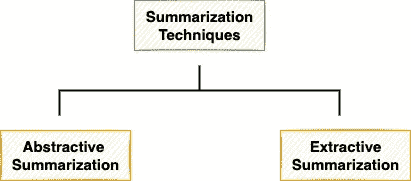
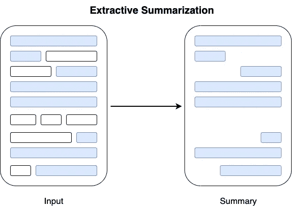
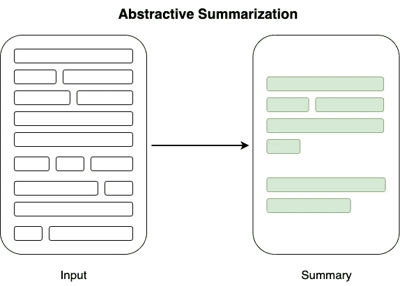
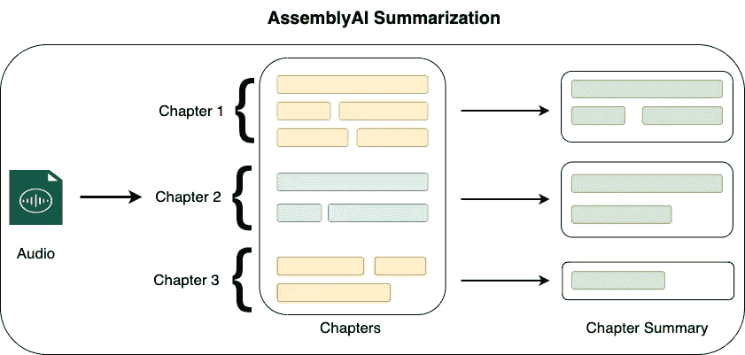

# 用 Python 总结音频文件的分步指南

> 原文：<https://towardsdatascience.com/a-step-by-step-guide-to-summarizing-audio-files-in-python-55059bec54a7>

## 语音摘要变得简单

丹尼尔·施鲁迪在 [Unsplash](https://unsplash.com?utm_source=medium&utm_medium=referral) 拍摄的照片

顾名思义，摘要是对给定的信息生成简明摘要的过程。这些信息可以以文本、音频、视频、图片等形式出现。换句话说，摘要是选择/生成代表整个输入的相关信息片段的过程。

构建数据驱动的摘要系统是自然语言处理中的一项常见任务，因为它在诸如摘要网页、长文档、产品评论等领域具有广泛的下游适用性。

虽然该领域中的大多数现有方法集中于将摘要技术应用于文本，但是摘要音频/视频文件在自然语言处理中仍然是相对未开发的领域。

因此，在这篇文章中，我将演示如何使用 **AssemblyAI API** 和 **Python** 构建一个音频摘要系统。

文章的亮点如下:

[**概要介绍**](#d77f)[**概要音频文件**](#0918)[**分析**](#e25a)[**结论**](#2b98)

我们开始吧🚀！

# 总结简介

从构建智能嵌入式摘要系统的技术角度来看，用来解决这个问题的技术可以大致分为两类:

摘要技术的两个类别(图片由作者提供)

简单来说，**提取摘要**提取代表给定信息(文本、音频等)的前- `n`句。).

摘要(作者图片)

另一方面，**抽象摘要**技术使用自然语言生成方法从头开始生成摘要。

抽象摘要(作者图片)

# 汇总音频文件

在这一节中，我将演示如何使用 AssemblyAI API 来利用他们的深度学习模型，并对输入音频文件进行总结。

AssemblyAI API 在内部遵循两步过程来总结音频内容，如下所示:

AssemblyAI API 的摘要工作流(图片由作者提供)

*   首先，音频文件被转录并分成单独的章节(或段落)。
*   然后，摘要模块对输入音频/视频中识别的各个章节进行摘要，并返回逐章节的音频摘要。

总结音频文件的步骤如下所示:

## 步骤 1:获取 API 令牌

要访问 AssemblyAI 服务，您应该首先在 [AssemblyAI](https://app.assemblyai.com/signup) 网站上创建一个帐户，并获得您的访问令牌。

## 步骤 2:安装库

AssemblyAI 为 API 请求提供转录服务。因此，要总结音频文件，您应该使用 python 中的`[requests](https://pypi.org/project/requests/)`包从本地计算机发送请求，如下所示:

## 步骤 3:发送转录请求

接下来，我们将使用 AssemblyAI API 转录音频文件，开始实现摘要管道。

*   **导入库**

首先，我们将以下库导入 python 环境:

*   **定义授权密钥、标题和转录端点**

1.  您应该已经从上面的步骤 1 中获得了 API 密钥。
2.  `upload_endpoint`指定了将音频文件上传到 AssemblyAI 的服务器所调用的服务。
3.  转录服务是与上传服务分开调用的，为此，我们将使用`transcription_endpoint`来总结音频文件。

此步骤后的工作流程如下图所示:

使用 AssemblyAI API 的转录工作流(图片由作者提供)

*   **上传音频文件**

接下来，我们将定义一个将输入音频文件上传到 AssemblyAI 服务器的方法。`upload()`方法实现如下:

该方法打开位于`file_path`的音频文件，并以 5mb 为单位读取。此外，该函数返回从 JSON 响应中获得的`upload_url`。

> 注意:只要可以通过 URL 访问，就没有必要将音频文件上传到 AssemblyAI。你可以上传音频到 AWS S3 桶或音频托管服务，如 SoundCloud 等。

*   **转录音频文件**

现在，我们将定义`transcribe()`方法向 AssemblyAI API 发送 POST 请求来启动转录过程。

`transcribe()`方法接受`upload_url`作为参数，并创建一个 POST 请求来获取请求的惟一`transcription_id`。

*   获取结果

为了查看转录结果，我们现在应该为 AssemblyAI 服务器创建一个 GET 请求。为了了解我们特定请求的状态，我们将在新的 GET 请求中提供惟一的标识符(`transcription_id`)。`get_result()`方法实现如下:

由于转录过程可能需要时间，我们应该反复发出 GET 请求来了解状态。一旦状态变为`completed`或指示为`error`，我们将返回 JSON 响应。

*   **执行流水线**

最后，我们通过调用上面创建的各个函数来执行整个管道，如下所示:

JSON 响应可以解释如下:

*   我们看到转录的`**status**`为`**completed**`，表示音频文件被成功转录。
*   可以使用 JSON 响应的`text`键访问整个转录，如下所示:

*   我们可以使用 JSON 响应的`chapters`键访问音频文件的摘要，如下所示:

对应于`chapters`键的值是字典列表，其中每个单独的字典代表一章的摘要。

这样的话，章数就是`1`。因此，我们在单个字典中获得了整个音频文件的摘要。

此外，每个单独的字典包含五个不同的键，它们是:

*   `summary`:表示章节的摘要。

*   `headline`:顾名思义，这在一行中代表了整个章节的精髓。

*   `gist`:这是本章内容的超短总结。

*   `start`:这是输入音频中章节的开始时间戳(以毫秒为单位)。
*   `end`:最后，这表示输入音频中章节的结束时间戳(以毫秒为单位)。

# 分析

一旦结果准备好了，我们就可以执行下面的分析来定量地了解汇总质量。

*   首先，让我们看看由模型生成的摘要是通过提取的还是抽象的技术。

由于三个总结句子都没有出现在转录文本中，我们可以得出结论，该模型执行了**抽象总结**。

我们可以对标题和要点进行类似的分析，如下所示:

*   接下来，我们将计算摘要文本和转录文本之间的单词比率。理想情况下，摘要应该占正文的 5-10%。

# 结论

最后，在这篇文章中，我们讨论了 AssemblyAI API 的一个特定的 NLP 用例。具体来说，我们看到了如何在预先录制的音频文件上构建一个摘要系统，并解释获得的结果。

你可以在这里找到这篇文章的代码。

感谢阅读！

[🧑‍💻**成为数据科学专家！获取包含 450 多个熊猫、NumPy 和 SQL 问题的免费数据科学掌握工具包。**](https://subscribepage.io/450q)

✉️ [**注册我的电子邮件列表**](https://medium.com/subscribe/@avi_chawla) 不要错过另一篇关于数据科学指南、技巧和提示、机器学习、SQL、Python 等的文章。Medium 会将我的下一篇文章直接发送到你的收件箱。