# 网格搜索和贝叶斯优化简单解释

> 原文：<https://towardsdatascience.com/a-step-by-step-introduction-to-bayesian-hyperparameter-optimization-94a623062fc>

超参数调优介绍和两种最流行的技术

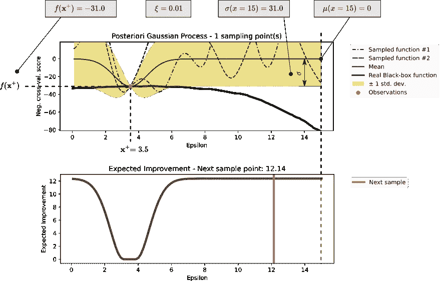

作者图片

# 目录

- [简介](#5241)

- [网格搜索与贝叶斯优化](#9dda)

*   [支持向量回归——工作原理](#7096)
*   [车型性能评估](#c16b)
*   [寻找最佳超参数设置](#a391)
*   [网格搜索](#0857)
*   [从网格搜索到贝叶斯优化](#b7b7)

- [总结](#dd61)

- [参考文献](#2143)

> 作为事先的一个小备注，本文着重于尽可能直观地解释贝叶斯超参数优化背后的过程。它不包括现有库的应用，也不包括针对特定用例的不同类型的超参数优化方法之间的直接性能比较。

# 介绍

超参数是在实际训练之前设置的参数，用于控制学习过程。决策树要求限制树的最大节点数；多项式回归训练模型的多项式次数；支持向量回归核、正则化参数 c 和容限ϵ.所有这些参数都会影响训练过程，从而影响最终模型的性能。

对最优超参数的搜索被称为超参数优化，即搜索训练模型对给定数据集表现出最佳性能的超参数组合。流行的方法有网格搜索、随机搜索和贝叶斯优化。本文解释了这些方法之间的差异，并重点介绍了贝叶斯优化。在大多数情况下，选择正确优化方法的决定性因素是评估各种不同超参数设置所需的计算工作量。

如果我们想知道结果模型对于特定超参数组合的表现如何，我们别无选择，只能使用数据集的一个子集来构建模型，并使用第二个子集来评估它。算法、选定的超参数设置和数据集的大小决定了模型构建过程的计算开销。对于所谓的“昂贵的”优化过程，超越“简单的”试错原则是值得的。

为了便于说明，考虑一个简单的回归问题，我们希望使用多项式回归来解决这个问题。在第一步中，我们选择对我们来说似乎合理的超参数的设置(例如，基于先验知识)。使用多项式次数小于 10 的多项式回归模型可以很好地解决工程中的大多数回归问题。像这样的先验知识可以用来预先缩小超参数空间。

对于以下评估，我们将超参数空间设置为 1–20 之间的多项式次数。为了确保我们在定义的超参数空间中识别最佳超参数值，我们可以简单地为该范围内的每个值建立模型并评估它。在回归中，我们通常比较模型的预测值与测试值的绝对误差或平方误差。下面更详细地解释了各个评估步骤。

使用 for 循环，我们可以对每个可能的超参数执行以下步骤，并将每次运行的结果保存在一个列表中:

1.  使用指定的超参数设置定义多项式回归算法
2.  建立模型(使用训练数据集)
3.  评估模型(使用验证或测试数据集)

然后，我们简单地为我们的模型选择在评估过程中表现出最佳性能的多项式次数。

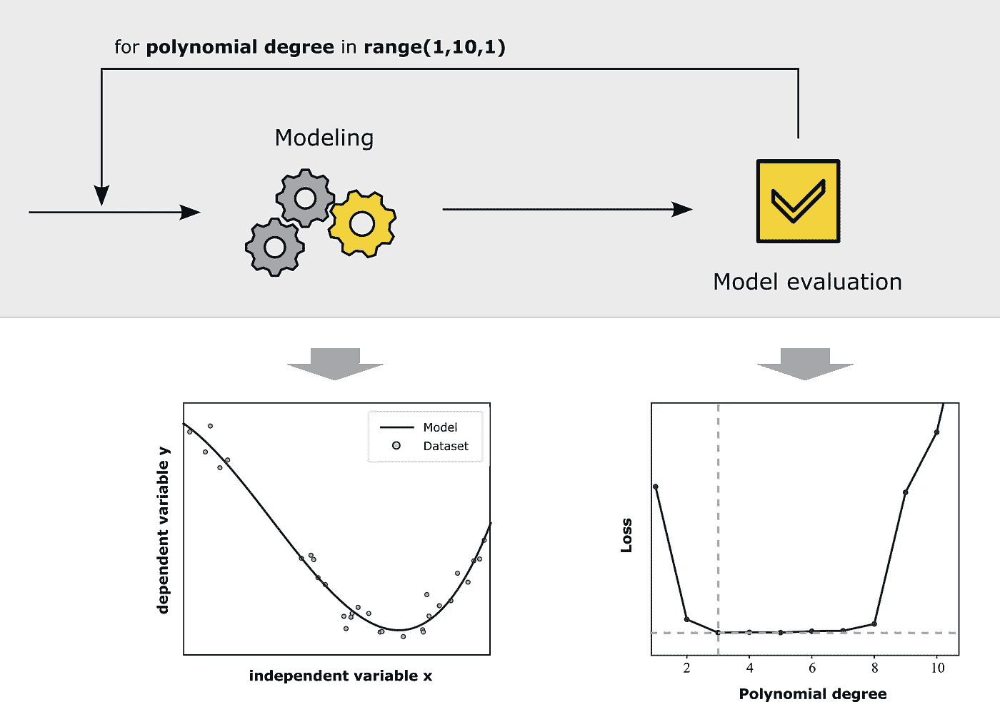

**超参数搜索:简单 for-loop —作者图片**

这种方法对于图像中的小数据集和相对简单的多项式回归模型当然是有效的，但是当数据集和超参数空间很大并且使用计算成本更高的算法时，这种方法会达到其极限。

为了降低寻找最佳超参数设置所需的计算能力，贝叶斯优化使用贝叶斯定理。简单来说，贝叶斯定理用于计算一个事件的概率，基于它与另一个事件的关联[Hel19]。

因此，如果我们知道彼此独立地观察到事件 A 和 B 的概率(所谓的先验概率)和假设 A 为真时事件 B 发生的概率(所谓的条件概率)，我们能够计算假设 B 为真时事件 A 发生的概率(条件概率)，如下所示:

贝叶斯定理的一个普遍应用是疾病检测。对于快速检测，人们感兴趣的是被检测为阳性的人实际上患有该疾病的实际概率有多高。[Fah16]

在超参数优化的背景下，我们希望预测定义的超参数空间中任何可能的超参数组合的损失值的概率分布。在损失函数的一些计算的“真实”值的帮助下，我们想要在整个超参数空间上对损失函数的函数进行建模——得到的模型函数是所谓的**代理函数**。对于我们的示例，我们可以计算多项式次数为 2、8 和 16 的最终损失，并使用回归分析来训练一个函数，该函数在从 1 到 20 的整个超参数空间上逼近损失。

该图示出了后验高斯过程的示例。用于训练的数据集由真实函数的 10 个已知点组成。

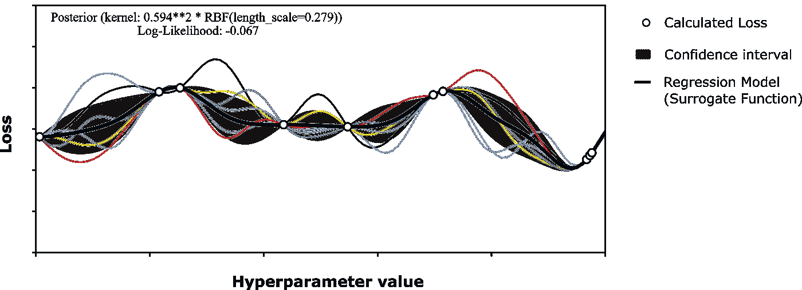

**后验高斯过程示例—作者图片**

在高斯过程回归中，得到的模型不仅提供了真实函数(高斯过程的均值函数)的近似值，还提供了每个 x 的模型不确定性(协方差)的测量值。简而言之，函数中某一点的标准偏差(此处为灰色背景)越小，模型就越确定平均值(此处为黑色曲线)代表真实损失值的良好近似值。如果想要提高近似的准确性，我们可以简单地增加训练数据集的大小。由于我们可以专门选择一些超参数组合，并计算模型的最终损失，因此首先考虑什么样的采样点可能会导致最高的模型改进是值得的。寻找下一个采样点的一种流行方法，是使用模型的不确定性作为决策的基础。

这些和类似的考虑被映射到一个**采集函数**，它是选择下一个采样点的基础。

本文的以下部分将使用支持向量回归一步一步地说明这个简要概述的过程。

# 网格搜索与贝叶斯优化

为了能够用一个更现实的例子一步一步地解释刚刚描述的概念，我使用波士顿住房数据，并利用支持向量回归算法建立一个模型，该模型近似计算以下各项之间的相关性:

**目标变量:**MEDV——以千美元为单位的自有住房的中值

**独立变量:** LSTAT — %人口的较低状态

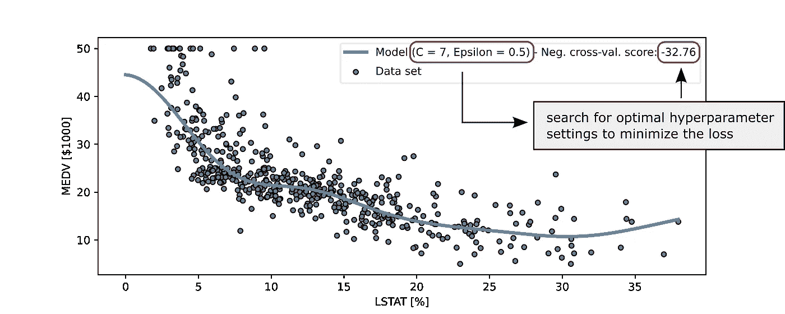

**波斯顿房屋数据集—图片由作者提供(数据:[CST79])**

因此，目标是找到超参数设置，由此产生的回归模型显示手头数据集的最佳可能表示。

# 支持向量回归——工作原理

为了能够理解下面的超参数优化步骤，我将简要描述支持向量回归，它是如何工作的以及相关的超参数。如果你熟悉支持向量回归，可以跳过下面的部分。

支持向量回归(SVR)的 P_xi 功能基于支持向量机(SVM)。基本上，我们在寻找线性函数:

x⟩·⟨w 描述了叉积。SV 回归的目标是找到一条直线作为数据点的模型，而直线的参数应该以直线尽可能“平坦”的方式定义。这可以通过最小化规范来实现

对于模型建立过程，只要数据点在定义的范围内(-ϵ到+ϵ). ),数据点离建模的直线有多远并不重要不允许偏差超过规定的ϵ限值。

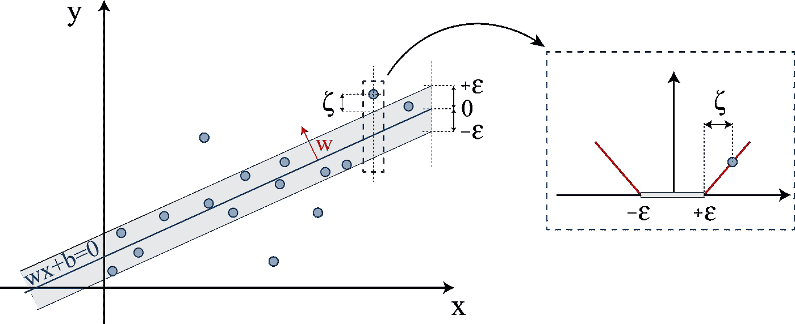

**线性 SVM 的软边际损失设置—图片由作者提供(受[Smo04]启发)**

上图描述了使用线性损失函数对超过ϵ量的偏差的“惩罚”。损失函数称为核。除了线性核，多项式或 RBF 核也经常被使用。因此，根据 Vapnik 的公式如下:

# 模型性能评估

为了评估各种超参数设置的模型性能，需要定义合适的损失函数。回归问题中常用的成本函数 L(f，x，y)是**均方误差(MSE)** :

其中 f=A(D)表示算法 A 在训练数据集 D=z_1，z_2，…，z_k 上训练时返回的函数/模型。z 描述了用于训练模型 f=A(D)的训练数据集的实例。变量 x 描述了超参数。y 是被预测变量的观测值。就超参数优化而言，观察值是计算的损失(例如均方误差)。

机器学习估计器的性能取决于用于训练和验证的超参数和数据集。这就是为什么我们通常不只是选择数据集的一部分作为训练集，另一部分作为测试集，并计算测试数据集的每次观察的 MSE。

为了至少减轻这种对性能评估的影响并获得更一般化的评估，在下文中使用了统计程序 K-fold 交叉验证(CV)。

因此，数据集被分成 K 个子集。然后，k1 子集被用作训练数据集，一个用于验证。建立模型后，计算验证数据集的 MSE。重复这个过程，直到每个子集都被用作一个验证数据集。

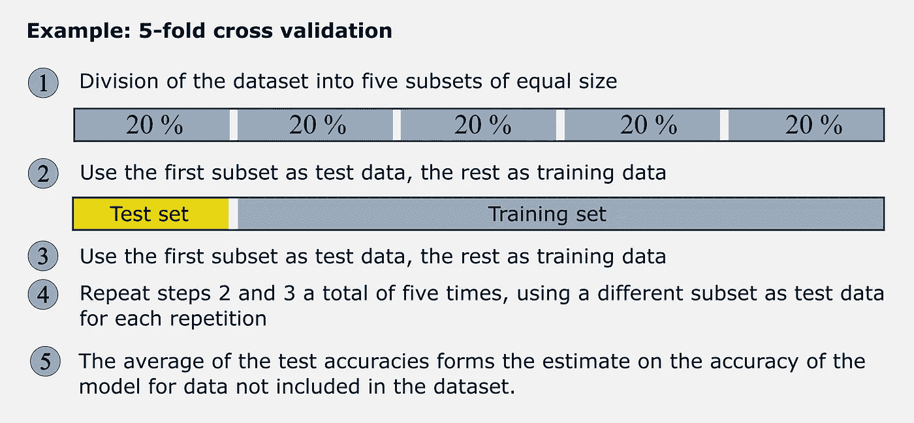

**交叉验证说明—图片由作者提供**

因此，在交叉验证的过程中形成并评估 K 模型。交叉验证分数通常计算为单个均方差的平均值。

如果您使用 sklearn 模块**sk learn . model _ selection . cross _ val _ score**并希望使用 MSE 作为评分参数，您会注意到只能选择取反的 MSE。这是由于在所有情况下都试图最大化分数的统一惯例。因此，成本函数总是被否定。

因此，负交叉验证分数的函数代表数学优化问题的**目标函数**。目标是识别最佳超参数设置，即训练模型表现出最佳性能的超参数值(即负交叉验证分数最大)。

**目标函数:**数学优化问题的目标函数是应该最小化或最大化的实值函数。

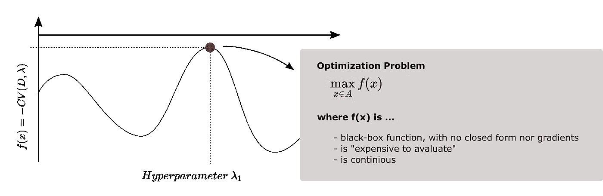

**优化问题——图片作者**

因为我们不知道 f(x)在第一时刻的解析形式，所以我们说一个所谓的黑箱函数。黑盒功能是一个内部工作未知的系统。像晶体管、引擎和人脑这样的系统通常被描述为黑箱系统。

在我们的情况下，超参数表示函数的输入参数，只有它不直接知道它如何影响例如交叉验证分数。函数上的每一点都必须经过或多或少的精心计算。

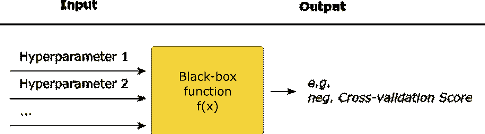

**黑盒功能——作者图片**

# 寻找最佳超参数设置

为了找到最佳的超参数设置，我们可以从理论上计算每个可能的超参数组合的交叉验证分数，并最终选择在评估中表现出最佳性能的超参数。

下图显示了超参数空间ε= 0.116 的程序，其中 C 始终取值 7。

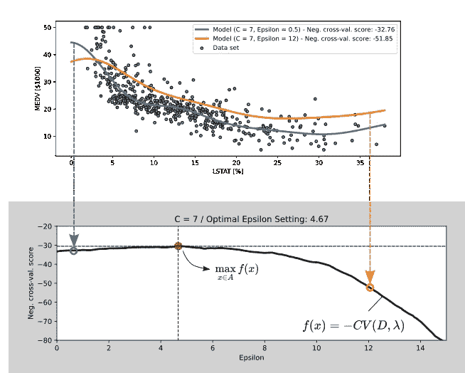

**不同超参数设置的黑盒函数示例计算—图片由作者提供**

超参数优化过程“网格搜索”根据此程序工作。因此，我们用每个计算步骤一点一点地近似建立函数。

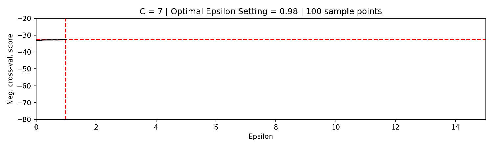

**逐步建立黑盒函数——作者图片**

因此，在所考虑的范围内，我们实际上有多接近最优值，决定性地取决于步长(网的细度)。然而，如果我们选择非常小的步长，具有许多超参数、大的数据集，并且还可能使用根据计算相对密集的原理运行的算法，则搜索最佳超参数所需的计算工作量可能会快速增加。

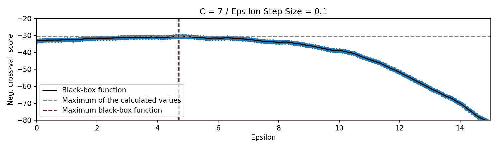

**使用不同步长计算的黑盒—图片由作者提供**

# 网格搜索

如下图所示，我们在超参数空间上定义了一个“网格”。如果我们认为核此刻是固定的，则产生下面的二维超参数空间。(C_min=1，C_max=50，ϵ_min=1，ϵ_max=30，步长=1)

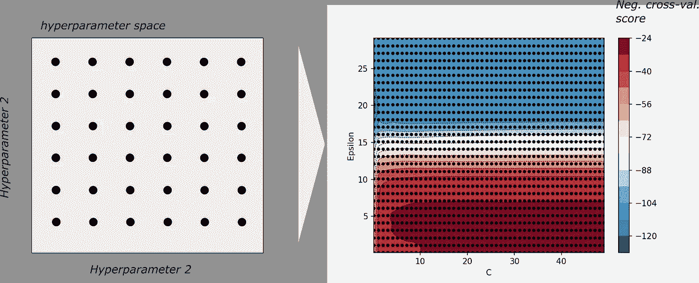

**网格搜索插图——作者图片**

该图已经示出了所选超参数空间中的最优值必须大约位于右下部分。

右图中的点表示研究的超参数组合。对于所示示例，评估了 1500 个超参数组合。由于我们使用交叉验证进行评估，5 重交叉验证会产生 1500 x 5=7500 个必须构建和评估的模型。

尽管我们为这个例子选择了非常高的粒度，但是具有 3、4 或 5 个超参数的算法仍然需要巨大的计算能力。

# 从网格搜索到贝叶斯优化

基本上是一种有效的方法，但如果是在谈论所谓的“昂贵的”黑盒函数，使用替代的超参数优化方法是值得的[案例 13]。

“高成本”和“低成本”之间的区别通常基于评估所需的时间、所需的计算能力和/或所需的资本投资。

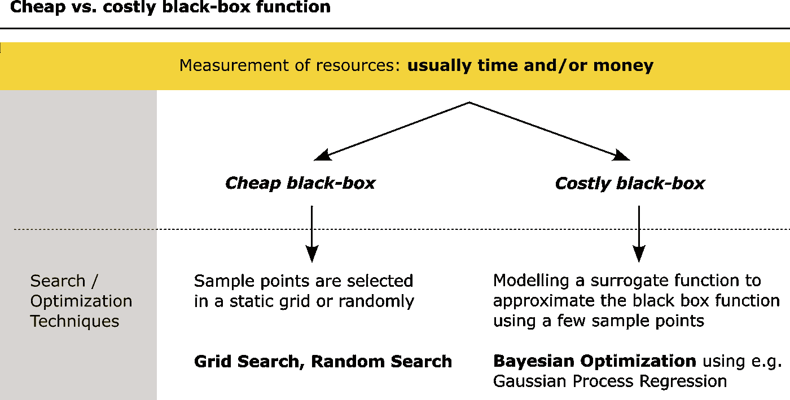

**廉价与昂贵的黑盒功能——图片由作者提供**

计算黑盒函数所需的计算工作量取决于各种因素，例如超参数空间的维度、所选算法的工作方式以及随后对所形成模型的评估。

如果可用的计算能力有限，并且超参数组合已经需要几秒或几分钟，那么寻找减少所需数据点数量的解决方案可能是有意义的。

贝叶斯优化为此引入了代理函数。在这种情况下，代理函数是一个计算的回归模型，它应该在几个采样点的基础上近似真实的黑盒函数。

基本上，在贝叶斯优化中，我们试图逐步减少模型的不确定性，计算每个额外的采样点，通常专注于函数的全局最大值可能位于的区域。

听起来这本身是一个非常有效的方法，尽管人们必须考虑到这个过程也会导致额外的计算工作，并且不能总是实现黑盒函数的充分复制。与任何其他回归问题一样，一个足够好的模型的形成不能想当然。当网格搜索以模型性能的评估结束时，贝叶斯超参数优化另外计算代理和获取函数。

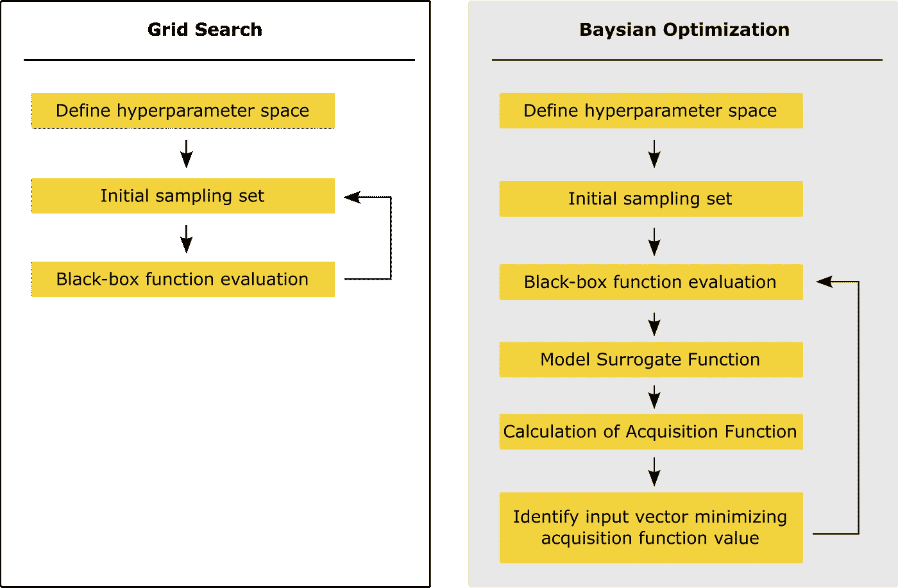

**评估步骤:网格搜索与贝叶斯优化—作者图片**

## 替代函数——高斯过程回归

如上所述，目标是通过使用较少的计算点找到尽可能接近黑盒函数的替代函数。

超参数优化中最著名的替代函数是高斯过程，或者更准确地说是高斯过程回归。关于高斯过程回归如何工作的更详细的解释可以在 Carl Edward Rasmussen 和 Christopher K. I. Williams 所著的“Gaussian Processes for Machine Learning”中找到，该书可以从以下网址免费获得:

[www.gaussianprocess.org](http://www.gaussianprocess.org/gpml/chapters/)

或者看看我以前的一篇描述 GP 回归如何工作的文章:

[关于最常用的回归算法以及如何选择正确的算法](/7-of-the-most-commonly-used-regression-algorithms-and-how-to-choose-the-right-one-fc3c8890f9e3)

简而言之，高斯过程回归定义了已经包括真实函数的先验知识的先验高斯过程。对给定数据集的训练导致后验高斯过程。

为了计算一个第一后验高斯过程，我们需要一个计算出的样本点的真正黑箱函数。使用这个计算出的“支撑点”，我们已经可以建立第一个 GP 回归模型。

因为我们通常没有关于黑盒函数看起来如何的先验知识，所以我们为先验高斯过程选择均值函数，该均值函数是与 x 轴(y=0)平行的直线。作为核，我们使用最常用的核之一，径向基函数(RBF)。由于我们通过直接计算采样点来假设该点(此处为红色)是“真实”黑盒函数的一部分，因此在计算点的位置会产生一个协方差为零的结果。在该图中，模型不确定性的水平通过标准偏差可视化，并以灰色突出显示。通过了解真实函数的各个数据点，函数的可能过程逐渐缩小。

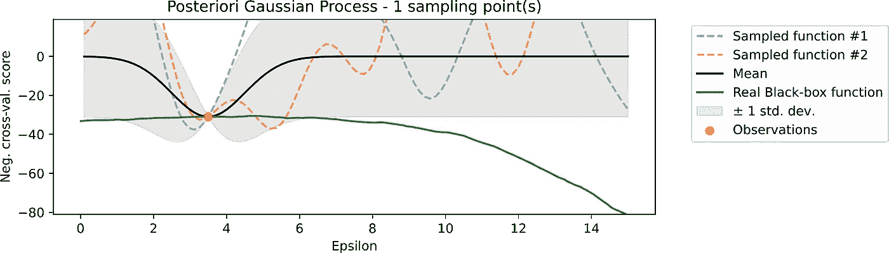

**后验高斯过程——作者图片**

正是这种对模型不确定性的度量，我们在下文中用来确定“最佳可能”的下一个采样点。如上所述，在这种情况下，我们可以自由选择下一个计算步骤。为此，我们引入了一个所谓的采集功能。

## 获取功能

超参数优化中最流行的采集函数是**预期改善(EI)** 。进一步的获取函数是“改进概率”、“知识梯度”、“熵搜索”或“预测熵”。

EI 定义如下[Kra18][Jon98][Uai18][Has19]:

在哪里

和

*   μ:是由高斯过程定义的分布的平均值
*   σ:是高斯过程定义的分布的标准偏差
*   φ():是标准的正态累积密度函数(cdf)
*   ϕ():是标准的正态概率密度函数
*   ξ:是一个探测参数

对于说明性的例子，在第一步中，我们选择一个随机采样集，为其确定黑盒函数的值。对于这个例子，我们只为第一步选择一个采样点，并对其拟合第一高斯过程回归模型。由于我们假设没有噪声，采样点区域的协方差变为零，回归线的平均值直接穿过该点。在该点的右侧和左侧，协方差增加，模型的不确定性也随之增加。

利用上面的公式，我们现在计算超参数空间的获取函数。f(x+)描述了到目前为止计算的所有样本点的最大值。由于我们只计算了图中的一个点，f(x+)是所选样本点的函数值，此处为 31.0-31.0。σ和μ由高斯过程回归模型描述。在图中，可以看到 x = 15 位置的两个值。

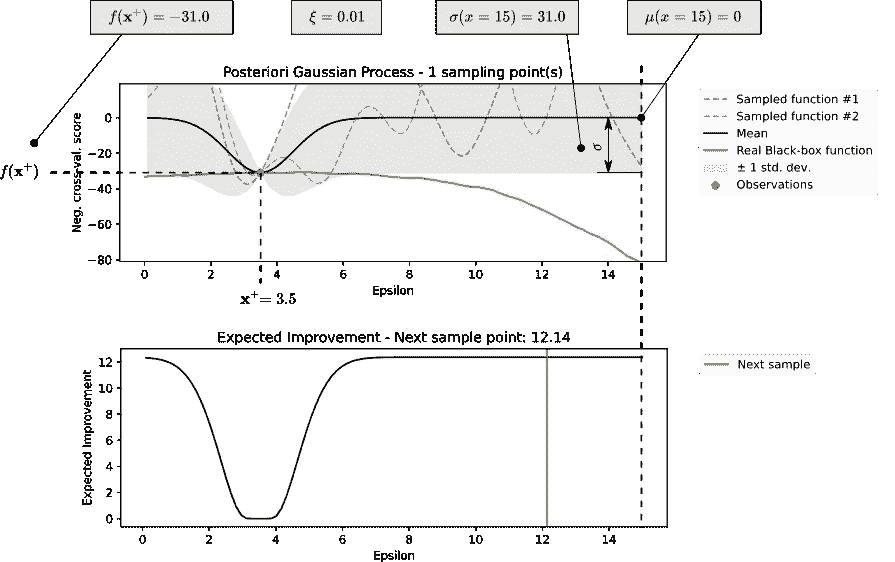

**后验高斯过程——作者图片**

如果我们现在更仔细地观察这个公式，我们会注意到 EI 由两部分组成:

*   左边部分描述了高斯过程回归模型的平均值和最大值之间的差异。所有采样点的 f(x)值
*   正确的部分，使用标准差的模型的不确定性

两部分如何加权取决于 CDF(Z)和 PDF(Z)。如果 f(x+)和μ之间的差异比回归模型的标准偏差大，则 CDF(Z)趋向于 1，PDF(Z)趋向于 0。这意味着到目前为止，模型的平均值明显高于采样点的最大值 f(x+)的区域权重更大。可以自由设置探测参数，从而在一定程度上控制权重。

这里提到了**勘探**和**开采**之间的权衡，这反映在两个术语成分上:

1.  探索性:选择函数上当前模型显示最大不确定性的点(探索搜索空间的其他部分，希望找到其他有希望的区域[Leh13])
2.  开发性:选择现在显示最大价值的点，并更密切地探索该区域

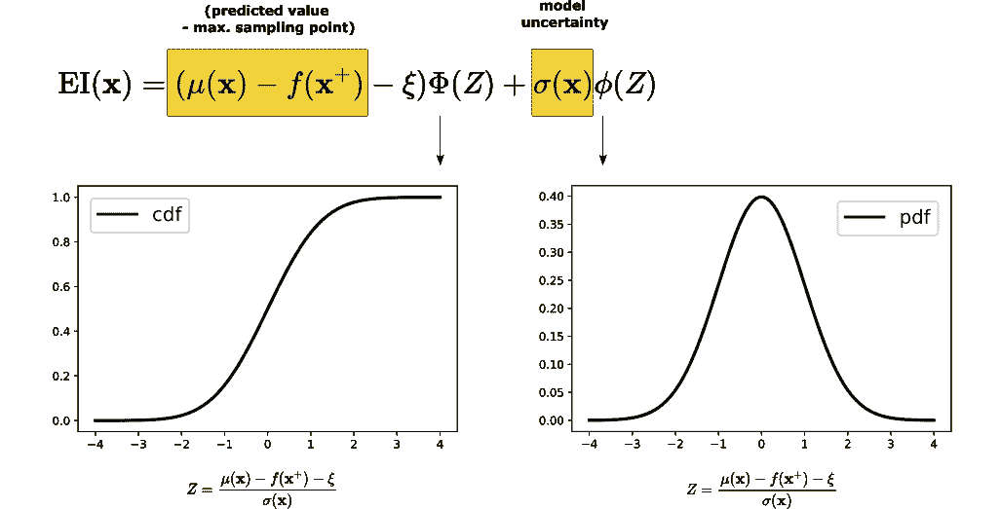

**后验高斯过程——作者图片**

在计算获取函数之后，我们简单地识别 EI 最大的超参数值 x(这里:超参数ε),并计算黑盒函数值(这里:neg)。十字谷。分数)。然后，我们再次执行采集函数的计算，并为下一次迭代识别采样点。

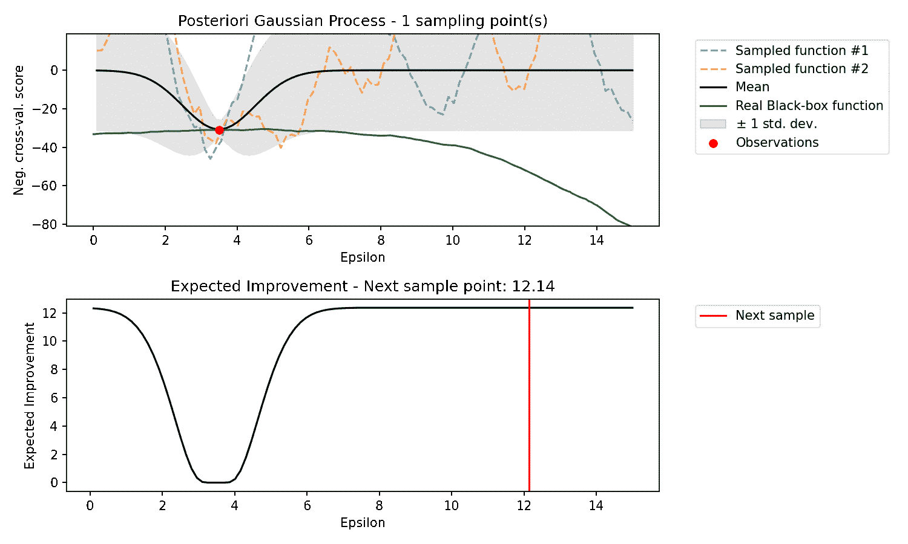

**贝叶斯逐步优化—图片由作者提供**

# 摘要

本文讨论贝叶斯超参数优化，并解释它如何通过减少所需的样本点从而减少计算量来帮助更有效地找到最佳超参数设置。

这篇文章并没有声称代表了贝叶斯优化的全貌。既没有涉及到 scikit-optimizer 或**hyperpt**等库的实际应用，也没有涉及到不同优化方法在具体应用实例上的比较。

本文的目的是尽可能简单易懂地介绍贝叶斯超参数优化的基本功能。通过这样做，这篇文章强调了贝叶斯超参数优化与网格搜索等其他方法的不同之处。

如果你喜欢这篇文章，请随意查看我的另一篇文章，它解释了各种回归技术、异常检测方法等。：

 [## 7 种最常用的回归算法以及如何选择正确的算法

### 线性和多项式回归、RANSAC、决策树、随机森林、高斯过程和支持向量回归

towardsdatascience.com](/7-of-the-most-commonly-used-regression-algorithms-and-how-to-choose-the-right-one-fc3c8890f9e3)  [## 异常检测多样化领域的初学者综合指南

### 隔离森林，局部异常因子，一类 SVM，自动编码器，稳健协方差估计和时间序列…

towardsdatascience.com](/a-comprehensive-beginners-guide-to-the-diverse-field-of-anomaly-detection-8c818d153995) 

如果您还不是中级高级会员并打算成为会员，您可以通过以下推荐链接注册来支持我:

【https://dmnkplzr.medium.com/membership 

感谢您的阅读！

# 参考

【AGN 20】Agnihotri，Apoorv 巴特拉，尼蓬。探索贝叶斯优化。https://distill.pub/2020/bayesian-optimization/.2020 年。
[Bur98] Burges，C. J. C 考夫曼湖；斯莫拉，A. J。支持向量回归机。1998.网址[http://papers . nips . cc/paper/1238-support-vector-regression-machines . PD fine](http://papers.nips.cc/paper/1238-support-vector-regression-machines.pdfine)
【cas 13】卡西洛，安德里亚。黑盒优化教程。[https://www . lix . poly technique . fr/~ dambrosio/black box _ material/cassi oli _ 1 . pdf .](https://www.lix.polytechnique.fr/~dambrosio/blackbox_material/Cassioli_1.pdf.)2013。美国人口普查局。[https://www . cs . Toronto . edu/~ delve/data/Boston/Boston detail . html](https://www.cs.toronto.edu/~delve/data/boston/bostonDetail.html)
【fah 16】Fahrmeir，l；霍伊曼角；Künstler，r . Statistik:Weg zur 数据分析。施普林格-莱尔布奇。柏林和海德堡，8。，2016 年。ISBN 978–3–662 50371–3。doi:10.1007/978–3–662–50372–0
[has 19]使用高斯过程的贝叶斯超参数优化。2018.[https://Brendan hasz . github . io/2019/03/28/hyperparameter-optimization . html # hyperparameter-optimization](https://brendanhasz.github.io/2019/03/28/hyperparameter-optimization.html#hyperparameter-optimization)
【hel 19】Helmenstine，Anne Marie。贝叶斯定理的定义和例子。[https://www.thoughtco.com/bayes-theorem-4155845.](https://www.thoughtco.com/bayes-theorem-4155845.)2019。
【Jon 98】Jones，D.R .，Schonlau，M. & Welch，W.J .昂贵的黑盒函数的有效全局优化。全局优化杂志
【kra 18】马丁·克拉瑟。贝叶斯优化。http://krasserm.github.io/2018/03/21/bayesian-optimization/T22【莱赫 13】莱赫蒂赫特阁下。[https://www . research gate . net/post/What _ is _ the _ difference _ between _ exploration _ vs _ exploitation _ 集约化 _ vs _ 多样化 _ and _ global _ search _ vs _ local _ search](https://www.researchgate.net/post/What_is_the_difference_between_exploration_vs_exploitation_intensification_vs_diversification_and_global_search_vs_local_search)【sci 18】si cotte，Xavier。交叉验证估计量。https://stats . stack exchange . com/questions/365224/cross-validation-and-confidence-interval-of-the-true-error/365231 # 365231。2018
【smo 04】斯莫拉，A. J 支持向量回归教程。统计与计算，14(3):199–222，2004。ISSN 0960–3174。doi:10.1023/B:STCO。0000035301.49549.8849549.UAI 2018。[https://www.youtube.com/watch?v=C5nqEHpdyoE.](https://www.youtube.com/watch?v=C5nqEHpdyoE.)2018。
【Yu12】于，h；金，SVM 教程-分类，回归和排名。g .罗森博格；t .贝克；自然计算手册，479–506。施普林格柏林海德堡，柏林，海德堡，2012。ISBN 978–3–540–92909–3。华盛顿大学。[https://sites.math.washington.edu/.](https://sites.math.washington.edu/.)2021。