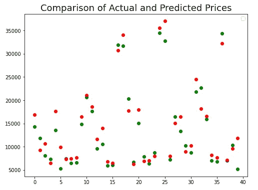

# 在 TensorFlow 中开发多输出模型的分步教程

> 原文：<https://towardsdatascience.com/a-step-by-step-tutorial-to-develop-a-multi-output-model-in-tensorflow-ec9f13e5979c>


Pavel Neznanov 在 [Unsplash](https://unsplash.com?utm_source=medium&utm_medium=referral) 上拍摄的照片

## 有完整的代码

我以前写过几篇关于 TensorFlow 的教程，其中包括顺序和函数 API 模型、卷积神经网络、强化神经网络等。在本文中，我们将使用 Functional API 处理一个模型，但是它将使用一个模型预测两个输出。

如果你已经知道函数式 API 是如何工作的，对你来说应该很简单。如果您需要关于函数式 API 的教程或复习，这篇文章应该会有所帮助:

<https://regenerativetoday.com/regression-in-tensorflow-using-both-sequential-and-function-apis/>  

让我们深入教程。首先导入必要的包:

```
import tensorflow as tf
from tensorflow.keras.models import Model
from tensorflow.keras.layers import Dense, Inputimport numpy as np
import matplotlib.pyplot as plt
import pandas as pd
from sklearn.model_selection import train_test_split
from sklearn.metrics import confusion_matrix
import itertools
```

我使用一个名为 auto_clean 的公共数据集。请随意从该链接下载数据集。**这是一个免费的公共数据集。**

<https://datahub.io/machine-learning/autos#resource-autos>  

首先，用 auto_clean.csv 数据创建一个 pandas 数据框架:

```
df = pd.read_csv('auto_clean.csv')
```

数据集有 201 行和 29 列。这些是列:

```
df.columns
```

输出:

```
Index(['symboling', 'normalized-losses', 'make', 'aspiration', 'num-of-doors', 'body-style', 'drive-wheels', 'engine-location', 'wheel-base', 'length', 'width', 'height', 'curb-weight', 'engine-type', 'num-of-cylinders', 'engine-size', 'fuel-system', 'bore', 'stroke', 'compression-ratio', 'horsepower', 'peak-rpm', 'city-mpg', 'highway-mpg', 'price', 'city-L/100km', 'horsepower-binned', 'diesel', 'gas'], dtype='object')
```

数据集有一些空值，在本教程中，我将简单地删除有空值的行。有几种不同的方法来处理空值。请随意自己尝试一下。

```
df = df.dropna()
```

现在，数据集有 196 行数据，这不是很多，但让我们看看我们可以用它做什么。

由于这是一个多输出模型，**我选择气缸数和价格作为目标变量。**这里，气缸数量是一个分类变量，价格是一个连续变量。你也可以选择两个分类变量或者两个连续变量。

## 数据准备

对于数据准备，首先，我们需要将分类变量转换为数值。这是我遵循的程序。

找出数据帧中的数字列:

```
num_columns = df.select_dtypes(include=np.number).columns
num_columns
```

输出:

```
Index(['symboling', 'normalized-losses', 'wheel-base', 'length', 'width', 'height', 'curb-weight', 'engine-size', 'bore', 'stroke', 'compression-ratio', 'horsepower', 'peak-rpm', 'city-mpg', 'highway-mpg', 'price', 'city-L/100km', 'diesel', 'gas'], dtype='object')
```

上面的输出显示了数字列名。我们需要将其余的列转换成数字。

```
cat_columns = []
for col in df.columns:
    if col not in num_columns:
        cat_columns.append(col)
cat_columns
```

输出:

```
['make',
 'aspiration',
 'num-of-doors',
 'body-style',
 'drive-wheels',
 'engine-location',
 'engine-type',
 'num-of-cylinders',
 'fuel-system',
 'horsepower-binned']
```

下面是我如何将这些列转换成数字的:

```
for cc in cat_columns:
    df[cc] = pd.Categorical(df[cc])
    df[cc] = df[cc].cat.codes
```

这个项目的资料准备就是这么做的。

## 数据分割

对于模型定型，我们不会使用数据集中的所有数据。20%的数据将保留用于验证，20%将用于测试模型的性能。为此，我使用了 scikit-learn 库中的 train_test_split 方法:

```
train, test = train_test_split(df, test_size=0.2, random_state=2)
train, val = train_test_split(train, test_size=0.2, random_state=23)
```

我将把我们的两个输出变量分开，用它们组成一个 NumPy 数组。

该函数将完成以下任务:

```
def output_form(data):
    price = data.pop('price')
    price = np.array(price)
    noc = data.pop('num-of-cylinders')
    noc = np.array(noc)
    return (price, noc)
```

让我们使用这个函数来训练、测试和验证数据:

```
train_y = output_form(train)
test_y = output_form(test)
val_y = output_form(val)
```

将数据标准化是一个很好的做法。因为数据中的不同变量可以在不同的数据范围内。因此，我将使用 describe 函数，它给出所有变量的计数、平均值、标准差、最小值、第 25、第 50 和第 75 百分位以及最大值。由此，平均值和标准差将用于标准化数据:

```
train_stats = train_stats.transpose()
def norm(x):
    return (x - train_stats['mean']) / train_stats['std']
```

我们有“norm”函数来标准化数据。

```
train_x = norm(train)
test_x = norm(test)
val_x = norm(val)
```

我们应该从输入特征中删除目标变量。我们以前可以这样做的。但是让我们现在就开始吧:

```
train_x = train_x.drop(columns=['price', 'num-of-cylinders'])
test_x = test_x.drop(columns=['price', 'num-of-cylinders'])
val_x = val_x.drop(columns=['price', 'num-of-cylinders'])
```

我们已经为模型准备好了特征和输出变量。

## 模型开发

我们将使用两个函数进行模型开发。基础模型将仅定义密集图层，最终模型将向基础模型添加输出图层。

```
def base_model(inputs):
    x= Dense(500, activation='tanh')(inputs)
    x= Dense(500, activation='tanh')(x)
    x= Dense(300, activation='tanh')(x)
    x= Dense(300, activation='tanh')(x)
    x= Dense(300, activation='tanh')(x)
    x= Dense(300, activation='tanh')(x)
    x= Dense(150, activation='tanh')(x)
    x= Dense(150, activation='tanh')(x)
    return xdef final_model(inputs):
    x = base_model(inputs)
    price = Dense(units='1', name='price')(x)

    noc = Dense(units = '5', activation = 'sigmoid', name = 'noc')(x)

    model = Model(inputs=inputs, outputs = [price, noc])

    return model
```

那是我们的模型。现在，训练模型，当然还有测试。

## 培训和测试

对于训练，需要定义输入和优化器。我将为这个模型和默认的学习率使用 adam optimizer。请随意尝试任何其他优化和一些不同的学习率。

```
inputs = tf.keras.layers.Input(shape=(27,))
```

现在，将此输入传递给模型:

```
model = final_model(inputs)
```

对于模型编译，对于两个输出变量，将有两个损失函数和两个精度度量。这里的术语“noc”指的是“气缸数量”。

```
model.compile(optimizer='adam', 
             loss = {'price': 'binary_crossentropy',
                    'noc': 'mse'},
             metrics={'price': tf.keras.metrics.RootMeanSquaredError(),
                     'noc': 'accuracy'})
```

训练模型的一切都准备好了。训练开始了。我训练了 400 个纪元的模型。

```
history = model.fit(train_x, train_y, 
                   epochs=400, validation_data=(val_x, val_y))
```

以下是最近三个时期的结果:

```
Epoch 398/400
4/4 [==============================] - 0s 11ms/step - loss: 390353.6250 - price_loss: 390342.9688 - noc_loss: 10.6905 - price_root_mean_squared_error: 624.7744 - noc_accuracy: 0.7097 - val_loss: 8178957.5000 - val_price_loss: 8178956.0000 - val_noc_loss: 1.6701 - val_price_root_mean_squared_error: 2859.8875 - val_noc_accuracy: 0.9062
Epoch 399/400
4/4 [==============================] - 0s 12ms/step - loss: 424782.6250 - price_loss: 424775.5625 - noc_loss: 7.0919 - price_root_mean_squared_error: 651.7481 - noc_accuracy: 0.6935 - val_loss: 8497714.0000 - val_price_loss: 8497707.0000 - val_noc_loss: 7.1780 - val_price_root_mean_squared_error: 2915.0828 - val_noc_accuracy: 0.8125
Epoch 400/400
4/4 [==============================] - 0s 11ms/step - loss: 351160.1875 - price_loss: 351145.4062 - noc_loss: 14.7626 - price_root_mean_squared_error: 592.5753 - noc_accuracy: 0.7258 - val_loss: 8427407.0000 - val_price_loss: 8427401.0000 - val_noc_loss: 5.7305 - val_price_root_mean_squared_error: 2902.9985 - val_noc_accuracy: 0.9062
```

从上面的结果可以看出，在最后一个时期之后,“气缸数量”的训练精度为 72.58%，验证精度为 90.62%。

> 虽然看到验证准确性比训练准确性高得多可能看起来有点滑稽，但我们应该记住，数据集非常小，验证数据集只有 20%。

我在这里打印最终的损耗和准确度指标:

```
loss, price_loss, noc_loss, price_root_mean_squared_error, noc_accuracy = model.evaluate(x=val_x, y=val_y)print()
print(f'loss: {loss}')
print(f'price_loss: {price_loss}')
print(f'noc_loss: {noc_loss}')
print(f'price_root_mean_squared_error: {price_root_mean_squared_error}')
print(f'noc_accuracy: {noc_accuracy}')
```

输出:

```
1/1 [==============================] - 0s 18ms/step - loss: 8427407.0000 - price_loss: 8427401.0000 - noc_loss: 5.7305 - price_root_mean_squared_error: 2902.9985 - noc_accuracy: 0.9062

loss: 8427407.0
price_loss: 8427401.0
noc_loss: 5.730476379394531
price_root_mean_squared_error: 2902.99853515625
noc_accuracy: 0.90625
```

## 估价

我们使用训练和验证数据来训练模型。模型从未见过测试数据集。因此，我们将使用测试数据集进行评估。通常，预测函数用于预测任何数据的输出。

```
predictions=model.predict(test_x)
```

因为我们有两个输出，所以我们可以从如下预测中访问价格预测和 no _ of _ clinders:

```
price_pred = predictions[0]
noc_pred = predictions[1]
```

“气缸数量”的准确率是明确的，但对于价格，没有准确率，因为这是一个连续的变量。价格均方根误差看起来很合理。视觉解读可能会很有趣。

下图显示了同一图中的实际价格和预测价格:

```
plt.figure(figsize=(8, 6))
plt.scatter(range(len(price_pred)), price_pred.flatten(), color='green')
plt.scatter(range(len(price_pred)), test_y[0], color='red')
plt.legend()
plt.title("Comparison of Actual and Predicted Prices", fontsize=18)
plt.show()
```



我认为预测比较接近实际情况。请随意使用其他评估方法来评估模型。我的重点是制作一个关于多输出模型的教程。

## 结论

我希望这个教程是有帮助的，你将能够在你的工作或学术项目中使用它。我在这个模型中使用了两个输出变量。如果你有一个更复杂的数据集，请对两个以上的变量自由尝试这种方法。

欢迎在推特上关注我，喜欢我的 T2 脸书页面。

## 更多阅读

</a-complete-guide-for-detecting-and-dealing-with-outliers-bad26b1e92b6>  </what-is-a-recurrent-neural-network-and-implementation-of-simplernn-gru-and-lstm-models-in-keras-f7247e97c405>  </developing-a-convolutional-neural-network-model-using-the-unlabeled-image-files-directly-from-the-124180b8f21f>  </20-very-commonly-used-functions-of-pyspark-rdd-90b8271c25b2> 