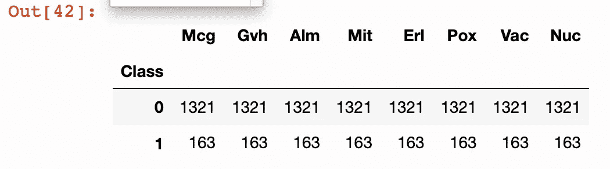
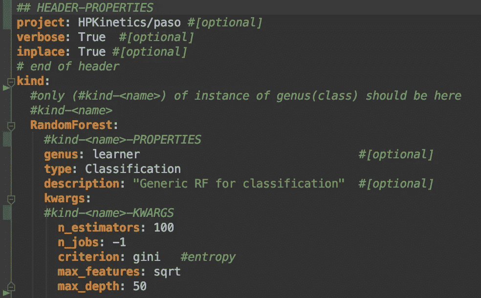
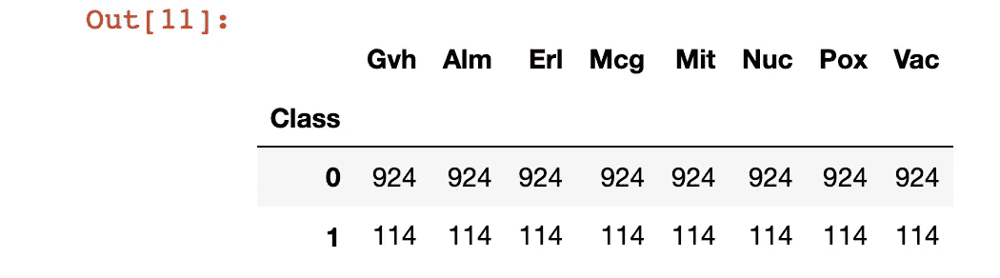
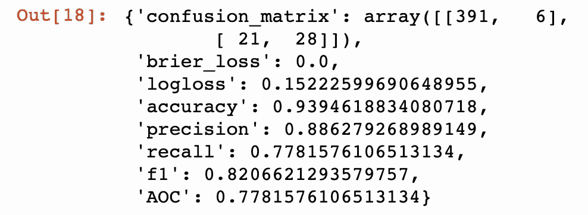
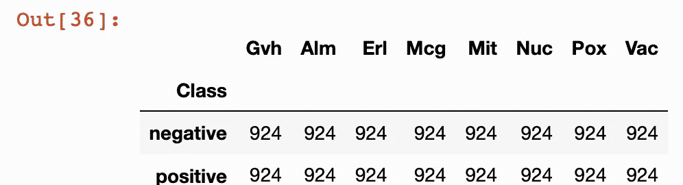
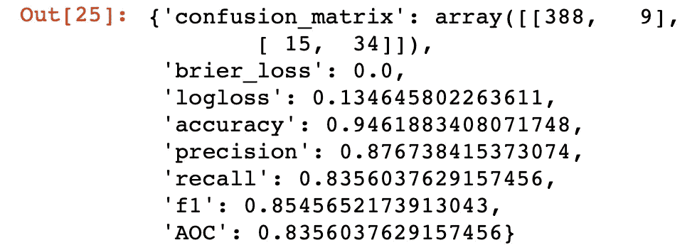
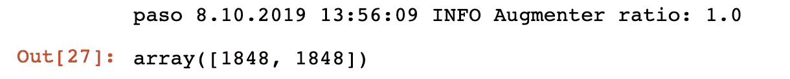
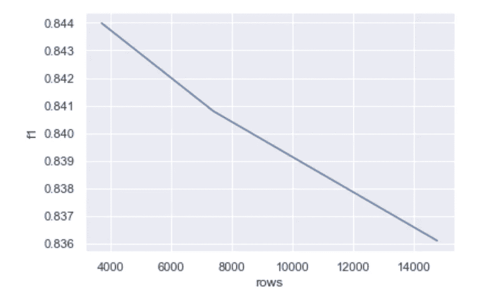

# 平衡和扩充用于分类的结构化数据的分步方法

> 原文：<https://towardsdatascience.com/a-stepped-approach-for-balancing-and-augmenting-structured-data-for-classification-b9602be5a050>

## 阶级不平衡

## 数据扩充从数据集生成模拟数据。我们拥有的数据越多，选择的学习者在分类或预测方面就越好。


平衡各类岩石。由 [Unsplash](https://unsplash.com/s/photos/balancing?utm_source=unsplash&utm_medium=referral&utm_content=creditCopyText) 上的 [Karsten Winegeart](https://unsplash.com/@karsten116?utm_source=unsplash&utm_medium=referral&utm_content=creditCopyText) 拍摄

结构化数据增强很少在理论方法中讨论，也很少出现在现实世界的生产系统中。当它发生时，它被称为类平衡或过采样。

我将展示一种简单的结构化数据扩充方法。在本文的后续文章中，我将演示一个分步过程，它避免了处于过采样技术(如 SMOOT 和 ADASYN)核心的简单 k 均值聚类。

# Paso:数据分类平衡

讨论将分为以下几个主要部分:

*   首先，我们用 Paso 输入器加载一个不平衡的类数据集。
*   其次，我将调查帕索提供的一些班级平衡方法。
*   接下来，我将展示 Paso 中提供的一些结构化数据扩充来自于类平衡方法。
*   然后，我暗示这些方法可能不足以平衡结构化数据的增长。

本文中所有示例的源代码也可以作为一个完整的[笔记本](https://github.com/bcottman/paso/blob/master/lessons/lesson-3.ipynb) (ipynb)获得。

我们可以通过以下方式启动 Paso 服务:

```
from paso.base import Paso,Log,PasoError
from loguru import loggersession = Paso(parameters_filepath='../parameters/default-lesson.3.yaml').startup()
```

# 数据集:yeast3

不平衡数据集是类分布不均匀的分类问题的一种情况。通常，它们由两类组成:多数(消极)类和少数(积极)类。

我选择了 yeast3 数据集，自 20 世纪 90 年代末以来，生物学家和机器学习科学家一直在研究它。可以参考参考文献中的引用来使用:[1，2]它从[https://sci2s.ugr.es/keel/imbalanced.php](https://sci2s.ugr.es/keel/imbalanced.php)下载。

我们将 yeast3 数据集加载到数据集 dataframe 中。要素类将包含类值。

输入 yeast3 的设置代码



该数据集的特征是:

**类:**预测或依赖或目标特征。第 0 类与第 1 类的比例为 8:1。

**Mcg** : McGeoch 的信号序列识别方法。

**Gvh** :冯·海涅的信号序列识别方法。

**Alm**:ALOM 跨膜区预测程序得分。

**Mit** :线粒体和非线粒体蛋白 N 端区域(20 个残基长)氨基酸含量的判别分析得分。

**Erl** :存在“HDEL”子串(被认为是内质网腔内滞留的信号)。二元属性。

**Pox**:C 端的过氧化物酶体靶向信号。

**Vac** :液泡蛋白和胞外蛋白的氨基酸含量判别分析得分。

**Nuc** :细胞核蛋白和非细胞核蛋白核定位信号的判别分析得分。

这些特征是酵母菌株的不同类型的测量。如果您不知道它们的意思，请不要担心，因为这对本文并不重要。

## 描述文件

我将使用一个描述文件，而不是使用代码中的关键字参数。描述的一个有效定义(来自维基百科)是:

"显示主题领域或领域中概念和类别之间的关系."

我们使用描述文件是因为:

*   对象(数据集、模型等)的描述。)改而不改代码；
*   描述文件和 Python 的解析性能大致相同，因为两者都使用动态类型。对于静态类型语言来说，性能问题可能不是问题。然而，在所有情况下，与类实例执行的操作相比，对象的元数据解析计算是微不足道的。
*   描述文件是独立于语言的。它被格式化为 YAML 文件，但也格式化为 JSON 或 XML 文件。



学习者随机森林的描述文件

描述文件由键值对的层次结构组成。在以后的文章中，我将详细介绍描述文件——在[https://github.com/bcottman/paso/tree/master/descriptions](https://github.com/bcottman/paso/tree/master/descriptions)查看不同的描述文件。

# 平衡前先拆分。

在训练学习者之前，我们必须只平衡我们将要训练的数据集。我们想知道平衡数据对学习者的影响，同时不要用增加的数据破坏我们的验证数据集。

验证从初始训练数据集中提取，希望它是测试数据集从训练集剩余部分提取的过去和未来数据的样本。在这种情况下，我们的验证集被引用为 asX_test，y_test。涵盖原始数据集的训练、有效和测试的另一种情况是将初始数据集拆分为训练和验证数据集。然后再分乘一列火车，进行训练和测试。只要第二次分割也在训练数据集中，顺序就无关紧要。这里，训练集将是 70%，验证(测试)集将是原始数据集的 30%。

```
X, y = DataFrame_to_Xy(dataset, inputer.target)
splitter = Splitters(description_filepath=splitter_file)
X_train,X_test, y_train, y_test = splitter.transform(X, y,random_state=11)
train = X_train.copy()
Xy_to_DataFrame(train, y_train, inputer.target)
train.groupby([inputer.target]).count()
```



# 随机森林学习者

在我们平衡类之前，让我们在`yeast3`数据集上运行具有通用分类超参数的随机森林学习器(如上面随机森林的描述文件所示)。

```
from paso.learners.learners import Learners
learner = Learners(description_filepath=learner_file)
learner.train(X_train,y_train)
learner.cross_validate(X_train,y_train,description_filepath=cv_file)learner.evaluate(X_test, y_test)
```



使用 RandomForest 的 yeast3 指标

上面显示了与`0.8207.`的`f1`相当好的拟合，当我们通过过采样平衡类 1 和类 0 时会发生什么？

# 处理不平衡的班级

对于不平衡的类数据，没有必要平衡类。在现实世界中，数据集是实际人口的样本。然而，这种不平衡可能不能准确地代表潜在人口。

此外，平衡可能不会影响底层类的表示，从而更好地适应数据。

也就是说，如果不平衡程度相对较低，应该不会对您的模型性能产生任何重大影响。

在不同的不平衡水平下，采样技术表现不同。

目前有四种不同类型的方法来实现阶级平衡:

1.  **权重** **赋值**:这些不同的方法对少数类赋予较高的权重，对多数类赋予较低的权重。没有事实信息添加到数据集中。相反，这是由不同的阶层调节的。极度**欠采样**或**过采样**会产生最差的数据拟合。
2.  **离群点** **剔除**:聚类分析后，剔除离质心最远且在聚类之外的数据点。数据点消除应在人工监督下完成(即手动)。例如，年薪 2，000，000 美元可能是潜在分布的实际数据点，而 50 米长的蜘蛛可能是错误的。有些人会认为不应该删除整行；相反，虚假值被更敏感的东西取代，比如中值或平均值。在任何情况下，淘汰都会导致信息含量降低。
3.  **欠采样**:多数类成员通过不同的采样策略减少。欠采样通常是最糟糕的方法之一，因为数据集中的数据量减少了。同样，随着数据的减少，大多数模型更适合的信息丢失。当训练数据集(带有欠采样)从来没有比验证或测试数据集更好的损失度量时，您还必须小心欠拟合。
4.  **过采样**:少数类成员通过不同的合成数据生成策略增加。SMOTE(合成少数过采样技术)和 ADASYN(自适应合成)是过采样领域最著名的技术。随着样本数量的增加，过采样通常是最佳方法之一。随着数据的增加，所有的模型都更加适合。但是，如果您小心过度拟合，那将是最好的。当训练数据集(具有过采样)具有比验证或测试数据集更好的损失度量时，会发生过度拟合。

*警告:
只有 SMOTEC 可以平衡具有分类特征的数据集。所有其他人将只接受具有连续特征的数据集。*

给定的过采样技术有:

*   `RandomeOverSample`
*   `SMOTE`
*   `ADASYN`
*   `BorderLineSMOTE`
*   `SVSMOTE`
*   `SMOTENC`

> `[*ADASYN*](https://imbalanced-learn.readthedocs.io/en/stable/generated/imblearn.over_sampling.ADASYN.html#imblearn.over_sampling.ADASYN)`着重于生成与使用 k-最近邻分类器错误分类的原始样本相邻的样本，而`[*SMOTE*](https://imbalanced-learn.readthedocs.io/en/stable/generated/imblearn.over_sampling.SMOTE.html#imblearn.over_sampling.SMOTE)`的基本实现不会对使用最近邻规则分类的简单和困难样本进行任何区分。因此，在训练期间发现的决策函数在算法之间将是不同的。然而，由于距质心的距离度量，类簇需要是圆形的，以使任一方法都工作良好。

给定的欠采样技术有:

*   `RandomUnderSample`
*   `ClusterCentroids`
*   `SMOTE`的各种版本
*   `ADASYN`

异常值消除(导致欠采样)技术有:

*   `NearMiss`
*   `EditedNearestNeighbour`
*   `CondensedNearestNeighbour`

你可以在广泛的[不平衡-sklearn 文档](https://imbalanced-learn.readthedocs.io/en/stable/user_guide.html)中详细阅读这些类平衡技术和例子。

所有可用的类别平衡策略如下所示:

```
from paso.pre.cleaners import Balancers
class_balancer = Balancers(description_filepath=balancer_file)
o.classBalancers()
```

我将使用`SMOTE`对少数类进行过采样。我推荐阅读，

[](/handling-imbalanced-datasets-in-machine-learning-7a0e84220f28) [## 机器学习中不平衡数据集的处理

### 面对不平衡的班级问题，应该做什么，不应该做什么？

towardsdatascience.com](/handling-imbalanced-datasets-in-machine-learning-7a0e84220f28) 

了解更多关于如何平衡类不平衡数据集的详细信息。

```
balancer = Balancers(description_filepath=balancer_file)
X_train,y_train = balancer.transform(X_train,y_train)
train = X_train.copy()
Xy_to_DataFrame(train, y_train, inputer.target)
train.groupby([inputer.target]).count()
```



SMOOT 类平衡后的 yeast3 数据集

```
from paso.learners.learners import Learners
learner = Learners(description_filepath=learner_file)
learner.train(X_train,y_train)
learner.cross_validate(X_train,y_train,description_filepath=cv_file)learner.evaluate(X_test, y_test)
```



使用 RandomForest 的类平衡 yeast3 的度量

注意，由于类平衡了前少数的假阳性，类 1 从 21 减少到 15(好)(如混淆矩阵所示)。以前的多数类将假阳性从 6 增加到 9(坏)。更重要的是，`f1`增加到了`0.8356`，而`logloss` 减少到了`0.1346.`，看来`SMOTE`类平衡帮助我们适应了`yeast3`数据集。

# 扩充`yeast3` 数据集

现在，我们可以使用 SMOTE 通过类不平衡方法生成的合成数据进行扩充(增加 100%的数据量)。结果类似于图像扩充，因为我们通过使用合成数据增加`yeast3`数据集的行数来完成结构化数据扩充。

```
from paso.pre.cleaners import Augmenters
augmenter = Augmenters(description_filepath=balancer_file)
ratio = 1.0
X_augment,y_augment = augmenter.transform(X_train,y_train,ratio=ratio, verbose=True)
_, _, occurCount = np.unique(
    y_augment, return_index=True, return_counts=True
)
occurCount
```



使用来自 yeast3 的每个类簇的合成数据，将行数增加 100%。

```
learner = Learners(description_filepath=learner_file,target=inputer.target)
learner.train(X_augment,y_augment )
learner.cross_validate(X_augment,y_augment ,description_filepath=cv_file)
learner.evaluate(X_test, y_test)
```


年增长 100% 3

使用 SMOTE 的聚类采样对数据进行过采样最多也就是模棱两可。`logloss`和`f1`都增加了！这表明`yeast3`的簇不是`SMOTE.`所要求的圆形。接下来，我将使用`SMOTE` 进一步增加数据集三次，每次都使数据集行数加倍。绘制`logloss` 与行数和`f1`的关系图显示:


数据集:yeast3。logloss 作为 SMOTE 数据生成的函数。



数据集:yeast3。f1 作为 SMOTE 数据生成的函数。

# 结论和总结

我不能说 SMOTE 不会生成好的伪数据。为此，我们需要为每次增强优化学习者的超参数，使用 PCA 和聚类分析查看数据的形状，尝试不同的学习者，以及尝试除 SMOTE 之外的不同数据增强器。我将在本文的第 2 部分做这件事。

我们引入了 paso 的数据输入类、Inputer 和 Spitter 类来将数据分成训练、有效和测试数据集。我还略微浏览了描述文件，这些文件捕获了我们希望某个类执行的操作的描述。我说过，通过偶然的争论，描述文件比编码的关键字争论更好。是的，我们从描述文件中获得了一些语言独立性。最后，我对学习者的使用和那些学习者的交叉验证做了一个小小的尝试。

我把重点放在了这篇文章的主题上，平衡器和增强器。我们看到了如何扩充结构化数据。平衡提高了学习者的预测能力，但在这个最小的研究中，我们未能显示使用 SMOTE 进一步增加数据会提高预测能力。

如果你有一个服务或功能或看到一个错误，离开帕索项目一个[注意](https://github.com/bcottman/paso/issues)。

考虑成为一个月 5 美元的中等会员。你将可以无限制地访问我的文章和数以千计的其他作者关于投资、数据科学、编程、人际关系、幽默、健康、生活方式等等的文章。

用我的推荐链接加入媒体。

[](https://dr-bruce-cottman.medium.com/membership) [## 通过我的推荐链接加入 Medium—Bruce h . Cottman 博士

### 阅读 Bruce H. Cottman 博士(以及媒体上成千上万的其他作家)的每一个故事。您的会员费直接…

dr-bruce-cottman.medium.com](https://dr-bruce-cottman.medium.com/membership) 

作为一个媒体会员，你的会员费的一部分给了你阅读的作家，你可以完全接触到每一个故事。

继续高效地编码！继续开心吧！

[1]阿尔卡拉-费德斯、桑切斯、加西亚、德尔赫苏斯、本图拉、加雷尔、奥特罗、罗梅罗、巴卡迪特、里瓦斯、费尔南德斯、埃雷拉。

[2] KEEL:一个评估数据挖掘问题进化算法的软件工具。软计算 13:3(2009)307–318，[doi:10.1007/s 00500–008–0323-y](http://dx.doi.org/10.1007/s00500-008-0323-y)。


*   J.阿尔卡拉-Fdez、A. Fernandez、J. Luengo、J. Derrac、S. García、L. Sánchez、F. Herrera。KEEL 数据挖掘软件工具:数据集存储库、集成算法和实验分析框架。多值逻辑和软计算杂志 17:2–3(2011)255–287。

