# 最著名的随机数发生器研究

> 原文：<https://towardsdatascience.com/a-study-of-the-most-famous-random-number-generator-13925cd55783>

## 解释线性同余生成器及其缺点


由 [Unsplash](https://unsplash.com?utm_source=medium&utm_medium=referral) 上的 [Edge2Edge 媒体](https://unsplash.com/@edge2edgemedia?utm_source=medium&utm_medium=referral)拍摄

如果你从事编程已经有一段时间了，那么你很可能在某个项目中从事过随机数生成的工作。

当我第一次在程序中使用随机数时，我没有质疑随机数生成是如何工作的。我一直假设生成的数字是真正随机抽取的。

然而，一个简单的想法就可以提出这个问题。

任何程序都是由特定的指令序列组成的。如果我们向它提供一个输入，我们每次提供那个输入都会得到相同的输出。我们称这个属性为**决定论**。试图用程序生成随机数是试图从确定性工具中获得随机行为，这有点自相矛盾...

意识到用计算机不可能得到一个真正的随机数生成器，研究人员有了一个想法:得到看起来随机的序列就足够了。

毕竟，*没有人能够说出一个数字序列是否是随机抽取的*。只要每个数字都落在生成器正在处理的范围内，总是有非零的概率得到我们能想到的任何数字序列。

例如，随机数生成器可能会连续一千次返回相同的数字。概率确实低，但是*还是有可能的*。

普通人不会对连续几次返回相同数字的随机数发生器满意，也不会对如下序列满意:

*   3 -> 4 -> 5 -> 6 -> 7 -> …
*   2 -> 6 -> 18 -> 54 -> 162 -> …
*   2 -> 4 -> 16 -> 256 -> 65536 -> …

这样的例子有哪些共同点让我们不满足？它们有一个*易于检测的*图案。

这可能会让你吃惊，但是你知道大多数随机生成器并不比这更复杂吗？

直到最近还被广泛使用的最著名的随机数发生器并不返回前一个数的增量、乘以 3 或平方，而是执行以下操作:

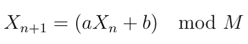

其中 ***a*** 和 ***b*** 都是选择的常量。 ***M*** 定义了我们生成的数字的范围。

使用此功能，我们能够生成如下序列:

```
72 -> 5 -> 614 -> 37 -> 140 -> …
```

作为用户，我们在这个序列中看不到任何模式。所以我们可以说它是随机的。如果有人对这个函数足够熟悉，这可能是一种模式，让他们说这个序列可能是用这个特定的函数绘制的。

这个随机数发生器被称为*线性同余发生器*。

在接下来的章节中，我们将讨论*这个随机发生器*有多糟糕，并尝试改进它。

# 线性同余发生器是好的随机发生器吗？

为了评估随机数生成器的质量，我们将使用两种可视化效果:**位图**和**随机漫步**。这两种方法都评估我们生成的数字的特定位。

我们先通过固定***a******b******M***来选择一个直线发电机。已经证明，最佳线性同余生成器满足以下条件:

1.  ***M*** 和 ***b*** 互质
2.  ***a-1*** 能被 ***M*** 的所有质因数整除
3.  ***a-1*** 能被 ***4*** 整除如果 ***M*** 能被 ***4*** 整除

让我们为函数*和*选择 C 语言中使用过的值(显然满足上述条件)。

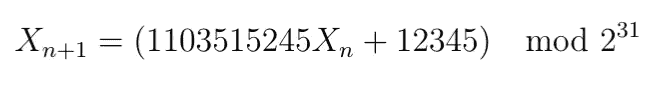

**最高有效位** **位**的位图给出如下内容:

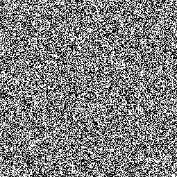

最高有效位的位图

每个生成数 ***Xn+1*** 由一个像素表示。如果数字的最高有效位等于 0，则该像素为黑色，否则为白色。

位图确实是随机的，我们没有任何模式。

让我们看看 2D 随机漫步给出了什么。


使用第 31 位和第 30 位的随机游走

通过 2D 随机游走，我们同时评估 2 位。两位给 ***四个*** 可能值。基于该值，我们在四个 方向*上、下、左、右*中的一个方向上移动。这里我们评估的是 ***Xn+1*** 的两个最高有效位(*第 31 位和第 30 位*)。

随机漫步看起来真的是随机的，没有任何模式。我们可以说这是一个很好的随机数生成器吗？在评估其他位之前。

我们来评价一下中间的，比如 15 号。以下是该位的位图和随机游走。

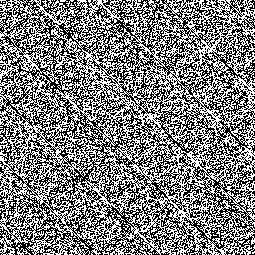

第 15 位位图


使用第 15 和第 16 位的随机游走

这次情况不同，我们可以看到一些模式。在位图中，你可以看到一些相同颜色的线条。在随机漫步中，你可以看到这个形状在一个对角线轴上是对称的，并且永远重复...对于所谓的“随机”行为来说，这不是好消息。

让我们看看第一位(最右边的位)会发生什么。

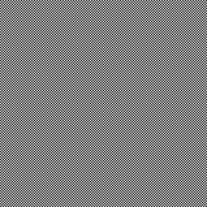

第一位位图


使用第 1 和第 2 位的随机游走

嗯，这两个结果中没有*什么*随机。如果放大位图，会发现黑白像素交替出现。在随机漫步中，它会*上、下、右、左*，并且永远重复。为什么会这样？

第一位是奇偶校验位，它表示数字是奇数还是偶数。如果你用这个随机数发生器产生任意的*序列，你会看到*每个奇数后面跟着一个偶数，每个偶数后面跟着一个奇数，*就像我们在本文前面看到的序列。因此，第一位在值 0 和 1 之间交替。这解释了位图图形。对于随机游走，方向由第一位和第二位决定。正如我们将在接下来的章节中看到的，在四个步骤*之后有一个循环。**

*如果你对剩下的比特做同样的操作，你会得出结论，当我们向右移动比特时，模式变得更清晰，随机性变得更差。*

*在下一节中，我们将研究为什么会发生这种情况。*

# *第一点有什么问题*

*利用线性同余发生器， ***X{n+1}*** 的第一位仅由 ***a*** 、***Xn*** 和 ***b*** 的第一位决定。对于奇数 ***a*** 和奇数 ***b*** ，我们从等式得到:*

*   ***如果** *Xn* 是奇数**那么** *X{n+1}* 是偶数*
*   ***如果** *Xn* 是偶数**那么** *X{n+1}* 是奇数*

*这证明了上一节中位图的结果。*

*因此，也许不同的奇偶校验 ***a*** 或 ***b*** 可以解决第一位的问题？让我们看看下表。*

*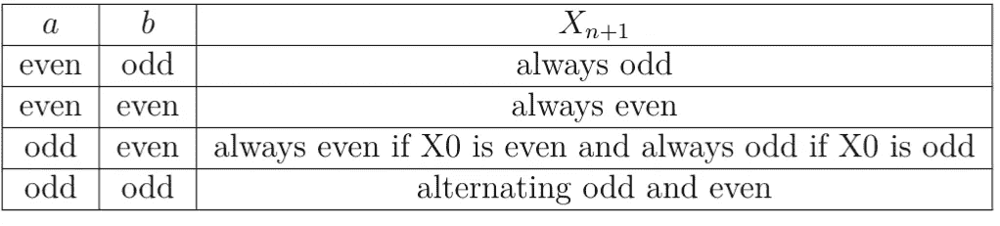*

*从这个表中，只有奇数 ***a*** 和奇数 ***b*** 能够给我们所有可能的数字。因此，我们不能做得比我们得到的结果更好。我们说第一位的**周期**长度为*2，*因为我们有一个长度为 2 的序列，它永远重复。*

# *第二点怎么样*

*类似地，让我们检查*和 ***b*** 上的条件，这些条件允许获得第二位的所有可能值。这一次， ***X{n+1}*** 的第二位同时取决于 ***a*** 、 ***b*** 、 ***Xn*** 的第一位和第二位。根据 ***a*** 和 ***b.*** 的前两位，下表给出了 ***X{n+1}*** 的前两位值的顺序**

**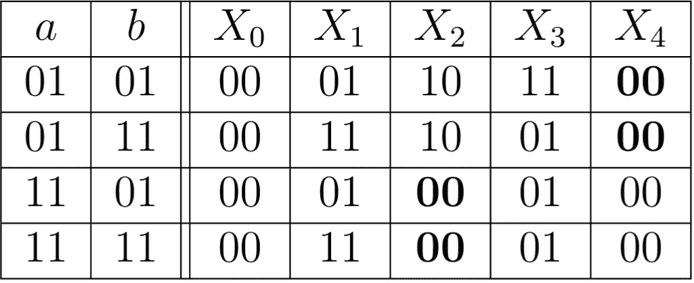**

**这里，前两位的序列也是重复的。但是只有以*结尾的 ***a*** 给出了循环前 ***X{n+1}*** 所有可能的**四个**值。因此，这是一个关于*的新条件，以获得前两位的所有可能值。****

1.  ******a******b***应该是奇数***
2.  *****一个*** *应该以* ***01*** *结尾。
    换句话说* ***a mod 4 = 1*** 。
    *换句话说* ***a-1*** 应该是 ***4*** 的倍数**

**我们在这里检索我们早先看到的关于最佳线性同余生成元的定理的条件之一(条件 n 3)。因为 ***M=2*** 是 ***4*** ， ***a-1*** 应该是 ***4*** 的倍数。**

**目前为止我们得到的信息是:**

*   ****1** 第一位:长度为 2 的时间段**
*   ****2** 第二位:长度为 4 的周期**

**如果你迭代下面的比特，你会得到类似的结果:**

*   ****3** 第 3 位:最大长度为 8 的周期**
*   ****4** 第 6 位:最长 16 的周期**
*   **….**
*   ****31** 第一位:周期长度最大为 2**

**此外，我们在上面对 ***a*** 和 ***b*** 的前两位设定的两个条件都是**足够的**来获得所有剩余位的最大周期。这就是为什么最终定理中出现条件“ *a-1 应为 4 的倍数，如果 M 是 4 的倍数*”。**

**总之，因为它们的周期更长，高位比低位具有更好的随机性。**

# **解决低位问题**

**从前面的章节中，我们明白了为什么***I***t16 位有一段长度 ***2^i*** 。这是因为第 ***i*** 第位的 *X{n+1}* **只取决于第**I 位的 *Xn* 。 ***2^i*** 是我们可以用 ***i*** 位得到的最大组合数。**

**所以，我们需要一种方法，让第一位也依赖于其他位。加法和乘法只向左传播比特。是否有任何向右侧传播位的操作？一 ***师*** ！**

**例如:如果我们想使 **1** 的第一位**、T53【X { n+1 }、依赖于*的第三位*、T59【Xn】、。我们把 ***Xn*** 除以 4，这相当于把 ***Xn*** 向右移动了两步。****

**让我们用以下内容更新我们的线性同余发生器:**

**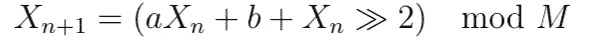**

**现在让我们看看这是否提高了第一位的随机性。**

**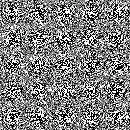**

**aX + b +的第 1 位位图(X >> 2)**

****

**对于 aX + b + (X >> 2)，使用第 1 和第 2 位进行随机游走**

**这大大提高了第一位的随机性！位图中有一些图案(见黑点)，但比黑白交替好得多。**

**让我们看看我们是否仍然擅长第 31 位的*。***

**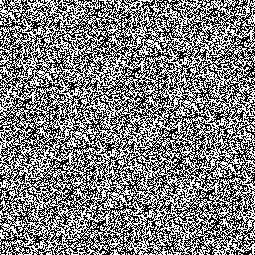**

**aX + b + (X >> 2)的第 31 位位图**

****

**对 aX + b + (X >> 2)使用第 31 位和第 30 位的随机游走**

**嗯，不太好，现在我们得到了位图中的图案(见黑点)，你可以看到一个形状在随机游走中无限重复。**

**我们可以尝试另一个金额来转换。为此，我编写了一个程序，返回不同班次金额的周期。结果如下:**

**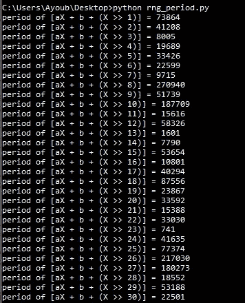**

**没有任何金额给出 2 的最大期限。因此，这种形式的函数不能在不影响随机数发生器周期的情况下解决我们的问题。**

**研究线性同余发生器的变体并不容易，这些变体既能解决低位问题，又能实现最大周期长度。***a******b***的调优对于 ***aX+b*** 来说已经被证明了，任何变体都要足够好的学习，以免陷入短周期。我尝试了不同版本的函数，如下所示。每次我的周期变短:**

*   ***X { n+1 } =(aXn+b+****X>>2****)mod M***
*   ***X { N+1 } =(aXn+b+****sum I 从 1 到 N(X>>I)****)mod M***
*   ***X { N+1 } =(aXn+b+****xor I 从 1 到 N(X>>I)****)mod M***
*   ***X { N+1 } =(aXn+b+****N-1 个最高有效位之和*** *) mod M***
*   **…**

**如果你试一试，也许你会发现一个变种，可以解决周期和低位的问题！**

# **结论**

**令我非常惊讶的是，我发现最著名的随机数发生器之一根本不是随机的。在本文中，我们已经看到了线性同余生成器如何无法为它生成的数字的低位获得看似随机的序列。我们还使用了两种可视化方法来帮助用肉眼评估随机数生成器。**

**今天，有更先进的随机发生器，不存在低位的问题，如[梅森扭转器](https://en.wikipedia.org/wiki/Mersenne_Twister)，它不像线性同余发生器那么简单，但绝对值得花时间来理解它是如何工作的。**