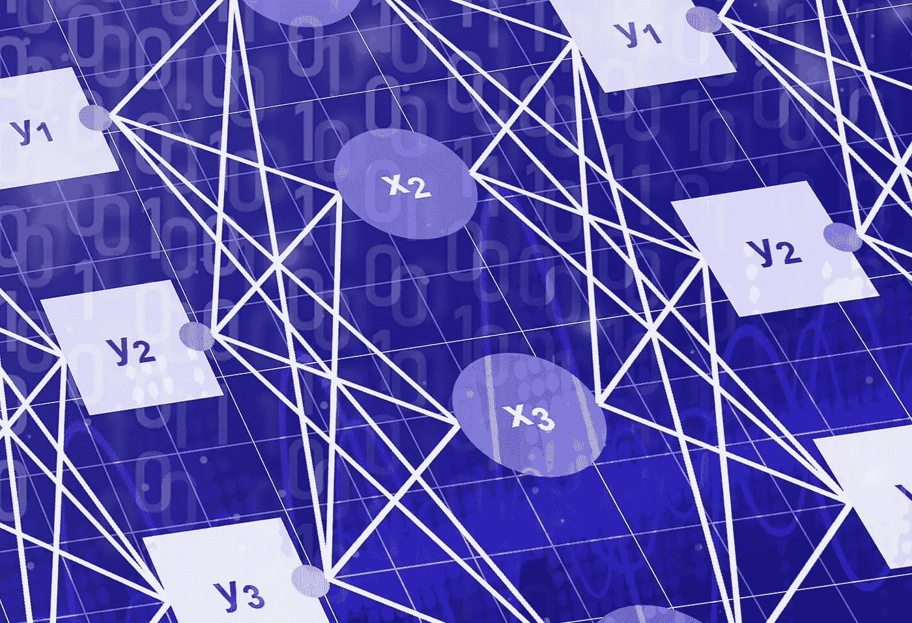
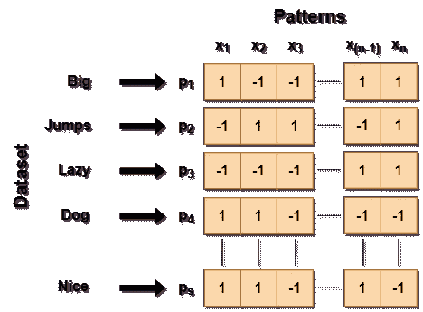
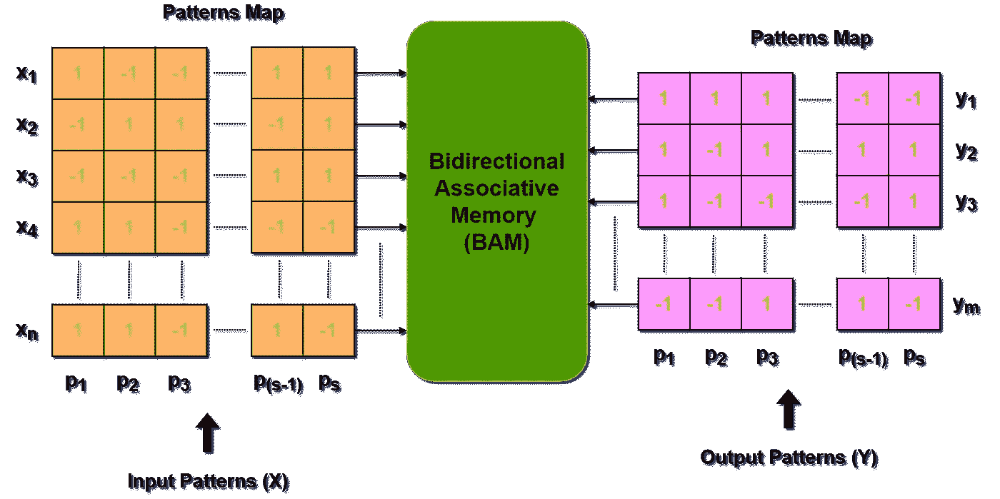
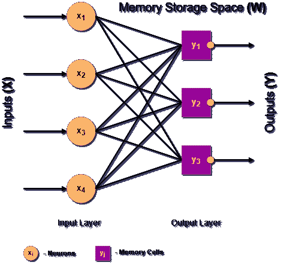
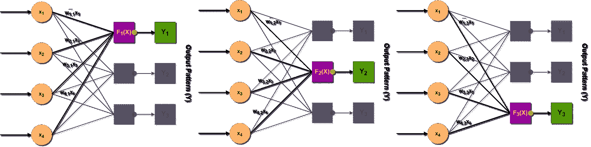
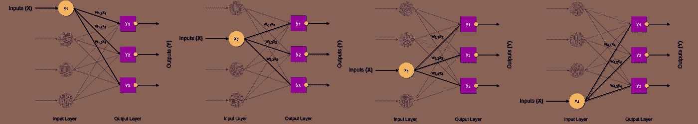
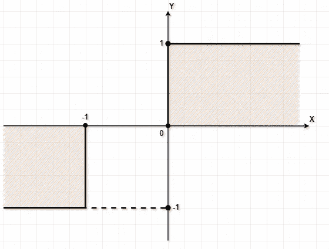
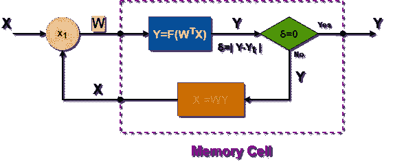

# 双向联想记忆简明指南

> 原文：<https://towardsdatascience.com/a-succinct-guide-to-bidirectional-associative-memory-bam-d2f1ac9b868>

Arthur V. Ratz 的照片

## 读者需要了解的关于双向联想记忆(BAM)的一切，包括 Python 3.8 和 NumPy 中的示例

# **简介**

B 双向联想记忆(BAM)是一种特殊类型的递归神经网络(RNN)，最初由 Bart Kosko 在 20 世纪 80 年代初提出，试图克服自联想 Hopfield 网络和 ann 的几个已知缺点，后者从连续训练中学习数据的关联。

BAM 是异联想存储器，提供存储相关数据的能力，而不管其类型和结构，无需连续学习。在从 BAM 的存储器中调用数据关联之前，数据关联被同时存储，仅存储一次。通常，BAM 比现有的 ann 跑得快，在回忆关联时提供明显更好的性能。此外，与现有的人工神经网络相比，使用 BAM 完美地解决了已知的按位异或问题，这使得在其存储器中存储编码为二进制(双极性)形式的数据成为可能。

与单向 Hopfield 网络不同，BAM 能够双向调用分配给其输入或输出的数据关联。此外，它允许检索正确的关联，即使是不完整或失真的输入数据。

当作为基于人工智能的决策过程的一部分部署时，BAM 模型是相当有效的，它基于许多相关数据的各种关联来推断特定数据分析问题的解决方案。

一般来说，BAM 模型可用于多种应用，例如:

*   **分类和聚类数据**
*   **不完整数据扩充**
*   **恢复受损或损坏的数据**

每当人工神经网络获取的各种知识不足以处理引入人工智能进行分析的数据时，BAM 模型就非常有用。

例如，用人工神经网络预测不完整文本中遗漏的单词，基本上需要将单词与句子的关联存储在人工神经网络的存储器中。然而，这将导致不正确的预测，因为相同的缺失单词可能出现在不止一个不完整的句子中。在这种情况下，使用 BAM 提供了存储和调用数据实体的所有可能关联的能力，例如*单词到句子*、*句子到单词*、*单词到单词*和*句子到句子*，反之亦然*。这反过来显著提高了预测的质量。为了扩充或聚集这些数据，还推荐多方向地关联各种数据实体。*

最后，每个 ANN 的层的内存容量都绑定在最大浮点类型的大小: *float64* 。例如，shape (100x100)的单个 ANN 层的容量只有 1024 字节。显然，人工神经网络的层数以及每层中神经元的数量都必须增加，以具有存储联想和多方向回忆的能力。这反过来又会对基于人工神经网络的内存延迟产生负面影响，因为它的学习和预测工作量与人工神经网络的规模成比例地增长。

尽管如此，BAM 的学习和预测的高性能提供了根据需要分配大量存储空间的能力，超过了传统 ANN 的存储容量限制。同样，可以将多个 bam 聚合到内存中，具有分层结构。

# 存储在内存中的关联…

BAM 学习各种数据的关联，转换成双极模式。双极模式是二进制向量的特例，其元素分别是 **1 的**和 **-1 的**的值。多个模式(列)沿着矩阵的 y 轴排列成 2D 模式映射。x 模式映射是嵌入，其每一列对应于存储在 BAM 的存储器中的特定输入和输出数据项:

作者将数据编码成双极 2D 图形形状图(s×n)|图像

BAM 模型同时从模式映射中学习相关数据，分别分配给其相应的输入和输出:

作者分配给 BAM 模型|图像的输入(X)和输出(Y)模式映射

在上图中，BAM 模型学习数据的关联，分别编码到形状(𝙨 x 𝙣)和(𝙨 x 𝙢)的模式映射𝙓和𝒀中。在学习时，来自输入和输出模式的值被分配给 BAM 模型的相应输入𝙭ᵢ**∑**𝙓和输出𝙮ⱼ**∑**𝒀。反过来，输入和输出模式映射(列)必须具有相同数量的模式(𝙨)。由于 BAM 是一个异联想记忆模型，它有不同数量的输入(𝙣)和输出(𝙢)，因此，相应地，在𝙓和𝒀这些模式映射中也有不同数量的行。

# BAM 的拓扑和结构

通常，BAM 是一个原始的神经网络(NN ),仅由输入和输出层组成，通过突触权重相互连接:

BAM 模型的神经网络拓扑(4 x 3) |图片由作者提供

在上图中，输入层的神经元(𝒏)不执行输出计算，而是将输入𝑿前馈到 BAM 输出层的存储单元(𝒎)。它的大小基本上取决于 BAM 的输入和输出的数量(例如，输入和输出模式映射的维度)。上面显示的形状为(4 x 3)的 NN，在其输入和输出层分别由 4 个神经元和 3 个存储单元组成。

与传统的人工神经网络不同，BAM 的输出层由执行 BAM 输出计算的存储单元组成。每个存储单元基于由突触权重𝑾转发给该单元的多个输入𝑿来计算其输出𝒀，每个输出都具有特定的强度。

存储单元的输出对应于模式的特定值，被调用:

BAM 内存单元的输出(Y )|作者提供的图像

BAM 的输出计算为所有 BAM 输入𝑾ᵀ𝙓的加权和，作为双极性阈值函数的参数应用。每个输出𝒀的 ***正*** (+)或 ***负*** (-)值(例如 **1** 或 **-1)** 总是与该单元的加权输入之和的大小成比例。

连接输入神经元和记忆细胞的所有突触权重存储由 BAM 基于下面讨论的 Hebbian 监督学习算法学习的基本记忆。

# 学习算法

从代数角度来看，BAMs 存储和回忆关联的能力完全依赖于矩阵的双向属性，T. Kohonen 和 J. Anderson 在 20 世纪 50 年代中期对此进行了研究:

> *两个矩阵𝑿和𝒀的内点积，给出一个相关矩阵𝑾据说是双向稳定的，是𝑿和𝒀回忆和反馈到𝑾的结果。*

通常，这意味着矩阵𝑿和𝒀的相应行和列，以及它们的标量矢量积，同样对𝑾 *、*的值有贡献，作为回忆:

因为，矩阵𝑿和𝒀的每一个向量都可以通过下面讨论的内点积𝑾𝑿ₖ或𝑾 𝒀ₖ很容易地回忆起来。

在这种情况下，𝑾是一个矩阵，它推断𝑿ₖ或𝒀ₖ向量的相关性。整个学习过程非常类似于 ***保持*** (𝙬ᵢⱼ **≠ 0** )或 ***丢弃***(𝙬ᵢⱼ**= 0**)*特定权重，将 BAM 的输入神经元和记忆细胞相互连接。*

*突触权重𝙬ᵢⱼ **∈** 𝑾的值可以大于、小于或等于 **0** 。BAM 只保存那些突触权重，其值要么是正的，要么是负的。在初始化模型时，等于 **0** 的突触权重被简单地丢弃。*

*Donald Hebb 提出了双向矩阵性质，作为著名的监督学习规则，它是 Hopfield 网络和其他联想记忆模型的基础。*

*根据 Hebbian 算法，在初始化突触权重的矩阵𝑾ₙₓₘ时，所有相关模式被存储在 BAM 的存储空间中，仅一次(例如，存储空间)。通过分别取输入𝑿ₚₓₙ和输出𝒀ₚₓₘ模式图(即，矩阵)的内点积来获得矩阵𝑾ₙₓₘ:*

**

*或者，权重矩阵𝑾ₙₓₘ可以从𝑿ₚₓₙ、𝒀ₚₓₘ矩阵获得，作为相应模式𝙭ₖ和𝙮ₖ的外部克罗内克乘积的和。*

**

*与𝑿和𝒀的内点积不同，(𝙭ₖ,𝙮ₖ)**∑**𝑿,𝒀向量的外积产生矩阵𝙬ₖ**∑**𝑾(即基本记忆)。最后，通过逐点获得它们的和，所有的矩阵𝙬ₖ被组合成单个矩阵𝑾。*

*BAM 的突触权重初始化的整个过程如下图所示:*

**

*基于 Hebbian 算法学习 BAM 模型|图片作者*

*然而，相关矩阵𝑾为作为正交向量的模式提供了最稳定和一致的记忆存储。𝑿,𝒀正交向量的乘积给出了对称相关矩阵𝑾，其中关联的基本记忆分别从模式图𝑿和𝒀学习。*

*因此，强烈建议在训练模型之前执行𝑿和𝒀模式图的正交化。由于𝑿和𝒀是两极的，𝒀的正交化可以很容易地做为:𝒀 = -𝑿.通过取负-𝑿，𝒀模式将具有与𝑿相同的值，其符号 **(+/-)** 变为相反。*

*BAM 的学习算法很简单，可以用 Python 3.8 和 NumPy 中的一行代码轻松实现:*

# *从记忆中回忆模式*

*因为输入和输出模式映射已经存储在 BAM 的存储器中，所以通过在多次迭代中计算 BAM 的完整输出来调用特定模式的关联，直到检索到输入模式𝑿的正确关联。*

*为了计算完整的内存输出，在每次迭代中，𝞭-iterations，𝒌=𝟏..𝞭，𝙓模式的 BAM 的输入𝙭ᵢ乘以相应的突触权重𝙬ᵢⱼ **∈** 𝙒.在代数上，这是通过取权重矩阵𝙒-transpose 和输入模式𝙓.的内积来完成的然后，将 BAM 输入的加权和𝙒 ᵀ𝙓应用于双极阈值函数𝒀=𝙁***(***【𝙒ᵀ𝙓***)***，以计算每个存储单元的输出，该输出对应于被调用的输出模式𝙮ⱼ **∈** 𝒀的特定值 **1** 或 **-1** 。这种计算类似于通过传统人工神经网络的每一层前馈输入。*

*双极阈值函数𝙁与经典阈值函数完全相同，唯一的区别是其正(+)或 **0** 输入的值为 **1、**和负(-)，除非另有说明。在这种情况下，𝙁的实际输入也包括零 **:***

**

*双极性阈值函数 Y=F(X)*

*双极阈值函数的曲线图如下所示:*

**

*双极阈值激活功能|图片作者*

*下面列出了一个简单的代码片段，演示了 BAM 的内存单元激活:*

*与传统的人工神经网络不同，输出层中的存储单元还为下一次迭代𝙠+𝟏.计算新的输入𝙓ₖ₊₁然后，它检查当前𝙓和新输入𝙓ₖ₊₁是否不相等(𝙓≠𝙓ₖ₊₁).如果没有，它将新的输入分配给 BAM，在下一次迭代中继续计算输出𝒀。否则，如果是𝙓=𝙓ₖ₊₁，则意味着输出𝒀是输入𝙓的正确关联，并且算法已经收敛，从过程返回模式𝒀。此外，BAM 通过基于所讨论的相同算法双向计算存储器输出，提供了调用输入𝙓和输出𝒀的关联的能力。*

*图形调用过程如下图所示:*

**

*内存单元输出(Y)计算|作者图片*

***从 BAM 存储器中调出关联的算法如下:***

*设𝑾ₙₓₘ—为相关权重矩阵(即 BAM 存储器的存储空间)，𝑿ₙ—为长度为𝒏的输入模式，𝒀ₘ—为长度为𝒎:的输出模式*

*回想一下先前存储在 BAM 内存中的输入模式𝑿的关联𝒀:*

***对于每个𝞭-iterations、*𝟏*≤**𝞭**≤****𝒕，执行以下操作:***

1.  *用输入向量𝑿₁←𝑿.初始化 BAM 的输入*
2.  *计算 BAM 输出向量𝒀ₖ，作为权重矩阵𝑾 **ᵀ** 转置和输入向量𝑿ₖ的内点积，用于𝒌-th 迭代:*

**

*3.获得下一次𝒌+𝟏)-th 迭代的新输入向量𝑿ₖ₊₁，例如:*

**

*4.检查新的和现有的矢量𝑿ₖ₊₁≠𝑿ₖ是否**不**相同:*

*如果**不是**，返回步骤 1，计算𝒌+𝟏)-th 迭代的输出𝒀ₖ₊₁，否则进行下一个步骤 5。*

*5.从过程中返回输出向量𝒀←𝒀ₖ，作为输入𝑿向量的正确关联。*

*6.继续步骤 2–4，直到收敛。*

*下面列出了 Python 3.8 和 NumPy 中实现模式预测算法的一段代码:*

# *内存评估(测试)*

*下面列出的代码演示了 BAM 评估(测试)过程。它建立特定形状*(模式×神经元×记忆 _ 细胞)*的 BAM 模型，并生成 1D 数组，由 **1** 和 **-1** 值组成。然后，它将数组重新整形为输入的二维图案图𝑿.为了获得𝒀的模式图，它执行𝑿的正交化，例如:𝒀=−𝑿.接下来，计算相关矩阵，将𝑿和𝒀模式的关联存储到 BAM 的内存中。*

*最后，它对每个输入模式𝙭ᵢ **∈** 𝙓执行模型评估，它从 BAM 的存储器中双向调用一个关联。当从存储器中调出输入模式 x⃗的关联 y⃗ₚ时，它会检查输出 y⃗ₚ目标 y⃗模式是否相同，显示每个输入模式𝙭ᵢ **∈** 𝙓:的结果*

# *预测不完整的模式*

*BAM 模型的优点之一是能够通过 **> 30** 不完整或损坏的输入来预测正确的关联。下面的代码片段演示了不完整的模式预测。它从模式图𝑿中随机选择一个输入模式，并扭曲它，用任意的 **1** 或 **-1** 替换它的多个值。它应用 poison(…)函数(在下面的代码中实现)来扭曲随机选择的模式 x⃗，正在回忆它的关联。最后，它预测一个关联模式，如果目标和预测的关联 y⃗和 y⃗ₚ是相同的，则执行一致性检查。如果是这样的话，x⃗被召回的正确联想模式是:*

# *结论*

*尽管 BAM 模型无需持续学习就能灵活地存储和调用关联，但对于某些应用程序来说，它的效率可能会降低，因为它无法调用某些类型数据的正确关联。根据最新的研究，预测各种不完整或损坏的数据的关联基本上需要由大量存储单元组成的巨大尺寸的 bam。当回忆少量模式的正确关联时，也存在几个问题。显然，BAM 模型的现有变体必须经过改进才能用作大量应用的持久存储器。尽管如此，以下问题的解决方法仍在开发中。*

# *源代码:*

*   *[*《Python 3.8 和 NumPy 中的双向联想记忆(BAM)》，Jupyter Notebook @ Google Colab*](https://colab.research.google.com/drive/1M9oTh4cruwLJBvKs3ijMpY7ptYP_BGXJ)*
*   *[*双向联想记忆，Python 3.8 + NumPy 样本，Visual Studio 2022 Project @ GitHub 资源库*](https://github.com/arthurratz/bam_associations_intro)*

# *放弃*

*所有的图片都是由这个故事的作者使用 Draw.io 应用程序设计的，[https://www.diagrams.net/](https://www.diagrams.net/)*

# *参考*

1.  *[*“双向联想记忆”——来自维基百科，免费百科。*](https://en.wikipedia.org/wiki/Bidirectional_associative_memory)*
2.  *[*自适应双向联想记忆，Bart Kosko，IEEE 系统汇刊，人与控制论，第 18 卷第 1 期，1988 年 1 月/2 月。*](https://opg.optica.org/DirectPDFAccess/52A68963-3B21-4588-868A1CEBDFCC7199_30894/ao-26-23-4947.pdf?da=1&id=30894&seq=0&mobile=no)*
3.  *[*模式协会或联想网络，Jugal Kalita 科罗拉多大学科罗拉多泉分校。*](http://www.cs.uccs.edu/~jkalita/work/cs587/2014/05PatternAssoc.pdf)*