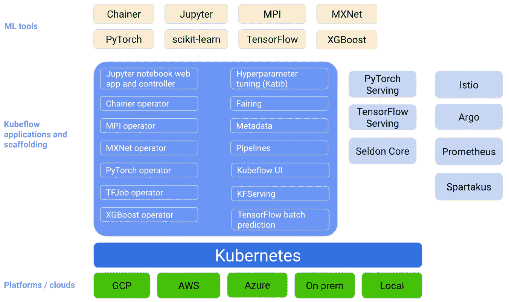
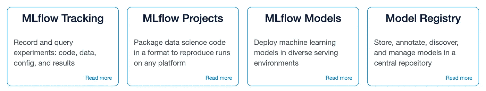
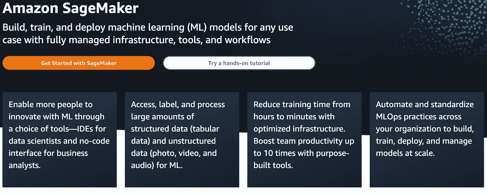

# 三大 MLOps 工具概览

> 原文：<https://towardsdatascience.com/a-survey-of-the-top-three-mlops-tools-1694688648c5>

## 机器学习模型部署和管理的最新工具

由[像素](https://www.pexels.com/photo/business-equipment-factory-industrial-plant-357440/)上的[像素](https://www.pexels.com/@pixabay/)生成的图像

部署和维护机器学习模型对于任何使用预测分析为客户提供价值的公司来说都是必不可少的。MLOps 是机器学习操作的缩写，指的是用于可靠地部署和维护机器学习模型的一组任务。随着数据科学和机器学习团队在各行各业的兴起，公司越来越多地使用预测分析来为客户提供价值。这就产生了对系统的需求，以确保机器学习管道对变化是健壮的，并且它们的结果是可重复的。

MLOps 位于软件开发运营(DevOps)、机器学习和数据工程的交叉点。MLOps 将一组特定的实践应用于机器学习生命周期中的所有步骤，包括数据收集和处理、标记和特征工程、模型训练和优化以及端点部署和监控。在高层次上，MLOps 寻求以有效和可靠的方式自动化这些相互关联的步骤，同时保持模型预测的质量并满足业务需求。

对于任何希望扩展其机器学习系统的公司来说，实施一些基本的 MLOps 实践是必不可少的。例如，关于数据收集和处理，在进入生命周期中的数据标记和特征工程步骤之前进行数据检查是很重要的。数据刷新可能会导致质量差的数据，这可能会成为数据标注和特征工程的瓶颈。这肯定会导致模型性能恶化，并降低 ML 系统对客户和最终用户的效用。

另一个例子是监控模型训练和模型预测的运行时间。如果数据刷新导致模型训练时间显著增加，应该有一个过程来使用更强大的机器或机器集群，以便部署不会显著延迟。此外，关于端点部署和建模，模型预测调用的延迟会对用户体验产生重大影响。例如，如果对工具返回预测的速度有所预期，则每当定型数据、模型特征或模型类型发生更改时，都应监控预测调用运行时。对数据摄取、模型验证和业务需求进行适当的检查可以防止质量差的模型和来自这些模型的无意义的见解被发送给客户。有各种各样的工具可用于监控数据、模型和业务规则。在这里，我们将调查三个最流行的 MLOps 工具。

## 库贝弗洛

[Kubeflow](https://www.kubeflow.org/) 是谷歌开发的机器学习工具包，允许数据科学家和机器学习工程师监控机器学习生命周期。Kubeflow 基于 Kubernetes 构建，用于部署、扩展和管理复杂系统，如机器学习管道。Kubernetes 是一个开源的容器编排系统，主要用于软件工程领域。具体来说，它用于自动化软件部署、扩展和管理。

Kubeflow 本质上是机器学习管道 Kubernetes 的扩展。下图从概念上概述了 Kubeflow 平台，以及它如何适应机器学习工作流程的不同组件。大致可以分为 ML 工具、模型服务工具和云计算平台。

作者图片

Kubeflow 通常对与数据科学家密切合作的 DevOp 工程师更有用。这可能是规模服务模型的最佳选择。

## MLflow

另一个类似的工具包是由 Databricks 开发的 [MLflow](https://mlflow.org/docs/latest/index.html#) 。MLflow 有四个主要组件:跟踪、项目、模型和注册表:

作者图片

如图所示，每个 MLflow 组件分别用于模型实验、可再现运行、模型部署和模型存储。

*跟踪*

追踪对模型实验最有用。它包含一个 API，用于记录模型超参数、模型性能指标和工件，例如 pickeled 训练模型。

*项目*

项目组件对于以可重现的方式打包数据科学和机器学习代码非常有用。它还有一个 API 和命令行工具，允许多个项目链接在一起。

*车型*

模型组件用于服务模型。例如，它可以与 REST API 一起用于实时模型预测服务。

*注册表*

最后，registry 组件有几个工具用于管理 MLflow 模型的整个生命周期。这些包括集中式模型存储、API、ui，它们可用于跟踪模型沿袭、版本控制、模型分级和注释。

MLflow 对数据科学家和机器学习工程师更有用，因为它允许他们轻松地设计、运行和重现实验。

## AWS SageMaker

[AWS SageMaker](https://aws.amazon.com/sagemaker/?p=pm&c=ml&pd=sm&z=4) 是另一个流行的 MLOps 工具。对于数据科学家和业务分析师来说，这是一个非常用户友好的选择，因为它为每个角色提供了 ide 和无代码 ui。它还拥有访问、标记和处理结构化和非结构化数据的工具。此外，与 Kubeflow 和 MLflow 类似，它可以直接部署和监控机器学习模型。

作者图片

总的来说，AWS SageMaker 可能是机器学习生命周期中数据工程和数据争论步骤的最佳选择。这是因为它有一个内置的 IDE，配备了完成这些任务的工具。

## 比较 Kubeflow、MLflow 和 AWS SageMaker

我们在这里讨论的三个平台之间有许多相似之处和不同之处。在高层次上，每个都可以用于部署、服务和维护机器学习模型。Kubeflow 和其他两个平台的一个很大的区别就是它依赖于 Kubernetes。此外，MLflow 是一个 python 库，使数据科学家可以非常容易地运行和保存实验以进行建模。MLflow 还可以与 AWS SageMaker 一起用于模型部署。Kubeflow 与 SageMaker 的不同之处还在于，它是免费和开源的，而 SageMaker 需要为 AWS 服务付费(即使是在免费层)。此外，与 Kubeflow 和 MLflow 相比，AWS SageMaker 是数据工程和数据争论任务的更好选择。鉴于每个平台都有利弊，DevOps 工程师、数据科学家和机器学习工程师最好对每个平台都有所了解。

## 结论

机器学习操作已经成为开发、监控和维护机器学习生命周期的重要部分。当谈到管理数据科学和机器学习管道时，对最佳实践和可用的最先进工具有一个总体的理解和认识是很重要的。Kubeflow 最适合用于大规模服务机器学习模型。MLflow 最适合模型实验和记录。AWS SageMaker 拥有许多与 Kubeflow 和 MLflow 相同的工具，同时还为数据工程任务提供了更多的工具。