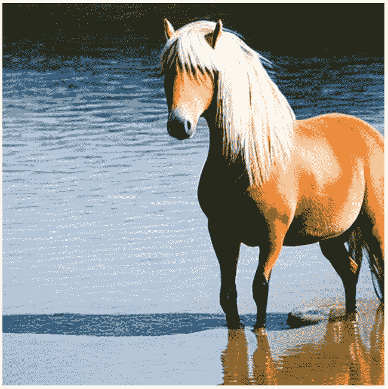
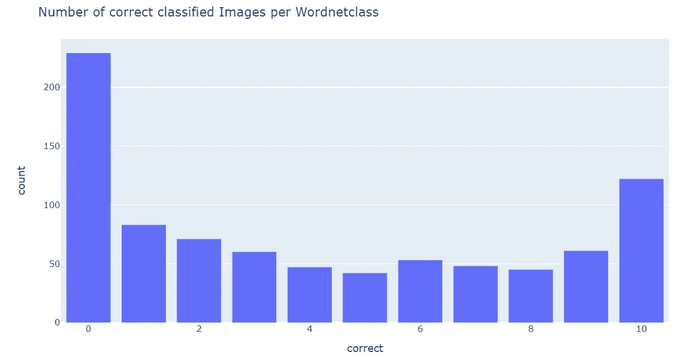
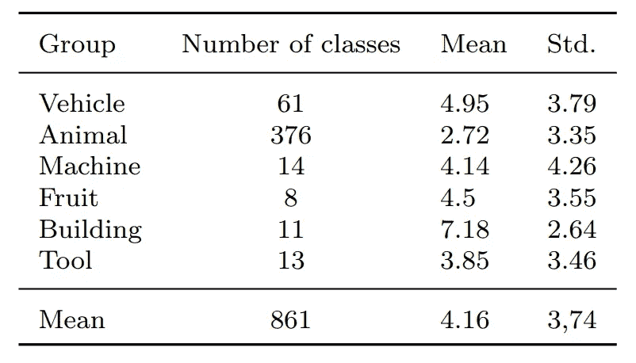
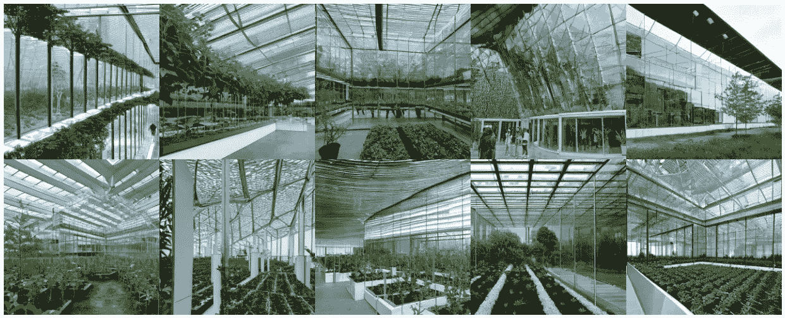
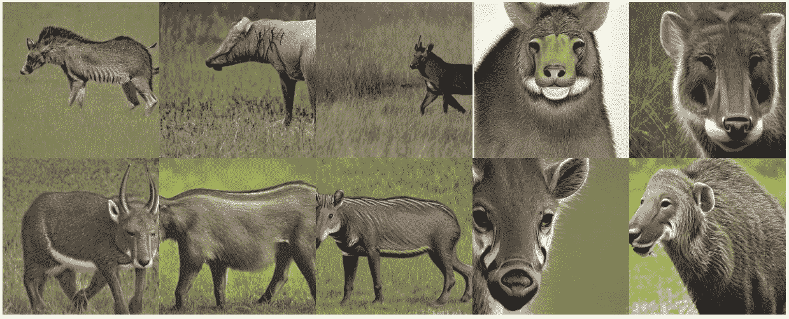
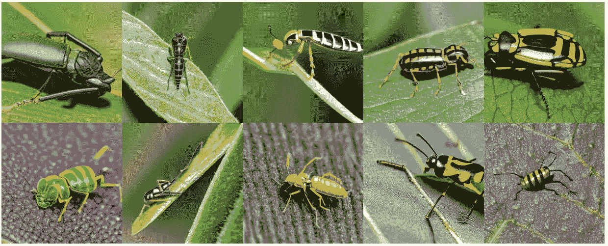
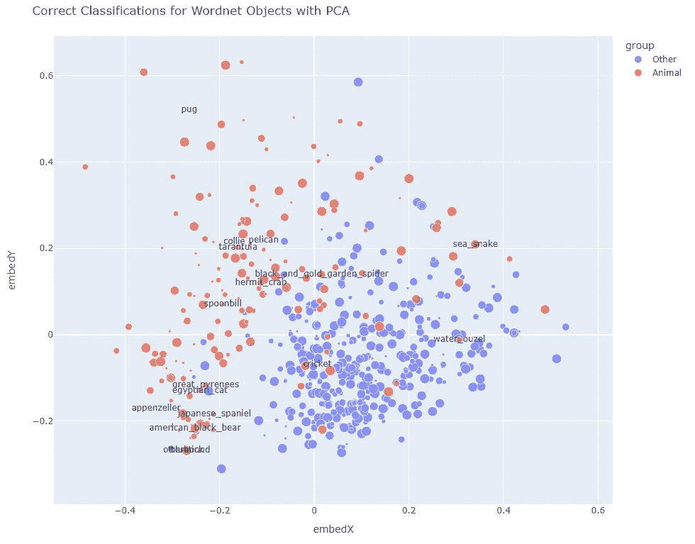

# 用稳定扩散生成的合成图像数据集

> 原文：<https://towardsdatascience.com/a-synthetic-image-dataset-generated-with-stable-diffusion-93e8b557051b>

## 用 Wordnet 测试稳定扩散能力

由作者创建的稳定扩散的图像

用于从文本输入生成合成图像的当前模型不仅能够生成非常逼真的照片，而且能够处理大量不同的对象。在论文“[评估使用稳定扩散生成的合成图像数据集](https://arxiv.org/abs/2211.01777)”中，我们使用“稳定扩散”模型来研究哪些对象和类型被如此真实地表示，以至于后续的图像分类正确地分配它们。这给了我们在现实表现方面对模型的评估。

上面的照片用一个足球的例子来说明，不仅生成了非常逼真的照片，而且从精确的文本提示开始，创建了对象的非常不同的表示。

## 数据的生成

作为图像生成的基础，我们使用[“稳定扩散”1.4 模型](https://github.com/CompVis/stable-diffusion)和 [Huggingface 扩散器库](https://huggingface.co/docs/diffusers/index)的实现。该模型允许基于文本提示创建和修改图像。它是在 [LION5B 文本到图像数据集](https://laion.ai/blog/laion-5b/)的子集(LAION-美学)上训练的潜在扩散模型。

下图显示了从文本提示生成的图像示例

> 《站在水中的短腿哈夫林杰马》。

该示例表明，生成器模型可以表示具有不同属性的不同概念，还可以将它们组合在一个设置中。

由作者创建的稳定扩散的图像

我们创建了一个包含各种不同概念的图像的数据集。对于文本输入，我们使用“ [Wordnet](https://wordnet.princeton.edu/) ”中包含的信息。Wordnet 将概念组织到所谓的“synsetss”中，synset 对应一个或多个具有相同含义的单词的含义。因此，一个意义不同的词可以属于几个同义词集。例如,“apple”这个词有水果和电脑品牌的意思，这两个词各有一个同义词集。

从 Wordnet synset‘object . n . 01’开始，通过递归调用“下位词”(比适用于它的一般或上位术语具有更具体含义的词)，创建了 26，204 个名词 synset 的列表。对于这些名词中的每一个，我们使用 Wordnet 中的同义词集描述来生成图像。

这种提示的一个例子是:(狗的 synset)

> “犬科动物属的一员(可能是普通狼的后代)，从史前时代起就被人类驯养；出现在许多品种中”

对于每个 synset，生成了 10 个图像，并存储在 synset 的名称下，并附加了编号。这导致我们的数据集总共有 262，040 幅图像。

与每个 synset 的 10 个图像一起，保存一个文本文件，该文件包含所使用的提示、synset 的名称(例如“dog.n.01”)和 wordnet 编号(例如“n12345678”)。唱片可以从 Kaggle 下载。

<https://www.kaggle.com/datasets/astoeckl/stable-diffusion-wordnet-dataset> 引用:【https://arxiv.org/abs/2211.01777】T2

## 数据评估

为了对我们的数据集子集进行系统评估，我们使用了 [ImageNet 大规模视觉识别挑战](https://image-net.org/challenges/LSVRC/) (ILSVRC)数据集。
我们使用 [vision transformer 模型](https://arxiv.org/abs/2010.11929)的 Pytorch 实现，它在 ImageNet 数据上的前 1 名准确率为 88.55%，前 5 名准确率为 98.69%，以验证生成的图像可以正确分类。

对来自所考虑的子集的所有 8610 幅图像的审查产生每类 4.16 幅图像的平均正确分类(最多 10 幅)，所有类的平均标准偏差为 3.74。下面的直方图显示了正确分类数量的巨大差异。NSFW 滤波器产生的黑色图像是统计数据的一部分。

作者图片

可以看出，虽然为大多数类别(73%)生成了至少一个正确识别的图像，但是所有 10 个图像仅在 14%的类别中被识别。这也反映了文章开始时的观察，即一个类生成的图像差别很大。这使得分类过程的任务变得复杂。

现在让我们考虑一些物体组的识别率。在 Wordnet 的层次结构下，总结了一些术语组的相关类别，并确定了每个类别的平均识别率。下表显示了结果。

不同物体类别的识别率

引人注目的是对建筑物的良好识别率。下图显示了“温室”的图像，所有 10 个图像都被正确识别。

“温室”——作者创造的稳定扩散的意象

“动物”类显示出低于平均水平的分类率。如果我们更仔细地观察这个组，我们会发现在 162 个动物类别中，没有一个图像是完全不被识别的。看看个体特定的例子，如下面的例子中的术语“黑脚雪貂”和“叶蝉”，“稳定扩散”显然揭示了动物科学中的重大缺陷。

“黑脚雪貂”——作者创造的稳定扩散的形象

“叶蝉”——作者塑造的稳定扩散的形象

创建术语“地图”,显示由
稳定扩散生成的哪些图像被视觉转换器模型正确识别，以及每种情况下的识别率有多高，我们根据语义在 2D 中放置术语，并根据子组对其进行着色。圆圈的大小表示正确分类的图像的数量。为了确定在这个地图上的位置，我们使用[单词嵌入](/introduction-to-word-embedding-and-word2vec-652d0c2060fa)作为类名。

分类率“地图”——作者图片

这里，许多没有被正确识别的动物种类的小红点也很明显。

## 类似项目

一个提供对用稳定扩散生成的合成图像数据的访问的项目是“Lexica”。它是一个搜索引擎，从超过 1000 万张图片中返回一个术语的结果。但是，这里的整个数据库无法下载，也没有分类。

lexica——作者截图

中提供并描述了一个包含 200 万幅图像的大型数据库，该数据库也可以下载并作为开放源代码使用

<https://poloclub.github.io/diffusiondb/>  

除了图像，“扩散数据库”数据集还包含用于生成每个图像的文本提示。作者通过抓取 Stable Diffusion 的 Discord 服务器并提取包括提示在内的图像来创建数据集合。