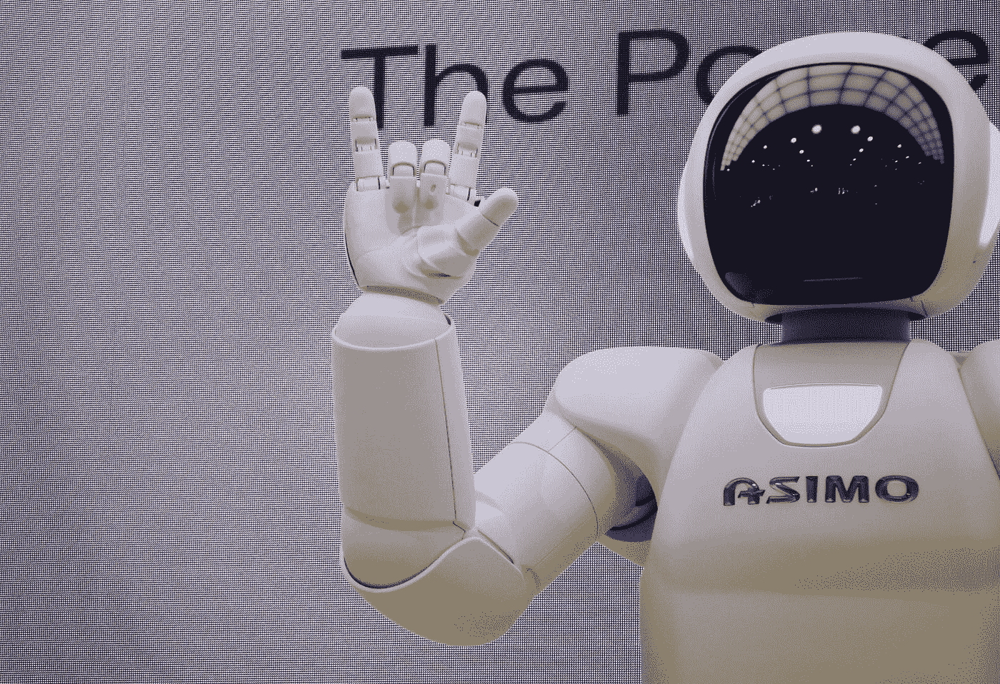
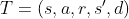
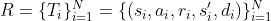
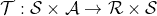

# 非策略深度强化学习中的经验重放介绍

> 原文：<https://towardsdatascience.com/a-technical-introduction-to-experience-replay-for-off-policy-deep-reinforcement-learning-9812bc920a96>

## 探索提高深度强化学习代理样本效率的关键机制

机器人是一个定位于从深度强化学习中受益匪浅的领域。阿瑟尼·托古列夫在 [Unsplash](https://unsplash.com?utm_source=medium&utm_medium=referral) 上的照片

# 动机:深度强化学习代理的样本效率

训练深度强化学习代理需要大量的*反复试验*，以便代理学习健壮的策略来完成其环境中的一个或多个任务。对于这些应用，代理人通常只被告知其行为导致的奖励是大还是小。因此，代理必须间接地学习某些动作和状态的行为和值。可以想象，这通常需要代理对其行为和估计进行相当长时间的实验。

产生这些体验可能是困难的、耗时的和昂贵的，特别是对于像人形机器人这样的现实生活应用。因此，许多机器人学家和机器学习研究人员一直在考虑的一个问题是:**“我们如何才能最大限度地减少我们需要生成的经验数量，以便成功地训练健壮和高性能的智能体？”**

刚入门深度强化学习？ [**看看这个来自 OpenAI 的精彩介绍。**](https://spinningup.openai.com/en/latest/spinningup/rl_intro.html)

在类似人形机器人的应用中，为训练用于决策的深度强化学习代理生成经验可能是困难的、耗时的和资源昂贵的。**幸好经验回放可以帮忙！**图片由[附身摄影](https://unsplash.com/@possessedphotography?utm_source=medium&utm_medium=referral)在 [Unsplash](https://unsplash.com?utm_source=medium&utm_medium=referral) 上拍摄

# **进入:体验回放**

正如你可能怀疑的，这就是*经验回放*的用武之地！这一关键技术背后的想法很简单——与其每次我们想训练代理人时都产生新的经验，为什么我们不继续从我们已经有的经验中学习呢？

经验重放是非策略深度强化学习算法的一个重要组成部分，它通过存储代理以前经历的环境交互来提高样本效率和训练的稳定性[1]。

体验回放缓冲区存储什么？

要回答这个问题，我们首先需要访问深度强化学习中“体验”的常见实现:

## 将培训体验表现为过渡和推广

在强化学习中，经验被表示为过渡和展开，后者是一组时间上连续的过渡。这些转换，以其最一般的形式，由作为训练样本提供给代理的五个特征/信号的五元组组成:

1.  **状态** ( ***s*** ):表示代理可用的信息，可用于动作选择。你可以把 ***s*** 看作是代理能够观察到的世界*的表示。典型地，代理不能观察世界的真实状态，只是它的一个子集。*
2.  **动作** ( ***a*** ):这些表示代理在与环境交互时可以做出的选择，无论是离散的还是连续的。代理人的行动选择通常会影响其*下一状态****s’***和*奖励* ***r*** *。*
3.  **奖励** ( ***r*** ):这些代表给予代理人的奖励，用于采取给定的动作*给定的状态****s*****或者，在某些情况下，仅仅用于观察/处于 ***a*** 对应的状态。****
4.  ******下一个状态**(***s’***):这表示代理处于状态 ***s*** 并采取动作*后转换到的状态。*****
5.  *******完成信号** ( ***d*** ):这些是二进制信号，表示当前过渡是否代表给定展示/情节中的最终过渡。这些不一定用于所有环境，当不需要它们时(例如，没有终止条件的环境)，它们可以简单地总是设置为 1 或 0。*****

****象征性地写下，这些过渡五元组 **T** 给出如下:****

********

****过渡可以说是体验回放中最基本的体验单元。它从与其环境交互的代理中捕获一个样本数据点。****

****并且展示，也被称为情节或轨迹，并被表示为 **R** ，被给出为一组 **N** 过渡:****

********

****一个卷展栏对应一组 **N** (通常是连续的)过渡 **T** 。对于像机器人这样的应用程序，这些可能是机器人学习从 A 点到 b 点的相邻时间步。****

****这些过渡 **T** 和展开 **R** 是如何存储代理经验的主要表示。这些跃迁都位于跃迁空间内，我们用函数τ来表示。τ的定义域由主体*状态*和*动作*空间 **S** x **A** 的笛卡尔乘积给出，共定义域由*奖励*和*状态*空间( **R** x **S** )的笛卡尔乘积给出。在数学上，转移函数由下式定义(当它是确定性的时):****

********

****转换函数/流形定义了状态和行动如何映射到奖励和未来状态。深度强化学习代理的目标是有效地学习这个转移函数，以及如何在其中进行规划和决策，以最大化回报。****

******我们如何实现体验回放？******

********

****[Jason Leung](https://unsplash.com/@ninjason?utm_source=medium&utm_medium=referral) 在 [Unsplash](https://unsplash.com?utm_source=medium&utm_medium=referral) 上的照片。****

****体验回放通常实现为**循环、先进先出(FIFO) *回放缓冲区*** (可以把它想象成存储我们代理的体验的数据库)。我们使用以下定义对我们的经验重放缓冲区进行分类[1]:****

1.  ******重放容量:**存储在重放缓冲器中的转换总数。****
2.  ******过渡年龄:**定义为自过渡产生以来学习者所走的梯度步数。重放缓冲区的最早策略由缓冲区中最早转换的年龄表示。****
3.  ******重放比率:**每个环境转换的梯度更新次数。假设代理可以通过重复训练相同的经验集来继续学习稳定的策略、行为和技能，较高的重放率有助于提高非策略强化学习代理的样本效率。****

# ******我们如何通过经验回放进行训练？******

********

****经验重放作为训练深度强化学习代理的训练程序的一部分。[布鲁诺·纳西门托](https://unsplash.com/@bruno_nascimento?utm_source=medium&utm_medium=referral)在 [Unsplash](https://unsplash.com?utm_source=medium&utm_medium=referral) 上拍照****

****我们已经讨论了如何描述重放缓冲区，但是它们是如何工作的呢？简而言之， **replay buffers 为代理“重放”体验，允许他们重温记忆并进行培训。**直观上，它允许代理“反思”和“学习”他们以前的错误。俗话说，我们从犯的错误中学习，对于经验回放来说也是如此。****

****经验重放缓冲区通常应用于**非策略**强化学习算法，通过捕获由与其环境交互的代理生成的所有样本，然后存储它们以备后用。重要的是，由于代理不符合策略(具有不同的训练与探索策略)，从代理重放的样本不需要遵循连续的顺序。****

## ******我可以使用哪些库作为重放缓冲区？******

****在许多流行的 python 强化学习环境中都可以找到实现强化学习的功能，例如:****

1.  ****[**TensorFlow 代理**](https://www.tensorflow.org/agents/tutorials/5_replay_buffers_tutorial) (回放缓冲页面)****
2.  ****[**光线 RLLib**](https://docs.ray.io/en/master/rllib/package_ref/replay-buffers.html) (回放缓冲 API)****
3.  ****[**稳定基线**](https://docs.ray.io/en/master/rllib/package_ref/replay-buffers.html) (使用带有软演员-评论家的重放缓冲)****
4.  ********(首页)********
5.  ********[Keras-RL(首页)](https://keras-rl.readthedocs.io/en/latest/)********
6.  **********(回放缓冲页)**********

********这些库中的许多都模块化地实现了重放缓冲器*，允许选择*不同的重放缓冲器*与*不同的强化学习算法*一起使用。*********

# ********经验重放的最新进展********

****************

********下面讨论的方法不仅提高了当今深度强化学习代理的采样效率和性能，而且这些技术及其相关方法有助于为许多新兴的新经验重放技术“播下种子”。杰里米·毕晓普在 [Unsplash](https://unsplash.com?utm_source=medium&utm_medium=referral) 上拍摄的照片********

********已经取得了重大进展，建立在经验重放的基础上，以进一步提高强化学习代理的样本效率和鲁棒性。这些进步可以大致分为两个主题:********

********(一)确定样本选择********

********㈡生成新的训练样本。********

********下面将讨论其中的每一个，以及文献中相应示例的样本。********

## ********确定样本选择(PER、LFIW、HER、ERO)********

********经验重放缓冲器显式管理强化学习代理的训练的一种方式是让它控制为代理重放哪些经验。一些文献示例包括:********

1.  ********[**优先化体验回放**](https://arxiv.org/abs/1511.05952)**【PER】**【4】:**根据代理从该体验中学习会收到多少“惊喜”来分配数字“优先化”值。本质上，样本越“令人惊讶”(通常编码为 TD 误差)，优先级权重就越大。**********
2.  ********[**似然自由重要性权重**](https://openreview.net/forum?id=ioXEbG_Sf-a)**【LFIW】**【5】:**和 PER 一样，LFIW 使用 TD 误差来分配经验的优先顺序。LFIW 根据当前政策的可能性对经验进行重新加权。为了平衡偏差和方差，LFIW 还在政策内和政策外经验之间使用了一个无似然密度比估计器。这个比率又被用作优先级权重。**********
3.  ********[**后见之明体验回放**](https://arxiv.org/abs/1707.01495) **【她】**【6】:**通过不仅存储用于给定情节的原始目标的转换，还存储 RL 代理的其他目标的子集，来解决与稀疏回报环境相关联的问题。**********
4.  ********[**体验重放优化**](https://arxiv.org/abs/1906.08387)**【ERO】**【7】:**学习一个单独的神经网络函数，用于确定从重放缓冲器中选择哪些样本。因此，除了底层代理的神经网络(通常是演员和评论家网络)之外，该架构还分配神经网络来为其他学习者确定样本选择。**********

********这些方法都控制如何为训练代理选择新样本，并且反过来允许改进深度强化学习代理的整体训练。新的经验重放不是仅仅向代理提供一组随机的经验进行训练(并随后使用梯度优化技术进行优化)，而是启发式地或通过额外的梯度优化方法学习*哪些样本*提供给代理，以便最大化学习。重放缓冲器不仅提供和存储用于教导代理的隐喻书籍和课程，而且实际上负责决定在正确的时间给代理哪些书籍和课程。********

## ********生成新的训练样本(CT，S4RL，NMER)********

********另一类经验重放缓冲器集中于为代理生成新样本，以使用现有样本进行训练。一些文献示例包括:********

1.  ********[**连续转换**](https://arxiv.org/abs/2011.14487)**(CT)**【8】:**通过使用 Mixup [9](一种随机线性重组技术)沿轨迹内插相邻转换，为连续控制环境中的强化学习代理执行数据扩充。**********
2.  ********[**出奇简单的自监督 RL**](https://arxiv.org/abs/2103.06326)**(S4RL)**【10】:**提出、实现并评估七种不同的增强方案，以及它们在现有离线 RL 算法中的表现。这些增强机制有助于平滑深度强化学习代理的状态空间。**********
3.  ********[**邻域 Mixup 体验回放**](https://arxiv.org/abs/2205.09117)**【NMER】**(免责声明:我的研究)【11】:与 CT 类似，NMER 使用 Mixup 将附近样本重新组合生成新样本。然而，NMER 不是组合时间上相邻的样本，而是根据提供的距离度量组合(状态，动作)空间中最近的相邻样本。********

# ******体验重放的未来(我的展望)******

******最初，重放缓冲区的任务只是存储代理的经验，对于代理如何使用样本来改进其策略和值函数几乎没有控制。然而，随着新的经验重放缓冲区的出现，重放缓冲区正在获得越来越重要的作用，不仅作为强化学习代理的经验存储机制，而且作为代理的训练器和样本生成器。从上面提到的技术以及更多的技术来看，我相信体验回放有几个发展方向。******

1.  ********插入的经历** ( *免责声明:*这是我的[硕士论文](https://dspace.mit.edu/handle/1721.1/138972)的主要研究领域。)—使用现有的经验，重放缓冲区将增加可用于训练的强化学习代理的经验集，从而导致更健壮的策略和决策制定。******
2.  ********低偏差、低方差样本选择** —重放缓冲区将进一步改进从重放缓冲区中选择样本的方式，以确保他们隐式教授给代理的经验分布有助于代理了解环境的真实表示及其相关的转换函数/流形。******
3.  ********神经经验重放** —如 ERO 等重放缓冲方法所见，经验重放中的一些机制可以自己学习，并且当作为神经网络实现时可以近似函数！随着经验重放方法的不断成熟和变得更加复杂，我相信我们将看到不同神经网络架构(MLPs、CNN、GNNs 和 Transformers)的持续集成和使用。******

********感谢您的阅读！**要查看更多关于计算机视觉、强化学习和机器人技术的内容，请 [**关注我**](https://rmsander.medium.com/) 。考虑加盟 Medium？请考虑通过这里 报名 [**。感谢您的阅读！**](https://rmsander.medium.com/subscribe)******

# ******参考******

******[1]费杜斯，威廉，等，“重温经验重放的基本原理。”*机器学习国际会议*。PMLR，2020 年。******

******[2]布洛克曼，格雷格，等，“开放的健身房。” *arXiv 预印本 arXiv:1606.01540* (2016)。******

******[3]托多洛夫、伊曼纽尔、汤姆·埃雷兹和尤瓦尔·塔萨。“Mujoco:基于模型控制的物理引擎。” *2012 IEEE/RSJ 智能机器人及系统国际会议*。IEEE，2012 年。******

******[4] Schaul，Tom 等，“优先化的经验重放” *ICLR(海报)*。2016.******

******[5] Sinha，Samarth 等人，“使用无似然重要性权重的经验重放”*动态学与控制会议*。PMLR，2022 年。******

******[6] Andrychowicz，Marcin 等，“后见之明经验重放”*神经信息处理系统进展* 30 (2017)。******

******[7]查，，等.“体验重放优化” *IJCAI* 。2019.******

******[8]林，，等.“连续过渡:通过混合提高连续控制问题的采样效率” *2021 年 IEEE 机器人与自动化国际会议(ICRA)* 。IEEE，2021。******

******[9]张，，等.“混合:超越经验风险最小化”*国际学习代表会议*。2018.******

******[10] Sinha、Samarth、Ajay Mandlekar 和 Animesh Garg。“S4RL:机器人离线强化学习的惊人简单的自我监督。”*机器人学习会议*。PMLR，2022 年。******

******[11] Sander，Ryan 等人，“邻域混合经验重放:连续控制任务中提高样本效率的局部凸插值”*动态学与控制会议*。PMLR，2022 年。******