# 一个在 RNN 消失的渐变的真实故事

> 原文：<https://towardsdatascience.com/a-true-story-of-a-gradient-that-vanished-in-an-rnn-56437c1eea45>

## 你需要的只是一个简单明了的解释

递归神经网络试图推广前馈神经网络来处理序列数据。它们的存在彻底改变了深度学习，因为它们为从语言建模到翻译的众多迷人应用铺平了道路。然而，阻碍 RNNs 在许多这些应用中流行的一个问题是它们不能处理当输入序列很长时自然出现的长期依赖性。

正如我们在[最后一个故事](/unriddling-rnns-with-depth-and-in-both-directions-9ed336c4b392)中所描述的，rnn 无法处理长期依赖性可以归因于它们的消失梯度问题，这是时间反向传播的副作用——用于训练这种网络的算法。

在这个故事中，我们将开始一个快速的旅程来了解时间的反向传播是如何工作的，以找出:

1.  为什么渐变消失了？
2.  为什么会引起短时记忆？
3.  我们能做些什么来阻止它们消失？

照片由 [Aron 视觉效果](https://unsplash.com/@aronvisuals?utm_source=medium&utm_medium=referral)在 [Unsplash](https://unsplash.com?utm_source=medium&utm_medium=referral) 上拍摄

## 为什么渐变消失了？

在 RNN 中，任何示例(序列)造成的损失是序列中每个令牌造成的损失之和。这假定了常规设置，其中 RNN 为输入中的每个令牌生成一个输出。因此我们可以写

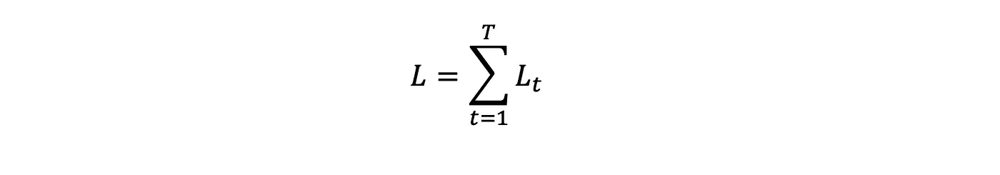

让我们试着找到**∂l/∂w**ₕ**ₓ**因为我们将需要它来进行梯度下降以更新**w**ₕ***ₓ****。*

接下来，**w**ₕ**t23】ₓ是输入权重矩阵(用于循环层连接的输入)，而 **W** ₕₕ是隐藏权重矩阵(用于从循环层到其先前输出的连接)。同时， ***W* ₒ** ₕ是输出权重矩阵(用于从递归层到输出的连接)。**

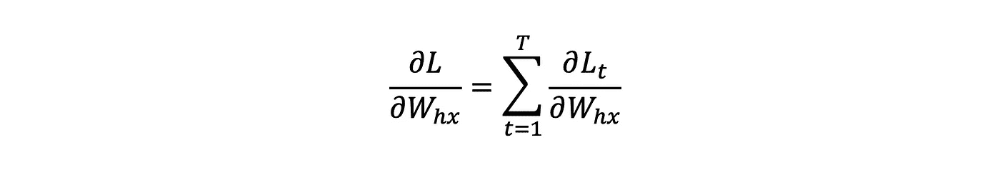

现在很明显，一旦我们找到**∂l**ₜ**/∂w**ₕ***ₓ***，我们就找到了我们的目标**∂l/∂w**ₕ**ₓ**。我们利用链式法则把它写成

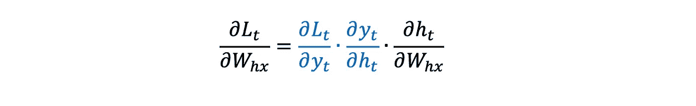

蓝色的两项很容易计算。对于第一项，损失是输出的直接函数，对于第二项，我们知道 yₜ=*f(****【wₒ】****【ₕhₜ+bₕ】*，所以在这两种情况下，只需要求导。

同时，对于第三个学期，我们需要记住

这意味着

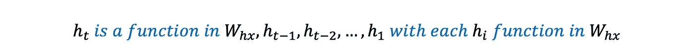

所以通过使用链式法则，我们可以写出

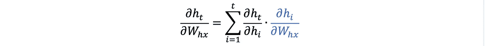

蓝色的项很容易计算，因为每个 h***【ᵢ】***都是ₓ.***w****中的直接函数*

> 请注意，如果我们想要使用[完美符号](https://mathworld.wolfram.com/TotalDerivative.html)，那么我们可能应该声明类似于 **h=f(…)** 的内容，然后在右侧使用 **f** 而不是 **h** ，但是我会这样保留它，因为除了其他原因之外，否则它看起来会更麻烦。

同时，对于另一个术语，我们似乎需要另一轮链式法则，因为

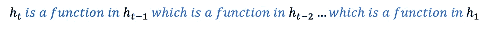

所以我们必须写

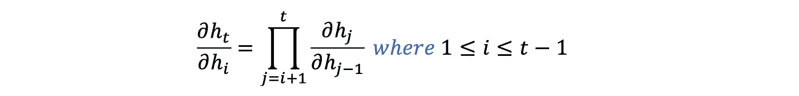

其中后插**∂h**t32】ₜt34】/∂wₕ**t37】ₓt39】产量**

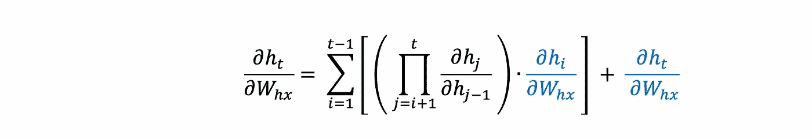

## 为什么会引起短时记忆？

现在，为了更仔细地观察消失梯度问题，让我们考虑一个 4 个单词的句子。这意味着 *t=4* 并且上面的表达式计算为

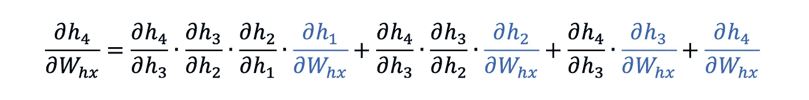

这我们可以认为是第四个词在***w****ₕ****ₓ****中更新权重的贡献。* 注意**考虑第一个词的唯一方法**是通过第一个词，这个词(正如我们将要展示的)预计非常小。因此，就好像它不存在，尽管它与第四项有任何关联。

结果是参数将被偏向于仅捕获训练期间的短期依赖性。产生一个神经网络，它不能确定是否选择“今天早上我看到的猫非常饿”。

为了支持第一项预计会很小的事实，我们需要观察

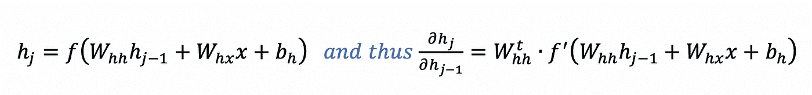

由于网络的初始化方式(通常来自正态分布)，权重自然很小，这同样适用于激活函数的导数，因为它通常是导数≤ 1 的双曲正切函数。用类似 ReLU 的东西替换 Tanh 可能只能解决部分问题。

## 我们能做些什么来阻止它们消失？

问题的根源显然是

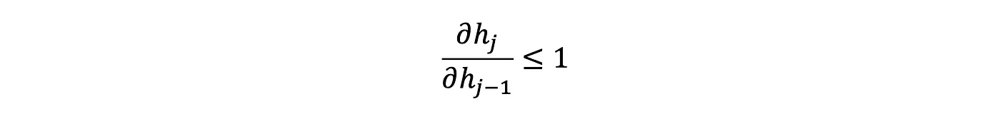

我们能否重新设计循环层，使其不再必要？假设，我们宁愿让隐藏状态 h 被定义为

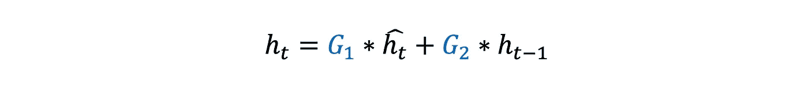

*是基于元素的产品

其中 **G₁、**g₂和 **ĥ** 中的每一个都是使用 **h** 作为先前隐藏状态的不同重现层的结果(它们都是它的函数)。

在这种情况下，我们有

我们不能再声称它总是≤ 1，即使这四项都成立。这个事实正是像 LSTM 和 GRU 这样的建筑用来克服梯度消失问题的。

杰奎琳·弗洛克在 [Unsplash](https://unsplash.com?utm_source=medium&utm_medium=referral) 上拍摄的照片

我们的故事到此结束。我们已经探索了 rnn 如何以及为什么会遭受短期记忆的困扰，以及可以做些什么来缓解这个问题。希望你觉得这个故事很容易读懂。下次见，再见。