# 使用 Python 和 Statsmodels 的 White 异方差一致性估计量教程

> 原文：<https://towardsdatascience.com/a-tutorial-on-whites-heteroskedasticity-consistent-estimator-using-python-and-statsmodels-7d38789150d1>


菲利普·D·T1 在 [Unsplash](https://unsplash.com/s/photos/spiral?utm_source=unsplash&utm_medium=referral&utm_content=creditCopyText) 上的照片

## 如何通过 Python 和 statsmodels 使用 White 的异方差一致性估计量

在本文中，我们将学习如何使用 HC 估计量来执行对异方差稳健的统计推断。

本文是以下两部分系列的第 2 部分:

[第 1 部分:介绍 White 的异方差一致性估计量](/introducing-the-whites-heteroskedasticity-consistent-estimator-821beee28516)
**第 2 部分:使用 Python 和 Statsmodels 的 White 异方差一致性估计量教程**

在第一部分中，我们深入研究了 White 的异方差一致性估计的理论。让我们快速回忆一下我们在第 1 部分中学到了什么。

考虑以下线性模型:


线性模型(图片由作者提供)

***y*** 是响应变量。对于大小为 *n* 的数据集，它是大小为*【n×1】*的列向量。假设模型有 *k 个*回归变量，包括截距。 ***β*** 是回归系数*【β_ 1，β_2，…β_ k】*的列向量，其中 *β_1* 是截距。 ***X*** 是回归变量的矩阵，包括矩阵第 1 列截距的占位符。 ***X*** 大小为*【n X k】*。

下面是等式(1)的矩阵形式:

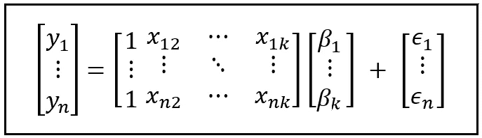

线性模型(图片由作者提供)

等式(1)的最小二乘估计为*产生以下估计量:*

*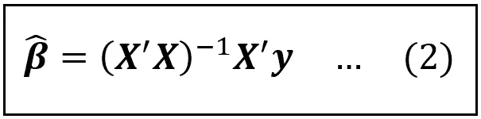*

**的 OLS 估计器(图片由作者提供)**

**由于估计系数 ***β_cap*** 是随机变量，因此它们具有方差-协方差结构，由以下协方差矩阵给出:**

**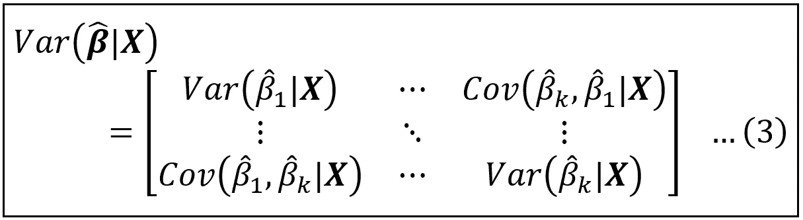**

**拟合回归系数的协方差矩阵(图片由作者提供)**

**该矩阵的对角元素是系数估计的标准误差，这些标准误差用于导出系数的 p 值和置信区间，换句话说，用于测试系数是否具有统计显著性并计算其精度。**

*****β_cap*** 的协方差矩阵使用下面的矩阵方程来估计(其解释和推导在第一部分中涉及):**

**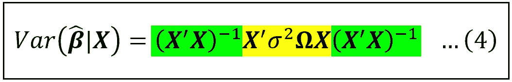**

**估计系数的协方差矩阵的公式(图片由作者提供)**

**上式中，**T5【X’**是***X****(-1)*算子的转置，对括号中的矩阵求逆。这个等式的核心是*σ****ω***，它是模型误差的以下*【n x n】*矩阵:**

**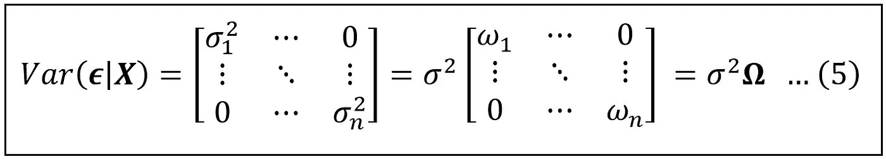**

**当模型误差为**异方差**和非自相关时，回归模型误差的协方差矩阵(图片由作者提供)**

***σ* 只是一个普通的比例因子，使得 *ω_i=σ _i/σ* 。当模型的误差为同方差(常方差)和非自相关(在横截面数据集中相当常见)时， *σ _i=σ* 对于所有 *i* 和 *ω_i=1* 对于所有 *i* 和***ω****=****I***，恒等式矩阵。在这种情况下，[可以看出](/a-deep-dive-into-the-variance-covariance-matrices-of-classical-linear-regression-models-4322b2cdc8e6)系数估计的协方差矩阵的公式简化为以下简单公式:**

**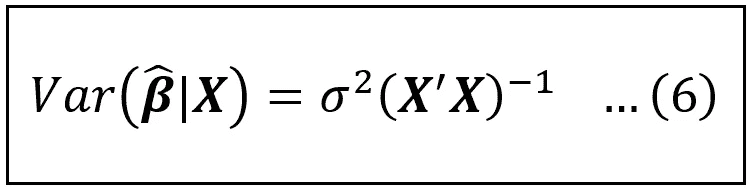**

**当模型误差为**同方差**和**非自相关**时，拟合回归系数的协方差矩阵公式(图片由作者提供)**

**由于 *σ* 不可直接观测，我们使用以下公式来估计协方差矩阵。这里 s 是拟合模型的残差的方差:**

**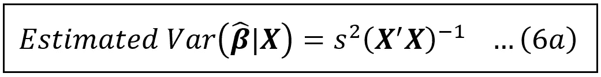**

**当模型误差为**同方差**和**非自相关**时，拟合回归系数的估计协方差矩阵的公式(图片由作者提供)**

**不幸的是，当模型的误差是同方误差时，我们不能使用等式(6)或(6a ),而必须回到等式(4)。在这个方程中，*σ****ω，*** 模型的误差的协方差矩阵本来就是不可观测的，所以必须进行估计。**

**为此，我们使用以下由 Halbert White 提出的估计量(也在第 1 部分中详细介绍)，或其改进之一(也由 White 随后提出):**

**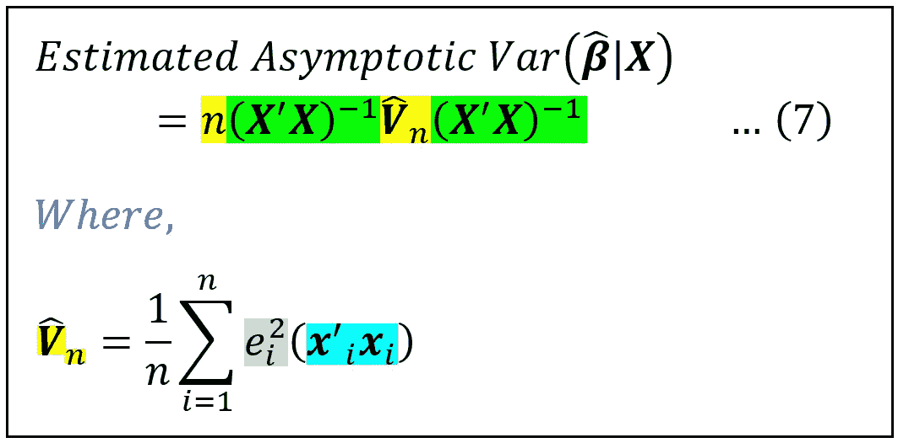**

**怀特的异方差一致性估计量(图片由作者提供)**

**式(7)中，e_i 为第 I 个预测值对应的拟合模型的残差:*e _ I =(y _ I—****X****_ I****β****_ cap】*其中***X****_ I*为第 I 行 ***X*** 。**

**在本文的其余部分，我们将把这些结果付诸实践。我们将看到在模型误差异方差的情况下，如何使用 White 的 HC 估计量对模型系数进行统计推断。**

**以下模型试图从几个社会经济因素来解释美国某县的贫困状况，具体来说，就是该县居民的年龄中位数、该县待售房屋的空置率以及该县至少拥有一个大学学位的人口比例。**

**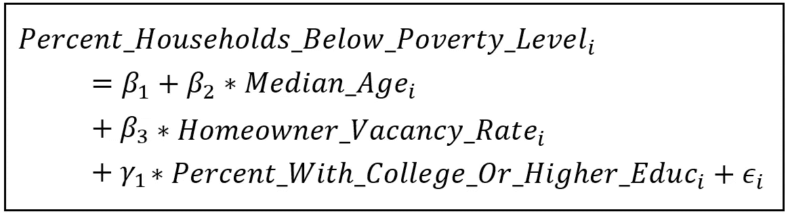**

**估算县级贫困的线性模型(图片由作者提供)**

**为了训练这个模型，我们将使用由美国人口普查局收集并在县一级汇总的几个社会经济指标的使用数据。该数据是美国人口普查局进行的 2015-2019 年美国社区调查(ACS) 5 年估计值的子集。下表包含我们将使用的数据(点击或单击图像进行缩放):**

**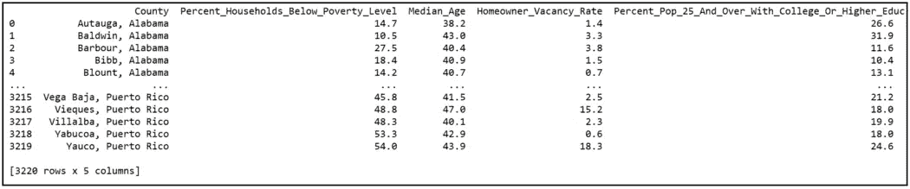**

**根据[使用条款](https://www.census.gov/data/developers/about/terms-of-service.html)从[美国人口普查局](https://www.census.gov/data/developers.html)提取的美国社区调查数据集的子集**

**本例中使用的数据集可以从这里 下载 [**。完整的 ACS 数据集可以使用**](https://gist.github.com/sachinsdate/0b8ebc2b26afb67a1e83e752c69e1a25)**[公开可用的](https://www.census.gov/data/developers/about/terms-of-service.html)[API](https://www.census.gov/data/developers.html)从美国人口普查局的网站上获取，或者直接从人口普查局的 [**社区资源管理器**](https://experience.arcgis.com/experience/13a111e06ad242fba0fb62f25199c7dd/page/Page-1/) 网站上获取。****

**我们将使用 Python 和 [Pandas](https://pandas.pydata.org/) 将 ACS 数据文件加载到内存中，并且我们将使用基于 Python 的 [statsmodels](https://www.statsmodels.org/stable/gettingstarted.html) 包来构建和拟合线性模型。**

**让我们从导入所需的包并将数据文件加载到 Pandas `DataFrame`开始:**

```
****import** pandas **as** pd
**import** statsmodels.formula.api **as** smf
**from** patsy **import** dmatrices
**from** matplotlib **import** pyplot **as** plt***#Load the US Census Bureau data into a Dataframe*** df = pd.**read_csv**(**'us_census_bureau_acs_2015_2019_subset.csv'**, **header**=0)**
```

**用 [Patsy](https://patsy.readthedocs.io/en/latest/quickstart.html) 语法构建模型的方程。Statsmodels 会自动将回归的截距添加到模型中，因此我们不必在模型的方程中明确指定它:**

```
**reg_expr = **'Percent_Households_Below_Poverty_Level ~ Median_Age + Homeowner_Vacancy_Rate + Percent_Pop_25_And_Over_With_College_Or_Higher_Educ'****
```

**建立和训练模型并打印训练摘要:**

```
**olsr_model = **smf**.**ols**(**formula**=reg_expr, **data**=df)olsr_model_results = olsr_model.**fit**()**print**(olsr_model_results.**summary**())**
```

**我们看到以下总结:**

**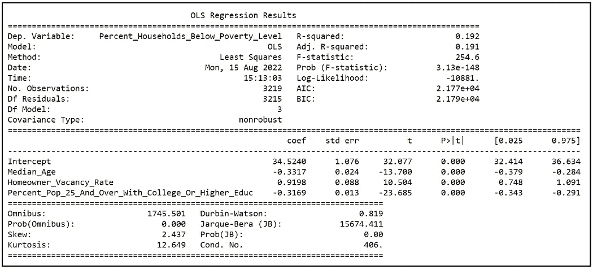**

**线性模型的训练总结(图片由作者提供)**

**我们将忽略 statsmodels 报告的 R 平方值(或 0.191 的[调整 R 平方值](/the-complete-guide-to-r-squared-adjusted-r-squared-and-pseudo-r-squared-4136650fc06c)，因为我们的兴趣在于估计[](/understanding-partial-effects-main-effects-and-interaction-effects-in-a-regression-model-54e8a127c62d')****【即系数估计值】，它们的标准误差和 95%置信区间，以及系数是否具有统计显著性。让我们放大输出的相关部分:******

******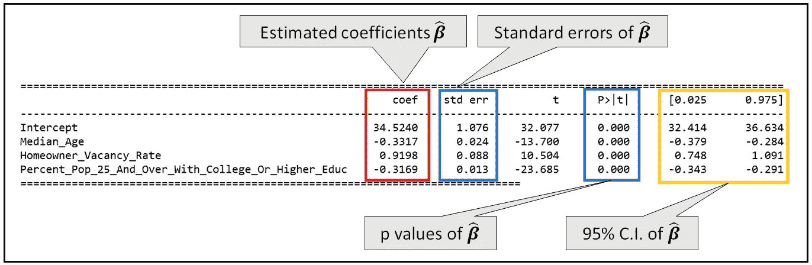******

******系数估计值、它们的标准误差、p 值和 95%置信区间(图片由作者提供)******

******我们看到所有的系数估计值在< .001\. By default, Statsmodels has assumed homoskedastic errors and accordingly used Eq (6a) reproduced below to calculate the covariance matrix of coefficient estimates which is further used to calculate standard errors, p values and confidence intervals.******

************

******The formula for the estimated covariance matrix of the fitted regression coefficients when the model’s errors are **同态分布**和**非自相关**的 p 处都是显著的(图片由作者提供)******

******我们已经看到，如果误差不是齐次的，那么上述公式将产生误导性的结果。因此，我们需要知道模型的误差是同方差的还是异方差的。******

******一个简单的异方差视觉测试包括绘制拟合模型的残差(模型误差的无偏估计)与响应变量的拟合值，如下所示:******

```
*********#Carve out the y and X matrices***y_train, X_train = **dmatrices**(reg_expr, df, return_type=**'dataframe'**)***#Get the predicted values of y from the fitted model***y_cap = olsr_model_results.**predict**(X_train)***#Plot the model's residuals against the predicted values of y***plt.**xlabel**(**'Predicted value of Percent_Households_Below_Poverty_Level'**)plt.**ylabel**(**'Residual error'**)plt.**scatter**(y_cap, olsr_model_results.resid)plt.**show**()******
```

******我们得到下面的散点图(画红线只是为了说明异方差):******

******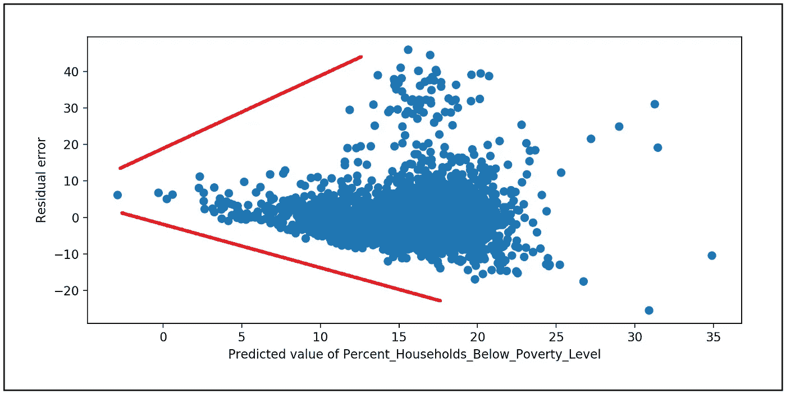******

******拟合模型的残差与响应变量的估计值的关系图(图片由作者提供)******

******模型的误差明显是异方差的，这应该使我们怀疑 statsmodels 报告的标准误差、p 值和置信区间。******

******幸运的是，statsmodels 允许您在拟合模型时使用几种异方差一致性估计量中的一种。这些被表示为 HC0、HC1、HC2、HC3 等。******

******第一个，HC0 是我们之前看到的 White 的原始异方差一致性估计量(复制如下):******

************

******怀特的异方差一致性估计量(图片由作者提供)******

******HC1、HC2、HC3 对 HC0 进行了改进，使其对小规模数据集的偏向性更小。MacKinnon 和 White 在他们 1985 年的论文中描述了后三种估计量。******

******我们将依次尝试这四种方法。在每种情况下，我们将拟合模型并打印出如下培训摘要:******

```
*********#Ask statsmodels to use the HC estimators***olsr_model_results = olsr_model.**fit**(cov_type=**'HC0'**)
**print**(olsr_model_results.**summary**())olsr_model_results = olsr_model.**fit**(cov_type=**'HC1'**)
**print**(olsr_model_results.**summary**())olsr_model_results = olsr_model.**fit**(cov_type=**'HC2'**)
**print**(olsr_model_results.**summary**())olsr_model_results = olsr_model.**fit**(cov_type=**'HC3'**)
**print**(olsr_model_results.**summary**())******
```

******让我们将所有 4 次训练的系数估计值叠加起来，并与原始的估计值进行比较:******

******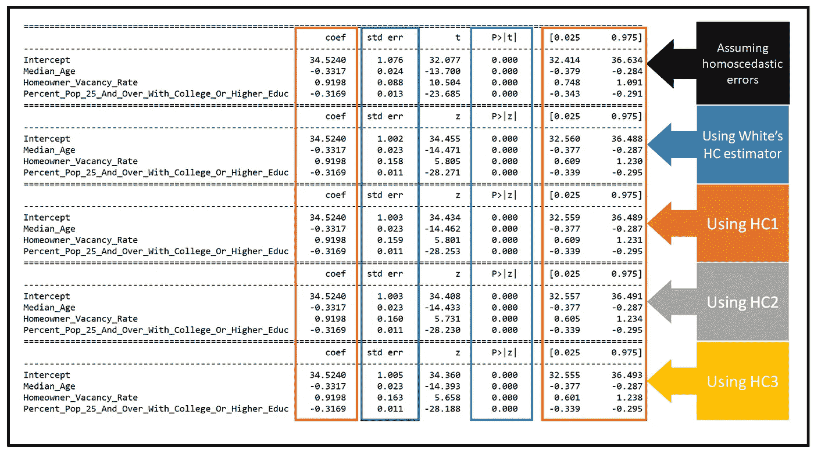******

******使用不同异方差一致性估计后的系数估计、标准误差和置信区间的比较(图片由作者提供)******

******第一组四行包含标准误差和置信区间，假设均方误差，即使用等式(6a)。下一组行包含使用不同 HC 估计值的估计值:HC0 到 HC3。我们看到，即使在使用 HC0 到 HC3 之后，所有系数在 p < .001\. This is good news. However, as expected, the standard errors of the coefficient estimates become larger and the corresponding C.I.s become wider after accounting for heteroskedasticity.******

******Let’s zoom into a portion of the above figure to see what we mean:******

******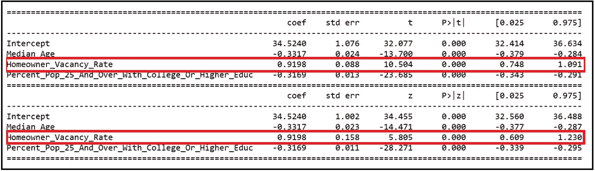******

******Comparison of coefficient estimates, standard errors and C.I.s assuming homoskedastic errors and using White’s HC estimator (Image by Author)******

******Let’s look at the data for the coefficient estimate of *房主空置率*下仍然具有统计显著性。在不考虑异方差误差的情况下，系数估计的标准误差为 0.088，但是当我们考虑异方差时，该系数的标准误差几乎翻倍，达到 0.158。******

******在不考虑异方差的情况下，*房主 _ 空置率*的系数估计的 95% C.I.s 为*【0.748，1.091】*。在考虑异方差后，它们变得更宽:*【0.609，1.230】*。******

******我们还看到，HC1 至 HC3 的使用导致 White 的 HC 估算器估算的标准误差向上微移，尽管幅度非常小。例如，HC3 估计*房主空置率*系数的标准误差为 0.163，与 HC0 报告的估计值 0.158 相比，仅“提高”了 3%。******

******无论如何，主要的收获如下:******

> ******面对异方差，回归模型的系数估计会失去精度。******

******因此，如果发现模型的误差是异方差的，这是横截面数据集中经常出现的情况，我们应该始终使用异方差一致性估计来对系数估计进行合理的统计推断。******

******下面是本文中使用的完整源代码:******

# ******参考文献、引文和版权******

## ******数据集******

******根据[使用条款](https://www.census.gov/data/developers/about/terms-of-service.html)，从[美国人口普查局](https://www.census.gov/data/developers.html)提取的美国社区调查数据集。******

## ******报纸******

******怀特，哈尔波特。"异方差一致性协方差矩阵估计和异方差的直接检验."*计量经济学*，第 48 卷第 4 期，1980 年，第 817–38 页。JSTOR ，[https://doi.org/10.2307/1912934.](https://doi.org/10.2307/1912934.)2022 年 9 月 25 日访问。 [**PDF 下载链接**](http://www-2.rotman.utoronto.ca/~kan/3032/pdf/GeneralizedMethodOfMoments/White_Econometrica_1980.pdf)******

******James G MacKinnon，Halbert White，具有改进的有限样本性质的一些异方差一致性协方差矩阵估计量，*计量经济学杂志，*第 29 卷，第 3 期，1985 年，第 305-325 页，ISSN 0304-4076，[https://doi . org/10.1016/0304-4076(85)90158-7。](https://doi.org/10.1016/0304-4076(85)90158-7.)([https://www . science direct . com/science/article/pii/0304407685901587](https://www.sciencedirect.com/science/article/pii/0304407685901587))[**PDF 下载链接**](https://www.econstor.eu/bitstream/10419/189084/1/qed_wp_0537.pdf)******

## ******形象******

******本文中的所有图片版权归 [Sachin Date](https://www.linkedin.com/in/sachindate/) 所有，版权归 [CC-BY-NC-SA](https://creativecommons.org/licenses/by-nc-sa/4.0/) 所有，除非图片下方提到了不同的来源和版权。******

*******如果你喜欢这篇文章，请关注我的*[***Sachin Date***](https://timeseriesreasoning.medium.com)*获取关于回归、时间序列分析和预测主题的提示、操作方法和编程建议。*******