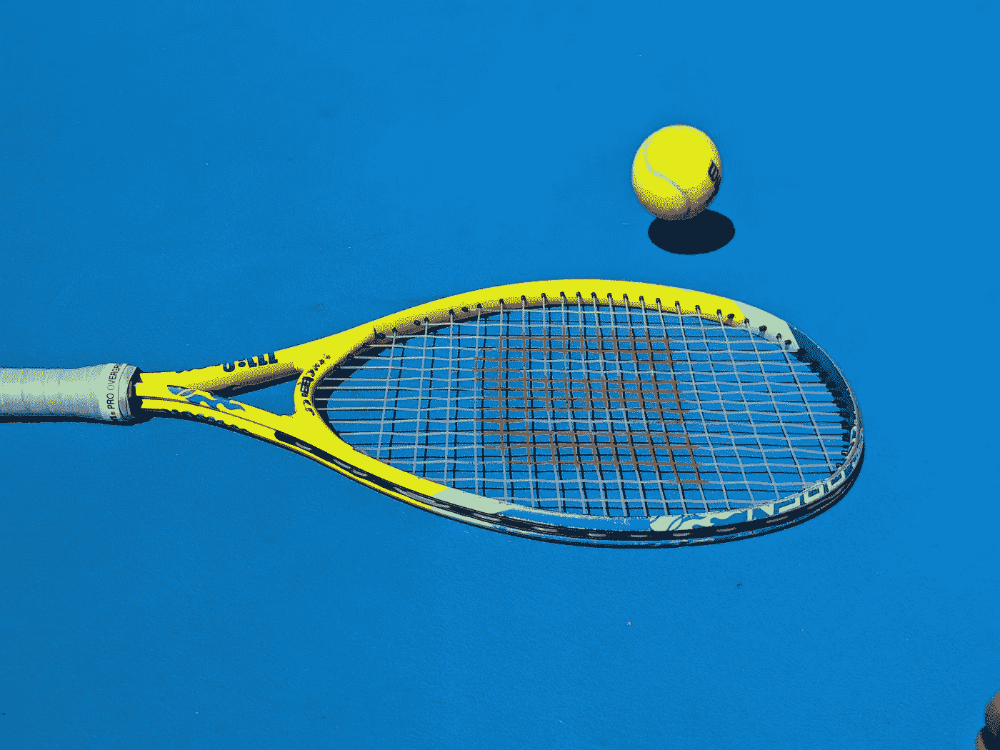
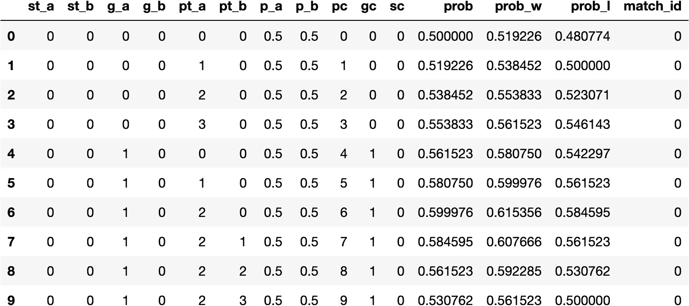
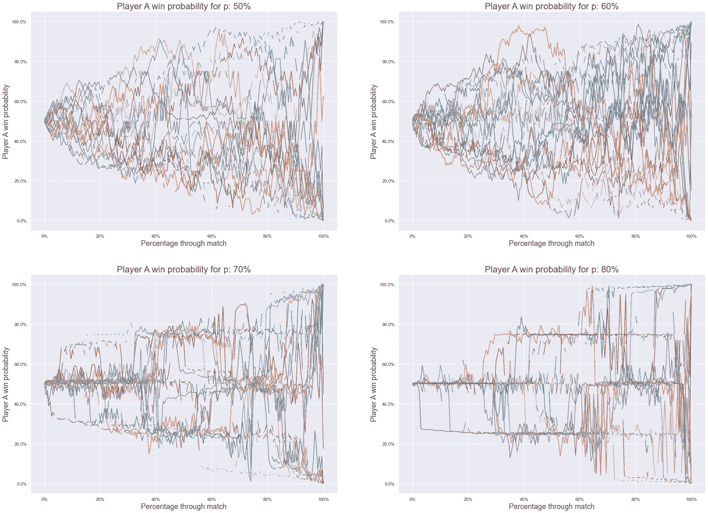
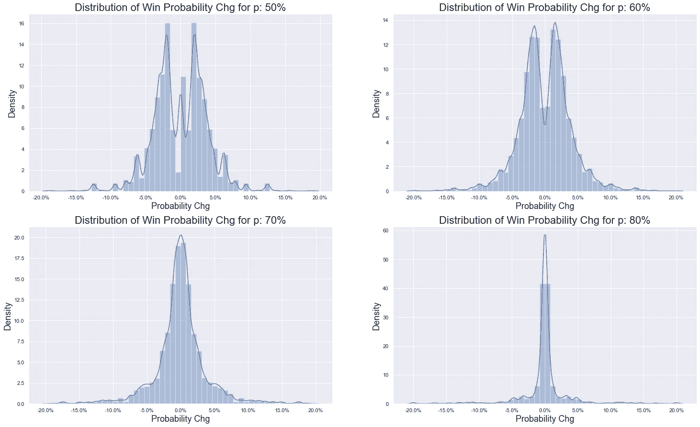
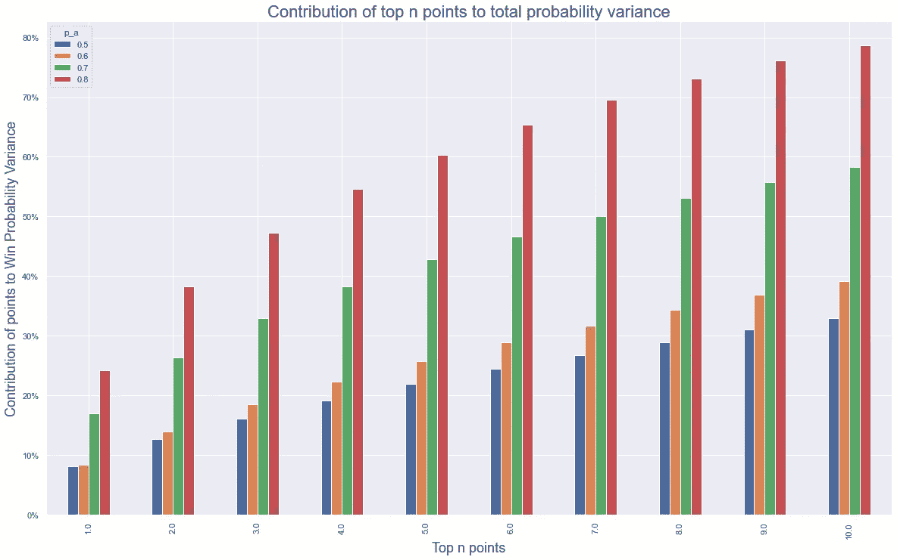
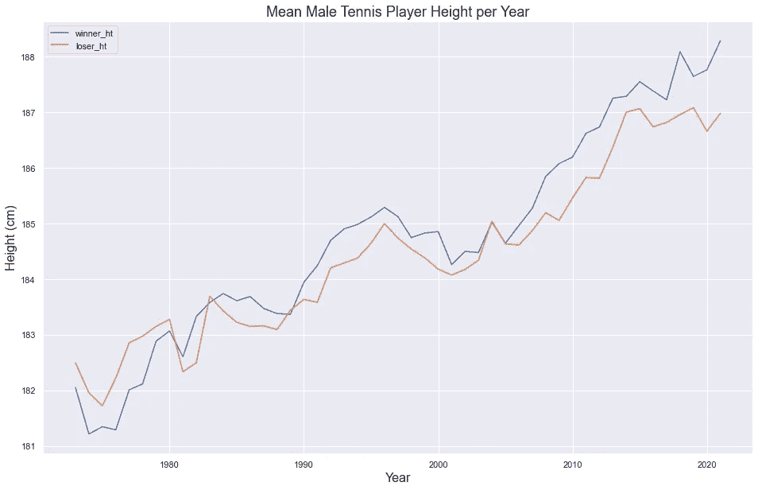
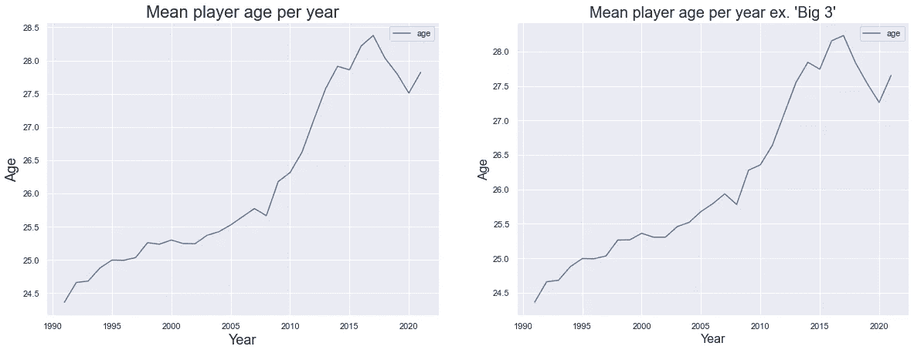
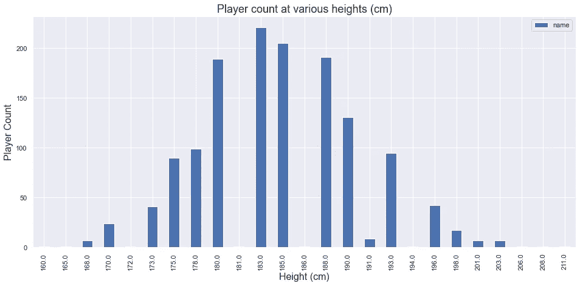
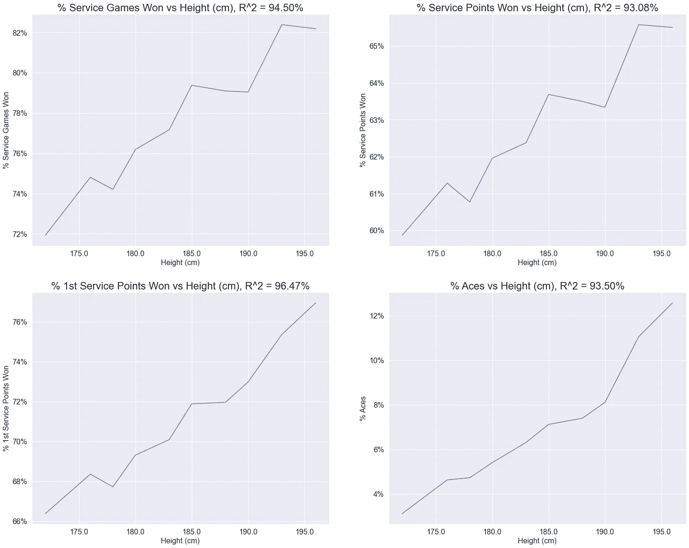

# 给网球电视的(不浪漫的)情书

> 原文：<https://towardsdatascience.com/a-unromantic-love-letter-to-tennis-tv-9daa4633ff81>



约瑟芬·加塞在 [Unsplash](https://unsplash.com/s/photos/tennis?utm_source=unsplash&utm_medium=referral&utm_content=creditCopyText) 上的照片

# 给网球电视的(不浪漫的)情书

## 用统计数据来证明满足我的 YouTube 瘾

今年的 ATP 巡回赛已经在澳大利亚网球公开赛之前开始了，拉法在墨尔本将冠军带回家——这使他打破了连续 19 个赛季获得冠军的纪录。鉴于这篇文章的标题，你可能会认为我是一个终生的网球超级粉丝，这是由令人印象深刻的青少年网球生涯或球场上的某种个人卓越所滋养的。现实是我:

*   几乎完全是将我的第一次发球打在网上
*   我对超过 10 次相当不稳定的地面击球的反弹感到兴奋

然而，自从去年[网球电视](https://www.youtube.com/channel/UCbcxFkd6B9xUU54InHv4Tig)(ATP 巡回赛的官方 YouTube 频道)进入我的生活，我现在几乎每天都看网球**。这篇文章试图理解为什么我觉得“YouTube 集锦”这种媒体对一项我并不感兴趣的运动如此有吸引力。像往常一样，这个过程将是完全过度设计这个想法，并在这个过程中证明在我的手机上升级我的 YouTube“应用程序时间限制”是合理的。**

## **亮点可以让你跟上这个季节的故事**

**背景很重要——这一点在我踢足球时变得非常明显。我对足球知之甚少，只够知道一支球队更有可能赢得英超联赛还是降级。但是语境是我和我的朋友在观看同一场足球比赛时产生以下两种观点的原因:**

*   **两个低于标准杆的球队正在努力将 5 次传球串在一起，目前是一场零进球的平局**
*   **两支以“坚韧风格”著称的球队之间的史诗般的赛季结束保级战**

**网球也是如此。正如每日比赛让足球迷能够了解赛季故事和相关比赛一样，跨越多场比赛的每日 YouTube 集锦也给了网球迷同样的机会。这很有帮助，因为关注网球开始需要更多的努力。**

## **网球赛季的故事过去很容易理解**

**“三巨头”的出现和后来的统治地位意味着，以前关注网球并不需要太多——只需要关注 3 名球员(德约科维奇、费德勒和纳达尔)，因此只需要 3 场面对面的比赛。这听起来可能有点夸张，但在过去的 18 年(2004 年至 2021 年)中，他们赢得了 71 个大满贯中的 59 个——这超过了每 5 场比赛中的 4 场，其中 8 年完全由他们主导。**

**鉴于这样的统治地位，以及由此而来的关于哪些球员将在“大赛”中扮演重要角色的决定论，真的没有必要去关注这个赛季剩下的比赛。这种情况正在改变。随着德约科维奇的统治地位开始受到新一批人(梅德韦捷夫、泽维雷夫等)的挑战，不再有同样的一小群球员宣称接近类似的统治地位。**

**有 3 名玩家，就有 3 名玩家紧随其后——这只是对[二项式系数](https://en.wikipedia.org/wiki/Binomial_coefficient)——“3 选 2”的陈述。8 个玩家会有 28 个，20 个玩家会迅速增加到 190 个。随着统治地位在比赛顶部的下滑，观看网球比赛以跟上赛季故事的数量增长非常快。你必须开始看大量的网球比赛，以防止最终看完一场大满贯半决赛，并努力说出两个“未知”的名字。亮点使这更容易跟随，在一个很酷很酷很酷的 10 分钟编辑中瞥见一场锦标赛的最后 8 场比赛。**

**然而，这就引出了一个真正的问题:即使你*能看完所有的网球比赛，你还想看吗？尽管我喜欢在运动中安顿下来，但对我来说，答案是响亮的不。***

## **大多数网球都不是网球**

**大多数网球比赛实际上并不是运动员在他们之间来回击球。现在，这不一定是网球特有的问题，也困扰着其他运动(最明显的是过度统计的美国运动)，但值得记住。事实上，据估计[一场网球比赛中只有 17.5%的比赛是用球进行的](https://www.wsj.com/articles/SB10001424127887323932604579053172340374060)——这个 reddit 帖子证实了这一点(reddit 仅在可信度上被维基击败)。花费了大量的时间:**

*   **改变结局**
*   **游戏间隙**
*   **服务点之间的间隔**
*   **[卫生间休息](https://www.youtube.com/watch?v=hoY_VBBinIk)**
*   **[更多的洗手间休息时间](https://www.youtube.com/watch?v=kX9hNtQHJS0)**

**自从疫情开始以来，这种情况变得更加严重，球员们不得不在两局之间自己拿毛巾。**

## **大多数网球都不是“激动人心的网球”**

**就像这篇文章中的大多数观点一样，网球中的大多数观点并不那么有趣。希望这不是*那个*有争议的声明，但即使如此，这也是我试图完全过度设计问题来证明这一点的地方。要做到这一点，需要定义在网球比赛中是什么让一分“激动人心”。对我来说，它是以下之一(或者最好是组合):**

*   **它包含一个闪光弹(灼热的胜利者，tweener，一些其他 sikkkkk 技能或[任何 Dimitrov 反手](https://www.youtube.com/watch?v=JfTz7zcaSsI)——跳到 1:02 分钟)**
*   **它包含一个长时间的反弹，最好有一点动量摆动**
*   **这很重要**

**现在前两者很难衡量，但是根据定义，在任何特定的网球比赛中都会很少。两者都是相对于平均值来定义的(“闪耀”和“长”)，所以根据定义，它们会很少，所以如果这是你所追求的，那么无论如何高光是适合你的。**

**最后一点更容易量化——一分有多重要可以被认为是它对你赢得整场比赛(不仅仅是这场比赛或一盘比赛)的机会有多大的影响。为了量化“机会”,我们需要一个模型。**

## **基于点的建模**

**我们对比赛中哪些分数最重要有一个直观的理解。赛点非常重要。设定点也是如此。此外，作为一个整体的平局打破和标准破发点。让这些观点有趣的(也确实存在的)是网球评分系统的离散化。可以说，评分系统是提升网球运动整体水平的关键。如果我们不在网球比赛中酌情计分，那么类似于大数定律(LLN)的东西就会出现，使它成为一件相当无聊的事情。这是因为如果我们简单地进行一场 100 分的比赛，那么稍微好一点的玩家总是会赢——这可以用[“分数问题”](https://en.wikipedia.org/wiki/Problem_of_points)从数学上证明。**

**为了给这种说法添加一点数学知识，让我们引入“基于点的建模”(太聪明了，不是我的原创想法)。简单来说，这个理论是这样的:**

*   **两名球员打网球，`a`和`b`**
*   **每个人发球和回球**
*   **给他们每个人一个概率，让他们在发球时赢得任何给定的分数{ `p_a`，`p_b` }，因此回球时获胜的概率是{ `(1 - p_b)`，`(1 - p_a)` }**
*   **现在为网球规则写一个算法，并根据谁在发球使用上述概率模拟每一分**
*   **让算法在网球规则中运行，随机模拟每一点，直到规则规定比赛结束**

**作为一个例子，如果我给两名球员 100%的机会赢得他们自己的发球(即`p_a = p_b = 1.0`)，那么我们将模拟`a`先发球:**

*   **`a`连得 4 分赢得第一局(1-0)**
*   **`b`连得 4 分赢得第二场比赛(1-1)**
*   **`a`连得 4 分赢得第三局(2-1)**
*   **等等等等**

**一旦我们用`0 < {p_a, p_b} < 1`引入一点随机性，我们就会得到更有趣的结果，但过程是一样的——模拟每一点，算法会在整个比赛中发挥作用，直到我们以胜利者结束。**

## **现在我们有了一个模型，我们能用它做什么呢？**

**像往常一样，对于“足够小”的问题，我们有两种方法来计算某件事情发生的概率:**

*   **暴力破解:在网球比赛中，从给定的起点模拟一系列比赛，计算`a`获胜的次数，然后除以模拟的比赛总数，得到`a`获胜的概率**
*   **封闭形式:从任何给定的起点推导出一个公式来表示获胜的概率**

**幸运的是，由于时间原因，我们可以使用后者。这里的理论很大程度上依赖于组合学，并且由于网球的来回性质(发球、接发球、发球等)。)随着抢七局的到来，比赛变得有点复杂。幸运的是，这里的[和这里的](https://www.seas.upenn.edu/~bhusnur4/cit592_fall2013/NeKe2005.pdf)和解释得非常简单，我已经将它们打包成一个简单的 python 包，名为 [tennisim](https://mjam03.github.io/tennisim/) 。**

**考虑到这一点，我们可以进行以下操作:**

*   **模拟一系列网球比赛(为了简单起见，我们可以用`p_a = p_b`来模拟)**
*   **在比赛的每一点，根据我们的基于点数的模型，计算出玩家`a`赢得比赛的概率**

## **太好了，但是这个概率和激动人心的网球得分有什么关系呢？**

**正如我们可以认为一分如果不改变我们赢得整场比赛的整体机会就完全无关紧要(就像足球比赛中输的球队在 10 比 0 落后时被罚点球)，我们可以认为“激动人心的分”是大大改变我们赢得比赛的概率的分。如上所述，这些可能是:**

*   **赛点**
*   **设定点(当设置关闭时)**
*   **平局决胜(当集合根据定义已经接近时)**
*   **断点**

**换句话说，所有的分数都是因为网球有一个离散的计分系统而存在的。因此，如果我们获胜的概率在某一点上变化很大，那么这可能是一个令人兴奋的观察点。**

## **让我们模拟一些比赛**

**让我们从模拟每对概率的 1000 个匹配开始`{p_a, p_b}`，为了简单起见，我们设置`p_a = p_b`。**

****

**图片作者。输出数据帧，其中每行对应模拟比赛中的一点。**

**在尝试做任何花哨的事情之前，让我们先看看数据，看看事情是否有意义。让我们为每个“概率对”`{p_a, p_b}`选取 25 个匹配，并绘制概率序列在整个匹配中的表现。我们应该期望他们:**

*   **以 50/50 开始(因为我们在开始时将我们的玩家设置为同样优秀，即`p_a = p_b`)**
*   **玩家`a`要么最终获胜(1)，要么输掉比赛(0)，要么以 1 或 0 结束**
*   **始终平稳地波动**
*   **在任何一点上最大波动 0.5(这个 0.5 只发生在最后一盘抢七或最后一局平手)**

**让我们对分数进行分类，这样我们就可以根据一场比赛的百分比而不是绝对分数*(因为每场比赛会略有不同)来绘制分数，然后绘制分数。***

****

**作者图片**

**我们在看什么？**

*   **正如预期的那样，所有路径都以 50/50 开始，并朝着玩家`a`前进，要么赢(100%)要么输(0%)**
*   **很明显，50%的路径比 80%的路径更像“随机漫步”，80%的路径看起来有点跳跃——80%的一些点在最后从 50%跳跃到 0%/100%**
*   **60%和 70%的匹配介于两者之间，因为随着一些大的跳跃，路径变得更加确定**

**作为直接观察，我们可以假设如下:**

***“如果球员在发球方面相对更好，那么比赛的大部分时间似乎不是很重要(阅读:不有趣)，相对较少的分数决定了比赛的整体结果”***

**在解释为什么之前，让我们试着通过以下方式让这听起来更有说服力一点:**

*   **试图用统计学把上面的陈述变成数字**
*   **试图使用听起来很花哨的词来听起来更有说服力**

## **“概率变化”的分布是什么样的？**

**假设我们现在要看“元分布”，即潜在变量是概率本身的概率分布，让我们通过将“概率 chg”(上图中的波动)重命名为“兴趣”来简化事情。现在我们可以:**

*   **对图上的上述线求一阶差分，得到每个点的“兴趣”**
*   **根据概率对绘制它们`{p_a, p_b}`**

****

**作者图片**

**因此，当我们不把每场比赛看做一个时间序列时(而只是从每个`{p_a, p_b}`对的所有点的横截面来看)，似乎在球员赢得更多自己的发球得分的比赛中，有更多的得分对比赛几乎没有影响——上面显示的是 0%左右越来越紧密的分布，其中 0%代表一个完全无关紧要的点。**

**但是，鉴于我们已经消除了时间序列元素，我们可能会在右下方的分布中屏蔽以下内容:**

*   **大多数`p_a = p_b = 80%`比赛令人难以置信的无聊，没有有趣的分数**
*   **一些`p_a = p_b = 80%`匹配是令人难以置信的史诗，包含了分布尾部所有有趣的点**

**为了验证这一点，我们可以看看:**

*   **计算比赛特定统计数据(计算统计数据*在*每个时间序列内)**
*   **为了方便起见，将这些特定比赛的统计数据进行平均(或者只显示它们的分布以获得更完整的图片)**

## **让我们来看看方差**

**鉴于上述分布看起来很钟形，虽然越来越厚尾，看看赢概率的方差可能是一个有用的措施。首先，让我们看看每场比赛获胜概率的总方差，它是给定服务概率对的所有比赛的平均值:**

```
df_res[['p_a', 'p_b', 'match_id', 'prob_chg']].groupby(['p_a', 'p_b', 'match_id']).var().groupby(['p_a', 'p_b']).mean().rename(columns={'prob_chg':'Var(Prob Chg)'})
```

****

**作者图片**

**有意思。这是一个相当无量纲的量，但趋势很明显。尽管我们上面说过，看起来以前看起来“无聊”的比赛实际上在获胜概率上产生了更多的变化。然而，我们忽略了一些事情:**

*   **差异发生的地方:有可能所有的差异都发生在一场比赛的最后，所以你必须看完整场比赛才能得到好东西**
*   **多少分构成了最大的差异:如上所述，看起来`p_a = p_b = 80%`游戏似乎在很大程度上被一些大的偏差所支配**

**为了深入了解这一点，我们可以做以下事情:**

*   **在每场比赛中，根据分数的“兴趣”大小(获胜概率的变化)对分数进行排名**
*   **计算每次匹配的方差**
*   **计算顶部`n`点对方差的贡献(如果我们取所有能提供 100%方差的点)**
*   **在给定概率对的所有匹配中平均这些百分比贡献**

****

**作者图片**

**上面的图表显示了什么？**

*   **在最左边，我们可以看到对于`p_a = p_b = 50%`,“最有趣的点”占总兴趣的不到 10%,而对于`p_a = p_b = 80%`我们接近 25%**
*   **在最右边，我们可以看到对于`p_a = p_b = 80%`，几乎 80%的变化都是由 10 个最大的点来解释的**

**换句话说，虽然这些比赛确实有更多的差异，但这种差异高度集中在选定的几个点上，对比赛的其余部分没有太大影响。**

## **为什么？为什么会这样呢？**

**在极端的情况下，我们可以想到`p_a = p_b = 100%`——每个球员都有把握赢得自己发球的每一分。抛开游戏永远不会结束的事实(你会永远被锁定在第一盘抢七)，它说明了上述的限制。每盘由 12 场完全没有意义的比赛组成，这 12 场比赛肯定会导致决胜局。随着`p_a = p_b = 80%`的出现，它不像现在这样极端，但它正在向那里发展。事实上，以 80%的概率赢得任何给定点数的给定发球游戏的概率是 98%。**

**即使你在你的发球比赛中落后 1 分(即 0-15 分),有 80%的机会在你的发球中赢得一分，你仍然有 93%的机会最终赢得比赛。这意味着大部分比赛都很无聊——用通俗的话来说，就是“发球机器人”连续 12 场比赛不停地发球得分，直到你达到 6-6，然后在抢七中决定整个比赛。或者，其中一个发球机器人出现了短暂的故障，被打破了(这种情况不太可能发生，但有可能发生)，在这种情况下，这一局几乎肯定结束了，将以 6-4 结束，但仍然只有一个短暂的“感兴趣”的时刻。如上所述，这是忘记了技巧击球和史诗般的对打——然而，随着越来越多的点数开始变得越来越不均衡(更好的发球),这些也不太可能发生。**

## **那么自动柜员机 ATP 在哪里？**

**鉴于以上所述，这感觉有点像一个引导性的问题。站出来说我们正处于`p_a = p_b = 50%`的场景中，这真的会打乱我过于费力的观点，即 YouTube 强调的是跟上游戏的前进方向。**

****答案是大约 65–70 %,但这看起来会随着顶级球员的身高继续上升。**让我们提供一些数据来支持这种说法，而不是未经证实就把它扔掉。我们可以利用杰夫·萨克曼(Jeff sack Mann)编制的数据库，这为他的数据密集型网球网站 [tennisabstract](http://www.tennisabstract.com/) 以及他运营的令人惊叹的博客“Heavy Topspin”[here](http://www.tennisabstract.com/blog/)提供支持。原始数据文件可以在[这里](https://github.com/JeffSackmann/tennis_atp)找到。让我们把数据拉进来，看看随着时间的推移，网球运动员的平均身高。**

****

**作者图片**

**因此，自 20 世纪 70 年代初数据库开始以来的过去 50 年中，这是一个非常明显的趋势。为什么？因为他们发球更好——发球是你的一次机会(一次机会),让你可以先发制人。这种身高趋势不会比现在的前 4 名更明显。抛开 6 英尺 2 英寸的德约科维奇不谈，以下三位都是新球员的一部分，他们分别是:**

*   **梅德韦杰夫 6 英尺 6 英寸高**
*   **泽维雷夫身高 6 英尺 6 英寸**
*   **齐蒂帕斯 6 英尺 4 英寸**

**为了证明身高和服务能力之间的关系，我们可以使用一些数据——杰夫在 2017 年[这里](http://www.tennisabstract.com/blog/2017/09/04/how-much-does-height-matter-in-mens-tennis/)展示了一些数据。同样，使用 Jeff 的数据，我们可以看到一些常见的发球指标是如何与身高相关的。这些指标是:**

*   **赢得服务游戏的百分比**
*   **SPW:赢得了%的服务点(这是我们在上述模型中的`{p_a, p_b}`)**
*   **第一次发球得分:第一次发球得分的百分比**
*   **得分率:得分的发球的百分比**

**为了计算这些，而不是只查看数据库中的每一场 ATP 比赛，我们希望确保一些已经存在了一段时间的球员不会过多地扭曲我们的统计数据。换句话说，如果我们有一个异常出色的 5 英尺 9 英寸的发球手，他在 10 年里打了每一场 ATP 比赛，那么当我们对身高和这些数据之间的平均关系感兴趣时，这个球员将产生不成比例的影响。**

**为了解决这个问题，我们将利用棒球中广泛使用的一个概念，叫做[‘季节年龄’](https://www.mlb.com/glossary/miscellaneous/baseball-age)。25 岁在棒球中被广泛使用，但是我们可以看看我们样本中网球运动员的平均年龄来决定什么年龄最合适。**

****

**作者图片**

**因此，即使排除“三巨头”，ATP 球员的平均年龄也在变老。看着上面的内容，让我们把 27 岁作为我们下面衡量标准的基础。在我们计算它们之前，让我们检查一下我们的身高分布是什么样的，以及我们是否需要对我们的身高进行分类。**

****

**作者图片**

**奇怪的是，对于一名 ATP 球员来说，看起来唯一比身高 175 厘米(5 英尺 9 英寸)更糟糕的事情就是身高 181 厘米或 186 厘米。事实上，这可能只是一个数据问题。让我们“修正”一下我们的身高数据，这样我们就能得到下面更平滑的分布。我们也将斗尾。**

****

**作者图片**

**最后，让我们选择我们的“27 岁赛季”数据，并计算我们的服务统计。**

****

**作者图片**

**以上 4 张图显示了身高和我们的指标之间的关系，每个指标都显示了身高对于发球优势的重要性。还计算了 r 平方值，结果显示，平均而言，每个指标中 90–95%的变化都可以用身高来解释。引人注目。**

## **请包起来**

**那么——我们展示了什么？**

*   **就像其他运动一样，集锦提供了一个很好的方式来跟上一个赛季的故事——随着男子网球中目前出现的“统治稀释”，这一点变得越来越重要**
*   **网球的大部分时间都没有花在打网球上**
*   **打网球的大部分时间可能是无关紧要的网球，但这在多大程度上是真实的取决于球员的服务能力**
*   **目前，ATP 巡回赛选手的平均发球能力并没有*那么令人担忧*，但是随着越来越高的顶级职业选手的趋势继续，更多的网球比赛将包含相当“无聊”的分数**

**因此，我觉得完全有理由继续我早上的例行公事，狼吞虎咽地吃掉网球电视放在我面前的任何东西。尤其是[这个](https://www.youtube.com/watch?v=Z8KL7fRQvfI)。而[这个](https://www.youtube.com/watch?v=VKd-zUQUDvg)。还有[这个](https://www.youtube.com/watch?v=NfSz-o99iB8)也是。我是说，这些都是好东西，你应该去看看。**