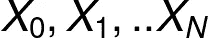
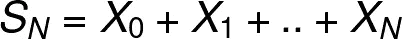
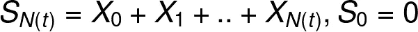
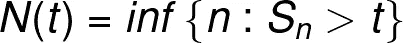
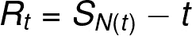
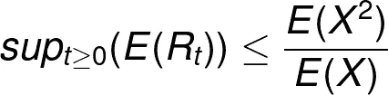
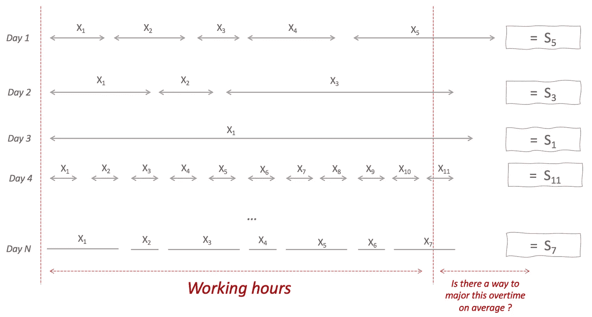
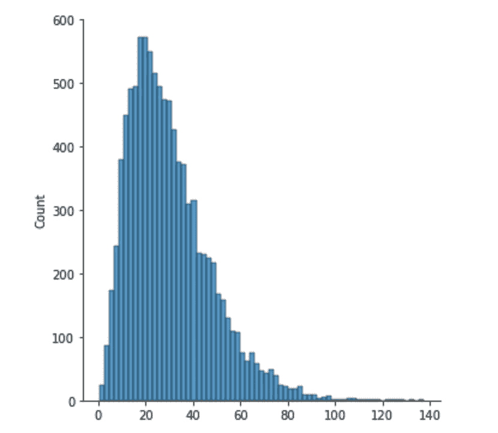
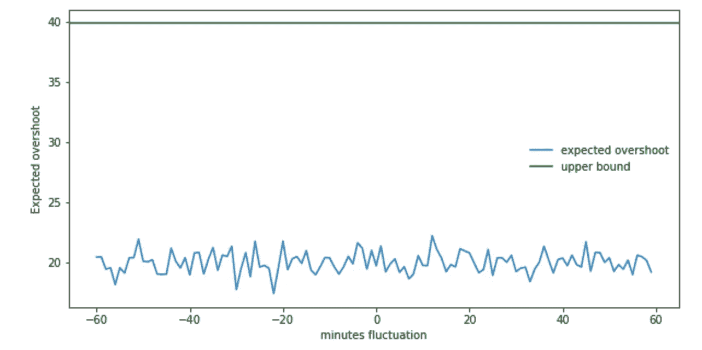

# 洛登不等式的一个用例

> 原文：<https://towardsdatascience.com/a-use-case-for-lordens-inequality-d701dc7f1ccc>

## 一个非常有用的概率不等式的典型假想用例。


照片由 [papazachariasa](https://pixabay.com/fr/users/papazachariasa-12696704/) 在 [pixabay](https://pixabay.com/fr/photos/d%c3%a9-pari-jeu-la-chance-cube-casino-5029548/) 上拍摄

爱丽丝是一个勤奋且非常有条理的人。她总是根据一个完全适合她的系统来运作，并让她保持一如既往的效率。随着时间的推移，她养成了一个特殊的习惯，那就是把项目分解成随机占用时间的子任务。在一天中，她可能有一个任务，也可能有十几个。

爱丽丝对自己的工作有自己的规定:她不完成最后一项任务就不回家，工作时间结束后也不开始新的任务。


作者图片

有一次，在完成一个她已经做了一年的长项目后，在回家的路上，她忍不住问自己以下问题:她能找到一种方法来估计她平均加班时间的上限吗？我们将帮助她完成她的使命:)

## 模型和实验:

爱丽丝提出的问题可以通过一个不为公众所熟知的概率属性来解决，这个属性是由`Gary Lorden`在他 1970 年的论文`On Excess over the Boundary.`中提出的

完成单个子任务所需的时间是一个随机变量。我们将把所有子任务的时间长度视为独立且同分布的随机变量:



作者图片

我们将指定另一个随机变量作为所有子任务的所有周期的总和。



作者图片

同样，我们将参考下一个量:



作者图片

作为工作时间后完成的最后一个子任务结束前的所有持续时间的总和，N(t)定义如下:



作者图片

超额的定义如下:



作者图片

这也被称为**过冲**。

`Lorden's inequality`声明如下:



作者图片

也就是说，每当我们在超过某个正数的条件下有停止时间的累积和时，我们总是可以用子任务分布的不同矩来表示它。基本上，这个问题可以描述如下:



作者图片

让我们进行一个演示。首先，我们装入一些原料:

```
import numpy as np
import seaborn as sns
import matplotlib.pyplot as plt
```

接下来，我们构建随机函数来帮助我们模拟解决方案:

我们将假设任务的持续时间是根据`Gamma distribution`分布的，T3 也被广泛用于建模**等待时间**。为了清楚起见，我们将下一个参数归属于该分布并将其可视化。

```
shape = 3
scale = 10
N_samples = 10000X = generate_gammas(shape, scale, N_samples)sns.displot(X)
```



作者图片

让我们写下一个函数，它采用分布参数和阈值来实现**过冲**。(在另一个用例中，您可以尝试插入不同的生成发行版) :

这里有一个全局函数来模拟几天内的超调量(几次实验) :

作为第一个例子，我们运行了一整年的模拟，也知道 Alice 一天工作从不超过 8 小时:

```
>>> N_worked_days = 365
>>> working_time_in_minute = 8 * 60 # 8 hours>>> run_experiments_for_one_excess(shape, scale, working_time_in_minute, N_worked_days)20.25803262081924
```

让我们计算二次分布的矩与一次分布的矩之比(期望值):

```
>>> X = generate_gammas(shape, scale, 100000)
>>> X_2 = np.power(X, 2)
>>> upper_bound = np.mean(X_2) / np.mean(X)
>>> upper_bound39.87780646001634
```

我们稍微调整了一下 Alice 的工作时间，看看这是否会影响她的加班时间:

更清晰的图像:

```
fig, ax = plt.subplots(figsize=(10,5))graph = sns.lineplot(range_fluctuation, experiments, label = "expected overshoot")
graph.axhline(upper_bound, color = "g", label = "upper bound")

ax.set_xlabel("minutes fluctuation")
ax.set_ylabel("Expected overshoot")
ax.legend(frameon=False)
plt.show()
```



作者图片

`Lorden’s inequality`肯定地告诉我们，即使过冲阈值波动，确定的上限仍然成立。这是因为上限只取决于任务持续时间的分布。

## 结束语:

我们在不等式的使用中没有提到一个重要的假设，因为分布的选择直接涉及到它。肯定是正面的。使用其他分布(如正态分布)会部分损害该属性，除非我们使用一个远离 0 且标准偏差非常低的平均值(类似狄拉克)。这样，我们可以确保——在我们的例子中——我们不会陷入负工期。
请随意将伽马分布替换为规范中注释的均匀/正态分布。

## 参考资料:

[关于超限界](https://projecteuclid.org/journals/annals-of-mathematical-statistics/volume-41/issue-2/On-Excess-Over-the-Boundary/10.1214/aoms/1177697092.full)