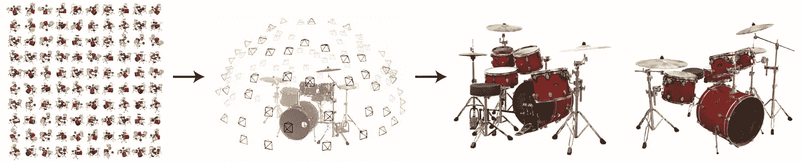
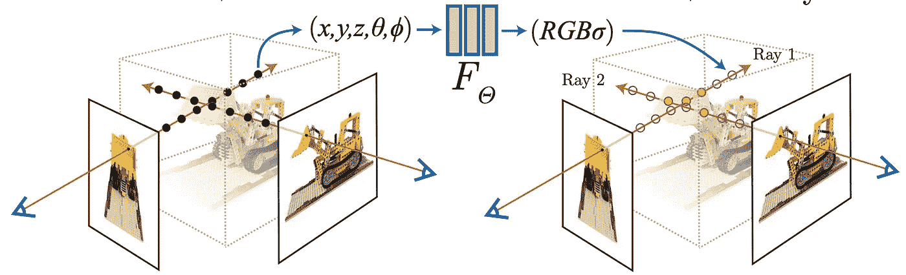
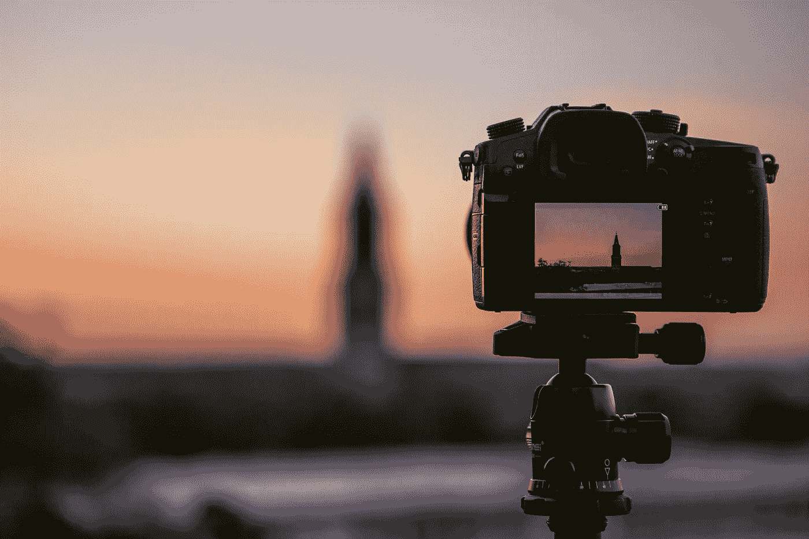

# 神经辐射场(NeRF)的基本概述

> 原文：<https://towardsdatascience.com/a-very-basic-overview-of-neural-radiance-fields-nerf-db4a0d4c391b>

## 它们有一天能取代照片吗？

图一。NeRF 管道。给定一大组图像，NeRF 学会隐式地表示 3D 形状，以便稍后可以合成新的视图。图片由[米尔登霍尔](https://arxiv.org/abs/2003.08934)等人从原始 NeRF 论文中检索而来。

深度学习时代始于它在传统 2D 图像识别任务(如分类、检测和实例分割)中带来的进步。随着技术的成熟，基于深度学习的计算机视觉的研究已经转向基本的 3D 计算机视觉问题——其中最值得注意的是合成物体的新视图，并从图像中重建其 3D 形状。许多方法将此作为传统的机器学习问题来解决，目标是在有限的一组训练迭代之后，学习系统从图像中“膨胀”出 3D 几何形状。然而，最近，一个全新的方向，即神经辐射场(NeRF)，已被引入。这篇文章深入探讨了最初提出的 [NeRF](https://arxiv.org/abs/2003.08934) 的基本概念以及近年来它的几个扩展。

# 隐式表示几何图形

用于 3D 重建的 NeRF 模型和传统神经网络之间的最大区别在于 NeRF 是对象的特定于实例的隐式表示。

简而言之，给定从多个角度捕捉相同对象的一组图像以及它们相应的姿态，网络学习表示 3D 对象，使得新的视图可以以与训练视图集一致的方式合成。

# **从基本的 MLP 开始**

图二。NeRF 培训概述。由[米尔登霍尔](https://arxiv.org/abs/2003.08934)等人从原始 NeRF 论文中检索的图像。

虽然这种隐式表示似乎很困难，但 Mildenhall 等人在他们的第一篇 NeRF 论文中表明，一个简单的多层感知器(MLP)拥有足够的能力来执行这样一个复杂的任务。

具体来说，这个全连接网络的输入是单个 5D 坐标(3 个用于位置，2 个用于观察方向)，输出是给定位置的密度和颜色。实际上，密度只与位置有关，而与观察方向无关，因此仅使用位置来预测密度，而观察方向与位置特征相结合来预测所看到的颜色。

# 优化 NeRF

有两种实现技术可以更好地改进 NeRF，以更好地表示复杂场景——位置编码和分层体采样。

## 位置编码

以前的文献表明，将输入映射到更高维的空间有助于网络学习更复杂的功能。位置编码是一种特殊的编码功能，它通过使用高频函数来精确地执行该功能。在输入到 MLP 之前，位置坐标和视角方向都被输入到该编码函数中。

## 分层体积取样

当训练一个 NeRF 时，两个网络，一个粗略的，一个精细的，被联合优化。具体来说，我们首先使用标准采样训练一个粗网络。然后，给定粗略网络的输出，精细网络样本旨在对体积的更相关部分进行采样，以提高训练效率。

# NeRF 的应用

图 3。NeRF 可能有一天会取代照片成为捕捉视觉记忆的新媒介。

当我们想要记住一个旅行过的地方，一个我们爱的人，或者一段我们珍惜的记忆时，照片一直是我们的首选媒介。NeRF 的兴起可能是一个更好的解决方案。

如果我们能够消除训练时间和图像数量的限制，NeRF 在多视图中存储视觉记忆的能力会大得多。它可能是一张“3D”照片，每个角度(甚至是你没有捕捉到的)都以高分辨率恰当地呈现在你面前。

# 超越标准 NeRFs

NeRF 的引入对 3D 重建领域来说是一股新鲜空气。将一个模型“过度拟合”到一个特定的 3D 实例是非正统的，但却产生了令人印象深刻的、新颖的视图合成品质。然而，首先提出的体系结构有一些主要的缺点。这些问题包括:

1.  它需要同一物体的大量图像。
2.  训练时间很长。
3.  每个图像的相机姿态是必需的。

最近已经引入了许多作品来解决所有这些问题。下面我们列出了一些旨在解决这些问题的方法。

## 它需要同一物体的大量图像。

*   RegNeRF:从稀疏输入中正则化用于视图合成的神经辐射场—【https://arxiv.org/abs/2112.00724 
*   pixelNeRF:来自一个或几个图像的神经辐射场—【https://arxiv.org/abs/2012.02190 

## 训练时间很长。

*   具有多分辨率哈希编码的即时神经图形图元—[https://nvlabs.github.io/instant-ngp/](https://nvlabs.github.io/instant-ngp/)

## 每个图像的相机姿态是必需的。

*   GNeRF:无姿态相机的 GAN 基神经辐射场—[https://arxiv.org/abs/2103.15606](https://arxiv.org/abs/2103.15606)
*   NeRF---没有已知摄像机参数的神经辐射场—[https://arxiv.org/abs/2102.07064](https://arxiv.org/abs/2102.07064)

## 其他有趣的 NeRF 相关论文

*   零射击文本引导的梦域对象生成—【https://ajayj.com/dreamfields 
*   Block-NeRF:可扩展的大场景神经视图合成—【https://arxiv.org/abs/2202.05263 

# 结束注释

这就是你要的——对 NeRF 原始论文的一个非常简单的概述。这种表示视觉数据的新方式带来了无穷的潜力，并激发了大量不断改进的最新研究。也许有一天我们的记忆会以现实和想象的结合来储存。

> “想象力比知识更重要。因为知识是有限的，而想象力包含整个世界，刺激进步，催生进化”——阿尔伯特·爱因斯坦

*感谢你坚持到现在*🙏*！* *我定期写关于计算机视觉/深度学习的不同领域，所以* [*加入并订阅*](https://taying-cheng.medium.com/membership) *如果你有兴趣了解更多！此外，这篇文章没有涉及任何数学或实现的细节，辐射场的扩展远远超出了我在这里提到的几个。详细解释请阅读原文。*