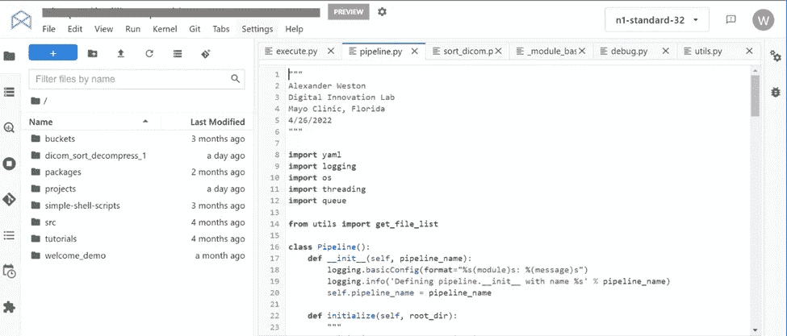
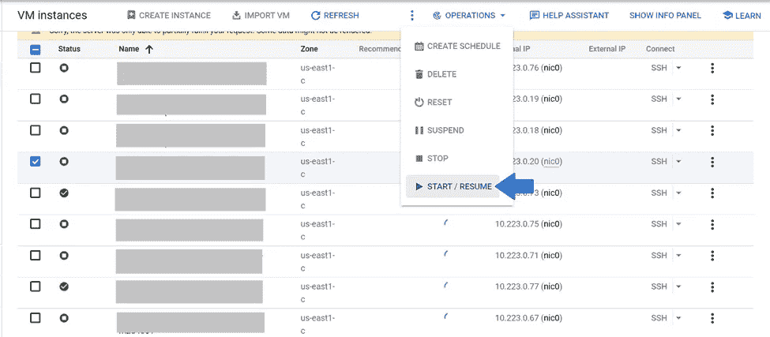

# 谷歌云平台的(非常)简要概述

> 原文：<https://towardsdatascience.com/a-very-brief-overview-of-google-cloud-platform-9dcce7bc1b1c>

## 新用户开始深入了解 GCP 的介绍和术语

埃比尼·贝欣赏梵高的作品。来自[维基共享资源](https://upload.wikimedia.org/wikipedia/commons/3/31/Van_Gogh_-_Ebene_bei_Auvers_mit_Regenwolken.jpeg)。

最近，我们的统计部门开始从本地服务器过渡到谷歌云平台(GCP)。可能你们中的许多人发现自己处于类似的情况。

我在使用 GCP 两年多的时间里发现，对于第一次学习云计算的新用户来说，网上提供的帮助少得惊人。我认为写一篇简短的文章来强调云的一些核心概念可能会有所帮助。

一个免责声明——我改编了为我们的暑期实习生写的文档，因为我认为它可能对更广泛的受众有用。我们使用由我们自己的 IT 部门构建的云环境，具有适合大型学术医疗机构的额外安全性。因此，该平台的一些功能被修改或禁用(例如，请求您自己的 DLVMs 的能力)。

如果你碰巧也为三盾工作，那么你就找对了文章。

## **什么是云？**

云指的是另一家公司管理你的服务器，而不是你自己管理服务器的平台。之所以称之为云(在我看来，这是一个令人困惑的术语)，是因为你正在访问一个由位于其他地方的成百上千个服务器组成的分布式网络，就像一个服务器“云”。

如果感兴趣，我真的很喜欢[这个谷歌云中心的视频之旅](https://www.youtube.com/watch?v=zDAYZU4A3w0)，对我们来说，它位于[南卡罗来纳州](https://cloud.google.com/about/locations)。

值得一提的是，谷歌云平台是所有谷歌员工，包括数据科学家，在内部用于自己研究的相同工具。

## **云的优势是什么？**

推动许多大型研究中心采用的最大优势是成本优势。但即使作为“最终用户”，我们也发现了谷歌云平台的几个优势。

**无限的数据存储**是最初吸引我们使用云的原因。我们一直在努力解决服务器存储问题。我现在有超过 30tb 的数据专门用于我的个人项目。

**无需共享资源**。另一个问题是太多的人(或者一个贪婪的人……)在运行大型计算任务，这会降低每个人的速度。对 GCP 来说，这不再是一个问题。

更新的工具。我们使用的许多工具，如 Tensorflow，都是由谷歌开发的(或者至少管理得更好)。访问最新的预构建软件包比自己尝试安装软件包要容易得多。

**自我管理的环境。**与共享服务器空间相比，单独的云 DLVM 通常更具可定制性，能够自由配置我们自己的单独环境是一个受欢迎的变化。

如果这些因素都不影响你的日常工作，我要补充一点，谷歌已经让我们获得了部署我们自己的模型所需的许多工具。因此，如果你正在编写希望其他人能够使用的代码，那么使用云将会有一个长期的优势。

## **简单说说安全问题**

数据安全，尤其是在学术健康中心，理所当然是一个主要问题。谷歌云架构师与我们自己的 IT 部门一起开发了一个安全的平台，即使是谷歌员工也无法访问。

我要补充的是，谷歌在数据安全方面比我更有经验，我更愿意利用他们自己的平台，而不是试图自己建立一个。

## **云资源和术语**

这是对您在使用云时会遇到的许多概念和术语的一个非常简单、非常基本的概述。我打算在以后的文章中更全面地讨论这些主题。

**项目**是一组共享存储和计算的用户，它是云中的基本组织级别，类似于共享服务器。我们的项目由我们研究实验室的 15 名成员组成。

每个项目都有一个唯一的项目 ID，显示在 web 界面的顶部。您需要知道这一点才能登录平台。

**深度学习虚拟机**，或 *DLVMs* ，是云的基本单元。对于使用过 Azure 或 AWS 的人来说，DLVM 和*虚拟机*完全一样。

DLVM 类似于您的个人计算机。DLVMs 不能共享；每个 DLVM 被分配给一个用户(尽管每个用户可以拥有任意多的 DLVM)。每个 DLVM 还有一个用于登录的唯一 ID。

就计算选项而言，DLVMs 几乎是无限可定制的。我发现拥有 16 个 CPU 内核和 60GB 内存的 *n1-standard-16* 配置非常适合我的大部分工作。我还添加了 2 个 T4 GPU 来训练基本的深度学习模型。这一成本约为 4 美元/小时

您只需在 DLVM 打开时付费。无论 DLVM 是被使用还是闲置，成本都是一样的，所以我们要求每个人都要注意，在一天结束时关闭他们的 DLVM。

Google 云平台的 JupyterLab 接口的一个例子。图片作者。

“计算引擎”菜单的一个示例，显示了分配给我们项目的 DLVM，以及启动/停止 DLVM 的选项。不幸的是，我不得不将 DLVMs 的名称灰化，一个典型的命名方案由 **projectName-zone-userID** 组成。图片作者。

**存储桶**是存储和共享文件的主要地方。与存储和计算不可分割的 Linux 服务器不同，存储桶与 DLVMs 位于不同的位置，这是该平台的一个方面，一开始可能会令人困惑。

这意味着，当您登录到 DLVM 时，存储桶中的文件不会立即对您可见。有一个简单的方法可以解决这个问题，通过[将桶 fuse-mount](https://stackoverflow.com/questions/34390730/mounting-google-storage-bucket-folder-using-gcsfuse)到 DLVM，这使得所有的文件都可见。

一旦 bucket 被 fuse 挂载，它就无法与 DLVM 存储区分开来，并且可以使用相同的命令进行访问。我们希望在启动脚本中包含这个命令，这样当 DLVM 打开时它会自动运行。

该存储桶由项目的所有用户共享；被分配到项目的任何人都可以读写桶中的任何文件夹。这种情况正在改变，在过去几周内，我们的机构实施了“增强团队”功能，允许将多个存储桶附加到单个项目，每个存储桶具有不同的权限。但是，在这个存储桶中，所有成员仍然可以访问所有文件。

[**big query**](https://www.youtube.com/watch?v=MH5M2Crn6Ag)**是 Google 版本的一个 SQL 数据库工具。作为一名专注于成像的数据科学家，我不经常使用 BigQuery，但我的同事告诉我，这是该平台最好的特性之一。它的速度快如闪电，并得益于谷歌作为关键词搜索领域世界领导者的专业知识。**

****Vertex AI** 是向计算引擎提交代码的服务。向 Vertex AI 提交作业通常比在 DLVM 上运行要快得多，也便宜得多。对于那些熟悉 Slurm 或 Sun Grid 引擎的人来说，Vertex AI 是一个类比。**

**要使用 Vertex AI，您必须将代码包装在 Docker 容器中，并与 YAML 文件一起提交，该文件告诉引擎要应用什么计算资源。**

**作为 Docker 主题的一个简短说明，它已经迅速成为我们最喜欢的利用 GCP 的工具。对于我们的实习生，我的一个同事用 RStudio Pro 构建了一个定制的 Docker 容器，让我们可以提前完成设置他们的环境的艰苦工作。**

**这也使得使用 Vertex AI 变得更加容易，因为你已经在 docker 容器中调试了你的代码，这个容器很容易被推送到引擎中。**

****Google Cloud Software Developer Kit，或** [**Cloud SDK**](https://cloud.google.com/sdk/docs/install) 是一个独立的可选命令行界面(CLI)，用于从本地台式机或笔记本电脑运行云命令。我强烈推荐。**

**SDK 允许您从笔记本电脑管理 GCP，包括将文件复制到 bucket 从 bucket 复制文件，通过 SSH 访问您的 DLVM(包括交互式环境的端口转发)，以及打开/关闭您的 DLVM。**

**在 Linux 和 Mac 上，SDK 命令可以从 shell 终端运行。在 Windows 上，Google 提供了单独的终端界面，它们也可以通过 PowerShell 获得。**

**一旦你熟悉了 SDK，就几乎不需要使用 web 界面，坦白地说，web 界面可能会很笨重。我将许多常用命令(如打开/关闭 DLVMs)打包成我的。bashrc 文件。**

**[**云 App。**](https://apps.apple.com/us/app/google-cloud-console/id1005120814) 最后，Google 还写了一个云主机智能手机 app。它的用途有限，但如果您忘记了，它可以用来打开/关闭您的 DLVM。**

## ****结论****

**感谢您的回顾，希望这些信息对您有所帮助！请留下评论，我很乐意回答任何问题。**

**我相信读者会很乐意听到您对该平台的体验，以及您可以提供的任何技巧或提示。**

**~噢**