# 梯度下降和其他优化算法的可视化方法

> 原文：<https://towardsdatascience.com/a-visual-approach-to-gradient-descent-and-other-optimization-algorithms-c82f45b7fc87>

## 可视化**梯度下降**、**带动量梯度下降**、 **RMSprop** 和 **Adam** 之间的异同

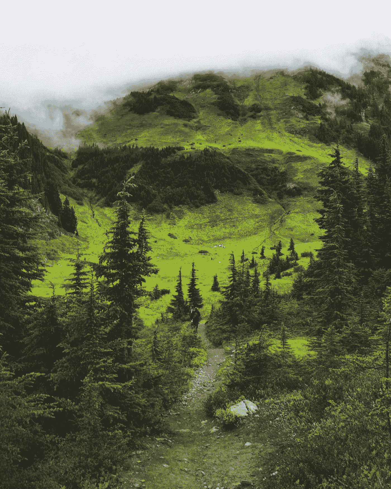

克里斯汀·蒙克摄于 Pexels:[https://www . Pexels . com/photo/photo-of-person-walking-on-unpaved-pathway-2599546/](https://www.pexels.com/photo/photo-of-person-walking-on-unpaved-pathway-2599546/)

# 介绍

如果你和我一样，方程不会自己说话。为了理解他们，**我需要用一个具体的例子来看看他们是怎么做的。**在这篇博文中，我将这一可视化原理应用于机器学习中常用的优化算法。

如今，亚当算法是一个非常受欢迎的选择。Adam 算法将**动量**和**学习速率的自调整**添加到普通梯度下降算法中。但是动量和自调整到底是什么？

下面是这些概念所指内容的直观预览:

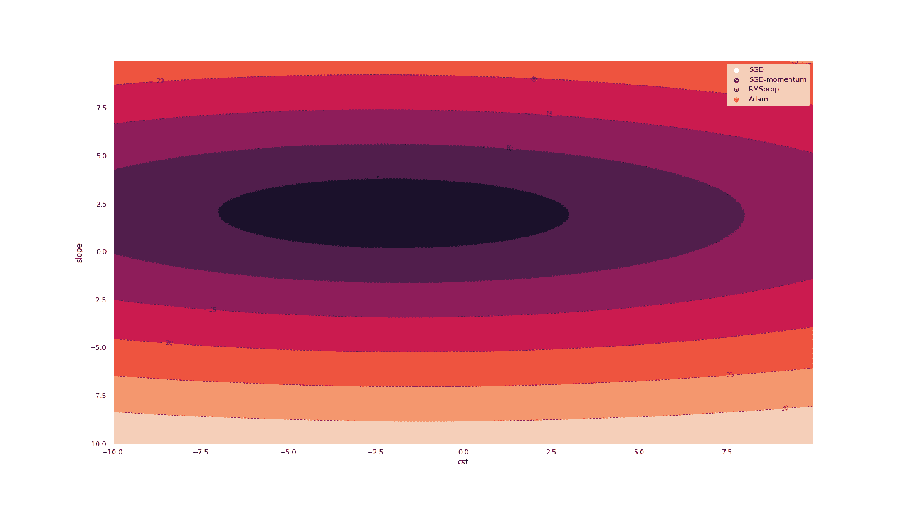

几种优化算法的行为。来源:作者的计算

# 线性回归

为了简单起见，我对二元线性回归模型使用了不同的优化算法:

*y = a + bx*

变量 *y* 代表我们试图用另一个变量 *x* 来预测/解释的一个量。未知参数有**截距*a*和**斜率*b .*****

为了使模型符合数据，我们最小化模型和数据之间的差异的均方，其可以简洁地表达如下:

*损失(a，b)=1/m||y-a-bx||*

(假设我们有 *m* 个观察值，并使用欧几里德范数)

通过改变 *a* 和 *b* 的值，我们有望提高模型对数据的拟合度。使用二元回归模型，一件好事是我们可以将损失函数值绘制成未知参数 *a* 和 *b* 的函数。下面是损失函数的曲面图，黑点代表损失的最小值。

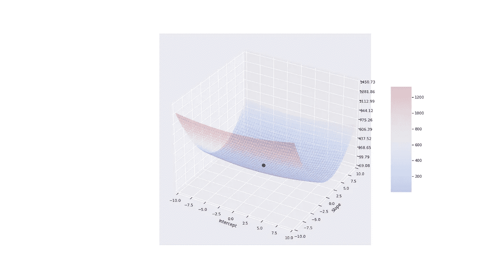

损失函数 OLS。来源:作者的计算

我们也可以使用等高线图来可视化损失函数，其中线是水平集(使得*损失(a，b) =* 恒定的点)。下面，白点代表损失函数的最小值。

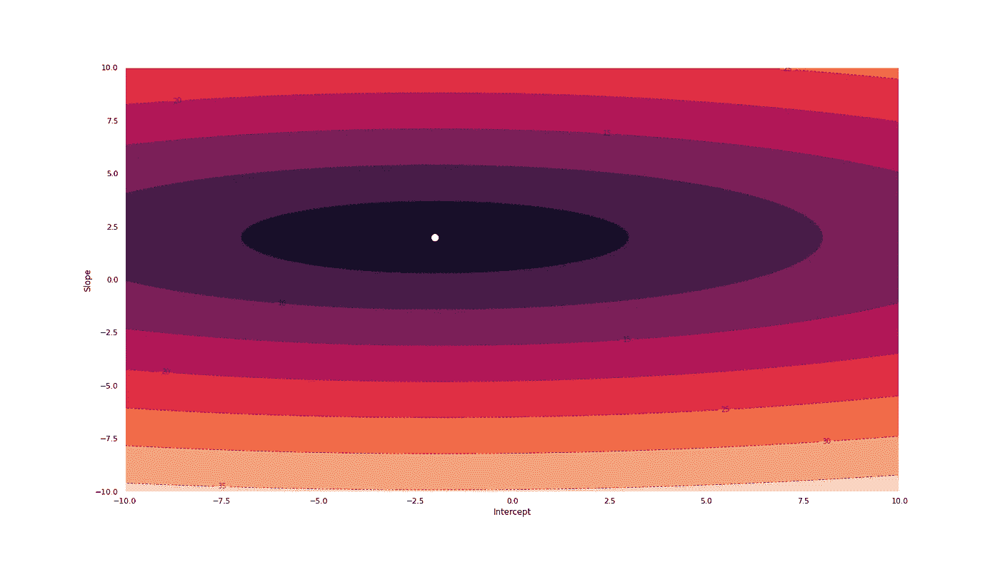

等高线图损失函数 OLS。来源:作者的计算

# 梯度下降

普通梯度下降算法包括在最陡下降的**方向上采取大小为 **η** 的步长，该步长由梯度的相反值给出。从数学上来说，更新规则如下:**


在下一个图中，我展示了梯度下降算法隐含的一条轨迹。点代表迭代中 *a* 和 *b* 的值，而箭头是损失函数的梯度，告诉我们在下一次迭代中向哪里移动。

一个关键特征是梯度下降算法可能会在水平集之间产生一些振荡。在一个完美的世界中，我们会像那样朝着最小值的方向平稳地移动。正如我们将看到的，增加动量是使轨迹向最小值平滑的一种方式。

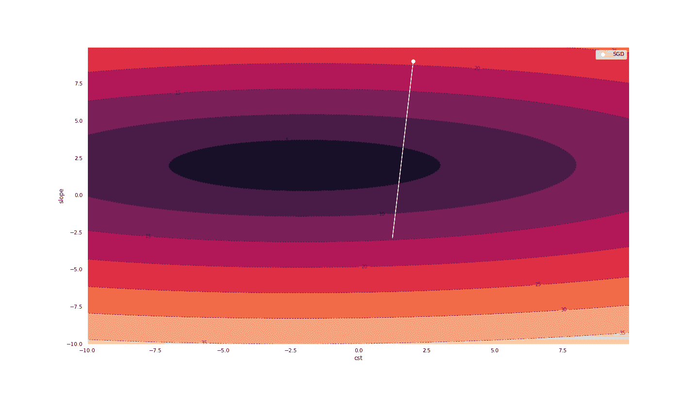

梯度下降。来源:作者的计算

# 动量梯度下降

**动量是指运动物体继续向同一方向运动的趋势**。在实践中，我们可以通过考虑梯度的先前值来增加梯度下降的动量。这可以通过以下方式完成:

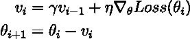

**γ的值越高，**当前更新中考虑的梯度的过去值越多。

在接下来的图中，我展示了梯度下降算法暗示的轨迹**(蓝色 **)** 和没有动量**(白色)的**。**

动量减小了沿坡度系数值的波动。一旦动量平均效应开始发挥作用，大幅上下波动往往会相互抵消。结果，随着动量的增加，我们朝着真实值的方向移动得更快。

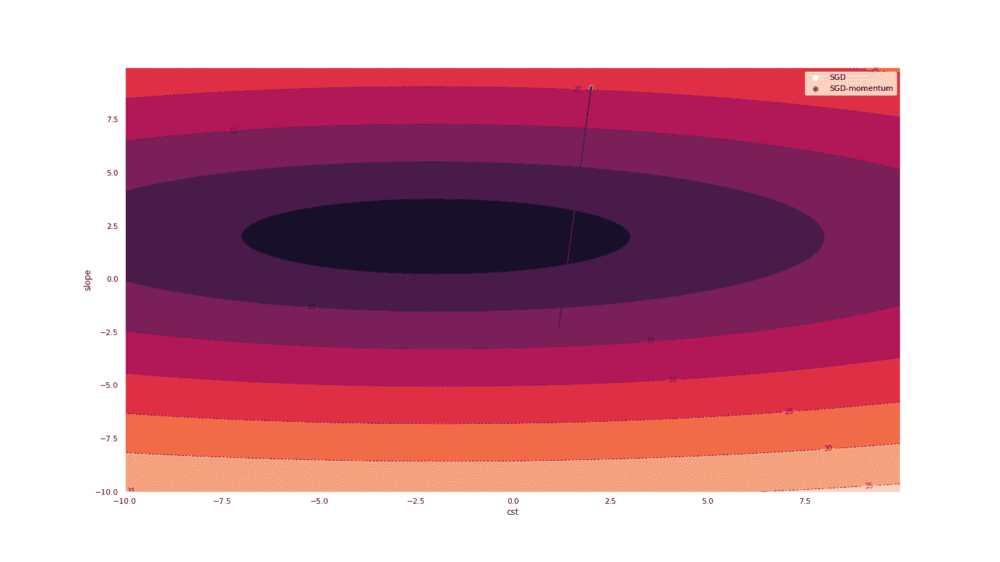

有动量(蓝色)或无动量(白色)的梯度下降。来源:作者的计算

# RMSprop

动量是梯度下降的一个很好的转折。另一条改进路线是**引入一个针对每个参数**定制的学习率(在我们的例子中:一个斜率学习率，一个截距学习率)。

但是如何选择这样一个系数特定的学习率呢？注意，前面的图显示梯度不一定指向最小值。至少在第一次迭代中没有。

直观地说，我们会给**较小的权重**给上下方向的移动，给**较大的权重**给左右方向的移动。RMSprop 更新规则嵌入了这个所需的属性:

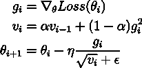

第一行仅仅定义了 **g** 为损失函数的梯度。第二行表示我们计算梯度平方的移动平均值。在第三行中，我们在梯度给定的方向上迈出一步，但是通过过去梯度的移动平均值的平方根来重新调整。

在我们的例子中，因为斜率系数的梯度的平方往往很大，所以我们在那个方向采取小的步骤。截距系数则相反(小数值，大移动)。

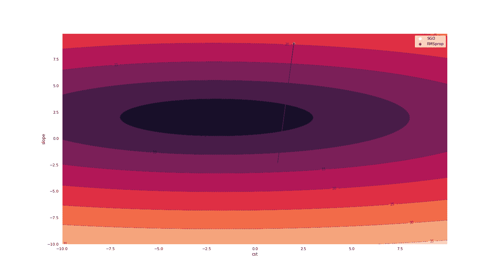

RMSprop(蓝色)和渐变下降(白色)。来源:作者的计算

# 亚当斯

亚当优化算法具有**动量**，以及**rms prop 的自适应学习速率**。下面是*几乎是*亚当做的事情:

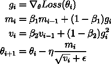

更新规则与 RMSprop 非常相似。**关键区别是动量:**变化的方向由过去梯度的移动平均值给出。

*实际* Adam 更新规则使用 *m* 和 *v* 的“偏差修正”值。第一步，Adam 将 *m* 和 *v* 初始化为零。为了校正初始化偏差，作者建议使用重新加权版本的 *m* 和 *v:*

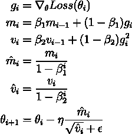

下面，我们看到 Adam 诱导的轨迹有点类似于 RMSprop 给出的轨迹，但是开始更慢。

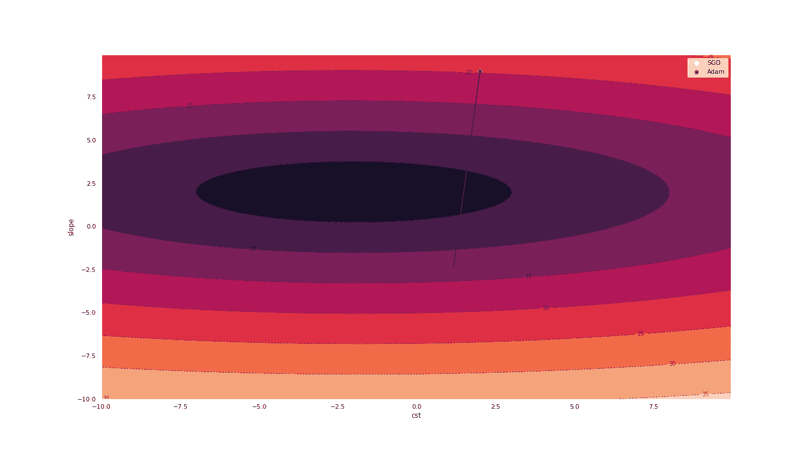

亚当(蓝色)和梯度下降(白色)。来源:作者的计算

# 主要情节

下一个图显示了由上述四种优化算法得出的轨迹。

主要结果如下:

*   有动量的梯度下降比没有动量的梯度下降波动小。
*   Adam 和 RMSprop 采用不同的路线，在斜率维度上移动较慢，在截距维度上移动较快。
*   正如预期的那样，Adam 显示了一些动量:当 RMSprop 开始向左转向最小值时，Adam 因为累积的动量而有更难的转弯时间。


几种优化算法的行为。来源:作者的计算

下图是同一张图表，但是是 3d 的:

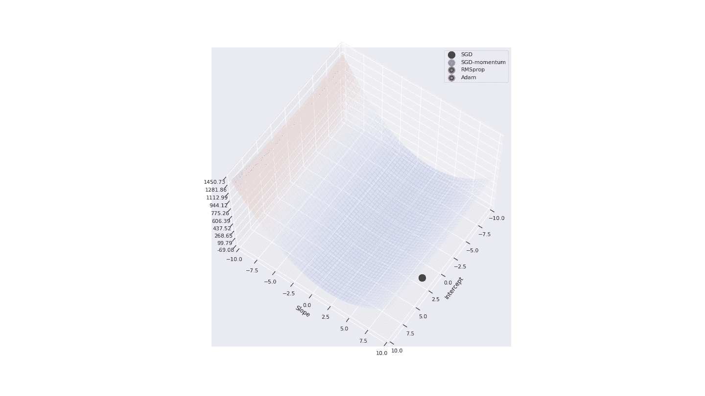

几种优化算法的行为。来源:作者的计算

# 结论

在这篇博文中，我的目的是让读者对机器学习中使用的关键优化算法有一个直观的理解。

在下面，你可以找到用来制作本文所用图表的代码。毫不犹豫地修改学习率和/或损失函数，看看这会如何影响不同的轨迹。

—

# 代码(Python)

以下代码块加载依赖关系，定义损失函数并绘制损失函数(曲面和等高线图):

```
# A. Dependencies 
%matplotlib inline
import matplotlib.pyplot as plt
from matplotlib import cm
from matplotlib.ticker import LinearLocator

plot_scale = 1.25
plt.rcParams["figure.figsize"] = (plot_scale*16, plot_scale*9)

import numpy as np
import pandas as pd
import random
import scipy.stats
from itertools import product
import os
import time
from math import sqrt
import seaborn as sns; sns.set()
from tqdm import tqdm as tqdm       
import datetime
from typing import Tuple
class Vector: pass
from scipy.stats import norm
import torch
from torch import nn
from torch.utils.data import DataLoader
import copy
import matplotlib.ticker as mtick
from torchcontrib.optim import SWA
from numpy import linalg as LA
import imageio as io #create gif

# B. Create OLS problem
b0 = -2.0 #intercept
b1 = 2.0 #slope
beta_true = (b0 , b1)
nb_vals = 1000 #number draws

mu, sigma = 0, 0.001 # mean and standard deviation
shocks = np.random.normal(mu, sigma, nb_vals)

# covariate
x0 = np.ones(nb_vals) #cst
x1 = np.random.uniform(-5, 5, nb_vals)
X = np.column_stack((x0, x1))

# Data
y = b0*x0 + b1*x1 + shocks

A = np.linalg.inv(np.matmul(np.transpose(X), X))
B = np.matmul(np.transpose(X), y)
np.matmul(A, B)

X_torch = torch.from_numpy(X).float()
y_torch = torch.from_numpy(y).float()

# Loss function and gradient (for plotting)
def loss_function_OLS(beta_hat, X, y):
    loss = (1/len(y))*np.sum(np.square(y - np.matmul(X, beta_hat)))
    return loss

def grad_OLS(beta_hat, X, y):
    mse = loss_function_OLS(beta_hat, X, y)
    G = (2/len(y))*np.matmul(np.transpose(X), np.matmul(X, beta_hat) - y) 
    return G, mse

# C. Plots for the loss function
min_val=-10.0
max_val=10.0

delta_grid=0.05
x_grid = np.arange(min_val, max_val, delta_grid)
y_grid = np.arange(min_val, max_val, delta_grid)
X_grid, Y_grid = np.meshgrid(x_grid, y_grid)

Z = np.zeros((len(x_grid), len(y_grid)))

for (y_index, y_value) in enumerate(y_grid):
    for (x_index, x_value) in enumerate(x_grid):
        beta_local = np.array((x_value, y_value))
        Z[y_index, x_index] = loss_function_OLS(beta_local, X, y)

fig, ax = plt.subplots(subplot_kw={"projection": "3d"})

# Plot the surface.
surf = ax.plot_surface(X_grid, Y_grid, Z, cmap=cm.coolwarm, linewidth=0, antialiased=False, alpha=0.2)

ax.zaxis.set_major_locator(LinearLocator(10))
ax.zaxis.set_major_formatter('{x:.02f}')

ax.scatter([b0], [b1], [true_value], s=100, c='black', linewidth=0.5)

x_min = -10
x_max = -x_min
y_min = x_min
y_max = -x_min

plt.xlim(x_min, x_max)
plt.ylim(y_min, y_max)

plt.ylabel('Slope')
plt.xlabel('Intercept')

fig.colorbar(surf, shrink=0.5, aspect=5)

filename = "IMGS/surface_loss.png"
plt.savefig(filename)
plt.show()

# Plot contour
cp = plt.contour(X_grid, Y_grid, np.sqrt(Z), colors='black', linestyles='dashed', linewidths=1, alpha=0.5)
plt.clabel(cp, inline=1, fontsize=10)
cp = plt.contourf(X_grid, Y_grid, np.sqrt(Z))
plt.scatter([b0], [b1], s=100, c='white', linewidth=0.5)
plt.ylabel('Slope')
plt.xlabel('Intercept')
plt.xlim(x_min, x_max)
plt.ylim(y_min, y_max)

filename = "IMGS/countour_loss.png"
plt.savefig(filename)
plt.show()
```

下一段代码定义了函数，这样我们就可以使用 Pytorch 解决 OLS 问题。在这里，使用 Pytroch 有点过了，但好处是我们可以使用预编码的最小化算法( *torch.optim* ):

```
def loss_OLS(model, y, X): 
    """
    Loss function for OLS
    """
    R_squared = torch.square(y.unsqueeze(1) - model(X[:,1].unsqueeze(1)))
    return torch.mean(R_squared)

def set_initial_values(model, w, b):
    """
    Function to set the weight and bias to certain values
    """
    with torch.no_grad():
        for name, param in model.named_parameters():
            if 'linear_relu_stack.0.weight' in name:
                param.copy_(torch.tensor([w]))
            elif 'linear_relu_stack.0.bias' in name:
                param.copy_(torch.tensor([b]))

def create_optimizer(model, optimizer_name, lr, momentum):
    """
    Function to define an optimizer
    """
    if optimizer_name == "Adam":
        optimizer = torch.optim.Adam(model.parameters(), lr) 
    elif optimizer_name == "SGD":
        optimizer = torch.optim.SGD(model.parameters(), lr)
    elif optimizer_name == "SGD-momentum":
        optimizer = torch.optim.SGD(model.parameters(), lr, momentum)
    elif optimizer_name == "Adadelta":
        optimizer = torch.optim.Adadelta(model.parameters(), lr)
    elif optimizer_name == "RMSprop":
        optimizer = torch.optim.RMSprop(model.parameters(), lr)
    else:
        raise("optimizer unknown")
    return optimizer

def train_model(optimizer_name, initial_guess, true_value, lr, momentum):
    """
    Function to train a model
    """
    # initialize a model
    model = NeuralNetwork().to(device)
    #print(model)

    set_initial_values(model, initial_guess[0], initial_guess[1])

    for name, param in model.named_parameters():
        print(name, param)

    model.train()

    nb_epochs = 100
    use_scheduler = False
    freq_scheduler = 100
    freq_gamma = 0.95
    true_b = torch.tensor([true_value[0], true_value[1]])

    print(optimizer_name)
    optimizer = create_optimizer(model, optimizer_name, lr, momentum)

    # A LOOP OVER EACH POINT OF THE CURRENT GRID
    # store mean loss by epoch
    scheduler = torch.optim.lr_scheduler.ExponentialLR(optimizer, gamma=freq_gamma)
    loss_epochs = torch.zeros(nb_epochs)
    list_perc_abs_error = [] #store abs value percentage error
    list_perc_abs_error_i = [] #store index i
    list_perc_abs_error_loss = [] #store loss
    list_norm_gradient = [] #store norm of gradient
    list_gradient = [] #store the gradient itself
    list_beta = [] #store parameters

    calculate_variance_grad = False 

    freq_loss = 1
    freq_display = 10

    for i in tqdm(range(0, nb_epochs)):

        optimizer.zero_grad()

        # Calculate the loss
        loss = loss_OLS(model, y_torch, X_torch)
        loss_epochs[[i]] = float(loss.item())

        # Store the loss
        with torch.no_grad():
            # Extract weight and bias
            b_current = np.array([k.item() for k in model.parameters()])
            b_current_ordered = np.array((b_current[1], b_current[0])) #reorder (bias, weight)
        list_beta.append(b_current_ordered)
        perc_abs_error = np.sum(np.square(b_current_ordered - true_b.detach().numpy()))
        list_perc_abs_error.append(np.median(perc_abs_error))
        list_perc_abs_error_i.append(i)
        list_perc_abs_error_loss.append(float(loss.item()))

        # Calculate the gradient
        loss.backward()

        # Store the gradient
        with torch.no_grad():
            grad = np.zeros(2)
            for (index_p, p) in enumerate(model.parameters()):
                grad[index_p] = p.grad.detach().data
            #reorder (bias, weight)
            grad_ordered = np.array((grad[1], grad[0]))
            list_gradient.append(grad_ordered)

        # Take a gradient steps
        optimizer.step()

        if i % freq_display == 0: #Monitor the loss
            loss, current = float(loss.item()), i
            print(f"loss: {loss:>7f}, percentage abs. error {list_perc_abs_error[-1]:>7f}, [{current:>5d}/{nb_epochs:>5d}]")
        if (i % freq_scheduler == 0) & (i != 0) & (use_scheduler == True):
            scheduler.step()
            print("i : {}. Decreasing learning rate: {}".format(i, scheduler.get_last_lr()))

    return model, list_beta, list_gradient 

def create_gif(filenames, output_name):
    """
    Function to create a gif, using a list of images
    """
    with io.get_writer(output_name, mode='I') as writer:
        for filename in filenames:
            image = io.imread(filename)
            writer.append_data(image)

    # Remove files, except the final one
    for index_file, filename in enumerate(set(filenames)):
        if index_file < len(filenames) - 1:
            os.remove(filename)

# Define a neural network with a single node  
# Get cpu or gpu device for training.
device = "cuda" if torch.cuda.is_available() else "cpu"
print(f"Using {device} device")

nb_nodes = 1
# Define model
class NeuralNetwork(nn.Module):
    def __init__(self):
        super(NeuralNetwork, self).__init__()
        self.flatten = nn.Flatten()
        self.linear_relu_stack = nn.Sequential(
            nn.Linear(1, nb_nodes)
        )

    def forward(self, x):
        out = self.linear_relu_stack(x)
        return out
```

使用梯度下降的最小化；

```
lr = 0.10 #learning rate
alpha = lr
init = (9.0, 2.0) #initial guess
true_value = [-2.0, 2.0] #true value for parameters

# I. Solve
optimizer_name = "SGD"
momentum = 0.0
model_SGD, list_beta_SGD, list_gradient_SGD = train_model(optimizer_name , init, true_value, lr, momentum)

# II. Create gif
filenames = []
zoom=1 #to increase/decrease the length of vectors on the plot
max_index_plot = 30 #when to stop plotting

# Plot contour
cp = plt.contour(X_grid, Y_grid, np.sqrt(Z), colors='black', linestyles='dashed', linewidths=1, alpha=0.5)
plt.clabel(cp, inline=1, fontsize=10)
cp = plt.contourf(X_grid, Y_grid, np.sqrt(Z))

# Add points and arrows
for (index, (bb, grad)) in enumerate(zip(list_beta_SGD, list_gradient_SGD)):
    if index>max_index_plot:
        break
    if index == 0:
        label_1 = "SGD"
    else:
        label_1 = ""
    # Point
    plt.scatter([bb[0]], [bb[1]], s=10, c='white', linewidth=5.0, label=label_1)
    # Arrows
    plt.arrow(bb[0], bb[1], - zoom * alpha* grad[0], - zoom * alpha * grad[1], color='white')
    # Add arrows for gradient:
    # create file name and append it to a list
    filename = "IMGS/path_SGD_{}.png".format(index)
    filenames.append(filename)
    plt.xlabel('cst')
    plt.ylabel('slope')
    plt.legend()
    plt.savefig(filename)

filename = "IMGS/path_SGD.png"
plt.savefig(filename)
create_gif(filenames, "SGD.gif")
plt.show()
```

利用动量梯度下降的最小化；

```
optimizer_name = "SGD-momentum"
momentum = 0.2

# I. Solve
model_momentum, list_beta_momentum, list_gradient_momentum = train_model(optimizer_name , init, true_value, lr, momentum)

# II. Create gif
filenames = []
zoom=1 #to increase/decrease the length of vectors on the plot
max_index_plot = 30 #when to stop plotting

# Plot contour
cp = plt.contour(X_grid, Y_grid, np.sqrt(Z), colors='black', linestyles='dashed', linewidths=1, alpha=0.5)
plt.clabel(cp, inline=1, fontsize=10)
cp = plt.contourf(X_grid, Y_grid, np.sqrt(Z))

# Add points and arrows
for (index, (bb, grad, bb_momentum, grad_momentum)) in enumerate(zip(list_beta_SGD, list_gradient_SGD, list_beta_momentum, list_gradient_momentum)):
    if index>max_index_plot:
        break
    if index == 0:
        label_1 = "SGD"
        label_2 = "SGD-momentum"
    else:
        label_1 = ""
        label_2 = ""
    # Point
    plt.scatter([bb[0]], [bb[1]], s=10, c='white', linewidth=5.0, label=label_1)
    plt.scatter([bb_momentum[0]], [bb_momentum[1]], s=10, c='blue', linewidth=5.0, alpha=0.5, label=label_2)
    # Arrows
    #plt.arrow(bb_momentum[0], bb_momentum[1], - zoom * alpha* grad[0], - zoom * alpha * grad[1], color='white')
    plt.arrow(bb_momentum[0], bb_momentum[1], - zoom * alpha* grad_momentum[0], - zoom * alpha * grad_momentum[1], color="blue")
    # create file name and append it to a list
    filename = "IMGS/path_SGD_momentum_{}.png".format(index)
    filenames.append(filename)
    plt.xlabel('cst')
    plt.ylabel('slope')
    plt.legend()
    plt.savefig(filename)

filename = "IMGS/path_SGD_momentum.png"
plt.savefig(filename)
create_gif(filenames, "SGD_momentum.gif")
plt.show()
```

使用 RMSprop 最小化:

```
optimizer_name = "RMSprop"
momentum = 0.0
# I. Solve
model_RMSprop, list_beta_RMSprop, list_gradient_RMSprop = train_model(optimizer_name , init, true_value, lr, momentum)

# II. Create gif
filenames = []
zoom=1 #to increase/decrease the length of vectors on the plot
max_index_plot = 30 #when to stop plotting

# Plot contour
cp = plt.contour(X_grid, Y_grid, np.sqrt(Z), colors='black', linestyles='dashed', linewidths=1, alpha=0.5)
plt.clabel(cp, inline=1, fontsize=10)
cp = plt.contourf(X_grid, Y_grid, np.sqrt(Z))

# Add points and arrows
for (index, (bb, grad, bb_RMSprop, grad_RMSprop)) in enumerate(zip(list_beta_SGD, list_gradient_SGD, list_beta_RMSprop, list_gradient_RMSprop)):
    if index>max_index_plot:
        break
    if index == 0:
        label_1 = "SGD"
        label_2 = "RMSprop"
    else:
        label_1 = ""
        label_2 = ""
    # Point
    plt.scatter([bb[0]], [bb[1]], s=10, c='white', linewidth=5.0, label=label_1)
    plt.scatter([bb_RMSprop[0]], [bb_RMSprop[1]], s=10, c='blue', linewidth=5.0, alpha=0.5, label=label_2)
    # Arrows
    plt.arrow(bb_RMSprop[0], bb_RMSprop[1], - zoom * alpha* grad_RMSprop[0], - zoom * alpha * grad_RMSprop[1], color="blue")
    # create file name and append it to a list
    filename = "IMGS/path_RMSprop_{}.png".format(index)
    filenames.append(filename)
    plt.xlabel('cst')
    plt.ylabel('slope')
    plt.legend()
    plt.savefig(filename)

filename = "IMGS/path_RMSprop.png"
plt.savefig(filename)
create_gif(filenames, "RMSprop.gif")
plt.show()
```

使用 Adam 的最小化:

```
optimizer_name = "Adam"
momentum = 0.0

# I. Solve
model_Adam, list_beta_Adam, list_gradient_Adam = train_model(optimizer_name , init, true_value, lr, momentum)

# II. Create gif
filenames = []
zoom=1 #to increase/decrease the length of vectors on the plot
max_index_plot = 30 #when to stop plotting

# Plot contour
cp = plt.contour(X_grid, Y_grid, np.sqrt(Z), colors='black', linestyles='dashed', linewidths=1, alpha=0.5)
plt.clabel(cp, inline=1, fontsize=10)
cp = plt.contourf(X_grid, Y_grid, np.sqrt(Z))

# Add points and arrows
for (index, (bb, grad, bb_Adam, grad_Adam)) in enumerate(zip(list_beta_SGD, list_gradient_SGD, list_beta_Adam, list_gradient_Adam)):
    if index>max_index_plot:
        break
    if index == 0:
        label_1 = "SGD"
        label_2 = "Adam"
    else:
        label_1 = ""
        label_2 = ""
    # Point
    plt.scatter([bb[0]], [bb[1]], s=10, c='white', linewidth=5.0, label=label_1)
    plt.scatter([bb_Adam[0]], [bb_Adam[1]], s=10, c='blue', linewidth=5.0, alpha=0.5, label=label_2)
    # Arrows
    plt.arrow(bb_Adam[0], bb_Adam[1], - zoom * alpha* grad_Adam[0], - zoom * alpha * grad_Adam[1], color="blue")
    # create file name and append it to a list
    filename = "IMGS/path_Adam_{}.png".format(index)
    filenames.append(filename)
    plt.xlabel('cst')
    plt.ylabel('slope')
    plt.legend()
    plt.savefig(filename)

filename = "IMGS/path_Adam.png"
plt.savefig(filename)
create_gif(filenames, "Adam.gif")
plt.show()
```

用四条轨迹创造“主情节”:

```
max_iter = 100
filenames = []
cp = plt.contour(X_grid, Y_grid, np.sqrt(Z), colors='black', linestyles='dashed', linewidths=1, alpha=0.5)
plt.clabel(cp, inline=1, fontsize=10)
cp = plt.contourf(X_grid, Y_grid, np.sqrt(Z))
colors = ["white", "blue", "green", "red"]

# Add points:
for (index, (bb_SGD, bb_momentum, bb_RMSprop, bb_Adam)) in enumerate(zip(list_beta_SGD, list_beta_momentum, list_beta_RMSprop, list_beta_Adam)):
    if index % freq_plot == 0:
        if index == 0:
            label_1 = "SGD"
            label_2 = "SGD-momentum"
            label_3 = "RMSprop"
            label_4 = "Adam"
        else:
            label_1, label_2, label_3, label_4 = "", "", "", ""
        plt.scatter([bb_SGD[0]], [bb_SGD[1]], s=10, linewidth=5.0, label=label_1, color=colors[0])
        plt.scatter([bb_momentum[0]], [bb_momentum[1]], s=10, linewidth=5.0, alpha=0.5, label=label_2, color=colors[1])
        plt.scatter([bb_RMSprop[0]], [bb_RMSprop[1]], s=10, linewidth=5.0, alpha=0.5, label=label_3, color=colors[2])
        plt.scatter([bb_Adam[0]], [bb_Adam[1]], s=10, linewidth=5.0, alpha=0.5, label=label_4, color=colors[3])
    if index > max_iter:
        break
    # create file name and append it to a list
    filename = "IMGS/img_{}.png".format(index)
    filenames.append(filename)
    # Add arrows for gradient:
    plt.xlabel('cst')
    plt.ylabel('slope')
    plt.legend()

    # save frame
    plt.savefig(filename)
    #plt.close()# build gif

create_gif(filenames, "compare_optim_algos.gif")
```

创建 3D“主图”:

```
max_iter = 100
fig, ax = plt.subplots(subplot_kw={"projection": "3d"})

# Plot the surface.
surf = ax.plot_surface(X_grid, Y_grid, Z, cmap=cm.coolwarm, linewidth=0, antialiased=False, alpha=0.1)
ax.zaxis.set_major_locator(LinearLocator(10))
ax.zaxis.set_major_formatter('{x:.02f}')
ax.view_init(60, 35)

colors = ["black", "blue", "green", "red"]
x_min = -10
x_max = -x_min
y_min = x_min
y_max = -x_min

# Add points:
for (index, (bb_SGD, bb_momentum, bb_RMSprop, bb_Adam)) in enumerate(zip(list_beta_SGD, list_beta_momentum, list_beta_RMSprop, list_beta_Adam)):
    if index == 0:
        label_1 = "SGD"
        label_2 = "SGD-momentum"
        label_3 = "RMSprop"
        label_4 = "Adam"
    else:
        label_1, label_2, label_3, label_4 = "", "", "", ""
    ax.scatter([bb_SGD[0]], [bb_SGD[1]], s=100, linewidth=5.0, label=label_1, color=colors[0])
    ax.scatter([bb_momentum[0]], [bb_momentum[1]], s=100, linewidth=5.0, alpha=0.5, label=label_2, color=colors[1])
    ax.scatter([bb_RMSprop[0]], [bb_RMSprop[1]], s=100, linewidth=5.0, alpha=0.5, label=label_3, color=colors[2])
    ax.scatter([bb_Adam[0]], [bb_Adam[1]], s=100, linewidth=5.0, alpha=0.5, label=label_4, color=colors[3])
    if index > max_iter:
        break
    # create file name and append it to a list
    filename = "IMGS/img_{}.png".format(index)
    filenames.append(filename)
    # Add arrows for gradient:
    plt.xlim(x_min, x_max)
    plt.ylim(y_min, y_max)
    plt.ylabel('Slope')
    plt.xlabel('Intercept')
    plt.legend()
    # save frame
    plt.savefig(filename)

filename = "IMGS/surface_loss.png"
plt.savefig(filename)
plt.show()

create_gif(filenames, "surface_compare_optim_algos.gif")
```

—

# 参考

*   鲁德，塞巴斯蒂安。"梯度下降优化算法概述." *arXiv 预印本 arXiv:1609.04747* (2016)
*   《论深度学习中初始化和动量的重要性》*机器学习国际会议*。PMLR，2013 年。

**关于这个话题的非常好的系列视频:**