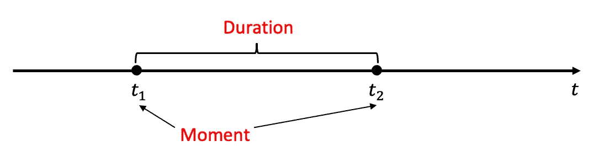
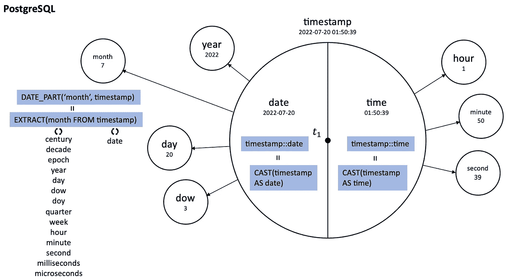
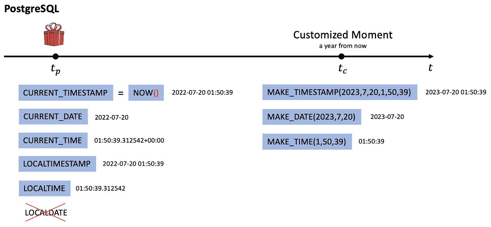
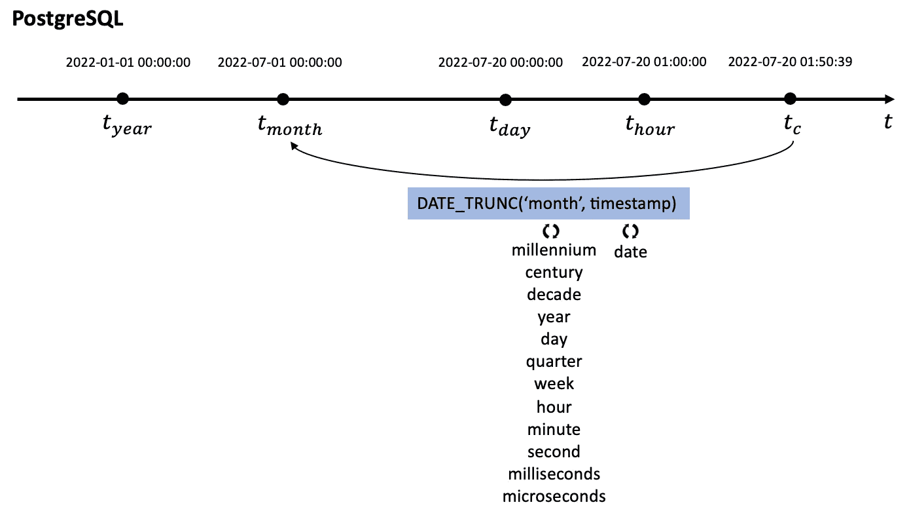
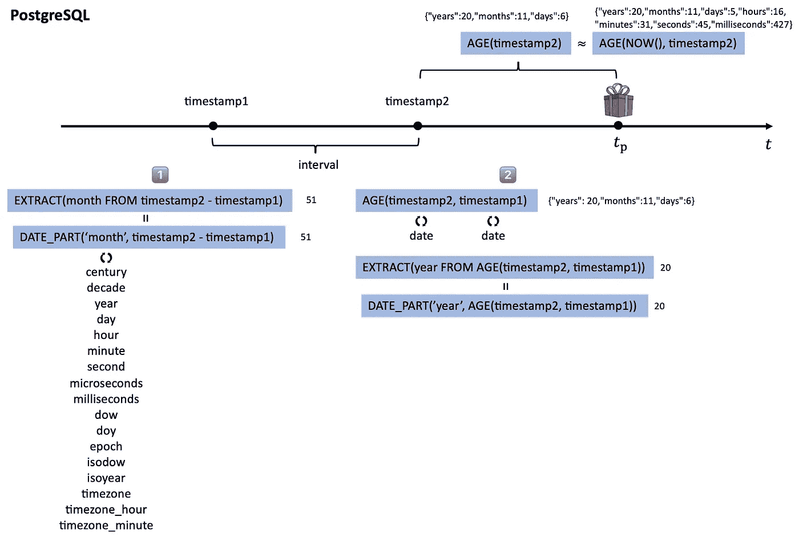
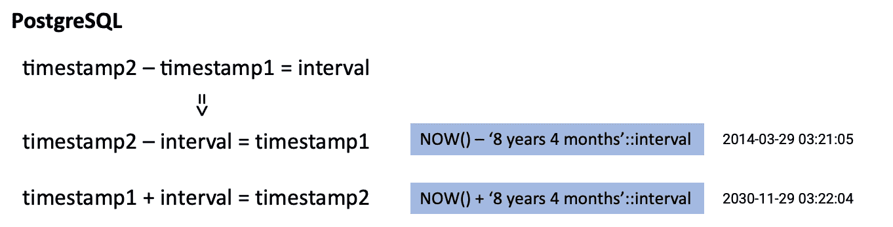

# SQL 日期/时间函数的可视化摘要

> 原文：<https://towardsdatascience.com/a-visual-summary-of-sql-date-time-functions-8bb96ce4f1b4>

## 准备 SQL 面试？

由[阿格巴洛斯](https://unsplash.com/@agebarros?utm_source=medium&utm_medium=referral)在 [Unsplash](https://unsplash.com?utm_source=medium&utm_medium=referral) 上拍摄的照片

在时间戳、日期和时间数据类型之间，SQL 日期/时间函数可能很容易混淆。在这篇博客中，我将尝试使用 **PostgreSQL 语法**绘制出 SQL 访谈中常见的数据/时间命令。

# 在 SQL 代码之前

在我们开始编码之前，让我们先暂停一下，考虑一下日期/时间表示中的元素。我们知道时间是线性的，单向的，并且在数学上可以用向量来表示。

作者图片

时间向量 t 上的两个关键元素是*时刻*和*持续时间*。这些术语可能不是最准确的，但是由于 SQL 使用了关键字*时间戳*和*间隔*，现在让我们使用不同的词语来理解这个概念。

*   **瞬间**指事件发生的瞬间。力矩是瞬时的，所以用向量 t 上的点来表示，t1 和 t2 是力矩。
*   **持续时间**是指两个时刻之间的时间跨度。持续时间由无数个瞬间组成，有开始也有结束。

所以，我们真的只需要了解这两个元素，以及这两个元素之间的转换，就能掌握 SQL 中的日期/时间函数。

# Moment & Moment 家庭

*时间戳*给了我们最多的信息。时间戳可以精确到毫秒，并且包含时区信息，但是大多数时候，YYYY-MM-DD HH:MM:SS 格式的时间就足够了。

作者图片

*时间戳*可以分成两部分，*日期*和*时间*，通过将*时间戳*转换成*日期*或*时间*对象(简写::)。但是，将日期*或时间*转换回时间戳是不可取的，因为您将丢失时间戳*中一半的信息*或者 SQL 将抛出一个错误。

从一个*时间戳*中可以提取很多信息，比如年、月、日、时、分、秒等。然而，并不是所有的信息都可以单独从*日期*或*时间*对象中提取。例如，您不能从*时间* 01:50:39 提取年份。

以下是 PostgreSQL 代码中的几个示例:

## 创造时刻

通常情况下，在 SQL 面试问题中会给你一点时间。例如，它可以是用户的登录时间、用户向另一个用户发送消息的时刻，或者客户下订单的时刻。但是，这并不能保证。有时候，你只需要创造属于你的时刻。

作者图片

**现在** : 99%的时候，我们需要利用现在的时刻进行一些计算。`CURRENT_TIMESTAMP`和`NOW()`给你当前时刻完全相同的时间戳。上图展示了更多的变化。请注意，没有所谓的`LOCALDATE`。

**定制时刻:**很少会遇到需要定制特定时刻的情况，但如果你这样做了，`MAKE_TIMESTAMP`就会做到。上图展示了更多的变化。

## 从一瞬间到另一瞬间

`DATE_TRUNC`将一个时刻转换成另一个时刻。它的工作原理类似于一个下限函数，将时间戳重置为时间戳的年/月/周/日/小时/…的开始。

作者图片

您可以向函数`DATE_TRUNC`输入*日期*，而不是*时间戳*，它将通过用零填充未知时间来输出结果。但是，输入一个*时间*会抛出一个错误。

# 持续时间

现在，我们来谈谈持续时间。持续时间对应 PostgreSQL 中的*区间*，以' *20 年 11 个月 6 天'的格式表示。*

作者图片

我们可以再次借用函数`EXTRACT`和`DATE_PART`得到具体的年/月/日/小时/分钟/秒/…的间隔。`AGE`功能给了我们一个更全面的视角。请注意，如果只给`AGE`函数一个输入，它会自动将输入与当前时间戳进行比较，但输出的精度会与您的输入保持一致。

## 把瞬间和间隔放在一起

知道了`timestamp2-timestamp1=interval`，只要知道方程的两个元素，就可以计算第三个。因此，我们可以使用时间戳和间隔来获取其他时间戳。

作者图片

感谢您的阅读！希望这篇博客对你有所帮助。