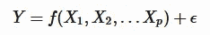
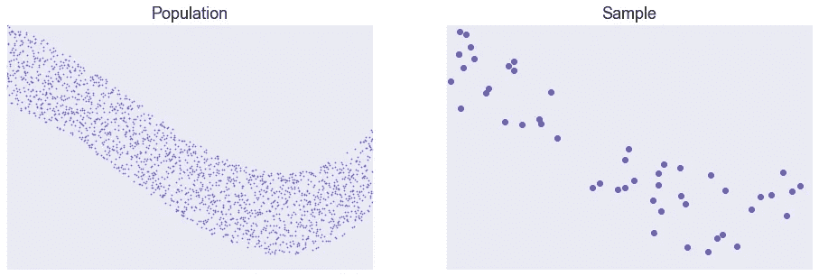
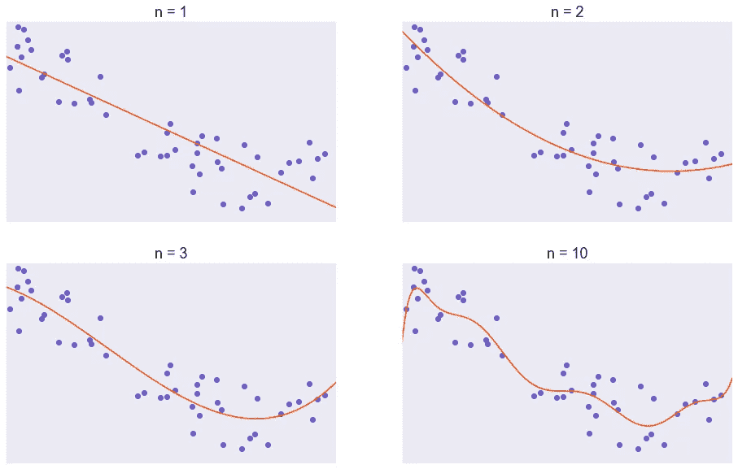
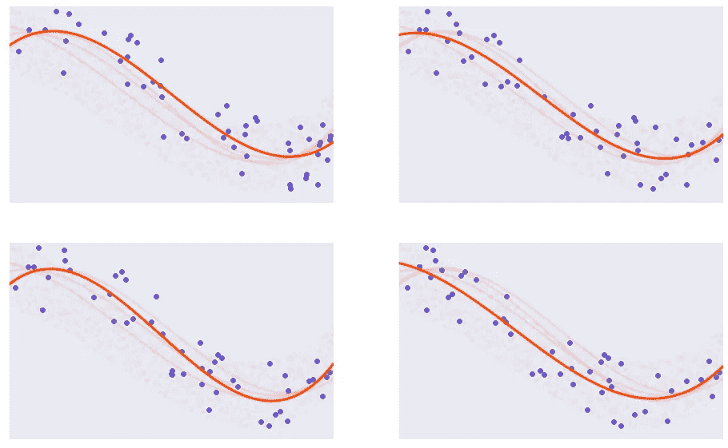
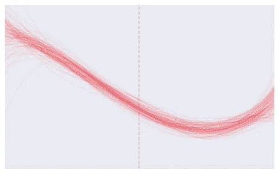
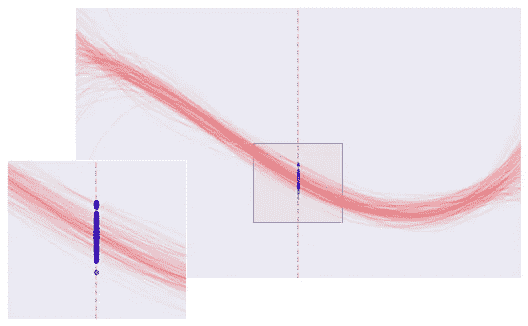
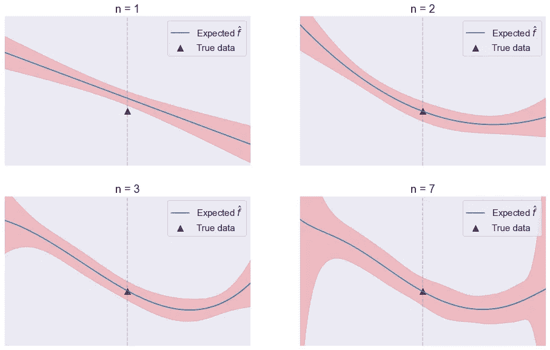
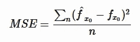
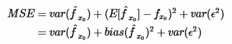
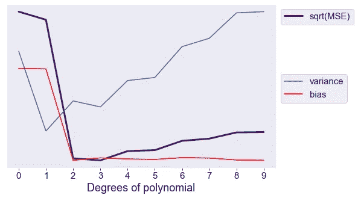

# 对偏差和方差的直观理解

> 原文：<https://towardsdatascience.com/a-visual-understanding-of-bias-and-variance-66179f16be32>

## 为这两个概念开发更深层次直觉的指南

乔·马尔多纳多在 [Unsplash](https://unsplash.com?utm_source=medium&utm_medium=referral) 上的照片

B 当谈到统计建模时，ias 和方差是两个最基本的术语，机器学习也是如此。然而，在机器学习社区中对偏差和方差的理解有些模糊，部分是因为许多关于该主题的现有文章试图产生速记类比(“偏差”=“欠拟合”，“方差”=“过拟合”，牛眼图)。如果你想快速描述一个模型的性能(“模型具有高偏差和低方差”)，这些类比是很好的，但我发现它们去除了偏差-方差权衡的潜在美感和具体性。我希望通过这篇文章，读者可以对统计建模中的偏差和方差有更深的理解。我也希望他们能把偏差和方差应用到其他情况。

# 统计建模

B ias 和方差来源于*统计学习*领域。统计学习是一个试图在收集的数据上建立模型的领域，以便(1)它们可以被预测或者(2)它们可以被理解。

***举例*** *:非常流行的* [*波士顿房屋数据集*](https://www.cs.toronto.edu/~delve/data/boston/bostonDetail.html) *是美国人口普查局在 1996 年收集的数据集。它包含多个变量，如人均犯罪率、每个住宅的房间数量、非零售企业的比例和价格值。*

如果你想建立一个房价模型，你可以设置其他变量作为模型的预测变量，而房价作为响应变量。如果有 *p* 个不同的预测因子 *X1* 、 *X* 2、…、 *Xp* 和一个响应变量 *Y* ，那么我们可以假设一个 *Y* 使用 *X* 的模型为:

在这个等式中，注意除了固定的函数 *f* ( *X* )之外，等式中还有另一项 *ϵ* 。这是误差项。这一项是模拟值和实际值之间的差异，可以表示噪声或随机过程等。主要的要点是， *ϵ* 既独立于 *X* ，又具有为零的平均值。

在现实世界中，如果我们着手对这些数据进行建模，我们可能无法访问所有的数据点(所有数据点的集合被称为“总体”)。相反，我们只能访问选定数量的数据点(这称为“样本”)。这里，我们有一个 50 个数据点的样本。这将与我们对方差的讨论相关，因为同一总体的多次抽样将产生略有不同的估计模型。

为了使模型适合这个数据集，最好从尽可能简单的开始，然后逐渐变得复杂。这里，我将使用一个以 *n^th* 幂为最高幂的多项式模型，从 *n* =1(线性回归)开始，然后将 *n* 的值一直增加到 10。所有模型都被拟合以最小化均方误差值。

为了使模型适合这个数据集，最好从尽可能简单的开始，然后逐渐变得复杂。这里，我将使用 n 次多项式模型，从 *n* =1(线性回归)开始，然后将 *n* 的值一直增加到 10。所有模型都被拟合以最小化均方误差值。

# 什么是方差？

现在，让我们进入这篇文章的主要部分:发展对方差和偏差的理解。我们先讲方差，因为它更容易理解。简单来说，并不是所有的样本都一样。当两个样品不同时，我们生产的模型看起来略有不同。

从同一人群中抽取大小为 50 的不同样本。我们用三次多项式来拟合它们。

这里我们说我们改变了模型的**参数**。上图中，所有模型都是三阶多项式，以 *X* 为最高次幂。每个模型都是在略有不同的人口样本上训练的。

假设我们重复这个过程 100 次。这是它们的样子。

我们模型的目标是产生预测。使用模型来预测新的 *X* 的 *Y* 值会产生以下结果:

使用不同建模曲线(红线)对 Y 值(蓝点)的不同预测。灰色虚线是我们用作预测值的 X 值。

一些模型会产生变化很大的预测，但其他一些模型会产生非常一致的预测。我们用**方差**来量化一致性。从统计学角度来看，模型预测的方差是所有预测的方差的平均值(或期望值)。正如在[的《统计学习导论](https://www.statlearning.com/)中所说:

> 一般来说，更灵活的统计方法具有更高的方差。

# 什么是偏见？

答在我们做出各种各样的预测之后，我们还想考虑这些预测的平均值或期望值是多少。这个平均值被称为所有预测的*期望值*。偏差是指所有预测的*期望值*与*实际值*相差多少。

偏差是真实数据(三角形)和预期值(蓝线)之间的“距离”。方差是不同预测的“宽度”(红色带)。

有了这个图，我希望你能理解如何测量偏差和方差，以及如何用它们来描述过度拟合或欠拟合的模型。

*   在我们的线性回归模型中( *n* =1)，预测值的平均值与实际的 *Y* 值相差很大。该模型也有广泛的范围。所以我们可以说线性回归模型有**高偏差**和**高方差**。
*   在使用 *n* =7 的模型中，预测值的平均值非常接近实际的 *Y* 值。然而，该模型有非常广泛的范围。我们可以说 *n* =7 模型有**低偏**但是**高方差**。
*   在使用 *n* =2 和 *n* =3 的两个模型中，方差和偏差都非常小。统计建模的目标是产生和发现具有低方差和低偏差的模型。

# 偏差-方差权衡

我们如何知道我们的模型对现实有多“正确”?好吧，我在前面给过你提示。我们可以计算出预测值和实际值的误差，然后相加，取平均值。当然，这就是我们如何得出预测值的偏差。然而，这样做可能会适得其反，因为如果偏差为 0，这可能意味着预测器正确预测了一切(无方差)，或者预测器错误地预测了一切，但它们甚至为零(高方差)。相反，我们对误差的绝对值或平方求和。在许多情况下，误差项的平方更为可取，因为在寻找解决方案方面，它更易于实现。我们称之为均方误差(MSE):

如果你以前学过统计学，你会知道这也被称为平方误差的期望值。期望值具有一些可以用来分解 MSE 的属性。你应该仔细阅读这篇博文中的[维基百科](https://en.wikipedia.org/wiki/Bias%E2%80%93variance_tradeoff#Derivation)和[的详细分解。最后，你应该得到](https://medium.com/analytics-vidhya/bias-variance-decomposition-101-a-step-by-step-computation-9d5f3694877)

*var* ( *ϵ* ^2)项称为不可约误差。它决定了 MSE 的最小可实现值，进而决定了预测值。

*作为练习，在已知误差来自均匀分布[-10，10]的情况下，能否计算出不可约误差值？*

从这个分解中，很明显，MSE 是由预测值的和与偏差决定的。如果我们将模型的 MSE、方差和偏差项一起绘制成复杂性增加的曲线，我们将观察到 MSE 的 U 形值。选择一个正确的模型需要选择一个有适当的方差和偏差的模型。

这就是偏差——方差权衡。在这种情况下，MSE 在 *n* =3 时最低。我们可以说，三阶多项式最好地模拟了实际人口。

> ***问题:*** 如果我增加训练数据的个数，一个预测器的偏差和方差会发生什么变化？
> 
> ***答案:*** *直觉地想，你会看到，通过采样更多的数据点，得到的预测模型会更稳定。因此，随着训练数据的增加，预测器将具有较低的方差。然而，偏见将保持不变。这是因为无论样本数量多少，偏差都会向平均值靠拢。实际上，如果用于训练的数据点太少，数据点的数量也会影响偏差，因为更多的数据点会使估计量更适合。*
> 
> ***问题:*** 如果我给自己的模型加一个常数项，偏倚和方差会怎么样？
> 
> ***答案:*** *方差只是简单的衡量了预测的传播程度。如果我加入一个常数项，利差仍然保持不变，所以方差也保持不变。另一方面，偏差将向常数项的方向变化。*

# 应用程序

到目前为止，我希望你能培养出对偏差和变化的直觉。更具体地说，为什么它们经常被用来描述模型。然而，您可能想知道它们是否只是描述模型的词语，没有实际的理论或实践重要性。在这里，我将指导您将偏差和方差应用于交叉验证。

# 交互效度分析

ross 验证是评估模型性能的最常用方法之一。通常，为了度量模型性能，您会将数据分为定型集和验证集，使用定型集更新模型参数，然后在验证集上生成评估。但是，如果原始数据集不够大，您可以在原始数据集的不同较小子集上重复训练模型。模型的最终评估将是使用不同验证集的所有评估的组合。通过查看采样过程，您可以立即看到这与预测值的方差方面有什么关系。我们的目标是找到在新的测试值上具有最低 MSE 的模型，那么交叉验证可以做到这一点吗？

首先，让我们考虑留一交叉验证(LOOCV)。在 LOOCV，测试集只有一个样本，而训练集有其余的样本。该模型被重复训练*n*1 次，其中 *n* 是数据集中数据点的数量。最终评估是所有培训的平均值。

很快，你就可以注意到 LOOCV 相对于简单的没有交叉验证的训练测试分割的优势。如果现有的数据样本足够好，那么训练集的重复采样与真实人群的重复采样是相似的。然而，有一个小小的警告。当执行 LOOCV 时，所有训练样本将具有非常大的重叠。这种大的重叠会产生模型的高方差。

为了减少差异，可以使用另一种交叉验证方法，称为 k-fold 交叉验证。在 k 重交叉验证中，样本被分成 k 等份。测试集是一部分，训练集是其余部分。该模型被重复训练 k 次，每次用不同的部分进行测试。与 LOOCV 相比，k-fold 验证可以产生具有较低方差的模型，但反过来具有较高的偏差。

对测试数据使用 LOOCV 和 K 倍交叉验证的 MSE 值。

交叉验证在选择最佳模型方面有多好？这里，我们将尝试使用 K 重交叉验证( *K* =10)来找到最佳多项式幂。LOOCV 产生最佳值 6，K 倍产生最佳值 3。如果我们不希望我们的模型过度拟合训练样本，我们可以使用更简单的模型，其中 *n* =3。

# 结论

我希望这篇文章能帮助你更好地理解偏差和方差分解背后的直觉。从现在起，当你考虑模型的偏差和方差时，你将不再需要考虑诸如飞镖靶之类的类比，而是可以直接从基本原理出发。

如果你想玩生成图形的游戏，[这是源代码](https://github.com/mtran5/Notebooks/blob/main/Bias-variance%20tradeoff.ipynb)。玩得开心！

除非另有说明，所有图片均为作者所有。所有数据均由作者生成。

# 参考

詹姆斯·加雷思等人*统计学习导论*。第 112 卷。纽约:施普林格，2013 年。