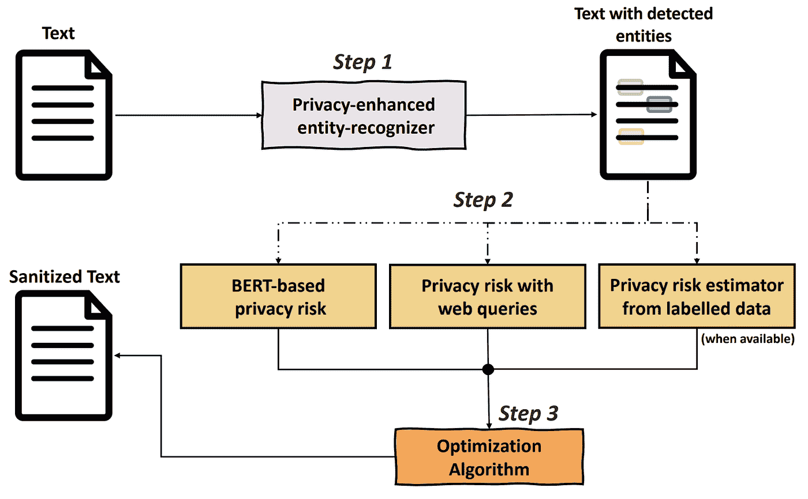
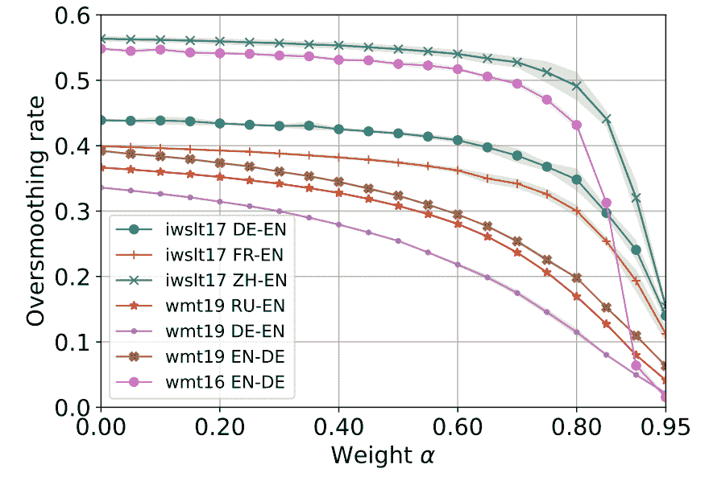

# AACL-IJCNLP 2022 亮点

> 原文：<https://towardsdatascience.com/aacl-ijcnlp-2022-highlights-d605e71e618f>

## 可调文本净化、惩罚过度平滑和用于看不见的语言的跨语言语言模型

蒂莫·沃尔茨在 [Unsplash](https://unsplash.com?utm_source=medium&utm_medium=referral) 上的照片

11 月 20 日至 23 日， [AACL 2022](https://www.aacl2022.org/) 与 IJCNLP 联合举办。

这是计算语言学协会(ACL)亚洲分会 AACL 的第二版。它只在网上举行(原计划在台湾举行)。

由于 AACL 仍然是一个年轻的会议，它收到的提交比欧洲和北美同行少得多。在提交的 554 篇论文中，有 147 篇被接受。

这是一个 **26.5%的接受率**，与 ACL 组织的其他会议的接受率相差不远。换句话说，AACL 是一个非常挑剔的会议。

我查阅了会议记录，挑选了几篇我觉得特别有趣的论文。

> ***如何选择高光？***
> 
> 我的集锦不一定是大会最好的论文。
> 
> 我主要选择处理趋势话题的论文，如人工智能中的公平和跨语言 NLP。
> 
> 我还试图选择那些得出适用于广泛的 NLP 应用的结论的论文，和/或我认为将对未来的工作产生重大影响的论文。
> 
> 这种选择也受到我自己在自然语言生成和机器翻译方面的专业知识的影响，也就是说，我更关注在这些领域发表的论文。

## [具有隐私风险明确措施的神经文本净化](https://aclanthology.org/2022.aacl-main.18/)

*作者:安西·帕帕多普洛(奥斯陆大学)、·于(理工学院)、皮埃尔·利松(挪威计算中心)和莉莉娅·弗勒里德(奥斯陆大学)*

NLP 模型越来越渴求数据。为了避免将私人信息传输到模型中，并防止在使用模型时侵犯隐私，应该应用文本净化。这是屏蔽文本中的任何私人信息的任务，例如姓名和地点，即可以帮助识别个人的信息。

文本净化是一项特别具有挑战性的任务，因为许多线索在单独使用时可能看起来毫无意义，但放在一起实际上可能会导致个人身份识别。标识符可以分类如下:

*   直接:姓名、社交网络标识符、车牌号等。
*   间接:出生日期、种族、国籍、地理定位数据点等。

在这项工作中，作者提出了一个不同于以往工作的方法。它引入了一个新的参数来控制隐私保护和数据有用性之间的权衡。事实上，以前的作品通常要么通过删除大量有用的信息(间接标识符)来保护隐私，要么不够积极，不足以保证隐私保护。

本文在权衡参数的需要上很有说服力。很容易想象需要或多或少主动清理的文档，例如，取决于领域(医疗记录、产品评论等。).

他们的方法分为 3 个步骤，如下图所示:

图由安西·帕帕多普洛(奥斯陆大学)、郝云·于(理工学院)、皮埃尔·利松(挪威计算中心)和利利亚·弗勒里德(奥斯陆大学)提供

他们首先应用实体识别器，该实体识别器特别适用于关注可能是直接或间接标识符的实体。然后，使用 3 种不同成分的组合，该方法识别哪些实体最有可能识别个体。这些组件的输出被组合以发布一个分数，该分数可用于调整净化的积极程度。

我认为这是一部令人印象深刻的作品。它保持简单和直观，同时为标准文本清理方法提供了一种可调的替代方法。

## [对于神经机器翻译来说，编码器-解码器是多余的吗？](https://aclanthology.org/2022.aacl-main.43/)

*作者:高英波、克里斯蒂安·赫罗德、杨子健和赫尔曼·内伊(亚琛工业大学)*

标准神经机器翻译(NMT)使用编码器-解码器架构。相比之下，生成式预训练语言模型仅使用自回归解码器，而没有任何单独的编码器，但是仍然能够执行翻译。例如，GPT 3 号可以翻译。

  

高等人的这项工作旨在研究机器翻译中编码器和解码器是否冗余。换句话说，难道我们不能通过连接源句子和目标句子来简化 NMT 体系结构，然后用语言建模目标在结果序列上训练模型吗？

为了回答这个问题，他们对非常不同的语言对进行了广泛的实验:德语-英语，英语-罗马尼亚语，英语-汉语，以及在同一训练数据中混合了多种语言(法语，德语和西班牙语)的多语言设置。

他们的主要意见如下:

*   翻译作为一种语言建模任务，其性能与标准的编码器-解码器架构相当。
*   自动编码和交叉熵损失产生类似的结果
*   对信号源来说，一个完整的注意力屏蔽是必要的
*   伯特风格的噪声对更好地训练模型帮助不大
*   语言模型应该具有与编码器-解码器版本一样多的参数，以实现类似的性能

它大大简化了 NMT 系统的当前架构。我们可以预期，在未来，翻译将更经常地作为语言建模任务来处理。

这项工作的一个局限在于评估。他们只用 BLEU 和 TER 这两个非常有限的指标来得出结论。鉴于这两个指标的评分之间的微小差异以及与人类判断的较差相关性，作者得出的结论在其他翻译任务中可能不成立。

  

## [对未知语言的跨语言少量学习](https://aclanthology.org/2022.aacl-main.59/)

*作者:尊达表·温纳塔(彭博)、吴世杰(彭博)、马扬克·库尔卡尼(亚马逊 Alexa AI)、塔玛·索洛里奥(彭博)和丹尼尔·普雷奥蒂乌克-皮埃特罗(彭博)*

大型语言模型可以应用于训练数据中看不到的语言吗？

虽然语言模型的跨语言能力是一个趋势性的研究主题，但它们对未知语言的建模能力在很大程度上仍未得到充分研究。

这项工作使用 3 种不同的多语言模型:XLM-R、mT5 和 XGLM，应用于情感分类任务(NusaX ),研究了少镜头学习如何在预训练期间对未知语言进行学习。

他们发现，如果我们有至少 15 个少量学习的例子，微调预先训练的模型实际上是最佳策略。上下文学习和在推理时用例子提示模型似乎产生较低的结果。

他们尝试了 XLM-R、mT5 和 XGLM，但同时也改变了少量学习策略，例如，mT5 在实验中从不微调，而只是用几个例子来提示。XLM-R 进行了微调，但没有使用示例进行提示。作者的结论是，微调是最好的策略，但这可能只是由于 XLM-R 本身而不是微调。

尽管如此，事实上，一个语言模型可以模拟一种在预训练期间看不到的语言，只使用少量的学习，这确实是了不起的。

## [描述和解决神经自回归序列建模中的过度平滑问题](https://aclanthology.org/2022.aacl-main.82/)

*伊利亚·库利科夫、马克西姆·埃雷米夫和赵京贤(纽约大学)*

自回归神经模型可以将非常高的概率分配给不合理的短序列。在极端情况下，序列甚至可能是空的。

有可能量化不合理的短序列产生的频率，即，当概率质量对短序列过度平滑时。

本文作者建议用“过度平滑率”进行量化。

他们首先表明，模型往往表现出罕见的过度光滑。它们生成的序列比它们应该生成的要短。

然后，他们提出了一种方法，使用负对数似然目标来减少模型训练期间的过度平滑率。

具体地说，他们以过度平滑损失的形式添加了正则化成分。这种损失有两项:第一项进一步最小化短序列的 EOS 令牌(即，生成时停止生成的令牌)的概率，而第二项防止短序列比完整序列更有可能。关于数学细节，我邀请你阅读这篇论文(第 3.1 节)。

注意，作者建议首先训练没有过度平滑损失的模型，因为它倾向于促进退化序列。然后，在模型的后续训练中，除了原始负对数似然训练目标之外，还可以引入过平滑损失。在第二次训练期间，过度平滑损失的贡献可以用权重α来调整。

在机器翻译中对所提出的方法进行了评估。正如我们在下图中看到的，该方法确实大大降低了过度平滑率。

图由伊利亚·库利科夫、马克西姆·埃尔梅耶夫和赵京贤(纽约大学)提供

在我看来，他们的结果中最引人注目的是对大波束解码的过平滑损失的好处。如下图所示，对于较高的α，BLEU 分数显著提高，特别是对于 100 的射束。

图由*伊利亚·库利科夫、马克西姆·埃雷米夫和赵京贤(纽约大学)*

它们表明句子的长度更接近参考句子的长度。

这项工作也是对深度学习中更好的波束搜索解码的重大进步。

## [预测公平性的系统评估](https://aclanthology.org/2022.aacl-main.6/)

*作者:(墨尔本大学)、艾力·申(亚马逊 Alexa AI)、特雷弗·科恩(墨尔本大学)、蒂莫西·鲍德温(墨尔本大学)和丽娅·弗雷曼(墨尔本大学 MBZUAI)*

我发现这项工作特别有趣，因为它回答了许多关于应用于数据集的去偏置方法的有效性的问题。

简而言之，他们的主要结论是，不存在消除数据集中偏差的通用最佳方法。

消除偏差的有效性很大程度上取决于数据条件，而不是去偏差的方法。

在这项工作中，数据条件是一组属性，用于量化数据集中人口统计子群、刻板印象等表示的平衡程度。直觉上，如果这些条件没有被很好地量化，去偏置方法的评估可能导致错误的结论。

评估这些条件的影响的实验是广泛的，并且跨越多个任务:二元和多类分类，以及回归。

根据给出的结果，不可能在先前工作使用的标准基准上正确评估去偏置方法。标准基准提供了一个不完整的画面，它将根据数据条件支持特定的方法。

这意味着应该通过更好地考虑数据条件来再次评估先前的工作。

我认为这是 NLP 在公平性领域的一个非常重要的进步。本文的结论将鼓励更好的去偏置方法的评估实践和基准的新数据集的创建。

这项工作的限制之一是它主要集中在“群体公平性”上，即一个模型在独立于人口统计子群的情况下，其表现如何是公平的。没有研究其他类型的偏差。作者承认这一点，他们认为他们的结论应该适用于其他类型的偏见。

## [缺乏理论是痛苦的:在同行评议中模拟苛刻](https://aclanthology.org/2022.aacl-main.67/)

*作者:拉吉夫·维尔马、拉贾什·罗伊丘杜里(贾达夫普尔大学)和提尔森卡·戈萨尔(查理大学)*

这是一项非常有趣的研究，它首先提醒了同行评议过程对科学论文作者来说是多么“痛苦”。

事实上，科学论文的审稿人经常是苛刻的，伤人的，并且可能忘记他们可能正在审阅一个年轻研究者的第一篇论文。

相信我，和大多数科学家一样，我也经历过。苛刻的评论对论文的改进毫无帮助，需要一些时间来找到再次提交的力量和动力。

尽管有问题的审查可能由元审查者或更高的计划委员会成员确定，但随着 AI/ML 会议变得越来越流行，由于要处理的审查量巨大，这变得越来越困难。

为了帮助完成这项任务，这项工作提出了一种自动的方法来评估评论的“苛刻度”。这里的最终目标是在评论发送给作者之前标记和编辑它们。

这项工作给出了下面这个苛刻评论的例子，来自 NeurIPS 2021:

> “我确实有社会科学研究的经验，但这篇论文从那个角度来看缺乏洞察力或原创性，所以我建议拒绝，[……]”
> 
> “这篇论文最终会在某个地方发表，但不会有太大影响。”

这听起来很刺耳，也没有建设性，但我见过更糟糕的。

为了训练一个粗糙度预测模型，作者汇编并公开发布了一个评论数据集，并对其粗糙度进行了注释。

他们对数据集上的 BERT 模型进行了微调，以对评论进行严格分类。他们获得了高于 70%的准确率。

我的看法是，这种倡议是非常需要的。众所周知，同行评审过程存在许多问题。拥有像这样的自动化方法肯定有助于解决这个问题。我甚至可以想象直接在运行中计算苛刻度分数，以警告评论者该评论可能过于苛刻，应该进行编辑。

# 结论

当然，这只是 AACL-IJCNLP 2022 项目的一瞥。你可以在那里找到完整的程序:

  

我还没有看过发表在“发现”上的论文，但那里总是有很棒的论文发表，还有在同处一地的研讨会上。

如果你有兴趣发现其他杰出的作品，我在这里列出了我的亮点:

本杰明·玛丽

## NLP/AI 会议集锦

[View list](https://medium.com/@bnjmn_marie/list/nlpai-conference-highlights-68bfee8c896d?source=post_page-----d605e71e618f--------------------------------)3 stories

*如果你喜欢这篇文章，支持我工作的最好方式就是使用我的链接成为一名媒体会员:*

  

*如果你已经是会员，想要支持这项工作，* [*就在 Medium*](https://medium.com/@bnjmn_marie) *上关注我吧。*