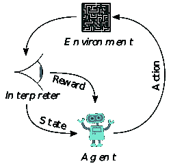
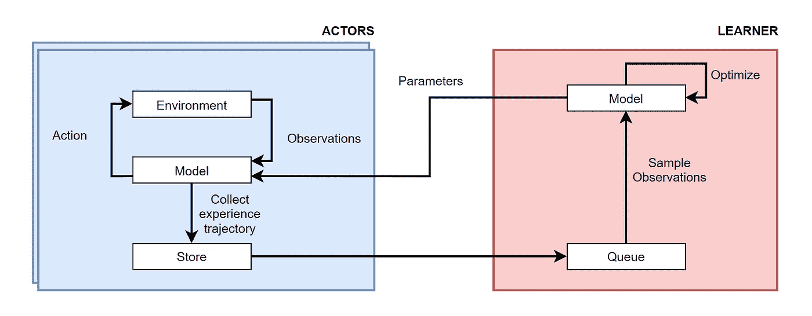
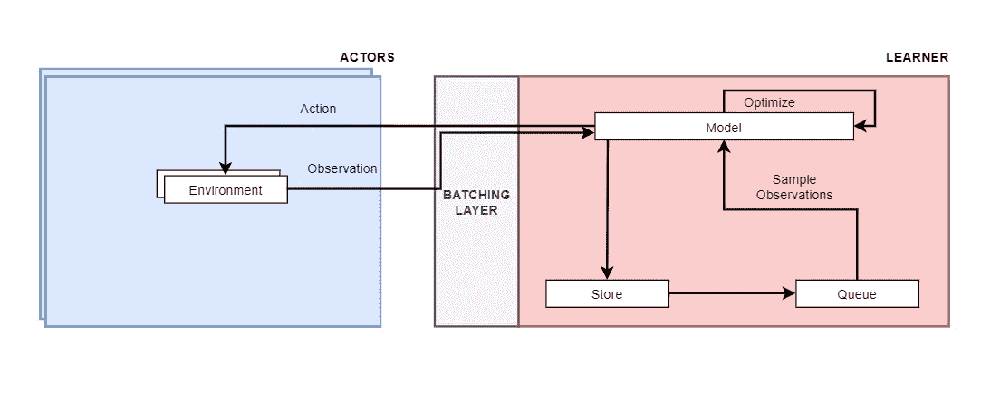
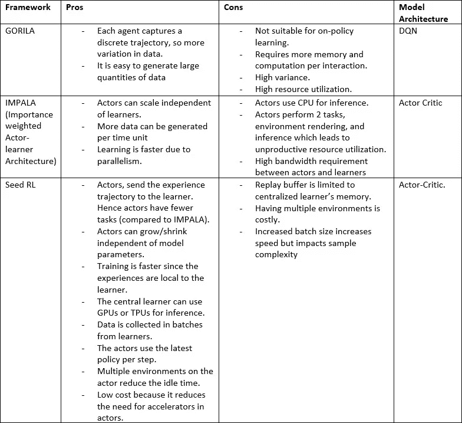

# 使用分布式强化学习架构加速 RL 培训

> 原文：<https://towardsdatascience.com/accelerate-training-in-rl-using-distributed-reinforcement-learning-architectures-b5a726b49826>

[附身摄影](https://unsplash.com/@possessedphotography?utm_source=medium&utm_medium=referral)在 [Unsplash](https://unsplash.com?utm_source=medium&utm_medium=referral) 上拍照

## 最常见的有什么不同？

Re enforcement learning 是人工智能的一个领域，专注于教导智能体在复杂和动态的环境中自动进行顺序决策。一个智能体学习与一个真正的人类棋手对弈就是应用 RL 的一个例子。在 RL 环境中，代理通过探索和利用可以在环境上采取的动作来学习操作环境。代理人的目的是最大化长期累积回报，就像在一场国际象棋比赛中获得最高的胜利数。

来源:[https://en.wikipedia.org/wiki/Reinforcement_learning](https://en.wikipedia.org/wiki/Reinforcement_learning)

。RL 算法分为基于模型的算法和无模型算法。在基于模型的环境中，我们有环境的真实表示，这意味着我们知道在当前状态下采取行动时到达下一个状态的概率。这些环境很容易模拟。例如，如果你想教一个智能体解决一个迷宫游戏，把迷宫表示为一系列当前位置、动作(左、右、前、后)、下一个位置元组更容易。

无模型学习处理难以模拟的真实世界环境，没有真实的环境模型——例如，代理在真实世界中学习驾驶汽车。在这个例子中，将汽车周围的世界表示为当前位置、动作(左、右、前、后)、下一位置元组的元组是复杂的。在这种情况下，代理通过最初采取随机行动来收集经验，并在后期优化行动。因此，代理在无模型 RL 问题中花费的大部分时间是在生成数据。这不仅仅是环境的随机性；动态环境还包含大的状态空间和动作空间，这使得训练数据的收集更慢。

大多数 RL 应用在决策时需要高吞吐量，这不仅限于游戏。想象一下，一个工业机器人负责通过将压力保持在最佳水平来确保安全。这种工业应用中的推断时间应该在几毫秒/微秒内，以便防止灾难。因此，在训练、优化和推理时间有限且环境复杂的情况下，应用 RL 算法开发工业人工智能解决方案始终是一个挑战。

在这种情况下，分布式强化学习会很有帮助。在分布式强化学习中，作用于环境和从经验中学习的责任分别在参与者和学习者之间划分。代理收集的经验与学习者共享，学习者负责学习要采取的最佳行动。类似地，学习者学习的动作被发送给演员。这种去耦支持对各种分布式 RL 架构的研究。

这篇博文介绍了最常用的架构，以及它们之间的区别。这里给出的架构列表并不详尽。随着 RL 在研究和应用中的普及，提出了更多的变体。然而，其中的每一个都仅仅是先前架构的衍生物，并且在优化训练时间、通信开销、资源优化、运行成本等方面有所不同。解耦参与者和学习者的底层设计在许多领域都很常见。

**注意**:基于模型的 RL 算法，如值迭代或策略迭代，也可以并行化。然而，他们局限于环境模型可用的问题，这在现实世界中是非常罕见的。因此这篇博文只关注无模型 RL 算法。

**哥里拉**

Gorila 代表通用强化学习架构，是 2015 年提出的第一个大规模分布式强化学习架构。本文引入了使用负责创建经验轨迹的行动者和基于神经网络的表示价值函数或策略函数的学习者的思想。下图显示了哥里拉的建筑。

哥里拉建筑，来源:【https://arxiv.org/abs/1507.04296 

GORILA 使用 DQN 学习价值函数。每个参与者从最新的 Q-网络参数中获得可以对环境采取的最佳行动。演员将体验轨迹发送到重放缓冲器。在一个环境中可以有多个参与者，这使得经验轨迹(训练数据)的收集更容易。每个学习者对训练数据进行采样，以使用深度 Q 学习来训练他们对应的 Q 网络。但是，梯度不会直接应用于目标网络。每个包含 Q 网络的学习器将梯度发送到参数服务器。参数服务器负责从学习者处收集梯度并合并梯度更新。参数服务器是使用 dist faith 构建的，dist faith 是一个用于并行训练大型网络的分布式系统。GORILA 使用模型并行性来收集和应用来自学习者模型的梯度，并将最新的 Q 网络参数发送到目标 Q 网络和演员。因此，用于生成最佳动作的模型参数落后于由学习者学习的最新参数，因为同步发生在每 N 个梯度更新之后。

**黑斑羚**

IMPALA 是重要性加权演员学习架构的标准，是 2018 年提出的另一种分布式 RL 方法，与 GORILA 截然不同。IMPALA 更适合多任务学习，你需要在不同领域的数百万个样本上进行训练。与 GORILA 学习价值函数不同，IMPALA 使用一种叫做 Actor-critic 的算法来学习政策函数和价值函数。在行动者-批评家方法中，有两个函数逼近器，一个负责学习策略，另一个负责学习价值函数。学习策略函数比纯值函数具有优势，因为策略函数本质上是随机的。在基于策略梯度的方法中，代理可以自由探索由策略函数生成的动作。相比之下，在传统的 Q-learning 中，只在学习阶段做出探索与利用的决策，但是由代理预测的动作是根据学习的策略采取的，这使得策略具有确定性。

*(注意:可以使用 Q 学习来学习随机策略，这种策略称为准确定性策略)。*

IMPALA 使用多个参与者和单个学习者策略来克服通信开销。学习者使用加速器(GPU)根据从各种参与者那里收集的经验来训练代理。学习者使用演员-评论家算法的变体来学习策略函数和基线值函数。然而，与 A3C 的分布式版本不同，参与者在本地存储并与集中式学习者共享经验，而不是梯度更新。IMPALA 采用各种优化技术来减少演员和学习者之间的滞后。使用 CNN + LSTM + FC 层来优化学习，其中对 CNN 和 FC 层的输入被并行处理。然而，该架构仍然遵循一个偏离策略的学习过程，因为参与者不使用最新的策略来派生动作。尽管如此，IMPALA 通过采用 [V-trace](https://paperswithcode.com/method/v-trace) 另一种不符合政策的演员-评论家强化学习算法来减少滞后的影响。正如算法的标题所提到的，“重要抽样”是一种应用于估计以减少方差的技术。IMPALA 通过对梯度应用权重来使用加权重要性采样。下图显示了 IMPALA 的架构示例。

英帕拉建筑(图片由作者提供)

**SEED-RL**

种子 RL 是最新的一个，由谷歌在 2020 年提出。SEED 代表可扩展且高效的深度 RL。SEED RL 解决了 IMPALA 使用的分布式参与者和集中式学习者方法中存在的许多不足。IMPALA 最重要的不足是使用 CPU 进行推理。SEED 通过将推理和轨迹集合移动到学习者来解决这个问题。有了这个变化，演员只负责操作环境。由于演员现在只有一项工作要做，所以它比 IMPALA 中使用的更轻便。此外，演员只分享经验。因此，与 IMPALA 相比，带宽需求是有限的，在 IMPALA 中，参与者共享模型参数、经验轨迹和 LSTM 状态。

由于参与者需要依赖学习者来完成每一步，这就引入了一个新的延迟问题。SEED 通过使用流式传输和始终开放的连接以及 GRPC 等低延迟通信协议来解决这一问题。此外，当参与者与学习者并置时，通过使用域套接字进一步减少了等待时间。下图显示了 SEED-RL 的架构。

SEED-RL 架构(图片由作者提供)

SEED 使用由 IMPALA 引入的 V-trace 来学习目标策略。SEED 不同于值函数的学习方式。SEED 使用 [R2D2](https://openreview.net/pdf?id=r1lyTjAqYX) (递归经验重放分布式强化学习)，一种基于价值的分布式代理来学习价值函数。

下表总结了上述每种方法的优缺点。

分布式 RL 方法的利弊。(图片由作者提供)

总之，上述每种方法都以独特的方式解决了训练时间、成本、带宽需求和资源优化的问题。每种方法的应用都取决于问题的性质。尽管如此，人工智能在除游戏以外的工业应用中的应用已经获得了动力，基于按需定价模型的 RL 分布式架构，云提供商加速器的可用性将有助于该领域的进一步发展。