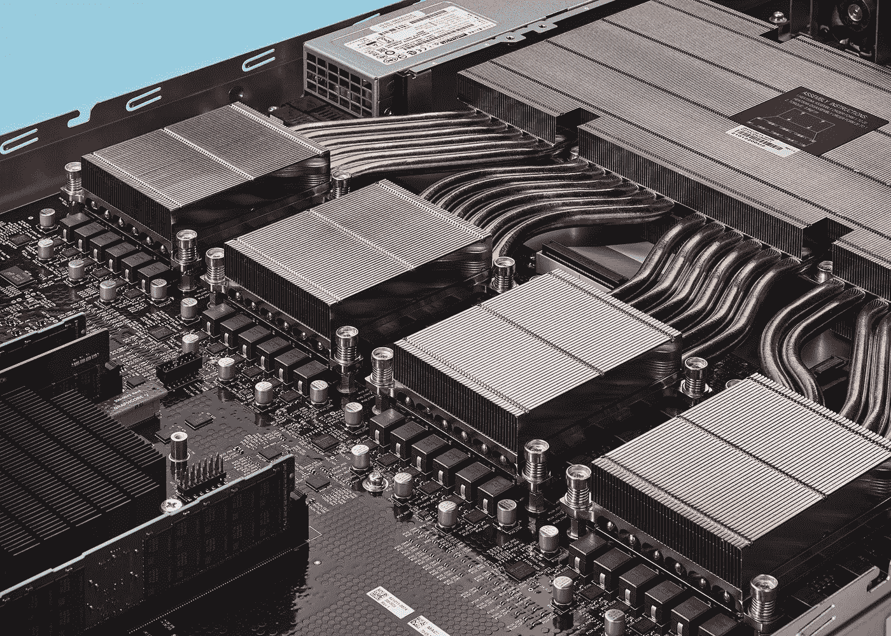
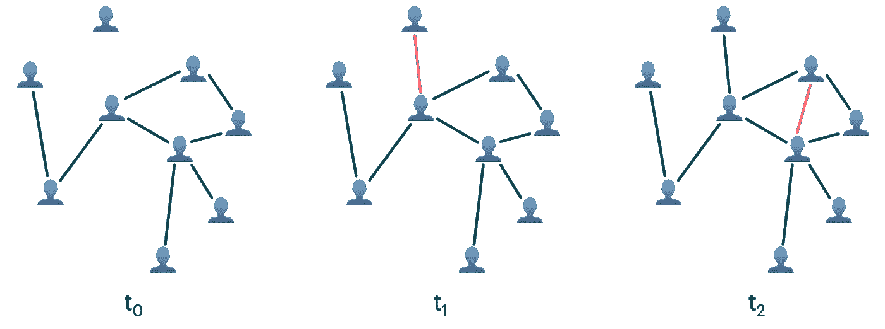
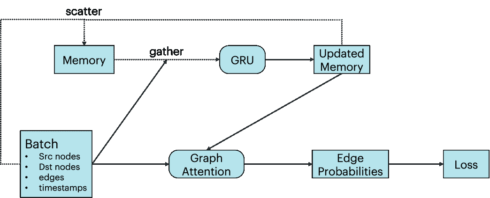
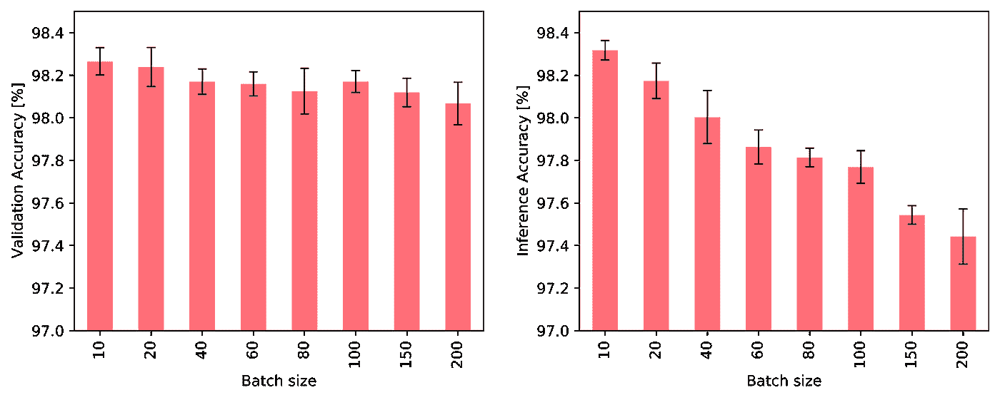
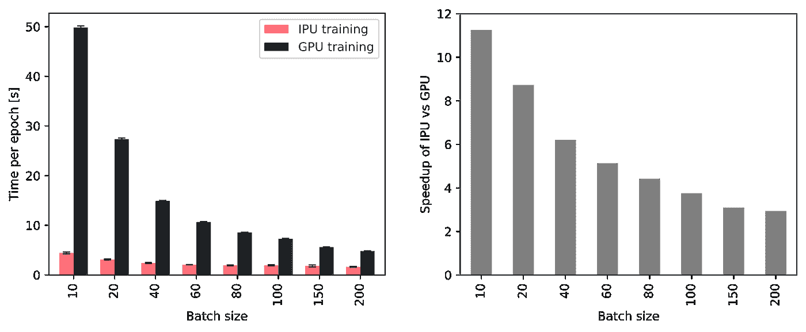
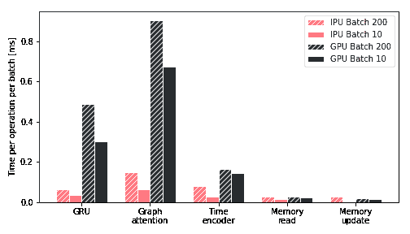
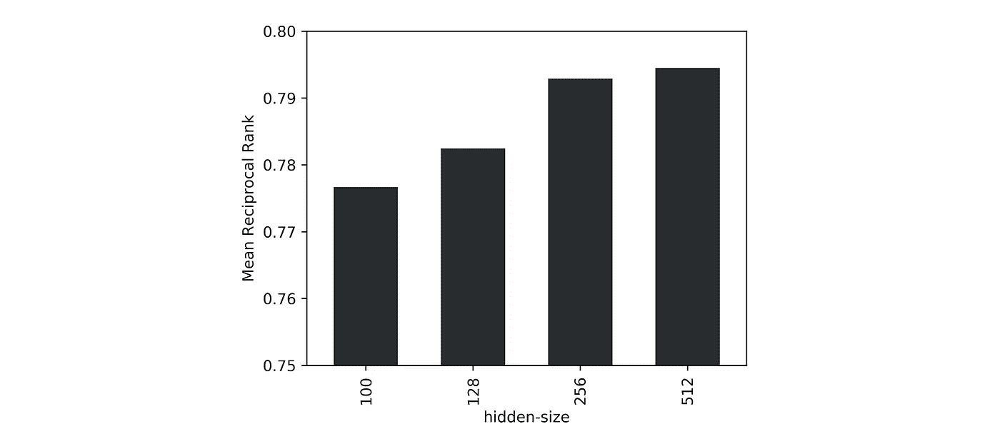
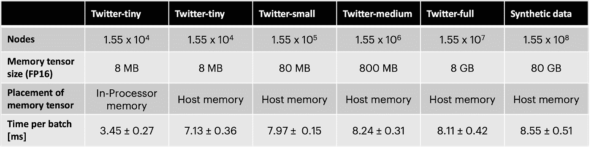

# 图核 IPU 上时态图网络的加速和缩放

> 原文：<https://towardsdatascience.com/accelerating-and-scaling-temporal-graph-networks-on-the-graphcore-ipu-c15ac309b765>

## 缩放 GNNs

## 图形神经网络(GNNs)标准硬件的适用性是图形 ML 社区中经常被忽视的问题。在这篇文章中，我们将探讨在 Graphcore 开发的新硬件架构上实现时态 GNNs，该架构是为图形结构的工作负载量身定制的。

Graphcore 弓 IPU 机。图片:图表核心

*这篇文章与* [*伊曼纽·罗西*](https://twitter.com/emaros96) *和* [*丹尼尔·贾斯特斯*](https://twitter.com/Daniels_Data) *合著，基于与英国半导体公司*[*graph core*](https://www.graphcore.ai/)*的合作。*

图结构的数据出现在许多处理交互实体的复杂系统的问题中。近年来，将机器学习方法应用于图结构数据的方法，特别是图神经网络(GNNs)，已经见证了流行的巨大增长。

大多数 GNN 架构都假设图形是*固定的*。然而，这种假设往往过于简单:因为在许多应用程序中，底层系统是动态的，图表会随着时间而变化。这是例如社交网络或推荐系统中的情况，其中描述用户与内容的交互的图形可以实时改变。最近开发了几个能够处理动态图的 GNN 架构，包括我们自己的[时态图网络](/temporal-graph-networks-ab8f327f2efe?sk=741e5d00c64bff1e98ed0e2ce248013a) (TGNs) [1]。

通过在时间戳 t ₁ *和 t* ₂.获得新的边，人与人之间的交互图是动态变化的

在这篇文章中，我们探索了 TGNs 在不同大小的动态图中的应用，并研究了这类模型的计算复杂性。我们使用 Graphcore 的 [Bow 智能处理单元](https://www.graphcore.ai/products) (IPU)来训练 TGNs，并展示为什么 IPU 的架构非常适合解决这些复杂性，在将单个 IPU 处理器与 NVIDIA A100 GPU 进行比较时，速度提高了一个数量级。

TGN 架构在[我们之前的帖子](/temporal-graph-networks-ab8f327f2efe?sk=741e5d00c64bff1e98ed0e2ce248013a)中有详细描述，由两个主要组件组成:首先，节点嵌入是通过经典的图形神经网络架构生成的，这里实现为单层图形注意力网络[2]。此外，TGN 还保留了一个总结每个节点过去所有交互的内存。这种存储通过稀疏读/写操作来访问，并使用门控循环网络(GRU) [3]通过新的交互来更新。

*TGN 建筑。底部一行代表一个只有一个消息传递步骤的 GNN。顶行说明了图形中每个节点的额外内存。*

我们关注通过获得新边而随时间变化的图。在这种情况下，给定节点的存储器包含关于以该节点为目标的所有边以及它们各自的目的节点的信息。通过间接贡献，给定节点的记忆也可以保存关于更远的节点的信息，从而使得图形注意力网络中的附加层可有可无。

# 对小图的应用

我们首先在 JODIE Wikipedia 数据集[4]上试验 TGN，这是一个 Wikipedia 文章和用户的二分图，其中用户和文章之间的每条边都代表用户对文章的编辑。该图由 9，227 个节点(8，227 个用户和 1，000 篇文章)和 157，474 条带时间戳的边组成，这些边用描述编辑的 172 维 LIWC 特征向量[5]进行了注释。

在训练期间，边被逐批插入到最初断开的节点集合中，同时使用真实边和随机采样的负边的对比损失来训练模型。验证结果被报告为在随机采样的负边缘上识别真实边缘的概率。

直观地说，大批量对训练和推理都有不利的后果:节点内存和图的连通性都只在处理完一整批后才更新。因此，一个批次中的后续事件可能依赖于过时的信息，因为它们不知道该批次中的早期事件。事实上，我们观察到大批量对任务性能的不利影响，如下图所示:

*当使用不同的批量大小进行训练并使用固定的批量大小 10 进行验证时(左)，以及当使用固定的批量大小 10 进行训练并使用不同的批量大小进行验证时(右)，TGN 对 JODIE/Wikipedia 数据的准确性。*

然而，小批量的使用强调了快速存储器访问对于在训练和推理期间实现高吞吐量的重要性。因此，与批量较小的 GPU 相比，具有较大处理器内存的 IPU 显示出了更大的吞吐量优势，如下图所示。特别地，当使用 10 TGN 的批量时，在 IPU 上的训练可以快大约 11 倍，并且即使使用 200 的大批量，在 IPU 上的训练仍然快大约 3 倍。

*与 NVIDIA A100 GPU 相比，使用 Bow2000 IPU 系统中的单个 IPU 时，不同批量的吞吐量有所提高。*

为了更好地了解 graph core IPU 上 TGN 培训吞吐量的提高，我们调查了不同硬件平台在 TGN 关键操作上花费的时间。我们发现，花费在 GPU 上的时间主要由注意力模块和 GRU 决定，这两种操作在 IPU 上执行效率更高。此外，在所有操作中，IPU 处理小批量产品的效率更高。

特别是，我们观察到 IPU 的优势随着更小和更分散的内存操作而增长。更一般地说，我们的结论是，当计算和内存访问非常异构时，IPU 架构比 GPU 显示出显著的优势。

*TGN 在不同批量的 IPU 和 GPU 上关键操作的时间对比。*

# 缩放至大图

虽然默认配置中的 TGN 模型相对较轻，只有大约 260，000 个参数，但是当将该模型应用于大型图形时，大多数 IPU 处理器内存都由节点内存使用。然而，由于它很少被访问，这个张量可以被移动到片外存储器，在这种情况下，处理器内存储器的利用率与图形的大小无关。

为了在大型图上测试 TGN 架构，我们将它应用于一个匿名图，该图包含 1550 万 Twitter 用户之间的 2.61 亿个关注[6]。这些边被分配 728 个不同的时间戳，这些时间戳尊重日期排序，但是不提供关于随后发生的实际日期的任何信息。由于该数据集中不存在节点或边要素，因此该模型完全依赖于图表拓扑和时间演变来预测新的链接。

由于大量数据使得与单个负样本相比识别正边缘的任务过于简单，我们使用 1000 个随机采样的负边缘中的真实边缘的平均倒数排名(MRR)作为验证度量。此外，我们发现当增加数据集大小时，模型性能受益于更大的隐藏大小。对于给定的数据，我们将潜在大小 256 确定为准确性和吞吐量之间的最佳点。

*模型不同隐藏大小的 1000 个负样本的平均倒数排名。*

U 使用片外存储器作为节点存储器会使吞吐量降低大约两倍。然而，使用不同大小的诱导子图以及具有 10 倍 Twitter 图节点数和随机连通性的合成数据集，我们证明了吞吐量几乎与图的大小无关(见下表)。在 IPU 上使用这种技术，TGN 可以应用于几乎任意大小的图，仅受可用主机内存量的限制，同时在训练和推理期间保持非常高的吞吐量。

*在不同图尺寸上训练隐藏尺寸为 256 的 TGN 每批尺寸为 256 的时间。Twitter-tiny 与 JODIE/Wikipedia 数据集的大小相似。*

正如我们之前已经[反复提到过](/deep-learning-on-graphs-successes-challenges-and-next-steps-7d9ec220ba8?sk=b260a9446e9a25a0904acdddb693e0a8)，选择实现图形 ML 模型的硬件是一个至关重要的问题，但也是一个经常被忽视的问题。特别是在研究社区中，抽象出底层硬件的云计算服务的可用性导致了这方面的某些“懒惰”。然而，当涉及到实现在具有实时延迟要求的大规模数据集上工作的系统时，就不能再简单地考虑硬件了。我们希望我们的研究能引起更多人对这一重要课题的关注，并为未来图形 ML 应用的更有效的算法和硬件架构铺平道路。

[1] E. Rossi 等，[动态图上深度学习的时态图网络](https://arxiv.org/abs/2006.10637) (2020) arXiv:2006.10637 .参见随附的[博文](/temporal-graph-networks-ab8f327f2efe?sk=741e5d00c64bff1e98ed0e2ce248013a)。

[2]p . veli kovi 等人，图形注意网络(2018 年)ICLR。

[3] K. Cho 等，[论神经机器翻译的性质:编码器-解码器方法](https://arxiv.org/abs/1409.1259) (2014)，arXiv:1409.1259。

[4] S. Kumar 等，[预测时态交互网络中的动态嵌入轨迹](https://arxiv.org/abs/1710.10903) (2019) KDD。

[5] J. W. Pennebaker 等人，《语言学调查和字数统计:LIWC 2001 年》(2001 年)。马威:劳伦斯·厄尔鲍姆联合公司 71。

[6] A. El-Kishky 等， [kNN-Embed:多兴趣候选检索的局部平滑嵌入混合](https://arxiv.org/pdf/2205.06205.pdf) (2022) arXiv:2205.06205。

*我们感谢 Douglas Orr 和 Gianandrea Minneci 为实施 IPU TGNs 所做的贡献。关于图的深度学习的附加文章，请参见《走向数据科学》中我的* [*其他帖子*](https://towardsdatascience.com/graph-deep-learning/home) *，* [*订阅我的帖子*](https://michael-bronstein.medium.com/subscribe) *，获取* [*中等会员*](https://michael-bronstein.medium.com/membership) *，或者关注我的*[*Twitter*](https://twitter.com/mmbronstein)*。*