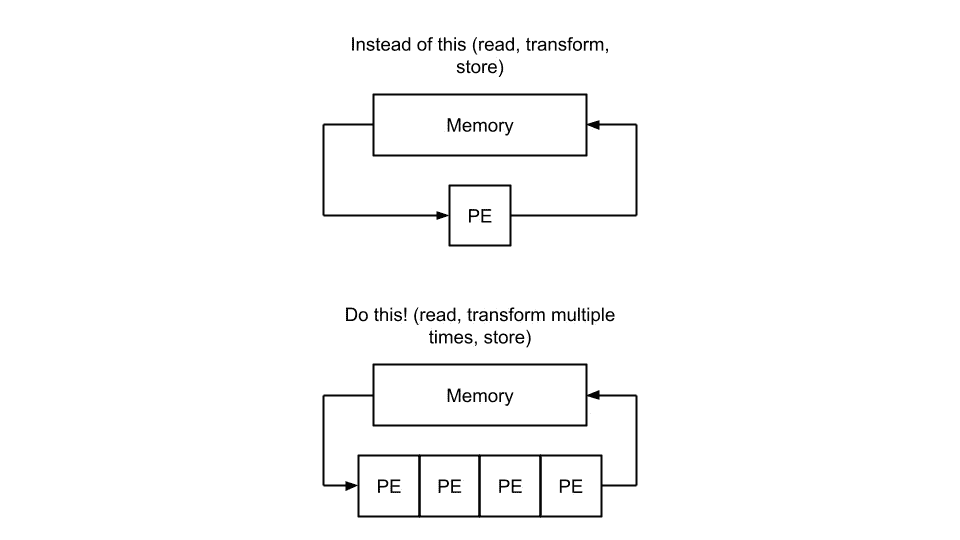
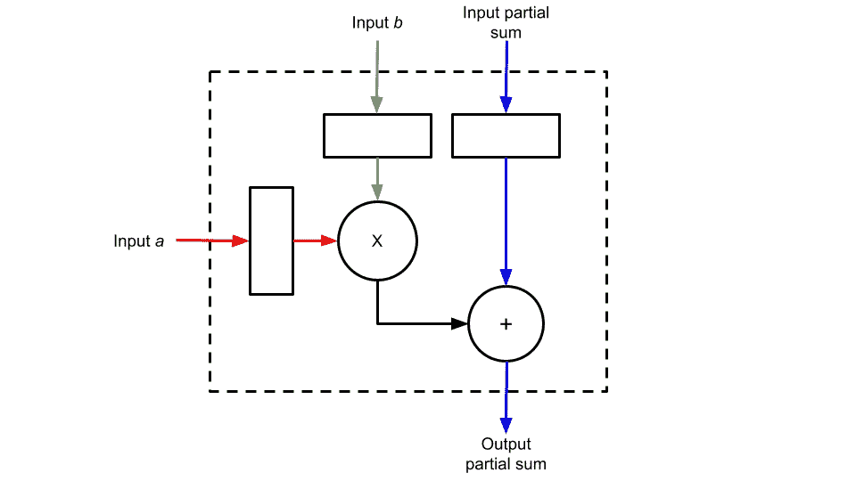
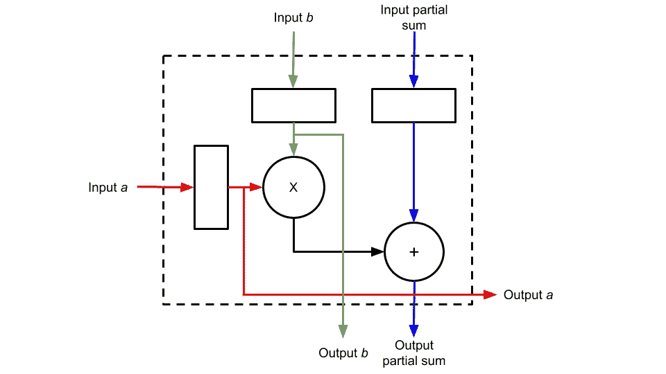
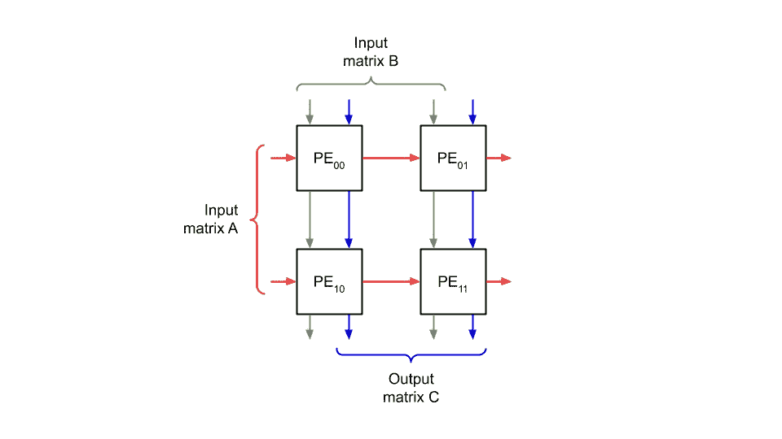
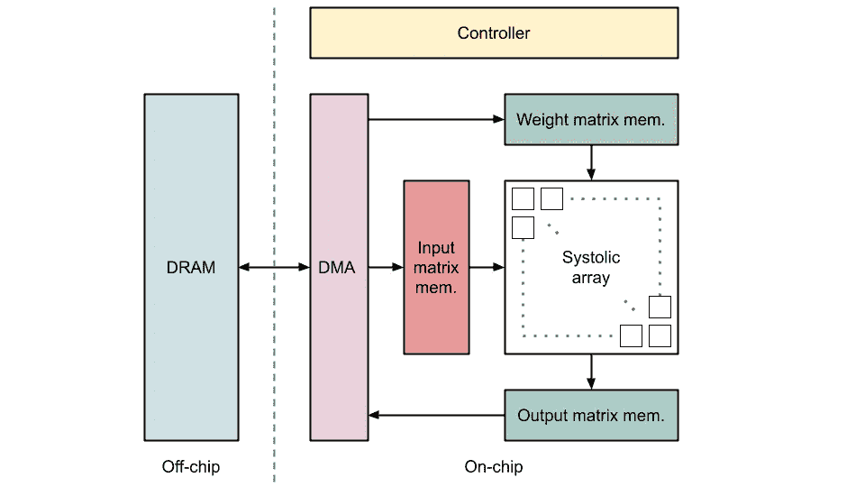

# 用于神经网络的硬件加速器

> 原文：<https://towardsdatascience.com/accelerating-neural-networks-on-hardware-baa3c14cd5ba>

## 脉动阵列如何工作

Vishnu Mohanan 在 [Unsplash](https://unsplash.com?utm_source=medium&utm_medium=referral) 上的照片

## 介绍

在一个神经网络被用来处理几乎任何类型的数据(从图像到音频或心脏活动)的世界，人们越来越有兴趣将这些模型的执行从云转移到边缘(嵌入式)系统。为什么这是一个有趣的趋势？这是这种范式转变的一些原因:

*   **能耗:**与其在 GPU 这样昂贵且耗能的硬件上运行人工智能算法，为什么不构建一个专门定制的嵌入式设备来更有效地执行算法呢？
*   **隐私问题:**与其将原始的传感器/摄像头数据发送到云端，从隐私的角度来看，将原始数据保留在设备中，只将已经处理过的结果共享到云端不是更好吗？

虽然有多种硬件架构和解决方案可以在嵌入式设备上加速这些算法，但最有吸引力的是基于脉动阵列的加速器。H. T. Kung 在其 1982 年[论文](https://www.cse.wustl.edu/~roger/560M.f17/01653825.pdf)中首次介绍了这些架构，这些架构基本上是通过以级联方式重复连接基本计算单元(称为*处理单元，此后称为*PE)来构建的。这些数组的一个重要方面是 PE 都等于。

Kung 提出的基本思想(实际例子见论文)。图片作者。

为什么这很重要？简单和常规的设计更容易也更便宜。此外，因为数据是在 PE 之间传播的，所以这种架构重用了大量数据，这在内存带宽和能耗方面是有吸引力的(数据只从内存中读取一次，可以多次重用)。

在本文中，您将:

*   查看神经网络的基本数学运算是如何表示的
*   了解脉动阵列如何能够执行矩阵乘法运算(配有漂亮且易于理解的动画！)
*   查看如何围绕脉动阵列构建完整硬件加速器架构的示例
*   获取关于该主题的实践项目、相关论文和教育视频的摘要

**免责声明:**要完全理解这篇文章，你应该对线性代数(知道什么是矩阵乘法)和数字电路(知道什么是寄存器和时钟)有一个基本的了解。如果你做到了，你就可以走了！如果没有，不要让这阻止你！我相信你会发现这篇文章很有趣。

## 将复杂的神经网络简化为基础

如今，神经网络正在成为极其复杂的算法，有数百层，数百万(有时数十亿)的参数。但是在这篇文章中，我们将关注当今流行的神经网络模型中使用较多的两层:卷积层和全连接层。

完全连接的层可以直接描述为矩阵乘法运算。卷积层稍微复杂一点，但是存在聪明的变换，以便将它们也变换成矩阵乘法运算(参见[这篇文章](https://ieeexplore.ieee.org/abstract/document/9650846)或[这篇文章](https://ieeexplore.ieee.org/document/7995254)关于这些变换如何工作的例子)。这就是为什么我们将只关注如何设计一个脉动阵列来执行这个操作。

为了更新您的线性代数知识，让我们记住基本的通用矩阵乘法(GEMM)运算是如何计算的，我们将在整篇文章中继续使用这个小例子:

基本的 2x2 矩阵乘法。作者视频。

这里的基本操作是什么？再看一遍动画。你看到我们总是在两个元素之间做乘法，然后累加上一次乘法的结果了吗？这种操作被称为乘累加(MACC)，在硬件中实现起来相当容易。

## 基础体育

因此，我们需要设计一些能够执行 MACC 操作的 PE。

我之前说过，这个运算是一个乘法后面跟着一个累加。现在，在神经网络中，A 矩阵通常是该层的输入，B 矩阵表示该层的参数(其*权重*)。因为这些参数是恒定的，并且在我们使用神经网络预测某些东西时不会(通常)改变，所以我们实际上可以将矩阵 B 的值预加载到 PE 中，并在多次乘法中重用它们！我向你保证，这以后会更有意义。这可以通过下图很容易地描述出来(寄存器 *b* 将预加载相应的 *b* 参数):

基础体育设计。图片作者。

但还记得我们讨论过这些脉动架构如何一个接一个地级联 PE 吗？为了做到这一点，我们只需添加几条线路，让我们能够从一个 PE 到另一个 PE 共享数据:

带有传播信号的基本 PE。图片作者。

这是我们的基本 PE！首先，注意我们如何从顶部插入 *b* 参数，并在每个时钟周期将其值传播到将连接到底部的 PE(这在用 B 矩阵预加载脉动数组时会很方便)。第二，注意在每个时钟周期，新的输入数据 *a* 来自左边的 PE，与存储的权重*b*相乘，然后与来自上面的 PE 的部分和累加。输出部分和然后被传播到下面的 PE，而原始输入数据 *a* 被传播到右边的 PE。最后，为了使图尽可能简单，我没有画出控制、复位和时钟信号。

接下来，我们将看到如何使用级联来执行整个矩阵乘法！

**免责声明:**请记住，这只是**一种**可能的处理元件配置，它使用*权重固定*方法(权重首先预加载到 PE 中，然后来自矩阵 A 的输入数据和部分和从 PE 流向 PE)。存在用于矩阵乘法的其他 PE 设计，例如，*输出稳定*方法。也可以使用脉动阵列加速的不同算法可以具有更简单或复杂的 PE 设计。有关所有这些其他方法和 PE 设计的示例，请查看“参考资料”部分和文章末尾。

## 构建脉动阵列

让我们建立一个 PE 的 2D 数组:一个**脉动数组**！如前一节所述，每个 PE 将从其左侧和顶部的 PE 接收数据，并将数据传播到其右侧和底部的 PE。

2D 脉动阵列。图片作者。

为了执行整个矩阵乘法，我们将首先将整个 B 矩阵预加载到脉动阵列中(记住，我们使用的是*权重固定*方法)。然后，我们将从左到右传播输入矩阵 A，并且从上到下传播部分和。C 结果矩阵将从底部 PEs 的输出中获得。请看下面的动画，它通过在 2x2 脉动阵列中执行[2，2]x[2，2]矩阵乘法来说明这一过程(请注意我们实际上是如何插入 A 矩阵的转置版本的):

在加权静态脉动阵列上执行 2×2 矩阵乘法。图片作者。

注意数据如何需要以这种“步进”或移位的方式进入脉动阵列，以及如何以相同的方式获得结果。如果数据在脉动阵列中一次移动一个时钟，那么计算特定配置获得完整结果需要多少个时钟是相当容易的。如果你感兴趣，可以看看阿斯加里等人的工作，其中对方程有更详细的解释。

如果不是执行 C=A*B，我们还想添加一个矩阵(C=A*B+D，有时被称为扩展 GEMM)会怎样？嗯，我们只是将 D 矩阵值插入到数组顶部的 PEs 的部分和输入中！

但是如果我们的输入矩阵大于脉动数组的大小，我们该怎么办呢？这就是我们使用**平铺**方法的时候。平铺意味着划分我们的 A 和 B 矩阵，以便我们得到可以在脉动阵列中执行的补丁。让我们来看一个 8×8 脉动阵列(Ax、Bx 和 Cx 都是 8×8 面片)上的[16，16]x[16，16]矩阵乘法的例子:

脉动阵列上的平铺示例。作者视频。

**注意:**如果平铺方法生成的分区小于脉动阵列的大小(例如，因为矩阵大小和脉动阵列大小之间的除法不是偶数)，则 PE 将在计算期间保持空闲。当然，我们希望在一次计算中尽可能多地使用 PE。寻找跨不同工作负载最大化 PE 使用的操作符映射技术是一个活跃的研究领域！

## 将其集成到完整的硬件加速器架构中

仅举一个例子，为了了解所有这些在真实用例场景中是如何协同工作的，让我们向硬件加速器添加更多的模块。

首先，我们将添加内存来存储矩阵 A(称为*输入特征映射*)、矩阵 B(正如我们已经说过的，*权重*)和矩阵 C(称为*输出特征映射*)。然后，我们添加一个模块(例如，一个 [DMA](https://en.wikipedia.org/wiki/Direct_memory_access) )来在加速器的内部存储器和外部 DRAM 之间移动数据(以防矩阵太大而不适合加速器的内部存储器，如果您试图运行一个当今流行的神经网络，如 [YoloV7](https://arxiv.org/abs/2207.02696) 或 [EfficientDet-D7](https://arxiv.org/abs/1911.09070v7) ，这几乎在所有情况下都会发生)。最后，我们添加了一个控制器模块来协调数据进出加速器，以及矩阵必须如何进入脉动阵列。

基本加速器图。图片作者。

# 动手！

您想尝试脉动阵列模拟器，尝试不同大小的暂存区和处理元件阵列尺寸，并分析整个神经网络架构的执行情况吗？查看 [Scale-SIM](https://github.com/scalesim-project/scale-sim-v2) [2】，这是一个用于脉动阵列的 Python 模拟器，您可以在其中探索卷积或全连接层等工作负载的内部内存大小和脉动阵列尺寸之间的权衡。

欢迎在[推特](https://twitter.com/PecciaF)或 [LinkedIn](https://www.linkedin.com/in/fpecc/) 上关注我，让我知道你对这篇文章的看法，或者[给我买杯咖啡](https://www.buymeacoffee.com/pecciaf)如果你真的喜欢它！

感谢阅读！

# 参考

如果您对本文中使用的论文和工具感到好奇，或者您想了解更多关于脉动阵列的信息，我建议您看看这些论文和视频:

脉动阵列的设计(手动或自动):

*   [Kung，“为什么选择收缩期架构？”1982.](https://www.cse.wustl.edu/~roger/560M.f17/01653825.pdf)
*   [X .魏，“fpgas 上面向高通量 cnn 推理的自动化脉动阵列架构综合”2017。](http://ceca.pku.edu.cn/media/lw/6c22198b68248a761d8d8469080b48f1.pdf)
*   [D. Lavenier，“高级心脏收缩设计”，2018 年。](https://www.researchgate.net/publication/2280595_Advanced_Systolic_Design)
*   [B. Asgari，“Meissa:在可扩展的心脏收缩架构中高效乘法矩阵”，2020 年。](https://hparch.gatech.edu/papers/bahar_2020_meissa.pdf)
*   [王，“Autosa:一种基于 fpga 的高性能脉动阵列多面体编译器”，2021。](https://cadlab.cs.ucla.edu/~jaywang/papers/fpga21-autosa.pdf)

实施:

*   [N. P. Jouppi，“张量
    处理单元的数据中心内性能分析”2017。](https://arxiv.org/abs/1704.04760v1)
*   [H .根茨，“Gemmini:通过全栈集成实现系统化深度学习架构评估”，2019 年。](https://arxiv.org/abs/1911.09925)
*   刘志国，“收缩张量阵列:一种用于移动 cnn 推理的高效结构稀疏 gemm 加速器”，2020。

视频:

*   [A. Samajdar，“使用 SCALE-Sim 表征 DNN 加速器可扩展性的系统方法”，2020 年。](https://www.youtube.com/watch?v=eQeU9R8_qGQ)
*   [O .穆特鲁，“数字设计&计算机拱门。—第 19 讲:VLIW 和脉动阵列架构”2022。](https://www.youtube.com/watch?v=1SSqV7Y75oU)