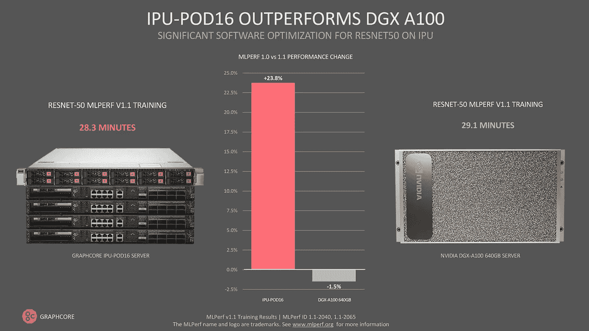
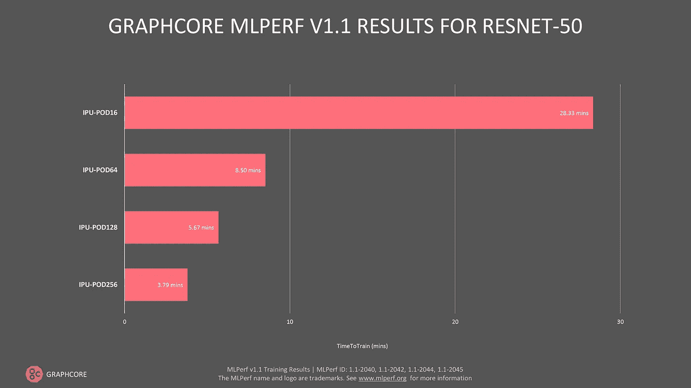
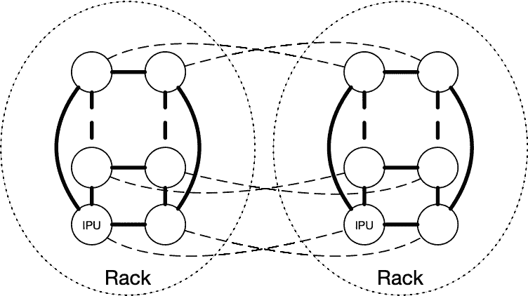
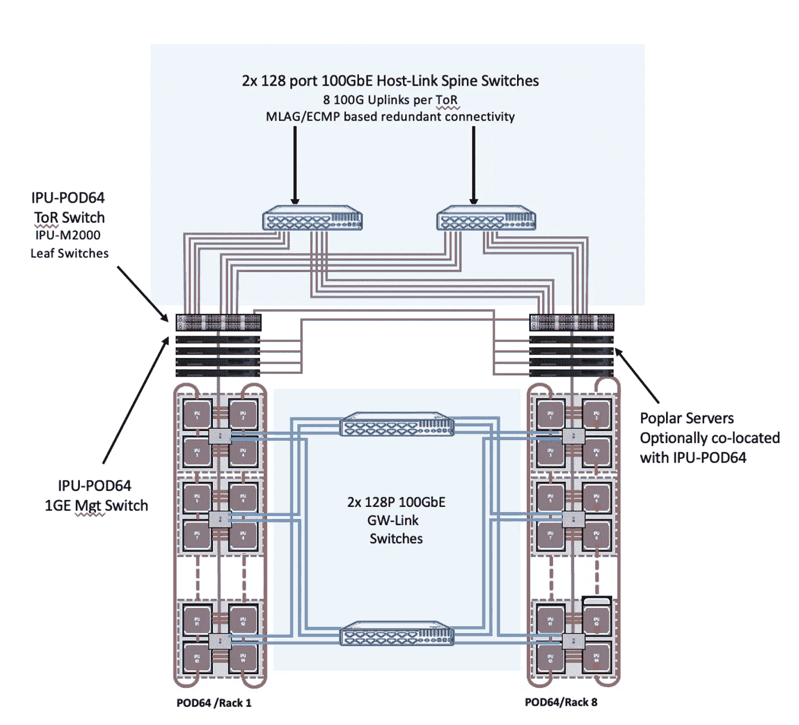
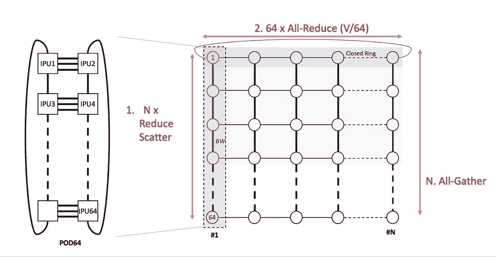
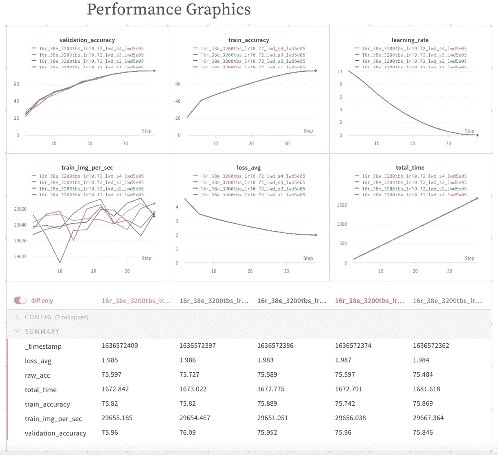
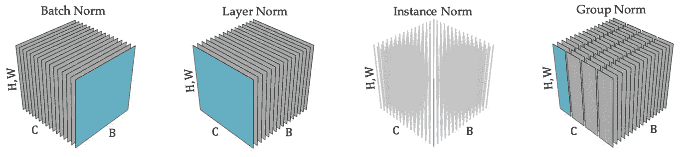
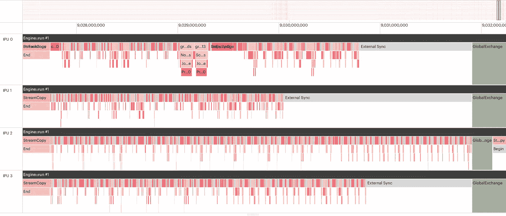
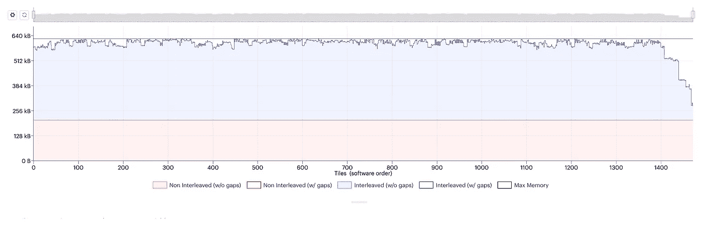
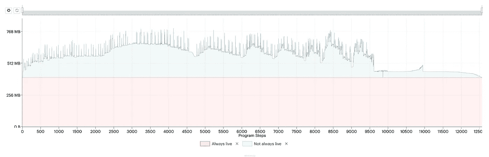

# 在 IPU 加速 ResNet-50 训练:在我们的 MLPerf 基准之后

> 原文：<https://towardsdatascience.com/accelerating-resnet-50-training-on-the-ipu-behind-our-mlperf-benchmark-2cefe43ab2b2>

# **在 IPU 上加速 ResNet-50 训练:落后于我们的 MLPerf 基准**

## 关于高效硬件扩展、内存优化策略和性能工具的技术指南

作者:[Mario Michael Krell](https://medium.com/u/24372940c2b3?source=post_page-----2cefe43ab2b2--------------------------------)博士、刘振英、Emmanuel Menage 和 Bartosz Bogdanski

G raphcore 工程师在 2021 年 12 月发布的最新 MLPerf v1.1 培训结果中表现出色[9]，我们的 IPU-POD16 在 ResNet-50 上的表现超过了英伟达的旗舰产品 DGX A100。

图片作者。

在这里，我们将解释我们的团队如何为这个流行的计算机视觉模型实现大规模加速。在本技术指南中，我们将揭示 Graphcore 工程师使用的各种技术和策略，涵盖高效硬件扩展、内存优化、实验跟踪、性能优化等。虽然本指南主要关注 IPU [9]的 MLPerf 中 ResNet-50 的性能指标评测优化，但它提供了性能指标评测优化的一般思路，该思路也适用于其他应用和硬件。

## 加速 ResNet-50

对于我们在 2021 年 12 月发布的 MLPerf v1.1 结果[9]，我们在 ImageNet (RN50)上实现了 28.3 分钟的 ResNet-50 训练时间，每秒 30k 图像吞吐量，在 IPU-POD16 上以 75.9%的验证精度收敛之前有 38 个时期。在我们于 2020 年开始我们的第一个 MLPerf 项目之前，ResNet-50 训练的吞吐量约为每秒 16k 幅图像，大约需要 65 个历元才能达到收敛。将这些数字加在一起，我们获得了 3.2 倍的总体改善。然后，我们将应用从 IPU-POD16 扩展到 IPU-POD256，这使我们的培训时间又提高了 7.5 倍，吞吐量提高了 12 倍。那么，我们是如何实现这种加速的呢？

我们在此过程中开发的工具在我们的[公共示例](https://github.com/graphcore/examples/tree/master/vision/cnns/tensorflow1/training)中提供，并不特定于 RN50 或 MLPerf 基准。我们认为其他 IPU 开发者可能会发现它们对他们的模型有用。关键成分是:

*   优化的工作分配和沟通
*   优化的主机 IO 和数据布局，分布在多个主机上
*   对权重和偏差进行实验跟踪
*   小有效批量
*   从 SGD with Momentum 切换到 LARS optimizer
*   带统计缓存的分布式批量定额
*   重新计算检查点，而不是流水线处理
*   随机舍入
*   优化的编译和内存配置文件

# IPU-POD:专为人工智能加速至超级计算规模而打造

将应用从 IPU-波德 16 扩展到我们的 IPU-波德 256。图片作者。

## IPU 硬件如何扩展机器学习应用

为了扩展我们的应用程序，必须部署许多功能。缩放时的一个主要挑战是增加的批量大小和通信，这需要时间进行数据传输和存储代码。对于本地副本，我们希望保持微批量大小尽可能大，以获得批量范数的良好统计估计，这是 ResNet-50 模型的关键部分。需要聚集每个副本的梯度，并且优化器执行其更新。

这带来了计算和通信开销。减少这种情况的一个技巧是在单个复制品上进行梯度累积，并具有更大的有效批量。通过添加更多的副本，有效的批量大小将线性扩展。尽管这种方法将保证几乎线性的缩放，但是更高的有效批量增加了获得收敛所需的历元数。因此，对于较大的系统，需要减少梯度累积，并且梯度的有效通信是必不可少的。

在我们的实验中，IPU-POD128 和 IPU-POD256 的最佳折衷方案是梯度累积计数为 2，通信量略有减少，但保持有效批量尽可能小。考虑到较大的批量，“LARS 优化器和超参数优化”中提到的更改是必要的，因为 SGD 会比 LARS 增加更多的所需时期。此外，我们过度使用了负载分布工具 PopDist，如“扩展主机-IPU 通信”中所述。通过增加具有本地数据存储的主机数量，我们提高了数据加载带宽，并确保无论使用多少加速器，数据传输都不会变慢。

## 硬件扩展:连接 IPU-POD64 平台

Graphcore 的 IPU-PODs 从一开始就考虑到了可扩展性，正如我们最新提交的 MLPerf 中展示的难以置信的可扩展性所示。在一个机架内，IPU 通过高带宽 IPU 链路连接直接相互连接，形成两个环。使用这些直接连接，每个 IPU-POD64 提供 10.24TB/s 的巨大 IPU 链路带宽，具有超低延迟(250ns)。在这些垂直机架内连接的顶部，IPU 跨机架连接(直接或通过交换机)以形成水平环。这意味着机架数量增加一倍会使可用带宽增加一倍以上。

图片作者。

Graphcore 通信库(GCL)旨在充分利用这些硬件特性。

IPU-POD128 和 IPU-POD256 是由多架 IPU-pod 64 建造的。单个 IPU-POD64 由 16 个 IPU-M2000 垂直堆叠而成，用 IPU 链连接形成一个 2D 环。我们横向扩展解决方案的灵活性允许我们将 IPU-pod 64 横向连接在一起，形成更大的系统。连接此类系统有两种可能的方法:直接连接(一个 IPU-M 上的 GW-link 直接连接到其他 IPU-POD64 系统上的 IPU-M 2000)或通过交换结构连接，其中所有 IPU-M 2000 上的 GW-link 连接到交换机，然后交换机将流量转发到其他 IPU-pod 64 上的正确目的地 IPU-M 2000。在这两种情况下，多个 IPU-pod 64 之间的同步通过 GW 链路发送，而不需要物理同步线路来实现更简单的横向扩展。对于我们用于 MLPerf 工作的 IPU-POD128 和 IPU-POD256，我们使用交换解决方案，因为它允许我们更加灵活，并提供更好的故障转移。

Graphcore 针对 IPU-POD128 至 IPU-POD512 的横向扩展解决方案。图片作者。

查看 IPU-POD 横向扩展拓扑的各个方面，现在我们可以了解一下实际情况。这表明，即使在现有交换结构上部署带来了所有的灵活性和强大的选项，它实际上并不像最初想象的那样需要“额外的套件”。该系统有 8 个 IPU-POD64 机架，因此我们可以称之为 IPU-POD512。仅使用两台 128 端口 100GbE 交换机就可以实现 IPU-POD512 中每个 IPU-M2000 之间所有 GW 链路的互连。

## 使用 Graphcore 通信库(GCL)扩展通信

为了加快人工智能模型的训练，一个想法是在许多 IPU 上复制模型，每个 IPU 处理不同的批次。处理完一个批处理后，复本使用 all reduce 共享它们从该批处理中获得的信息(渐变)。在理想情况下，如果 All-Reduce 是瞬时的，我们将在吞吐量方面实现完美的扩展:副本数量翻倍将允许我们处理两倍的训练样本。

GCL 已经实施了多项优化，支持横向扩展到单个 IPU-POD64 之外。所有模型副本内部数据交换在编译时都是已知的，并且由 Poplar 详细描述，并且假设所有集体通信、ML 模型细节和网络拓扑在编译时也是已知的，则 GCL 执行是确定性的，并且可以相应地被调度和优化。GCL 还公开了一个公共 API，用于将通信组指定为总副本集的子集，从而为我们在大型系统上执行操作提供了灵活性。对于 IPU-POD256 的更大规模，我们使用分阶段的全部缩减，其中在多 POD 系统上的张量缩减作为三个不同的操作来执行。

首先，在作为 IPU-POD256 的构造块的每个 IPU-pod 64 内的 IPU 链路上进行减少散射。Reduce 分散的输出成为在 GW 链路上运行的 All-Reduce 的输入。这在多个 IPU pod 之间交换数据元素，确保同一级别的每个副本包含相同的数据。最后，对 All-Reduce 的输出执行 All-Gather 集合操作，它再次在每个单独的 IPU-POD64 中运行，以便最终每个复制副本都包含相同的数据拷贝。

我们的实现的一个重要特征是，在 All-Reduce 中花费的时间是要共享的数据总量除以可用总带宽的函数。因为 IPU 数量加倍意味着带宽量加倍，所以全缩减的时间保持不变。Graphcore 产品的主要特点是恒定时间完全减少:它使创新者能够通过使用更多硬件来更快地进行实验，有效地减少反馈回路，最终导致令人兴奋的发现。

鉴于我们对大型系统的梯度累积计数为 2，梯度通信的任何优化都会对我们的扩展性能产生重大影响。例如，我们将不同类型和形状的张量组合在一起，一次性完成通信。此外，为了充分利用带宽，我们优化了主机和 IPU 之间的网关，以立即转发数据，从而显著降低各种应用的延迟。每个 IPU-POD64 都有自己的网关。因此，这种变化主要受益于从 IPU-POD16 到 IPU-POD64 的扩展。

三相全还原的直观表示。图片作者。

## 针对扩展的内存优化

尽管数据所需的内存在缩放时保持不变，但交换代码需要额外的内存。因此，例如在“其他内存和速度优化”中提到的内存优化对我们的扩展成功至关重要，特别是因为 LARS 优化器甚至比 SGD 需要更多的内存。扩展到 IPU-POD128 和 IPU-POD256 的具体优化是减少 IPU-POD 之间交换的代码大小。

## 将验证扩展到 IPU-波德 256

对于验证，不需要向后传递，并且在批范数层中，应用同步移动平均值和方差。因此，计算布局是完全不同的。为了不浪费图形交换的时间，我们改为应用离线评估方案，即，我们在训练期间存储检查点，然后，我们使用验证数据来评估性能。我们还保持 IPUs 的相同配置，以避免重新配置的时间。这意味着对于 POD256 的情况，我们有 128 个主机进程，其中每个进程负责一个验证文件，然后汇总结果以计算整体性能。因为我们使用的是静态图，所以即使批量大小为 1，50000 个验证图像也不能完全分割，这将是低效的。但是，对于 MLPerf 设置，需要处理所有图像，并且不能遗漏样本。因此，我们将数据填充到下一个更大的批次，然后在后处理中移除填充结果。

# 在 IPU 硬件上大规模加速 ResNet-50

## 实验跟踪

在整个项目过程中，跟踪实验、查找详细的参数配置和深入研究日志非常重要。因此，我们充分利用了通过权重和偏差进行实验跟踪的优势，并定期创建报告来与同事交流结果，并比较运行情况以找出任何潜在的差异。使实验具有挑战性的是，在低历元计数的情况下，收敛对任何变化都过于敏感。例如，将累积计数减半可以很容易地将非收敛设置转换为收敛设置。此外，实验之间有很大的差异，需要这种方法来跟踪实验。我们跟踪了超过 2600 个实验。最近，我们在我们的 CNN 知识库中扩展了我们的追踪。使用`*--wandb*` 和`*--wandb-project*`选项，结果会立即上传，而不是等待最终结果上传。

权重和偏差报告。图片作者。

## 减少纪元的数量

## 批量常模与群体常模

实际上，人们通常在大约 90 个纪元甚至更多的时候训练他们的网络。由于 MLPerf 基准只关心训练的时间，所以有很多调整来减少这个数字。我们的目标是将数量减少到 44 个时代，甚至更少。我们最初的实现使用了组范数而不是批范数，以便更快地处理和避免样本之间的依赖性。有关讨论，请参见[1]。

对于 65 个或更多的时期，这种标准化完美地工作。然而，在微调超参数时，我们了解到需要更积极和成本更高的归一化来在期望的小历元计数中获得收敛。这意味着我们开发的支持大批量范数的工具是特定于 MLPerf 基准的，因为必须减少历元的数量。如果没有这个要求，我们可能会坚持团体规范。

每个子图对应于一种特定的归一化技术，其特征在于其各组分量共享相同的归一化统计量。在每个子图中，中间激活的张量由批轴 B、通道轴 C 和空间轴(H，W)构成。图片由作者提供，改编自[7]。

## 增加批量

我们最初的设置是一个超过 4 个 IPUs(智能处理单元)的流水线，复制因子为 4，用于数据并行处理和分组调度。我们使用的批量为 16。将该设置更改为 batch-norm 是一个简单的配置更改，但收敛性仍略有改善。当我们通过使用内存高效通信、限制每个 IPU 的代码内存大小以及调整管道阶段的长度来微调内存和管道阶段以获得 24 的批处理大小时，情况变得更好。尽管如此，我们还是无法达到预期的 44 个纪元。因此，我们进行了一些模拟，发现 32 的批量应该足够了。通过模拟，我们可以在 44 个时期内达到收敛，但吞吐量低于可接受的水平，我们需要进行一些调整，如“增加吞吐量”一节中所述。

## 小有效批量

为了获得良好的硬件加速，通常要处理大量的数据。在单个加速器上使用更多数据通常会增加 ALU(算术逻辑单元)的使用率，并确保加速器获得足够的工作负载。请注意，IPU 有一种独特的分配工作负载的方式，也可以加速小批量的工作负载。此外，梯度和优化器更新的通信可能是昂贵的，因此可以通过降低这些更新的频率来增加吞吐量，例如通过使用梯度累积。请注意，梯度累积的回报随着每次增加而递减。在我们的实验中，我们意识到较大的批量需要更多的历元用于训练，这也可以在 MLPerf 参考收敛点中看到[8]。因此，更大批量的好处可能超过速度的提高。另一方面，每个“复制品”需要 32 的最小批量大小，以使批量标准工作。

对于最佳 IPU-POD16 配置，我们最终得到 3200 的有效批量大小(16 个副本，每个副本的微批量大小为 20，梯度累积计数为 10)，其在 38 个时期内收敛。**为了扩展到更大的系统**，我们分别减少了梯度累积计数。由于较大机器上的通信效率和优化，保持梯度累积计数为 2 就足够了。对于 IPU-POD64 系统，我们使用类似的有效批量 3840 (64 个复制品，梯度累积计数为 3)也在 38 个时期内收敛。对于 IPU-波德 128 和 IPU-波德 256，我们使用的梯度累积计数为 2，有效批量为 5120 和 10240，相应的时期为 41 和 45，直到收敛。使用更大的尺寸会增加更多的历元计数，并且是不可行的。

## LARS 优化器和超参数优化

尽管正常的 ML 设置在超参数的选择中表现出一定的鲁棒性，但是 MLPerf 中的低历元计数使得收敛对任何变化都敏感。这可以通过优化器的选择得到最好的体现。众所周知，LARS 是大批量的良好优化器。在我们的项目中，我们了解到它也是一个比动量随机梯度下降(SGD)更好的优化器，在收敛之前需要更少的时间。这种好处随着批量的增加而增加。请注意，LARS 需要更多的内存和计算，但次要成本超过了主要节省。我们的第一次和第二次 MLPerf 提交之间的一个主要变化是优化内存使用和启用 LARS，这导致了很大的加速。例如，对于我们的 IPU-POD16 设置，LARS 将所需的历元数从 44 个减少到 38 个。一个关键因素是热身时期的数量。SGD 需要 5 个历元，而 LARS 只需要 2 个历元。另一个敏感的超参数是 LARS 中的权重衰减参数，将其减少一倍并调整学习速率，可将收敛速度加快多达 2 个时期。

## 增加产量

## 管道平衡

与自然语言处理模型 BERT 相比，针对 RN50 优化流水线可能具有挑战性。有许多不同的组件需要不同的代码，并且各层之间的数据大小变化很大。因此，稍微修改一下分割策略就可能对内存配置文件产生重大影响，从剩余大量内存跳到需要过多内存。此外，正如我们在 PopVision 图形分析器中发现的那样，处理负载可能非常不平衡。第四个 IPU 的处理时间是第二个的两倍，并且由于数据的内存需求，没有平衡的空间。另一方面，IPU0 不能做太多的处理，因为它有最大的激活存储。类似地，IPU1 和 IPU2 也有一些空闲时间，甚至比绿条所示的同步时间更长。由于不平衡的计算和内存需求，很难进一步改善，我们选择了不同的途径，使用重新计算方法，可以在单个 IPU 上工作，并使用分布式批处理规范来实现足够大的批处理大小。

批量为 20 的 4 个 IPU 以上的分组调度管道的 PopVision 图形分析器摘录。第三行(IPU 2)对应于最后的第 4 级。与 IPU 2 相比，IPU 1 只需要不到 60%的处理周期。图片作者。

## 分布式批量定额

我们的批处理规范实现是在杨树级别上融合和优化的。通过之前用于流水线设置的所有内存微调，我们意识到现在可以在单个 IPU 上将新设置的批处理大小从 6 增加到 12，而无需任何流水线操作。现在，为了达到批量定额的批量大小 32，我们只需要一个分布式批量定额。对于其他一切，正常的数据并行处理就足够了。我们将这个特性添加到我们的框架中，只需要几行代码，我们在标准化实现中聚合了多个副本的统计数据。这种方法非常有效，并且不需要太多的内存，特别是因为统计数据的向量非常小。此外，向后传递只是 IPU 之间的梯度的集合，这有助于分布式批处理规范，因此只产生单行代码。

对于 TensorFlow 1.15 中的应用程序代码，界面保持了简约。只能设置一个配置号:

对于 12 的批量大小，我们需要在至少 3 个 IPU 之间合计数据，以达到至少 32 的批量标准批量大小。为了避免 IPU-M2000 机器之间的通信，它必须改为 4 个 IPU。

## 重新计算

为了从分布式批处理规范中获得更好的吞吐量和更少的通信开销，我们希望增加批处理大小并将分布式批处理规范限制为两个 IPU。因此，我们利用了重新计算。由于 TensorFlow 1.15 中没有对此的原生支持，我们使用了一个编程技巧。流水线的 IPU 实现附带了一个顺序调度，可用于在多个 IPU 上共享计算图。相反，我们没有将处理分布在多个 IPU 上，而是将它们都放在一个 IPU 上。请注意，片内存储器中的代码大小几乎没有增加，但是许多中间激活没有被存储，而是被重新计算。因此，我们释放了大量内存，可用于增加批处理大小。通过将我们的 splits 设置为`b1/0/relu, b1/2/relu, b2/0/relu, b2/2/relu, b3/0/relu, and b3/3/relu`，我们将批量增加到 20。我们可以通过将一些优化器状态卸载到主机来使用更少的重新计算点。我们避免了这种可能性，并将所有内容都保存在内存中，因为我们通过将更多数据传送到 IPU，更好地利用了通信带宽。因此，重新计算只需要三个要素:

*   在[https://docs . graph core . ai/projects/tensor flow 1-user-guide/en/latest/API . html # tensor flow . python . IPU . pipeline _ ops . pipeline](https://docs.graphcore.ai/projects/tensorflow1-user-guide/en/latest/api.html#tensorflow.python.ipu.pipelining_ops.pipeline)使用 IPU 管道 API
*   将`“PipelineSchedule.Sequential”`设置为`“pipeline_schedule”`
*   通过设置:
    `device_mapping = [0] * len(computational_stages)`将所有计算阶段放在同一个设备上(IPU 0)——在我们的例子中，有 7 个计算阶段

平衡重新计算点需要了解计算图中不同阶段的内存占用情况。为了进行微调，我们使用了 PopVision 图形分析器中的内存配置文件，以确保我们最佳地利用了内存。因此，我们在初始层有一组更密集的重新计算检查点，并保留更长的最终阶段以减少计算开销，因为对于最后阶段，前向传递永远不会重新计算。

单个 IPU 的 1472 个图块的内存利用率。它达到了每个图块的内存限制。作者使用 PopVision 图形分析器制作的图片。

用 PopVision 图形分析器创建的活性报告。我们可以看到除了最后一段之外的前向传递，然后是前向传递(内存增加)和后向传递(内存减少)的每个重新计算段的 7 次颠簸。图片作者。

## 扩展主机-IPU 通信

对于 ResNet-50 基准数据加载来说，预处理是工作负载中至关重要的一部分。在我们的一个实验中，我们尝试了一个基于英特尔的主机，与使用 AMD 主机相比，它的 CPU 内核更少，大大降低了我们的处理速度。因此，我们的分解主机架构对于能够为手头的应用选择正确的主机尤为重要。

获得更多传输数据的一个简单方法是减小其大小。增强的图像数据以 Int8 格式传输，然后在 IPU 上而不是在主机上进行归一化。归一化是作为一个融合操作实现的，它将数据转换为 Float16，并添加第四个带零的通道，以减少后续卷积层的内存占用。

此外，为了传输更多的数据，数据加载需要使用 Graphcore 的 PopRun 框架进行并行化[6]。我们的分析表明，对于每组两个副本，一个主机进程是最好的。每台主机都以 8 个 numa 感知节点最佳运行，每个 CPU 4 个节点。因此，对于 IPU-POD 16、64、128 和 256，我们分别使用了 1、4、8 和 16 台主机。该命令类似于:

`poprun --host $HOSTS $MPI_SETTINGS --num-instances “$INSTANCES” --num-replicas “$REPLICAS” python train.py args`

使用$MPI_SETTINGS 中的`“*--numa-aware 1”*`激活 Numa 感知。尽管主机进程是独立的 MPI 进程，但是跨多个机架创建了所有副本的计算图的组合表示。每个主机进程读取一组大小相等的独立输入文件。因此，避免了文件读取中的任何冲突。即使对性能的影响可以忽略不计，分布式读取数据也会保存在缓存中。

## 其他内存和速度优化

除了重新计算，我们还使用了一些优化策略:

*   我们存储批量定额统计数据以避免重新计算。
*   我们在 FP16 中做了权重、激活和渐变的所有计算。我们还使用随机舍入来提高收敛速度，使用半偏卷积和矩阵乘法来提高速度。我们的硬件支持随机舍入。请注意，权重更新需要对每个副本进行相同的更新，以确保权重保持一致。这是通过使用 horovod 广播
    `with tf.Graph().as_default(), tf.Session():
    identical_seed = hvd.broadcast(
    identical_seed, root_rank=0, name=”broadcast_seed”).eval()`
    同步起始种子并确保当应用权重更新时 IPU 被均等地播种来实现的。这是通过
    和`export POPLAR_ENGINE_OPTIONS=’{“target.deterministicWorkers”:”portable”}’`实现的
*   我们通过优化 IPUConfig [5]的`“availableMemoryProportion”`,微调了 IPU 上用于代码的内存和用于存储激活的内存之间的平衡，使其值约为 0.15。
    `config.convolutions.poplar_options[‘availableMemoryProportion’] = …`

有关内存和处理优化的更多想法，请查看我们的新指南[4]。

# 限制

这个博客中介绍的所有特性在最新版本中都可以使用。然而，我们想指出的是，尽管所有这些技术技巧可能对您的应用程序有所帮助，但它们并不是必须的。MLPerf 基准测试带有特殊的规则和限制，不适用于实际应用。

*   基准要求的目标精度低于最大可达到的精度。
*   对于基准测试，5 次运行中只有 4 次需要收敛。如果有一个失败，它就会被忽略。
*   只有超参数的子集可以被改变，并且唯一可用的优化器是具有动量的 SGD 和 LARS。
*   目标度量是训练/收敛时间，而不是吞吐量。这可能是因为随着批次大小和累积计数的增加，处理量可以增加，但收敛时间将需要更多的时间。
*   我们仅每 4 个时期评估一次。更高的评估频率是违反规则的。
*   培训仅在 ImageNet 上进行。
*   学习率计划是二次多项式计划，而不是步进或余弦学习率计划。

实际上，没有人会在 ImageNet 上将 ResNet-50 训练到 75.9%的验证准确率。更容易下载精度更高的预训练网络。

在实践中，人们可以在不同的数据集上进行更高精度的训练。但是，当在不同的数据集上训练时，为该基准选择的参数可能不会转移。此外，可能需要更大的历元计数和不同的学习速率计划。随着时代数量的增加，如果训练是从零开始，而不是用预训练的模型，那么使用群体常模(或代理常模)可能会更好。

75.9%的最高准确率对于搜索等应用来说是不够的。想象一下，你有一个像 YFCC100M 数据集这样的 100.000.000 张图像的搜索引擎，你试图使用 ResNet-50 搜索某一类图像，例如折纸。丢失 24%的相关图片对你来说可能没问题。挑战在于，因为其他类别也会被错误分类，你会得到更多不是折纸而是来自其他图像的错误分类的图像。事实上，这些错误的分类将是大多数[2]。为了实现更高的精度，值得考虑更多像 EfficientNet 这样的先进模型，它们受益于本博客中提到的一些特性。你可能还想读一下，[“我们如何让 EfficientNet 更有效率”](https://www.graphcore.ai/posts/how-we-made-efficientnet-more-efficient) [3]。

# 结论

将强大的 TensorFlow 1.15 框架与 Weights and Biases、Poplar 和 PopVision 工具以及强大的 MK2 IPU 结合起来，我们成功地充分利用了处理速度和内存，并实现了令人惊叹的性能。

# 谢谢

非常感谢 Brian Nguyen、Godfrey da Costa(和他的团队)以及 Mrinal Iyer 为完成这项工作所付出的努力。

我们还要感谢亚历克斯·库尼亚、菲尔·布朗、斯图尔特·科内尔、[多米尼克·马斯特斯、](https://medium.com/u/b23ad1d05ffe?source=post_page-----2cefe43ab2b2--------------------------------)、亚当·桑德斯、霍肯·桑德斯马克、乔治·帕韦尔扎克、西蒙·朗、[卢克·哈德拉斯-格里](https://medium.com/u/83b5c2605cec?source=post_page-----2cefe43ab2b2--------------------------------)、豪尔赫·贝隆·卡斯特罗、乔治·马修以及其他许多人的宝贵贡献。

# 参考

[1] A. Labatie，[通过代理标准化激活消除 CNN 中的批次依赖性](/removing-batch-dependence-in-cnns-by-proxy-normalising-activations-bf4824eb0ba4)，走向数据科学 2021

[2] D. Ma，G. Friedland，M. M. Krell， [OrigamiSet1.0:用于折纸分类和难度估计的两个新数据集](https://arxiv.org/abs/2101.05470)，arxiv 2021

[3] D. Masters，[我们如何让 EfficientNet 更加高效](/how-we-made-efficientnet-more-efficient-61e1bf3f84b3)，迈向 2021 年的数据科学

[4] [内存和性能优化指南](https://docs.graphcore.ai/projects/memory-performance-optimisation/en/latest/index.html)，Graphcore

[5] [在 IPU](https://docs.graphcore.ai/projects/available-memory/en/latest/available-memory.html) 、Graphcore 上优化卷积和 Matmuls 的临时内存使用

[6] [PopDist 和 PopRun:用户指南](https://docs.graphcore.ai/projects/poprun-user-guide/en/latest/index.html)，Graphcore

[7] N. Dimitriou 和 O. Arandjelovic，[重影标准化的新观点](https://arxiv.org/pdf/2007.08554.pdf)，arXiv 2020

[8] [MLPerf 参考收敛点](https://github.com/mlcommons/logging/blob/master/mlperf_logging/rcp_checker/training_1.1.0/rcps_resnet.json)，MLCommons

[9] MLPerf v1.1 培训结果。ml perf ID:1.1–2040，1.1–2042，1.1–2044，1.1–2045，1.1–2065。MLPerf 名称和徽标是商标。更多信息请见 www.mlperf.org。