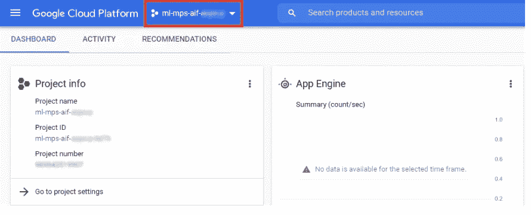
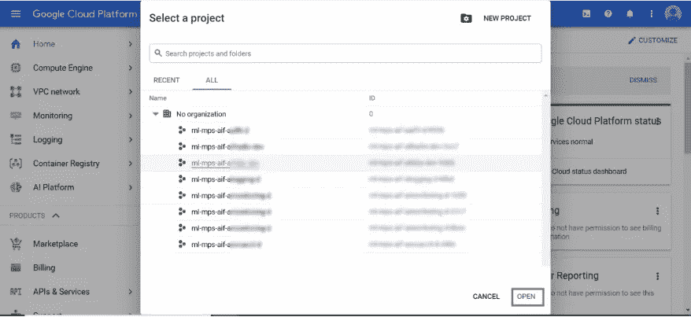
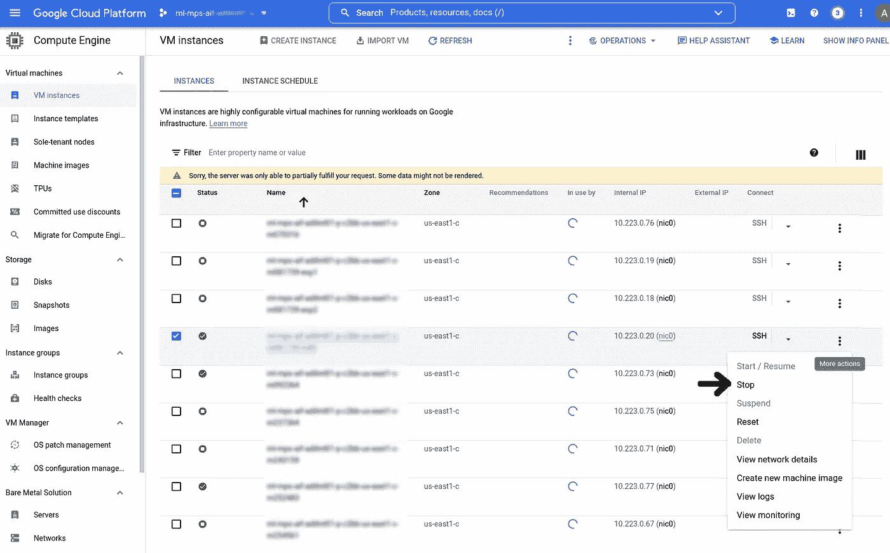
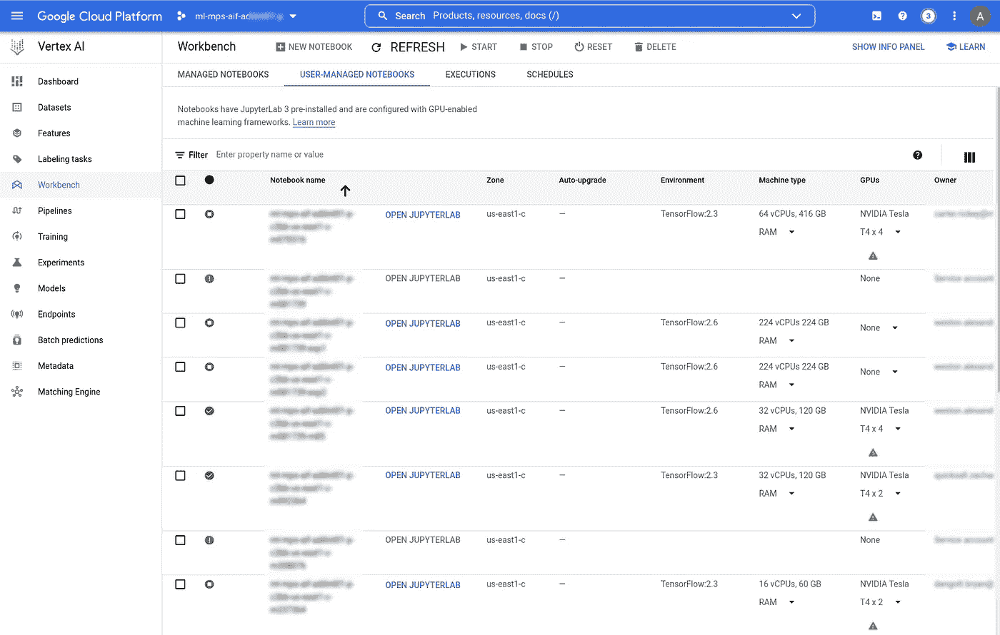
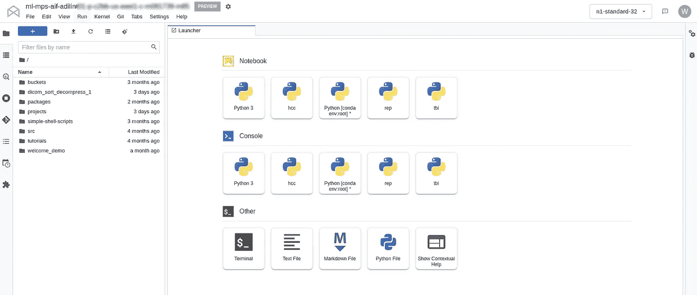
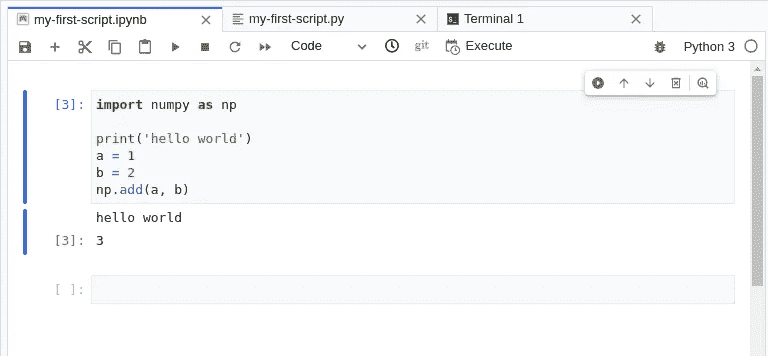
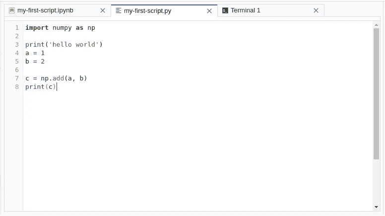
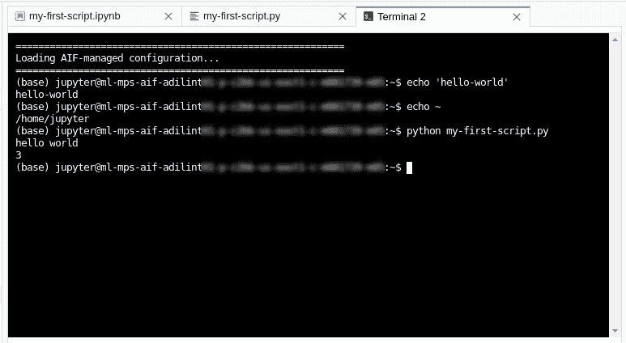

# 通过 Google 云平台访问 JupyterLab 界面

> 原文：<https://towardsdatascience.com/accessing-jupyterlab-interface-through-google-cloud-platform-e4f6e4f4896f>

## 简单的操作指南

一个修道士在工作。图片由[维基共享](https://commons.wikimedia.org/wiki/File:Scriptorium-monk-at-work.jpg)提供。

本文是关于如何第一次在 Google 云平台上设置的简短教程系列的一部分。这篇文章是关于如何使用交互式 web 控制台。

关于 GCP 的概况，请看[我之前的文章](https://alexweston013.medium.com/a-very-brief-overview-of-google-cloud-platform-9dcce7bc1b1c)。

一个免责声明——我改编了为我们的暑期实习生写的文档，因为我认为它可能对更广泛的受众有用。我们使用由我们自己的 IT 部门构建的云环境，具有适合大型学术医疗机构的额外安全性。因此，平台的几个特征可能被修改或禁用。

如果你也为三个盾牌工作，你来对文章了！

## **GCP 的 JupyterLab**

GCP 上可用的基本计算资源是“深度学习虚拟机”，或“DLVM”。这类似于您的个人计算机，每个人都被分配了一个(或多个)DLVMs 来开发和调试代码。

有许多方法可以访问您的云 DLVM，但最简单的入门方法之一(似乎是“默认”选项)是交互式 JupyterLab 环境。

## **进入项目**

首先，您需要登录到适当的云项目。如果您只使用一个项目，您应该自动登录。验证项目名称是否列在屏幕顶部或“项目信息”卡下。如果没有，有一个下拉菜单来选择适当的项目。

项目名称**列在 GCP 菜单的顶部。图片作者。**

如果您没有登录到正确的**项目**，从下拉菜单中搜索并选择它。图片作者。

## **访问 DLVM**

其次，打开 DVLM。在 web 界面中，它们列在“计算引擎”选项卡下。如果你在一个有多个用户的项目中，每个人的 DLVMs 都会被列出。

如果 DLVM 正在运行，名称旁边会有一个绿色的勾号。您可以通过打开“选项”菜单并选择适当的命令来启动/停止 DLVMs。请注意，每当 DLVM 运行时，您都会被收费，所以请考虑在当天结束时停止它。

将显示所有用户的 DLVMs。绿色复选标记表示实例正在运行。要启动/停止，请单击右侧菜单中的相应选项。图片作者。

## **打开 JupyterLab**

访问 JupyterLab 是通过 **Vertex AI** 菜单完成的(不要问我为什么不在前一个选项卡下)。从右上角菜单中选择顶点 AI，进入**工作台**。

您的 DLVMs 将再次列在此菜单下。选择**打开 JupyterLab** 按钮。这将在您的浏览器中打开一个新标签。

在 **VertexAI Workbench** 菜单下，从适当的 DLVM 启动 **JupyterLab** 。图片作者。

## **Jupyter 接口**

JupyterLab 将使用默认编辑器启动。关于 JupyterLab，网上有很多精彩的教程，所以我在这里就不赘述了。简而言之，主编辑窗口在右边，选项菜单在左边，默认打开文件浏览器。

在左侧菜单下，您还可以访问项目附带的 Google 云存储桶列表、BigQuery 菜单、活动内核实例管理器、GitHub 接口和扩展管理器。这些都是可定制的，并且会根据您的环境的配置而有所不同。

请注意，当您以这种方式启动 JupyterLab 时，您将作为用户" **jupyter** "登录，在下面的菜单中可以看到的默认主目录是" **/home/jupyter** "。这不是 DLVM 上的 root 用户(在我们的机器上，root 用户是"**ext _ last name _ first name _ email _ extension**"，这是您 SSH 进入 DLVM 时的默认设置)。

JupyterLab 的主菜单。主目录/ *home/jupyter* 的文件存储显示在左侧浏览器中。图片作者。

JupyterLab 主要用于 Jupyter 笔记本，可以通过**启动器**选项卡中的 **Python 3** 卡启动，或者通过点击左上角菜单上的蓝色**加**图标启动。你也可以访问发射器中的**终端**。我喜欢使用的另一个简单选项是在支持 Python markdown 的内置文本编辑器中编辑 Python 文件，并在终端中执行它。它并不复杂，但这是一个很好的方式，只需点击几下就可以开始，坦率地说，这与在 Sublime 中编辑没有太大的不同。

Google 云平台的 JupyterLab 中的 IPython 笔记本界面。图片作者。

在谷歌云平台的 JupyterLab 中，文本编辑 Python 脚本(左)并在终端中执行(右)。图片作者。

## **结论**

开始使用谷歌云平台的方法有很多，但 JupyterLab 界面可能是最快、最简单的。希望这些说明对你有用。请留下评论，我很乐意回答任何问题。

我相信读者会很乐意听到您对该平台的体验，以及您可以提供的任何技巧或提示。

~噢