# 从 Garmin 可穿戴设备获取睡眠和活动数据(2022 年)

> 原文：<https://towardsdatascience.com/accessing-sleep-activity-data-from-garmin-wearables-bffc64866a66>

## 为匆忙的人提供一个友好的如何提取 Garmin Venu 2 数据的指南

大约 6 个月前，我在[上写了如何转化。将 Garmin 的文件放入 CSV。](/accessing-and-cleaning-data-from-garmin-wearables-for-analysis-56c22b83d932)

从那时起，我得到了一个新的 Venu 2 Garmin 手表，有了它就有更多的数据要处理了！！特别是在**左右，从我的 Garmin 可穿戴设备中清除睡眠和活动数据**

和以前一样，我希望这篇文章是我在浏览 Garmin 网站时发现的缺失/过时文档的一个很好的替代品。

***剧透*** *:我写了一个脚本来* [***快速处理这里所有的 Garmin 数据***](https://github.com/adam1brownell/garmin_data) *。尽情享受吧！🌴 🏄*

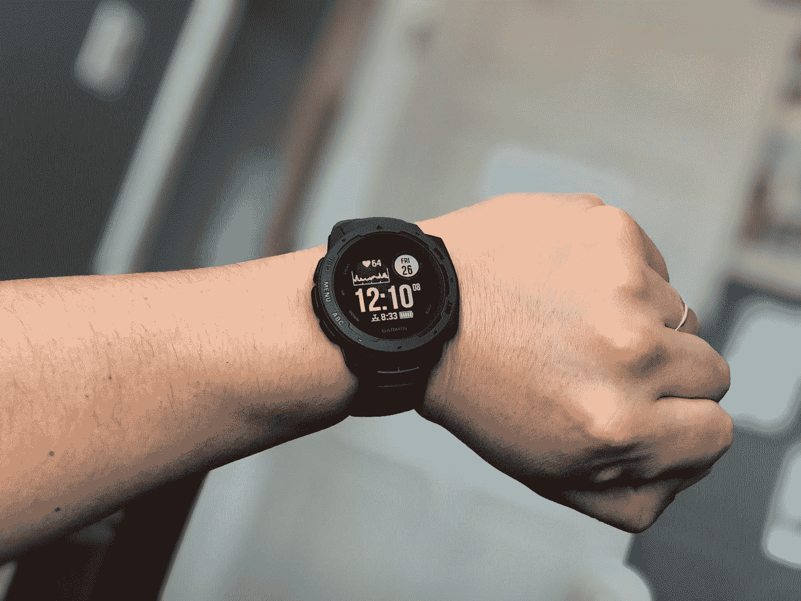

新手表==新数据！！照片由 [Gerardo Ramirez](https://unsplash.com/@gerardoramirez?utm_source=medium&utm_medium=referral) 在 [Unsplash](https://unsplash.com?utm_source=medium&utm_medium=referral) 上拍摄

# 睡眠、活动和更多数据

在我之前的帖子中，我假设所有可用的数据只在`DI_CONNECT/DI-Connect-Fitness-Uploaded-Files`中找到。活力

从那以后，我发现了更多的数据！

从 Garmin 获得数据转储后(正如我在[上一篇文章](/accessing-and-cleaning-data-from-garmin-wearables-for-analysis-56c22b83d932)中所解释的)，这里是`DI-CONNECT`的文件结构:

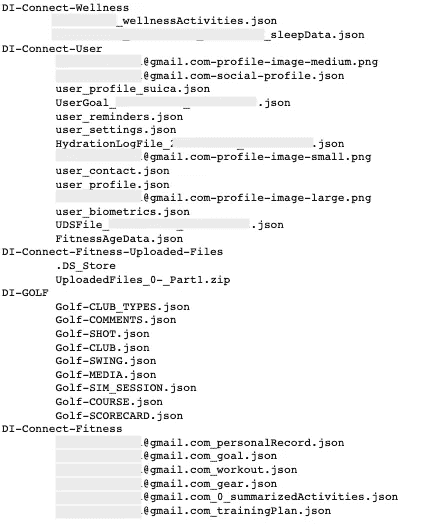

我的文件，PII 省略了

至少对我来说，我会仔细检查每个文件和里面的日期。就像数据转储中包含的许多文件夹一样，许多文件都是空的——部分原因是我没有使用手表的所有功能，部分原因是我的手表没有所有功能。

在适当的 git repo 中编写的所有代码都遵循以下通用结构:

下面我们将介绍每个新的 Garmin json 文件以及预期的数据。

# 健康档案

在`DI-Connect-Wellness`文件夹下，我们有两个文件，一个关注健康快照，另一个关注睡眠总数据。

这些是 DI-Connect-Fitness-Uploaded-Files 之外最有趣的分析文件。

## …_wellnessActivities.json

这个 json 文件包含您的 Garmin 手表上的**健康快照活动**的数据。运行这项活动需要静坐 2 分钟，这样你的对手就可以获得准确的生物特征读数

您需要保持静止的原因是因为众所周知[的移动会导致腕戴式显示器的精度问题。](https://help.elitehrv.com/article/119-why-can-t-i-use-my-wrist-hr-monitor-or-led-pulse-oximetry-monitors-like-fitbit)


在 Garmin watch 上运行健康快照活动如下所示。

数据包括:

*   一天中的时间
*   心率
*   呼吸率
*   “压力”
*   氧饱和
*   心率变异性

*“压力”用引号括起来，因为它是一个专有的、Garmin 特有的指标，在计算方式上是模糊的*

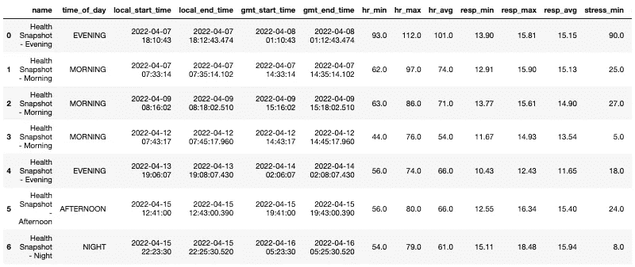

已处理的…_wellnessActivities.json 文件的快照

此外，由于该活动需要手动触发，因此它可能为空。

## …_sleepData.json

这个 json 文件包含关于睡眠的数据，汇总到每个会话级别。

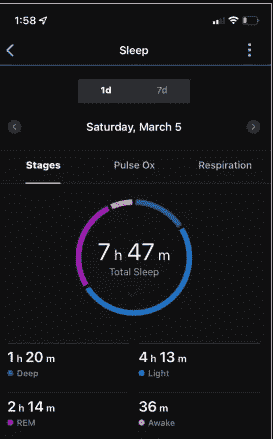

该 json 中包含的数据实际上是 Garmin Connect 应用程序中该屏幕上使用的数据

数据包括:

*   睡眠各阶段的秒数(清醒、浅睡、深睡、快速眼动)
*   睡眠期间的呼吸频率
*   关于睡眠质量、持续时间和恢复的“分数”
*   你夜里醒来的次数
*   Garmin 根据您的睡眠情况生成的见解和反馈

*“分数”在引号中，因为它是一个专有的、Garmin 特有的指标，在计算方式上是模糊的*

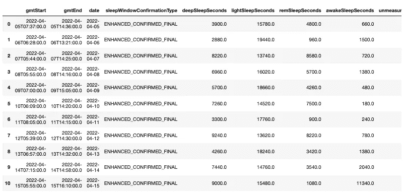

已处理的…_sleepData.json 文件的快照

反馈和见解专栏出乎意料而且非常有趣，因为我不确定这些数据在 Garmin Connect 应用程序中是否容易获得:

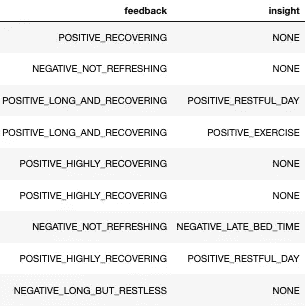

反馈和见解列的快照

# 用户文件

在`DI-Connect-User`文件夹下，我们有 14 个文件集中在您的 Garmin 个人资料上

虽然有一堆文件，但有些对分析并不感兴趣——3 个是各种大小的个人资料照片，一个(`...-social-profile.json`)包含您的 Garmin 个人资料上显示的信息，两个文件(`user_profile.json & user_profile_suica.json`)只包含您的姓名&电子邮件，另一个(`user_contact.json`)包含您的紧急联系人。

一些文件可能有潜在的有趣信息，但对我来说没有:

*   `user_reminders.json`是空的，可能是因为我不使用提醒
*   `user_settings.json`只有 1 行长，标记了每个区域之间的 HR。我使用的是默认值(见下文)
*   可能包含生物特征数据，如身高和最大摄氧量，但对我来说一切都是空的

要快速检查一个 json 文件，比如`user_settings.json`，只需执行…

```
file_name = os.getcwd()+'/DI_CONNECT/DI-Connect-User/user_settings.json'
with open(file_name) as file:
        j = json.load(file)
json.dumps(j)
```

…这让我产生了:

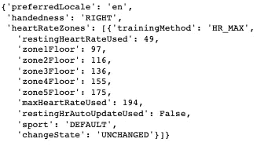

这样我们就有 3 个文件需要分析:

## FitnessAgeData.json

这个 json 文件包含关于你的健身年龄的数据。 [Garmin 将健身年龄](https://www.garmin.com/en-US/garmin-technology/health-science/fitness-age/)描述为:

> **健康年龄是相对于你的实际年龄而言，对你健康程度的估计。**
> 
> 它是通过将您当前的最大摄氧量健康水平与同性别不同年龄人群的正常值……[以及您的]活动强度、静息心率和体脂百分比或身体质量指数(身体质量指数)进行比较而计算出来的

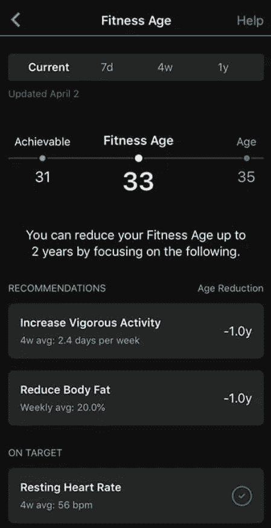

您可以在应用程序的这个屏幕中查看您的 Garmin 健身年龄。数据转储中不包括的建议…

数据包括:

*   你的年龄，身体质量指数，和静息心率
*   充满活力的周数、天数和分钟数
*   根据你目前的体重/身高/性别，你的健康身体质量指数、体脂%和最大摄氧量是多少
*   你的最大摄氧量
*   你的整体健康状况、体重指数和体脂百分比的“年龄”

*“年龄”在引号中，因为它是一个专有的、特定于 Garmin 的指标，在计算方式上是模糊的*

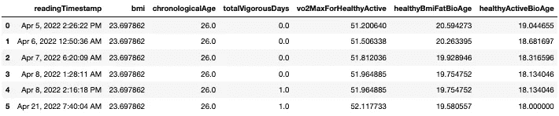

这些读数不一定像我希望的那样每天都有(从上面的截图中你可以看到日期上的巨大差距)，但肯定是一个有趣的数据集，可以在更长的时间尺度上进行探索。

## 水合日志文件…json

所以我目前没有在我的手表上使用[补水小工具，所以我的数据有点无聊/稀疏。每当你进行一项运动时，它都会做一个记录，因为它可以估计出汗量。](https://support.garmin.com/en-US/?faq=390puZ3AgO4hM3IzakFs99)

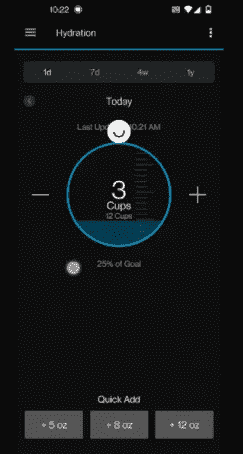

水合小部件数据包含在水合日志文件中

但是，如果您这样做了，下面是您可以期望数据包含的内容:

*   阅读时间
*   水合来源+活动 ID
*   水合量，活动持续时间
*   活动期间估计的排汗量


我的补水日志快照。数值全为 0，因为我没有记录锻炼期间的水摄入量

## UDSFile_…json

UDS 文件，我假设它代表“用户每日总结”，包含每日的步数、楼梯、压力和身体状况

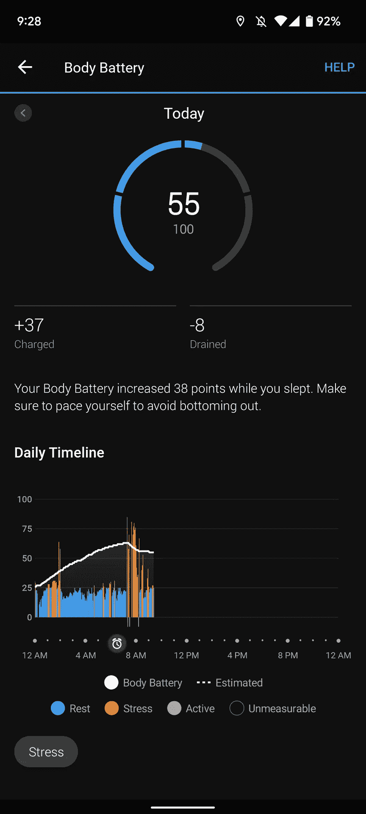

收集的车身电池数据的快照

该文件中的数据包括:

*   每日时间和距离功能，如`totalDistanceMeters`
*   心率特征
*   像`awakeAverageStressLevel`这样的应力特征
*   体感电池功能类似`maxBodyBattery`
*   额外的日总呼吸和 SPO2 功能

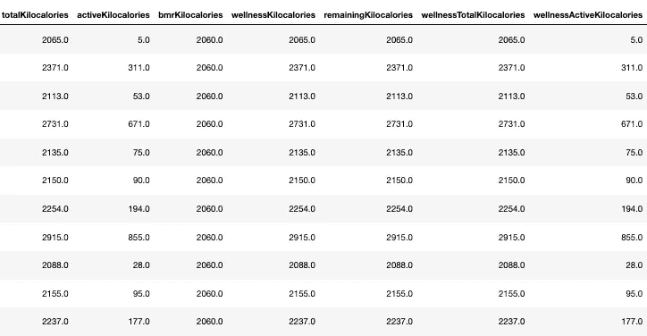

我的 UDS 日志的快照。这里有超过 100 个功能！

# 健身档案

这些文件都与你和你的 Garmin 进行的谨慎的身体活动有关。

不幸的是，我不使用我的 Garmin 来设定目标或计划，所以大多数这些文件对我来说是空的。

这将只留下一个包含数据的文件:

## …summaryed activities . JSON

顾名思义，这些表格包含了您佩戴 Garmin 时所进行的活动的摘要。像健康快照一样，这不是一种被动的数据收集形式，因为你需要手动告诉你的手表你正在锻炼。

然而，根据您参与的活动，您可以生成以下数据:

*   活动名称和开始时间
*   强度分钟
*   仰角增益/损失、行进距离和位置
*   呼吸率统计
*   总套数和重复数


我的汇总活动表的快照

# 高尔夫文件

像大多数健身文件一样，我不打高尔夫，也不使用我的手表打高尔夫，所以这些文件是空的。也许将来我会从事这项运动，并开始收集一些这方面的数据。

# 健身上传的文件

最终的数据宝库以. zip 文件的形式出现，而不是我们过去看到的 json。

我在之前的中已经写过关于[如何读取这个 zip 文件，但是这是一个有点手动的过程(或者需要制作一个宏)。从那时起，我已经建立了一个更加程序化的方法来解决这个转换需求:](/accessing-and-cleaning-data-from-garmin-wearables-for-analysis-56c22b83d932)

*我知道我应该使用 os.subprocess，但这是移植我之前的手动流程的最简单、最容易理解的方式*

# 把所有的放在一起

如前所述，我将所需的处理步骤组合成了一个 [git repo](https://github.com/adam1brownell/garmin_data) ！

1.  克隆 Git Repo

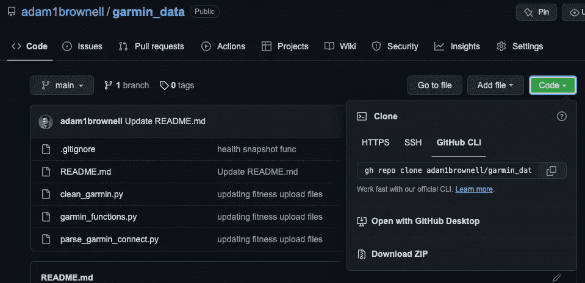

我们将在下面使用的 github 命令的起源

只需打开终端并输入:

```
gh repo clone adam1brownell/garmin_data
```

会下载我写的代码。

通过导航到目录

```
cd adam1brownell/garmin_data
```

2.访问 Garmin Connect 数据

假设您已经[在本地下载了 Garmin Connect 数据和 FitCSVJar 文件，正如我在之前的帖子](/accessing-and-cleaning-data-from-garmin-wearables-for-analysis-56c22b83d932)中所详述的，您需要做的就是运行以下命令来处理您的文件:

```
python parse_garmin_connect.py [connect/data/folder/location] [FitCSV/file/location]
```

用适当的文件位置替换[连接/数据/文件夹/位置]和[fit CSV/文件/位置]。*提示:在 Mac 上，您可以将&拖放文件拖到终端，以自动复制文件位置*

它应该是这样的:

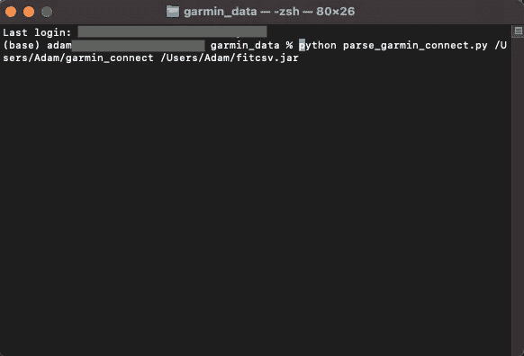

上述命令可能需要一段时间，因为它正在处理 fit 文件。

但是一旦完成，你应该有几个你的 Garmin 数据的 csv 文件，容易访问和准备分析！！


一旦你能分析你的 Garmin 数据，一切皆有可能！！照片由[拉兹万·苏驰](https://unsplash.com/es/@nullplus?utm_source=medium&utm_medium=referral)在 [Unsplash](https://unsplash.com?utm_source=medium&utm_medium=referral) 上拍摄

希望这有所帮助，如果有人遇到错误，我很乐意提供帮助🐛或者对❓有疑问