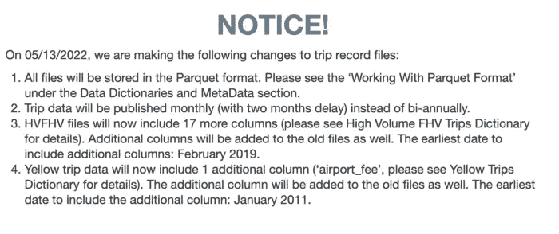
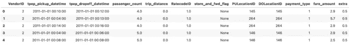
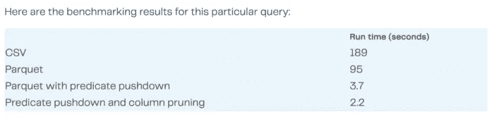

# 访问 2022 年纽约市的出租车数据

> 原文：<https://towardsdatascience.com/accessing-the-nyc-taxi-data-in-2022-8363adfda76a>

## 关于最近的变化你需要知道的一切


图片由 Benjamin Gremler 通过 Unsplash 提供

截至 2022 年 5 月 13 日，对纽约市出租车数据的访问已发生变化。拼花现在已经成为新的默认文件格式，而不是 CSV。实际上，这意味着您需要更改代码中的两件事:

1.  将路径更改为 S3 桶
2.  使用`dd.read_parquet()`方法，而不是你常用的`dd.read_csv()`或`pd.read_csv()`

这篇文章提供了变化的背景，解释了拼花文件格式的好处，并展示了对纽约市 11 年出租车数据的运行计算。



图片来自[www1.nyc.gov](https://www1.nyc.gov/site/tlc/about/tlc-trip-record-data.page)

# 你多年来一直在做的事情

[NYC TLC 数据集](https://www1.nyc.gov/site/tlc/about/tlc-trip-record-data.page)是最知名的公共数据集之一。这是为数不多的既大(> 100GBs) *又相对干净的公共数据集之一。正因为如此，许多公司将其用于演示和内部测试。十多年来，数据集一直是大数据领域的一个可靠特征。*

到了周末，这种情况突然发生了变化。如果你现在尝试拨打你熟悉的`read_csv`电话，你会遇到一个`IndexError: list index out of range`:

```
# read in 2012 CSV data 
ddf = dd.read_csv("s3://nyc-tlc/trip data/yellow_tripdata_2012-*.csv")
```

这将产生如下消息:

```
--------------------------------------------------------------------------- IndexError Traceback (most recent call last)
 Input In [21], in <cell line: 2>() ** 1** # read in 2012 CSV data ----> 2 ddf = dd.read_csv( **3** "s3://nyc-tlc/trip data/yellow_tripdata_2012-*.csv", **4** ) File ~/mambaforge/envs/dask-dataframes/lib/python3.9/site-packages/dask/dataframe/io/csv.py:741, in make_reader.<locals>.read(urlpath, blocksize, lineterminator, compression, sample, sample_rows, enforce, assume_missing, storage_options, include_path_column, **kwargs) **728** **def** read( **729** urlpath, **730** blocksize="default", (...) **739** **kwargs, **740** ): --> 741**return** read_pandas( **742** reader, **743** urlpath, **744** blocksize=blocksize, **745** lineterminator=lineterminator, **746** compression=compression, **747** sample=sample, **748** sample_rows=sample_rows, **749** enforce=enforce, **750** assume_missing=assume_missing, **751** storage_options=storage_options, **752** include_path_column=include_path_column, **753** **kwargs, **754** ) File ~/mambaforge/envs/dask-dataframes/lib/python3.9/site-packages/dask/dataframe/io/csv.py:520, in read_pandas(reader, urlpath, blocksize, lineterminator, compression, sample, sample_rows, enforce, assume_missing, storage_options, include_path_column, **kwargs) **515** paths = get_fs_token_paths(urlpath, mode="rb", storage_options=storage_options)[ **516** 2 **517** ] **519** # Infer compression from first path --> 520 compression = infer_compression(paths[0]) **522** **if** blocksize == "default": **523** blocksize = AUTO_BLOCKSIZEIndexError: list index out of range
```

# 换成拼花地板

拼花地板已经成为纽约市 TLC 数据的新默认值。要访问数据，您需要:

1.  将 S3 存储桶的路径改为使用文件扩展名`.parquet`而不是`.csv`
2.  使用`dd.read_parquet()`方法代替`dd.read_csv()`

```
# read in 2012 Parquet data 
ddf = dd.read_parquet("s3://nyc-tlc/trip data/yellow_tripdata_2012-*.parquet") ddf.head()
```



作者提供的图片(为便于阅读，已截断)

[**Dask**](https://dask.org/) **是按比例读取纽约市新出租车数据的最佳方式。Dask 使您能够最大限度地提高拼花文件格式的并行读/写能力。**

你也可以通过`pd.read_parquet()`使用 pandas，但这意味着你只能使用一个 CPU 内核来处理数据。这将使你的工作流程变得更慢，可扩展性更差。

阅读这篇文章了解更多关于 Dask 如何帮助你加速数据分析的信息。

# 旧习难改

如果你真的，真的，真的想使用一个较慢的并行 I/O，较少的压缩选项，没有列修剪或谓词下推的劣质文件格式😉您仍然可以访问`csv_backup`目录中的 CSV 数据:

```
# read in 2012 CSV data 
ddf = dd.read_csv("s3://nyc-tlc/csv_backup/yellow_tripdata_2012-*.csv")
```

请注意，与新的 Parquet 文件相比，这些 CSV 文件的并行 I/O 速度较慢，压缩选项较少，并且没有列修剪或谓词下推。如果您正在大规模工作，除非您有非常充分的理由使用 CSV，否则您通常应该使用拼花地板而不是 CSV。[阅读这个博客](https://coiled.io/blog/writing-parquet-files-with-dask-using-to_parquet/)，了解更多关于如何用 Dask 编写拼花文件的信息。

# 还有更好的

NYC TLC 拼花文件的唯一缺点是下载这些拼花文件需要很长时间，因为每年有 12 个非常大的分区。为了并行 IO 和更快的计算，最好将数据集重新分区到更优化的大小。

```
ddf = ddf.repartition(partition_size="100MB")
```

下面的代码演示了对 2011 年到 2021 年的 NYC TLC 数据执行 groupby 计算。这是磁盘上超过 200GB 的未压缩数据。您的本地机器不太可能有运行该分析的内存。我们将在一个有 50 个工人和 16GB 内存的卷状集群上运行我们的计算。[阅读文档](https://docs.coiled.io/user_guide/getting_started.html)开始使用 Coiled。

```
from coiled import Cluster 
from distributed import Client 
import dask.dataframe as dd # launch Coiled cluster 
cluster = Cluster( 
    name="dataframes", 
    n_workers=50, 
    worker_memory="16GiB", 
    software="coiled-examples/dask-dataframes",
) # connect Dask to Coiled 
client = Client(cluster)
```

现在我们可以加载我们的数据集:

```
# read in all data for 2011-2021 
ddf = dd.read_parquet("s3://nyc-tlc/trip data/yellow_tripdata_2011-*.parquet") for i in range(2012,2022): 
   ddf_temp = dd.read_parquet(f"s3://nyc-tlc/trip data/yellow_tripdata_{i}-*.parquet") 
    ddf = ddf.append(ddf_temp) # repartition dataset 
ddf = ddf.repartition(partition_size="100MB").persist()
```

现在通过计算来运行我们的组:

```
%%time 
# perform groupby aggregation ddf.groupby('passenger_count').trip_distance.mean().compute()CPU times: user 526 ms, sys: 55.1 ms, total: 582 ms 
Wall time: 10.3 s passenger_count
49.0      0.000000
208.0     0.241961
10.0      0.386429
19.0      0.690000
211.0     0.970000
192.0     1.010000
254.0     1.020000
223.0     1.160000
96.0      1.195000
177.0     1.340000
33.0      1.615000
249.0     1.690000
193.0     1.740000
112.0     1.800000
97.0      1.870000
129.0     2.050000
37.0      2.160000
0.0       2.522421
47.0      2.560000
15.0      2.590000
255.0     2.953333
6.0       2.975480
5.0       3.001735
70.0      3.060000
7.0       3.288784
247.0     3.310000
58.0      3.460000
225.0     4.830000
8.0       4.950078
250.0     5.010000
4.0       5.028690
9.0       5.675410
2.0       5.869093
3.0       5.931338
1.0       6.567514
61.0      8.780000
65.0     18.520000
36.0     20.160000
Name: trip_distance, dtype: float64
```

# 拼花地板是你的新朋友

是的，这种访问更改是痛苦的，并且意味着您可能必须更新一些遗留代码。但这种改变是有充分理由的:Parquet 是一种更有效的文件格式，尤其是在处理这种规模的数据集时，最好以并行方式读取。Parquet 使您能够执行节省时间的操作，比如并行 IO、列修剪和谓词下推。



[阅读我们关于使用 Parquet 优于 CSV 或 JSON 的所有优势的帖子](https://coiled.io/blog/parquet-file-column-pruning-predicate-pushdown/),了解更多信息并更详细地检查上述基准。

*原载于 2022 年 5 月 17 日*[*https://coiled . io*](https://coiled.io/blog/nyc-taxi-parquet-csv-index-error/)*。*