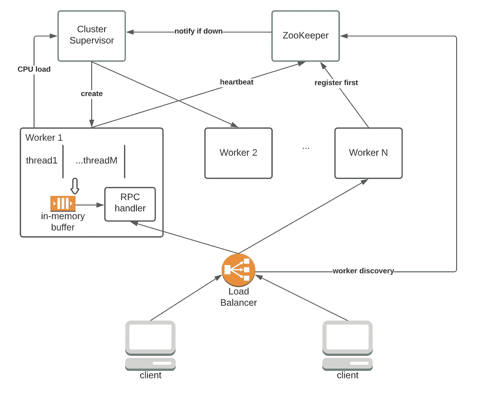
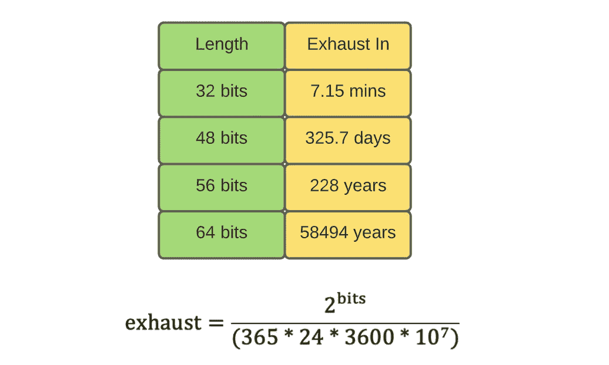
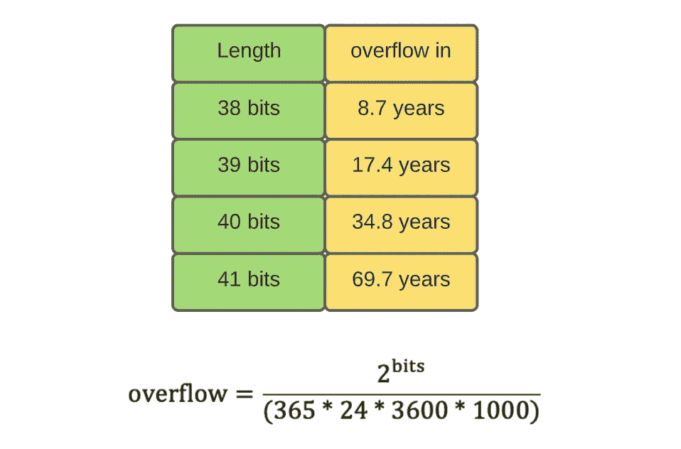
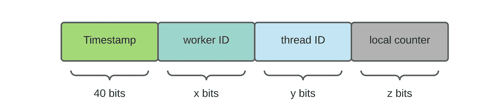
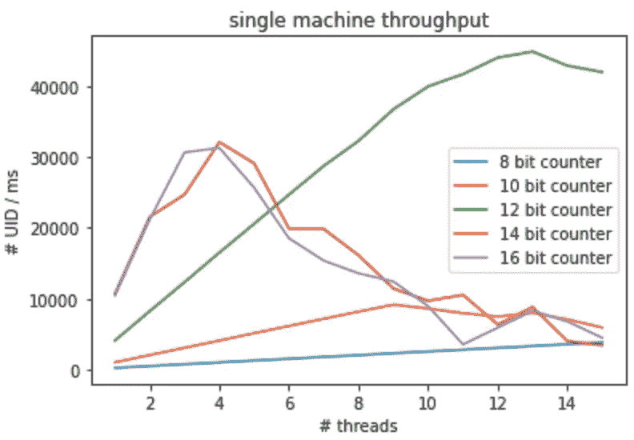
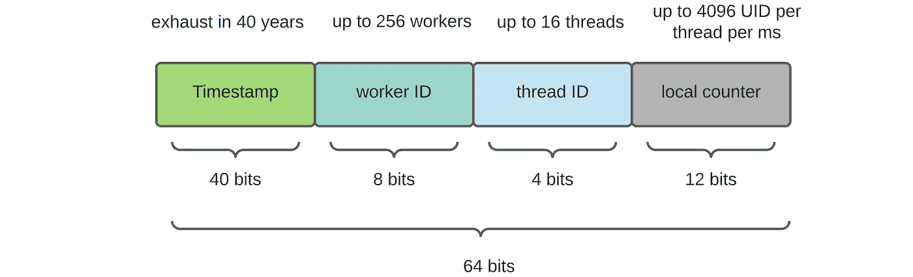
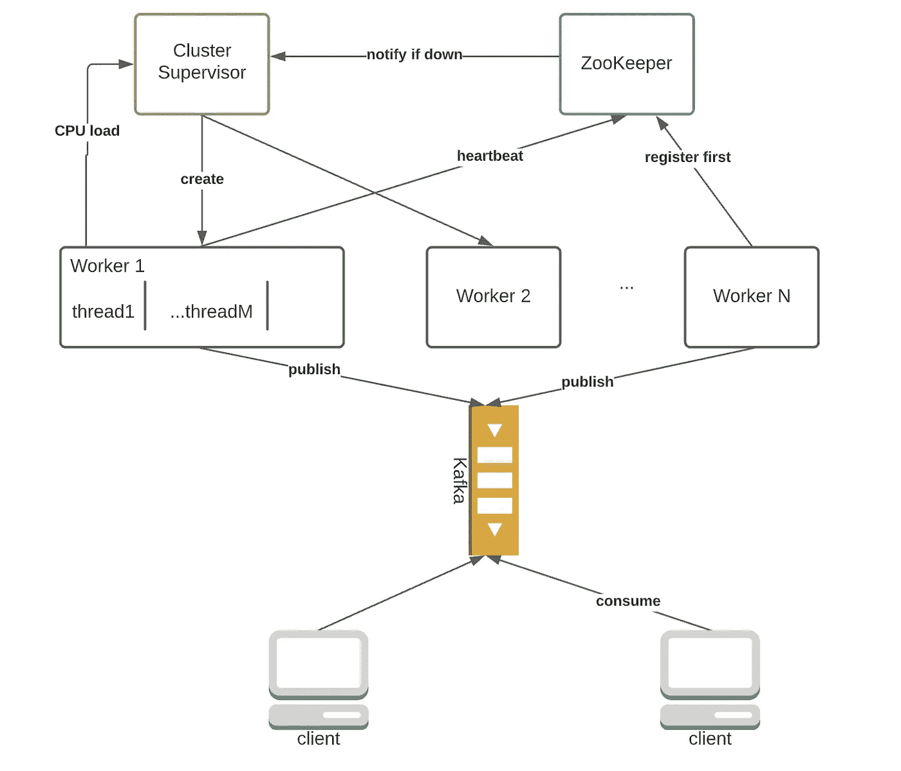

# Ace 系统设计访谈—分布式 ID 生成器

> 原文：<https://towardsdatascience.com/ace-the-system-design-interview-distributed-id-generator-c65c6b568027>

# 1.介绍

当你上传一张图片到 Instagram 或在你最喜欢的经纪应用上进行交易时，后端系统会给新创建的对象分配一个唯一的 ID (UID)。这个 ID 通常在一些数据库表中用作主键，可以用来有效地检索对象。我想你知道我要去哪里——我们如何生成 uid？

你肯定知道 SQL 中的自动递增主键。依赖这个特性的问题是显而易见的——它只能在单机数据库上工作，因为它涉及到锁定，因此不可伸缩。如果我需要 Slack、AWS、Youtube 等应用每秒数百万 uid 怎么办？在这篇文章中，我想和你分享我设计的大型 UID 生成器。

## 1.1 要求

当谈到 UID 生成时，区分这两种类型的 UID 是至关重要的。首先，是没有明显语义的随机 UID。第二，是顺序 UID，它包含排序等固有信息。


图一。两种类型的 UID，按作者分类

随机 UID 过滤不出有意义的信息，因此把它交给人类更安全(客户和人类是不同的！客户端是代码，它会尝试猜测其他人的 URL)。给定一个随机的 UID，很难猜测其他对象的 ID，因此提供了一些隐私。Youtube 上的视频或 TinyUrl 上的链接就是这样编码的。例如，如果我创建了一个 tinyUrl 并得到*tinyurl.com/2p8u9m2d,*，我很难猜出其他新创建的 Url(事实上，【tinyurl.com/2p8u9m3d】或【tinyurl.com/2p8u9m2c】*并不存在*)。

顺序 UID 有它自己的优点。它的固有含义是帮助应用程序组织数据。例如，在 Instagram 的 Slack/images 中，为聊天消息提供连续的 uid 是有意义的，因为我们希望保留项目排序。此外，如果 uid 不暴露给人类，那么即使不使用固有的顺序，使用顺序 uid 也完全没问题。

在本文中，我将关注顺序 uid，因为大多数百万 WPS 级别的应用程序不会向人类发布 uid。下面是系统的**核心功能需求:**

*   每秒能够生成一千万个顺序 uid
*   uid 必须保留一定程度的订购信息
*   能够根据消耗量调整发电率

不用说，系统应该是可伸缩的和高度可用的。

# 2.高层设计

通常在系统设计面试中，我会从访问模式和数据库模式开始。然而，我们的系统不需要任何数据库支持，稍后我会向您展示这一点。整个系统几乎是无状态的；如果一个生成器崩溃，可以重启另一个并重新开始。

## 2.1 API 设计

我们的 UID 生成器只有一个目的——为任何需要的人提供新的 UID。因此，它只需要以下面向客户端的 RPC 接口:

```
get_uid_batch(batch_size: int) -> List[int64]
```

为了最小化通信开销，客户端每隔大约 100 毫秒获取一批 uid，并将 uid 缓存在内存中。如果客户端崩溃，本地 uid 就会丢失，这完全没问题，因为我们有很多东西可以浪费。

## 2.2 高层架构

1.  由于应用程序的任务是每秒生成数百万个 uid，我们需要许多计算机并发工作来满足需求。
2.  我们需要某种监视节点健康和工作负载的集群管理器。如果供不应求，经理会增加更多的工人。



图二。建筑，作者的形象

## 2.3 控制逻辑

1.  启动 ZooKeeper 服务和集群管理器。在实践中，监管者可以被软件的内置功能所取代，例如自动缩放容器的 Kubernetes。
2.  默认情况下，集群管理器创建 N 个工作线程。
3.  当创建工作者时，它向 ZooKeeper 注册并获得唯一的工作者 ID(简单的整数，例如，从 0 到 256)。
4.  每只工蚁都对应着动物园管理员的一个短命节点。当一个工人死了，它的 znode 会被删除，ZooKeeper 会通知主管。
5.  所有工作线程定期将它们的 CPU 负载发送给集群管理器。经理删除/添加工人以最好地满足消耗率。

# 3.细节

## 3.1 流体分解

到目前为止，我们的讨论主要集中在高级特性上，比如 API 和架构。在这一部分，我们需要最终确定 UID 格式。应该是多长时间？它捕捉到了什么信息？

**流体长度**

UID 长度由应用程序及其存储需求决定。我们假设外部服务每秒消耗高达 1000 万个 uid。让我们来看看排出不同长度的 uid 需要多长时间:



图 3。UID 耗尽日期，按作者列出的数字

显然，我们至少需要 56 位，以便应用程序在其生命周期内不会用完新的 uid。

**UID 时间戳**

我们希望 UID 是可排序的，所以它的一部分必须是某种时间戳。对于我们的应用程序，将时间戳保持在毫秒粒度就足够了。UNIX 时间戳是一个很好的起点。但是，它有 64 位，对于我们的应用程序来说太长了。为了解决这个问题，我们可以建立一个自定义的纪元(而不是 UNIX 时间戳使用的纪元，1970/1/1 0:0:0 ),并计算经过的毫秒数。


图 4。作者如何使用纪元图

那么，应该用多少位来存储时间戳呢？图 5 显示了不同时间戳大小的溢出时间:



图 5。不同时间戳大小的溢出时间，按作者分类

假设项目寿命是 20 年，我们用 40 位是安全的。

**UID 附加信息**

很容易让人停下来完成我们的 UID 设计。然而，无论时间戳有多精确，都无法防止 UID 冲突。两台计算机可能会生成两个具有相同时间戳的 uid。为了区分同时生成的 uid，我们必须加入新的信息。以下是我的建议，基于实践中使用的流行设计( [Twitter 雪花](https://blog.twitter.com/engineering/en_us/a/2010/announcing-snowflake)):



图 6。UID 分解，按作者分类

1.  工人 ID:我们可以使用分配给每台计算机的唯一工人 ID 进行区分。位数由集群中的最大工作线程数决定。
2.  线程 ID:为了最大化吞吐量，多线程被用来利用现代多核 CPU 机器提供的并行性。为什么不是进程 ID？进程间通信的开销更大，我们希望将所有生成的 ID 放入一个共享的内存缓冲区，RPC 线程可以访问这个缓冲区。
3.  本地计数器:即使在 20 岁的计算机上，单线程也可以在一毫秒内生成两个时间戳。因此，我们需要一个本地计数器来进一步区分两个 uid。当计数器满时，线程会在当前毫秒内休眠。

我在我的笔记本电脑上做了一个简单的实验，一台 2019 款的六核 MacBook pro。这是我实现的吞吐量(这里是[代码](https://gist.github.com/29d9522b80f034887ed0485dd94d489e.git)):



图 7。单机吞吐量，按作者列出的数字

在不运行 RPC 服务器和其他沉重的东西的情况下，我的笔记本电脑可以达到大约每百万秒 40K UIDs。理想沙箱中的吞吐量惊人地高，我假设在实践中性能只会下降。根据有根据的猜测，假设一台计算机可以生成 5K UIDs。要实现 1000 万 uid/s，我们需要大约两台计算机。当然，实际上，我们可能需要更多。

现在，将所有东西放在一起，峰值性能(对于我的笔记本电脑)是用 13 个线程(4 位)实现的，每个线程有 12 位本地计数器。不包括工人 ID，我们的 uid 中至少需要 56 位。因此，使用 64 位 uid 是个好主意。



图 8。UID 细分，按作者分类

## 3.2 为什么不排队

有些人可能想知道使用专用队列将外部服务从 ID 生成系统中分离出来是否是个好主意。一种可能的架构如下所示:



图 9。带有队列接口的替代架构，由作者绘制

像 Kafka 这样的中间件服务提供了很好的特性，比如解耦、缓冲、重试和简单的接口。然而，在这个应用程序中不需要这些特性。我们不需要缓冲多余的 uid，因为它们可以被丢弃。系统有我能想象到的最简单的 RPC 界面，这让卡夫卡的界面看起来像火箭科学。有了卡夫卡，消费者的数量受到分区数量的限制，不方便。

在所有反对队列的理由中，这是让我相信 RPC 更好的最重要的理由。一些队列没有披露缓冲的消息数量，这使得我们的服务无法在需求上升/下降时增加/减少容量。使用 RPC，集群管理器可以更容易地监控整体工作负载。如果没有人使用 uid，一些工人将被解雇以节省资金。

# 4.摘要

在这篇文章中，我们设计了一个具有惊人吞吐量的分布式顺序 UID 生成器。我们深入研究了各种方法之间的技术权衡。在面试中，没有最佳答案。所有的解决方案都有优点和缺点；我们的工作是评估他们中的每一个，并根据面试官给定的限制做出最合理的权衡。

另外，祝所有庆祝农历新年的人虎年快乐！