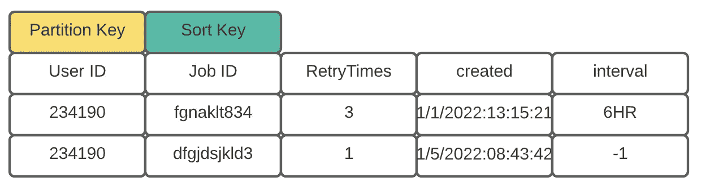
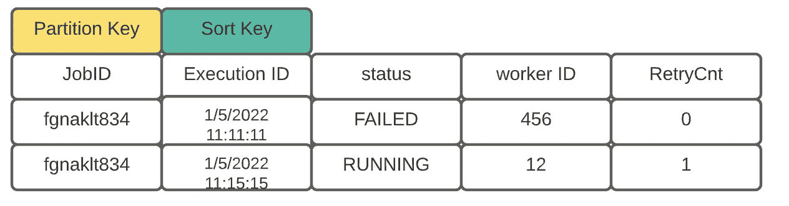
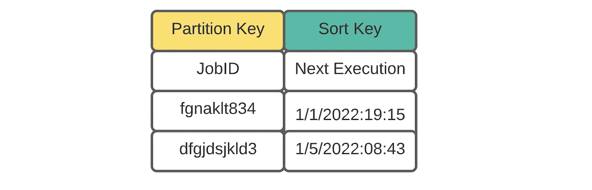
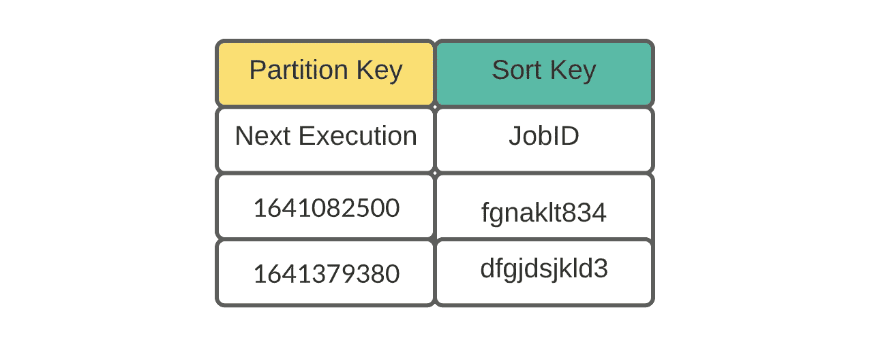
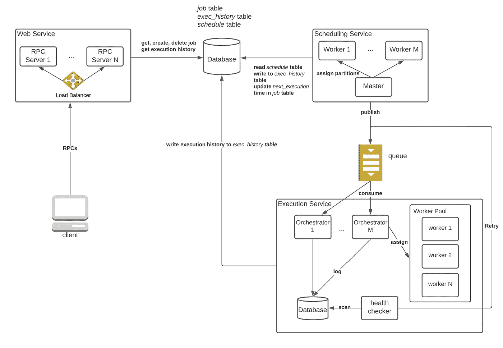
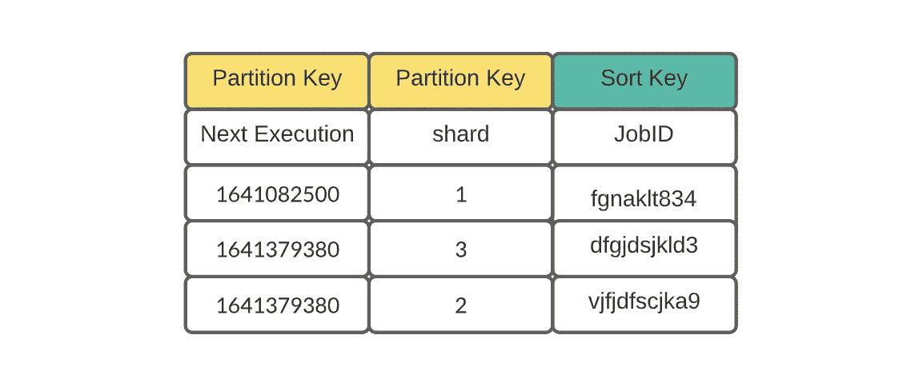
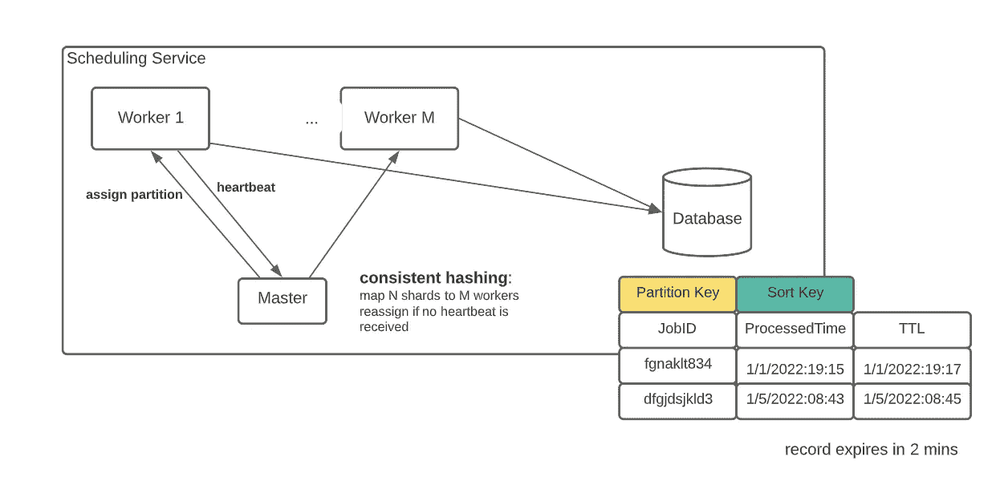
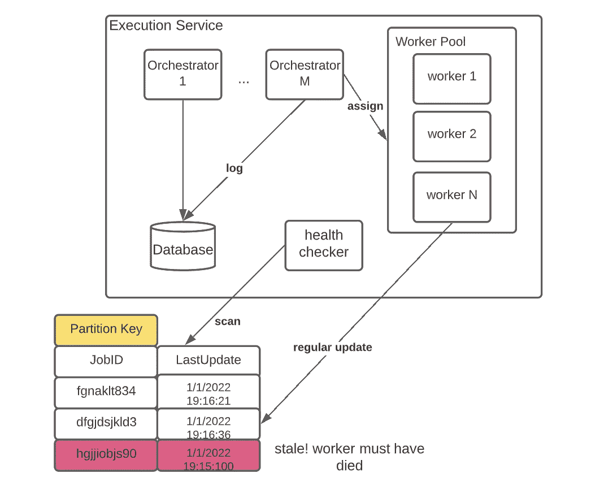

# Ace 系统设计面试:作业调度系统

> 原文：<https://towardsdatascience.com/ace-the-system-design-interview-job-scheduling-system-b25693817950>

# Ace 系统设计面试:作业调度系统

## 根据我自己的经验和与其他工程师的讨论，为大规模作业调度程序设计的。

# 1.介绍

当限价销售订单或一些代码计划在未来运行时，您需要一个像 Apache Airflow 这样的软件，它在满足某些条件时运行任务。由于它在行业中的广泛流行，作业调度器一直是系统设计面试的热门话题之一。在本文中，我想与您分享我根据自己的经验和与其他工程师的讨论而设计的大规模作业调度器。

## 1.1 要求

在面试中，具体地描述系统的期望特征是很重要的。没有人能在一个小时内设计出一个羽翼丰满的系统，所以尽量缩小题目！为了讨论的简单，我将集中讨论作业调度器的核心特性:

*   创建/删除新作业及其计划
*   查询用户拥有的所有作业
*   查询作业的状态(运行、失败、完成等)
*   查询作业的执行历史
*   对失败任务的重试支持
*   按时执行(当作业计划在下午 1 点运行时，应该在下午 1 点左右触发)

不用说，系统应该是水平可伸缩的和高度可用的。

## 1.2 交通量估计

命中作业调度程序的流量在不同的应用程序中有所不同。对于内部使用的调度程序，流量很小，因为用户数量受到团队规模的限制。另一方面，面向客户端的调度程序可能会受到大量流量的轰炸(比如 AWS 中的调度程序)。在本文中，为了更好地概括，我们假设流量很大:

*   我们预计会有数百万活跃用户。
*   平均而言，每个活跃用户拥有几十个重复性作业。
*   平均而言，一个活跃用户每周会创造几个新工作。
*   很大一部分工作每天重复几次。一些作业以更长的时间间隔执行。

基于上述估计，我们可以得出以下结论:

*   后端数据库应该是水平可伸缩的，因为执行历史增长很快(每天创建大约 1 亿行数据)。
*   该系统的读取量很大，因为调度程序创建一次作业并读取多次。执行历史也是如此，用户可以创建一个条目并多次查询。
*   我们需要一组分散的工作人员以不同的能力同时运行作业。
*   应该复制所有关键服务来处理大流量。

# 2.高层设计

## 2.1 数据库设计

在数据库设计中，应用程序的访问模式决定了使用什么模式。让我们研究一下命中数据库的请求:

**读取操作**

*   给定一个用户 ID，检索属于它的所有作业(按客户端)
*   给定一个作业 ID，检索属于它的所有/最新执行历史(按客户端)
*   查找计划立即运行的所有作业(由内部服务器执行)

**写操作**

*   用户可以(通过客户端)创建/删除新的作业计划。
*   工作人员将向数据库添加执行历史(通过内部服务器)。
*   运行作业后，系统会更新作业的下次执行时间戳(由内部服务器执行)。

在我们的用例中，不使用复杂的关系查询。大多数数据访问可以描述为主键查询(例如，给定一个作业 ID，获取所有执行)。此外，强一致性和事务的问题并不是最重要的。因此，只要针对读取进行了调优，分片 SQL 和 NoSQL 数据库都可以处理系统的所有需求。为了简单起见，我将在模式讨论中使用 NoSQL (Cassandra)语言，但请记住，您可以选择其他数据库，如 Postgres 或 HBase。

**模式**

*作业表*:我们需要一个记录作业元数据的表，比如所有者、执行间隔和重试策略。记住这个表的访问模式:给定一个用户 ID，获取一些作业记录。因此，我们可以使用 UserID 作为分区键，使用 JobID 作为排序键



图一。职务表，按作者列出的数字

*历史表*:该表用于存储作业的执行细节。给定一个作业，可能有多个执行与之相关联。记住访问模式:给定一个 JobID，检索所有执行历史。因此，我们使用 JobID 作为分区键，使用执行 ID 作为排序键(执行 ID 可以是一个简单的时间戳)



图二。历史表，按作者分类

调度表:当然，任何作业调度器的核心特性都是按时运行作业。因此，我们需要一个数据模型，它可以很容易地根据执行时间过滤作业。下面是一个适用于少量数据的简单设计:



图 4。附表设计 1，作者图

要获得待办事项列表，我们只需每分钟运行一次这样的查询:

```
SELECT * FROM ScheduleTable WHERE NextExecution == "1/5/2022:08:43"
```

当前设计的一个大问题是每个查询都会触发一次表扫描。如果数据很大，则需要额外的机制来确保系统的可伸缩性。详情请见详情部分。

如果你有处理大规模数据库的经验，单词**表扫描**应该会让你惊慌，更不用说每分钟都这样做了。有没有一种不用检查每一条记录就能筛选工作的方法？是啊！如果我们简单地颠倒图 4 中的数据模型，我们会得到:



图 5。附表设计 2，作者图

注意，执行时间被转换为 UNIX 时间戳，粒度为**分钟级**。这意味着计划在同一分钟运行的作业将共享相同的分区键。要获得计划立即运行的作业，只需找到带有当前 UNIX 时间戳的正确分区:

```
SELECT * FROM ScheduleTable WHERE NextExecution > "1641082500" AND NextExecution < "1641082580"
```

## 2.2 API 设计

我们的应用程序易于使用，它只需要以下 RPC 接口:

```
submit_job(user_id, schedule, code_location)retrieve_all_jobs(user_id)delete_job(user_id, job_id)get_exec_history(job_id)
```

## 2.3 架构

到目前为止，我们已经为应用程序打下了坚实的基础——数据库模式、RPC 调用。现在是做一些面向服务的设计的黄金时间！

*   **Web 服务:**调度系统的网关。来自客户端的所有 RPC 调用都由该服务中的一个 RPC 服务器处理。
*   **调度服务**:它每分钟检查一次数据库中未完成的任务，并将它们推到队列中等待执行。一旦一个任务被调度，在执行历史表中创建一个*状态=已调度的条目。有了这项服务，我们保证所有的作业都及时地被推到队列中。*
*   执行服务:在这项服务中，我们管理着一大群执行人员。每个工人都是消费者，执行从队列中获得的任何作业。需要额外的簿记，以确保在工人失败时重新执行。



图 6。高层建筑，作者图

# 3.细节

如果您仔细阅读图 6，您可能会想知道调度服务中的主服务器或执行服务中的健康检查器的用途。在这一节中，我们将讨论这些组件的必要性以及它们的工作原理。

## 3.1 按计划运行任务

让我们再次检查查询语句:

```
SELECT * FROM ScheduleTable WHERE NextExecution > "1641082500" AND NextExecution < "1641082580"
```

当并发运行的作业数量较少时，查询会产生合理数量的数据。然而，如果，比方说，10 万个作业被安排在这一分钟内运行，我们当然需要更多的工人来处理来自查询的入口数据以及将消息推送到队列。

当引入多个工人时，复杂性增加了——我们如何分配数据，使得每个工人只消耗 10 万个工作中的一小部分(10%)?事实证明，一个简单的复合分区键可以解决这个问题:



图 7。具有复合分区键的计划表，按作者分类

当一行被添加到明细表中时，它会被随机分配一个碎片号。有了新的模式，在工作人员之间分配负载变得非常容易:

```
Worker 1: SELECT * FROM ScheduleTable WHERE NextExecution > "1641082500" AND NextExecution < "1641082580" AND shard =1 Worker 2:SELECT * FROM ScheduleTable WHERE NextExecution > "1641082500" AND NextExecution < "1641082580" AND shard = 2...
```

尽管额外的分区键使数据分片变得容易，但还有另一个问题——工作人员总是来来去去。不能保证所有碎片都被覆盖。问题变成了我们如何将 **N** 个碎片平均分配给 **M** 个工人，其中 **M** 可以随时改变？



图 8。按作者列出的详细服务日程安排图

为了确保一个完整的工作分配，我们可以借鉴 MapReduce 的一些思想，在 MapReduce 中使用一个 master 来分配和监控工人。如果一个工作节点死亡，主节点会将其工作重新发送到其他节点。使用一个附加的本地数据库，这样就不会有作业被调度两次。当作业被推送到队列中时，会在本地数据库中创建一个条目，过期时间为 2 分钟。如果记录的原始处理程序死亡，碎片被移交给另一个工作者，新的工作者将跳过数据库中存在的任务。

## 3.2 排队交付

引入队列有两个原因。首先，我们需要一个缓冲区来容纳高峰时间的所有未决作业。其次，它将两个服务解耦。执行服务可以在不与调度服务协调的情况下增加/减少其容量。但是，有了额外的中间件，我们必须考虑什么类型的交付最适合系统(假设队列是在 Kafka 中实现的)。

**至少一次交货**

在这种交付模式中，消息在消费者提交索引之前被处理**。如果使用者在提交前死亡，相同的消息将由不同的工作人员再次处理。**

**最多一次交货**

在这种交付模式下，在消费者提交了消息的索引之后，消息将在第**被处理。如果消费者在完成任务前死亡，作业将不会被重新处理。**

在我们的应用程序中，至少一次交付具有更高的容错性，使得在 orchestrator 失败时重试失败的任务变得更加容易。只有当 orchestrator 在一个 workers 上成功启动容器时，才会提交消息(作业)。

## 3.3 处理故障和重试

尽管至少一次交付保证了每个作业都被分配给一个工人，但它不能防止工人失败时作业被丢弃。为了实现真正的重试功能，引入了异步运行状况检查器来运行以下逻辑:

1.  分配作业时，会在本地数据库中创建一个具有最新更新时间的条目。
2.  要求所有工人刷新更新时间~10s。
3.  运行状况检查器将定期扫描该表，查找更新时间过时(例如，超过 30 秒)的作业。
4.  满足上述标准的作业被送回队列重新执行。



图 9。故障处理，按作者分类

## 3.3 数据流

有了高级设计地址中的所有皱纹，我们终于可以得出系统的数据流:

**创建/删除作业/检索历史**

*   客户端向 Web 服务发出 RPC 调用。
*   其中一个 RPC 服务器使用提供的分区键查询数据库，并返回结果

**安排作业**

掌握

*   每一分钟，主节点都会创建一个权威的 UNIX 时间戳，并为每个工作者分配一个碎片 ID(请参阅详细信息)和时间戳
*   定期检查工人健康。如果它死了，把它的工作重新分配给其他人

工人

*   工作者用时间戳和碎片 ID 查询数据库。
*   对于每一行，如果它尚未被调度，则将其发送到队列中(请参阅详细信息)

**执行作业**

管弦乐演奏家

*   一组编排者使用队列中的消息
*   给定一条消息，找出一个工作量最小的工人。将工作分配给工人
*   提交索引，重复步骤 1 到 3

工人

*   工人定期用其时间戳更新本地数据库

健康检查器

*   扫描本地数据库大约 10 秒
*   如果任何行在大约 30 秒内没有更新，通过将作业 ID 推送到队列来重试

# 4.摘要

在本文中，我们设计了一个简单但可伸缩的作业调度器。除了高层次的设计，我们还深入研究了各种方法之间的技术权衡。在面试中，没有完美的答案。所有的解决方案都有缺陷，我们的工作是评估每一个，并向面试官解释我们的权衡。