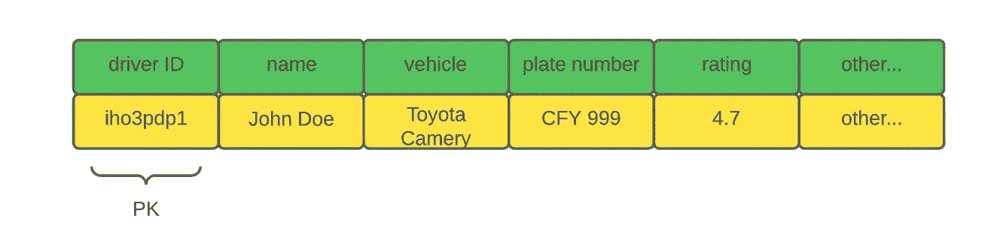
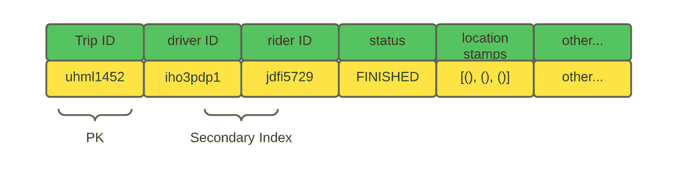
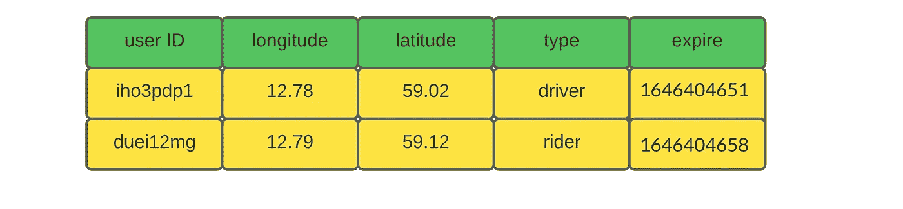
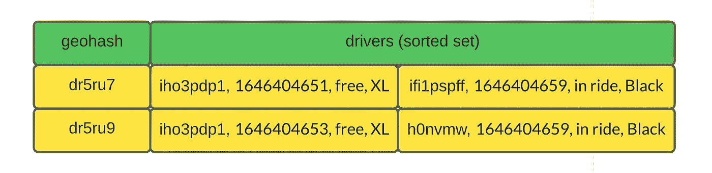
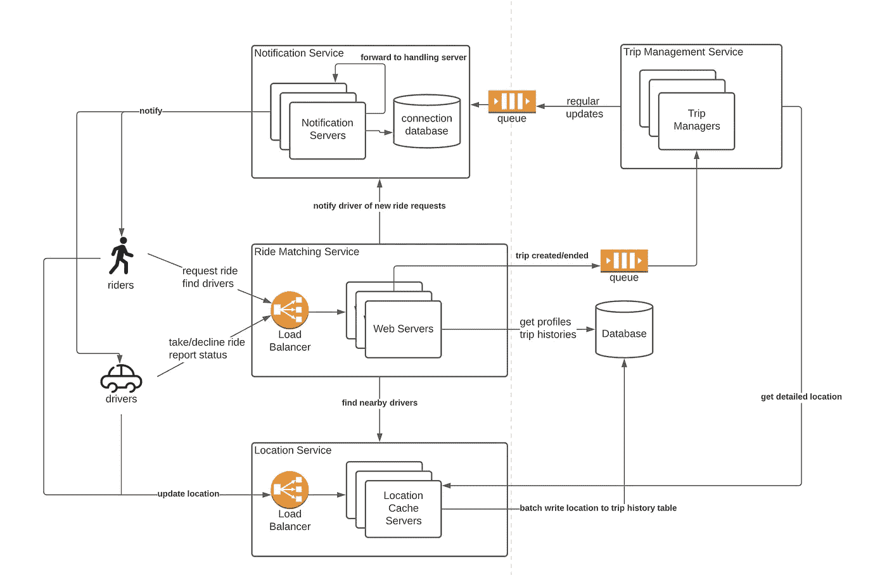
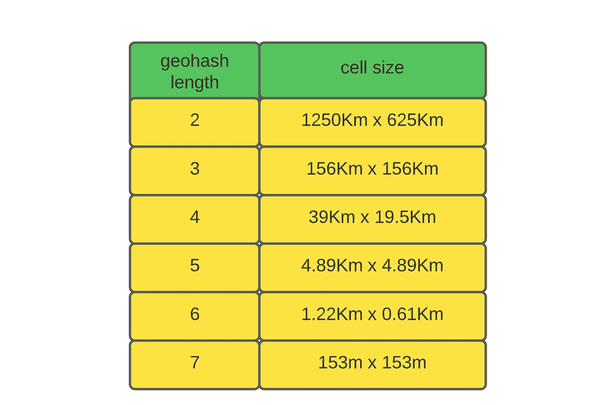
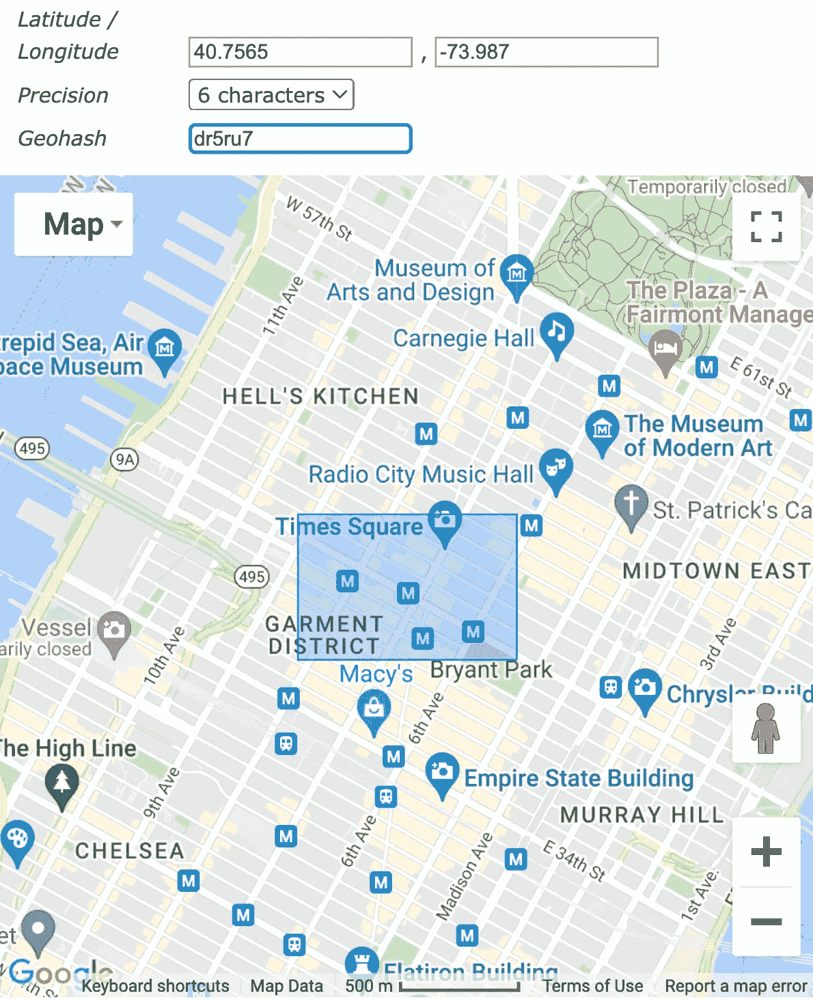
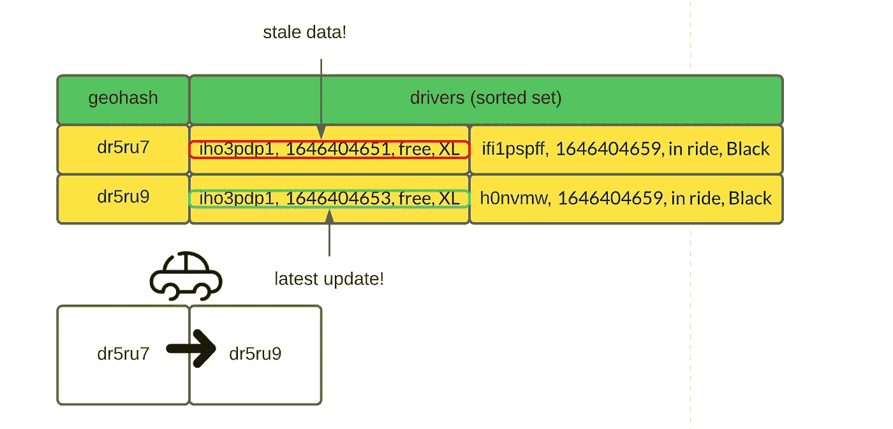
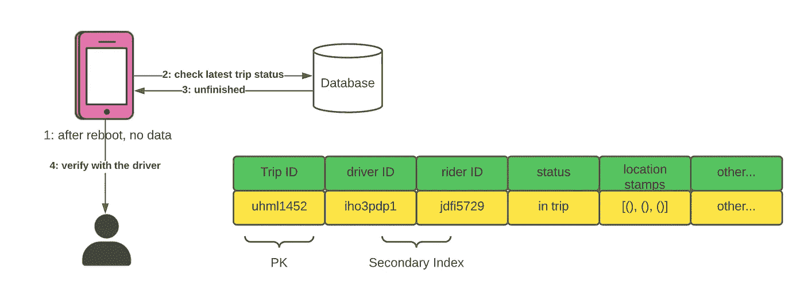

# 系统设计面试高手—优步/Lyft

> 原文：<https://towardsdatascience.com/ace-the-system-design-interview-uber-lyft-7e4c212734b3>

# 1.介绍

当谈到在城市出行时，许多人选择优步或 Lyft 等拼车应用程序。事实上，这类应用通过提供有竞争力的价格、相当短的等待时间和高可用性，让短程通勤变得非常容易。从技术角度来看，像这样的系统非常有趣，因为最近邻搜索很难。在这篇文章中，我想分享我对优步/Lyft 这样的大型拼车应用的设计。

## 要求

现代拼车应用程序除了提供拼车服务外，还提供复杂的功能，如拼车、拼车、实时聊天。在这篇文章中，我想保持讨论的简短，只关注核心功能—预订乘车。以下是我们系统的**功能需求**:

*   用户可以请求搭车，并应与附近的司机匹配
*   用户可以看到所有附近的司机(虽然没有选择哪一个)
*   司机可以回答/拒绝附近乘客的请求。
*   创建旅行时，双方都能看到对方的实时位置。

不用说，系统应该是可伸缩的和高度可用的。

## 交通量估计

在讨论流量之前，我们先来看看优步的一个独特之处——它的数据使用是本地的。与 Slack 或 Instagram 等 app 不同，很少需要跨区域的数据通信。如果你身在纽约，你就不能在伦敦订车。因此，位置数据和行程不会在不同的地区之间复制(当然，访问频率较低的数据，如个人资料，会在全球范围内复制)。从这个意义上说，讨论全局流量不如区域流量有意义。

点击我们系统的乘车请求数量因应用程序的受欢迎程度而异。这里，我们假设大量的区域交通用于通用解决方案:

*   将城市按邻近区域分组。我们可能需要十几个地区来覆盖整个美国
*   我们预计在一个地区大约有 10 万活跃司机。
*   我们预计一个地区会有大约 100 万活跃用户。
*   全球用户总数为 1000 万。

假设司机和乘客都发出他们的位置信息，每条信息包括经度、纬度和额外的元数据。此外，骑手会定期检查附近的驾驶员(~5s)，有时会提出骑行请求。我们可以预期的 QPS 和带宽数量是:

*   我们预计每秒大约有 20 万次位置更新/写入
*   我们预计每秒约 20 万次查询，峰值流量处理时加倍。
*   每个位置消息由 ID (8 个字节)、经度和纬度(16 个字节)以及其他信息(64 个字节)组成。总上传带宽略低于 88MB/s

# 2.高层设计

## 数据库设计

我们的应用程序的访问模式决定了使用什么模式。让我们研究一下命中数据库的请求:

**读取操作**

*   给定一个用户 ID，检索其配置文件
*   给定一个用户 ID，检索用户完成的所有行程
*   给定经度和纬度，查询附近的所有司机

**写操作**

*   给定一个用户 ID，更新其位置
*   给定一个行程 ID，司机可以接受/拒绝请求

**数据库模式**

给定访问模式，分片 SQL 是一个很好的选择，因为没有复杂的关系查询。注意，如果强一致性不是硬性要求，这里也可以使用像 Cassandra 这样的 NoSQL 数据库。

驾驶员资料表

图一。按作者分列的驾驶员概况表

骑手档案表

图二。骑手简介表，按作者分类

行程详细信息表

图 3。旅行详细信息表，按作者分类

除了这些数据库表，我们还需要另一个高性能存储来保存频繁更新的位置数据。由于实时位置数据本质上是短暂的，将它们保存在磁盘上没有意义。一个好的替代方法是使用内存缓存，比如 Redis 或 Memcache。

**缓存模式**

位置真实缓存

图 4。位置真相缓存，按作者分类

当涉及到用户位置时，这个缓存是事实的来源。手机应用程序会定期发送更新以保持准确性。如果用户断开连接，其记录将在 30 秒后过期。

驱动程序邻近缓存

图 5。驱动程序邻近缓存，按作者分类

邻近缓存对于附近的驾驶员搜索至关重要。给定一个位置，我们可以使用 G [eoHash](https://www.movable-type.co.uk/scripts/geohash.html) 来计算它的位置键，并检索网格中的所有驱动程序。我会在细节部分详细讨论这一点。

## 体系结构

随着对存储什么数据有了更清晰的理解，现在是时候进行面向服务的设计了！

*   **通知服务**:每当后端需要向客户端发送信息时，通知服务用于传递消息。
*   **旅行管理服务**:当旅行开始时，需要该服务来监控所有各方的位置以及计划路线
*   **乘车匹配服务**:该服务处理乘车请求。它会根据司机的反应(接受或拒绝)找到附近的司机并进行匹配
*   **位置服务**:所有用户必须通过该服务定期更新自己的位置。

图 6。高层架构，作者图

## **工作流程**

1.  Bob 向搭车匹配服务发送搭车请求，并希望与司机配对。
2.  骑手匹配服务联系位置服务并找到同一地区所有可用的驾驶员。
3.  然后，搭车匹配服务进行排名/过滤，并通过通知服务将搭车请求推送给选定的司机。
4.  司机可以接受/拒绝请求。收到后，乘车匹配服务将向行程管理服务发送行程详细信息。
5.  行程管理服务监控行程进度，并向行程中涉及的各方广播司机和乘客的位置。

# 3.细节

高层架构设计相对简单。然而，如果你仔细检查，还是有一些皱纹。例如，我忽略了行程定价、拼车等功能。在这篇文章中，我想把重点放在与位置相关的问题上，因为它们是优步/Lyft 的基础。

**3.1 如何高效查找附近的司机？**

最近邻搜索是一个困难的问题，我们系统的规模使得有效的查找更加困难。我们可以使用一种称为 GeoHash 的技术，将用户的位置转换为对应于图 7 中一个单元的唯一键，并将搜索限制在几个相邻的单元，而不是计算数据库中骑手和每个司机之间的距离。

图 7。位置到 GeoHash，PC credit: [活字脚本](http://Movable Type Scripts)

图 7 展示了 GeoHash 的 key 属性——键和位置单元之间的一对一映射。因此，我们可以使用以下启发式方法来快速查找驱动程序:

1.  给定一个用户位置，从经度和纬度计算其地理哈希。
2.  有了 GeoHash 键，很容易计算附近 8 个像元的键。([见本帖](http://ellse.org/uncategorized/how-geohash-works/))
3.  用全部 9 个键查询位置服务；检索这些单元格中的驱动程序。

GeoHash 的精度由密钥长度决定。密钥越长，每个单元格就越小。

图 8。geohash 密钥长度和像元大小，按作者分类

使用什么样的钥匙尺寸比较合适？实际上，密钥大小是根据驾驶员和乘客的数量迭代确定的。在我看来，一个好的起点应该是 6 码，因为它覆盖了几个街区。

图 9。根据作者的数据，6 号 GeoHash 提供了大量的覆盖面

这些单元中可以容纳的驾驶员和乘客的最大数量是有物理限制的。回到图 5，每个单元格都是 Redis 中驱动程序邻近缓存中的一个条目。

您可能想知道 Redis 能否处理这种级别的流量。如果该地区有 100 万活跃骑手，命中集群的请求数约为 20 万次写入/秒(每个用户更新其位置约 5 秒)和 2M 读取/秒(每个用户读取 9 个 Redis 键约 5 秒)。

图 10。单个 Redis 节点容量，PC 由[Redis.com](https://redis.com/blog/redis-enterprise-extends-linear-scalability-200m-ops-sec/#:~:text=At%20RedisConf18%20we%20demonstrated%20that,another%20new%20industry%20performance%20record.)

即使只有一个具有 32 个线程的 AWS c5.18xlarge 节点，系统也可以处理流量。在实践中，我们可以将工作负载分布到几十台计算机上，实现大约 100M 级别的 RPS 容量。

内存限制怎么办？如果我们使用大小为 6 的 geohash，缓存中可能有 32⁶~ = 100 亿个键，这太疯狂了。然而，如果移除了(图 5)的**空键，我们将永远达不到这个数量的键。实际上，缓存条目的数量受到汽车数量的限制，因为每辆汽车只能在一个单元中！因此，内存不是瓶颈。**

**3.2 位置更新**

希望我已经让你相信了在 Redis 上托管定位服务的可行性。现在让我们来看看用户是如何更新他们的位置的。

缓存中有两个表——位置真值表和驱动程序邻近度表。位置真值表的用法很简单。用户的移动应用程序每 5 秒钟向定位服务发送一次自己的位置和用户 ID。每当需要用户的精确位置时，系统可以通过用户 ID 查询该表。

邻近表本质上更有趣。司机开着车到处走，这意味着他们经常穿过一个牢房到另一个。当后端从驱动程序接收更新时，它不知道它们过去是什么单元。因此，很难将驾驶员从他们的旧单元中移除。言外之意很明显；由于数据陈旧，同一驱动程序可能会出现在多个单元中。

图 11。Redis 中的陈旧记录，按作者分列

为了解决这个问题，我们可以为每个记录引入一个时间戳。有了时间戳，很容易过滤掉陈旧的位置数据。实际上，Redis 中的有序集合数据结构是实现这一特性的有效方法。

除了司机的位置，我们还可以在缓存中保存车辆类型、行程状态(免费、正在行驶)等信息。有了这些附加信息，就可以快速进行乘车匹配，因为可以跳过到数据库的往返行程(查询车辆信息和行程状态)。

**3.3 行程记录**

我们系统的另一个重要特征是行程记录。对于一次完整的旅行，我们希望存储司机所走的路线，并让客户查看。

有许多方法可以实现这一功能；最简单的方法是依靠司机报告他们的位置和行程状态。位置服务将把所有带有 *in-trip* 状态的位置更新批量写入数据库进行永久存储。

依赖客户端 app 是有风险的。如果客户端应用程序在旅行中丢失了所有本地数据怎么办？在重新启动之前，它不知道驱动程序的状态。为了从失败中恢复，客户端应用程序应该检查数据库中是否有任何未完成的行程，并与司机确认它们的状态。

图 11。故障恢复，按作者分类

# 4.摘要

在本文中，我们设计了优步/Lyft 等拼车应用的基础。特别是，我们已经详细探讨了如何实现邻近搜索。记住，面试中没有完美的答案。所有的解决方案都有缺陷；我们的工作是在给定的假设和约束条件下提出一个足够好的设计。