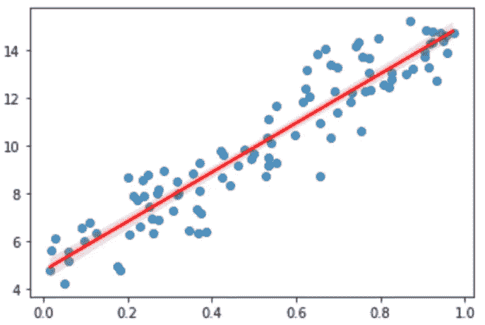
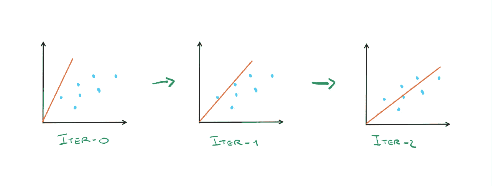
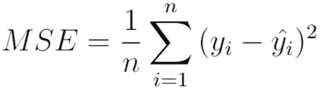
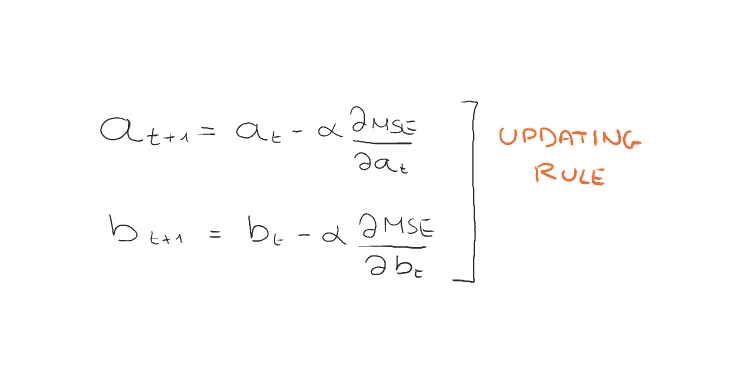
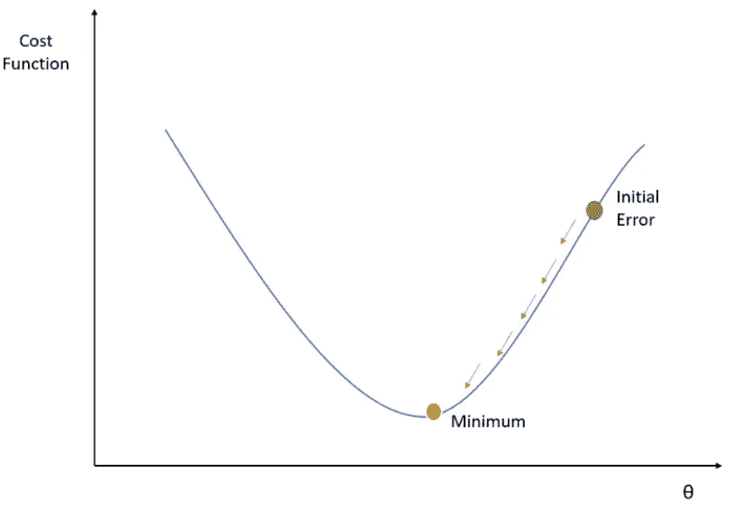
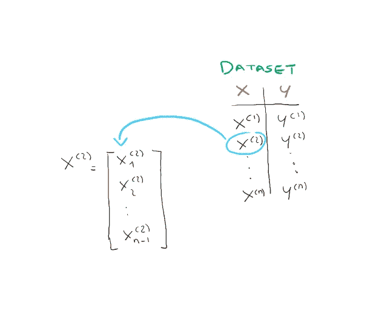
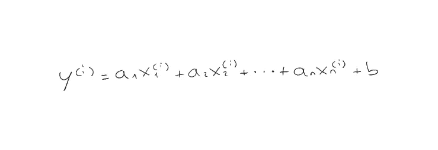
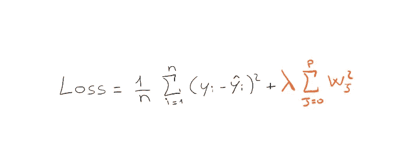
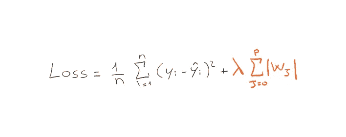
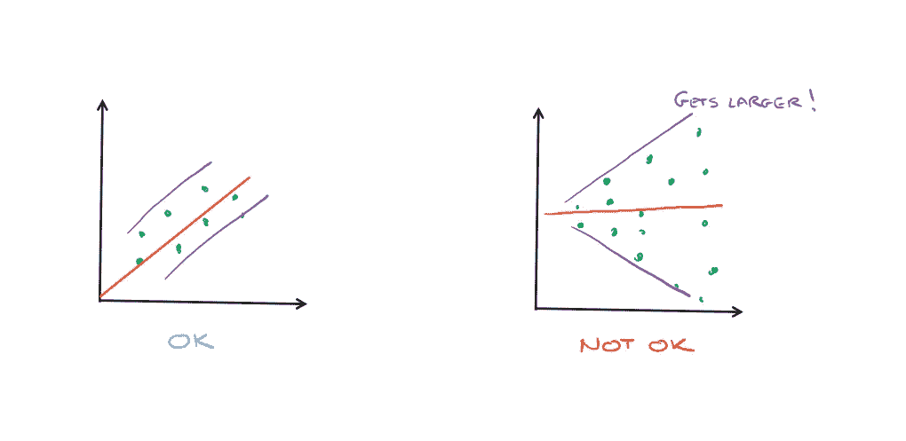

# 赢得机器学习面试——第 1 部分

> 原文：<https://towardsdatascience.com/ace-your-machine-learning-interview-part-1-e6a5897e6844>

照片由 [LinkedIn 销售解决方案](https://unsplash.com/@linkedinsalesnavigator?utm_source=medium&utm_medium=referral)在 [Unsplash](https://unsplash.com?utm_source=medium&utm_medium=referral) 上拍摄

## 深入线性回归、套索回归和岭回归及其假设

## 介绍

这些天我在机器学习领域有几个面试，因为我已经搬到国外，需要找一份新工作。

大公司和小创业公司总是想确保你知道机器学习的基础知识，所以我用一些时间来重温这些基础知识。因此，我决定分享一系列关于在机器学习中处理面试时你需要知道什么的文章，希望它也能帮助到你们中的一些人。

## 线性回归

线性回归(作者图片)

当我们谈论线性回归时，我们有一组点，为了方便起见，您可以认为这些点绘制在二维平面上(x:要素，y:标注),我们希望用直线拟合这些点。

也就是说，我们想要找到通过上图中的点之间的右*的直线。*

我们知道，用红色表示直线的方程是这样的类型: ***y = a*x + b*** 。所以找到正确的直线意味着**估计**我们需要绘制直线的参数 ***a*** 和 ***b*** 。

但是我们如何找到这些我们可以称之为 ***的参数θ = (a，b)*** ？

直观地说，这种机制很简单，我们从任何一条直线开始，反复调整它，直到找到一条更好的直线。

按迭代调整(图片按作者)

但是我们如何在每次迭代中提高对 *θ = (a，b)* 的估计呢？要做到这一点，我们需要找到一种方法，能够告诉每一行有多少错误。在上图中，ITER 0 线比 ITER 1 线错得更多。现在我们需要找到一种形式主义来明确这一点，即使它在视觉上是微不足道的。

这就是所谓的**损失函数**帮助我们的地方。这个函数，给定一条线和我们的数据集点，将返回一个数字，这个数字相当于网络产生的误差，太棒了！所讨论的损失函数被称为**均方误差(MSE)** 。

MSE(作者图片)

在此函数中，对所有点的误差进行平均，即每个点到直线的距离。事实上，如果你仔细观察括号，我们会发现实际的 y 值*和预测的 y 值*之间存在差异。注意，预测的 *y* 将是 ***a*x + b*** 的结果(其中最初的 *a* 和 *b* 是随机取的)。**

**现在我们也有了一种方法来量化我们的直线的误差，我们需要一种方法来迭代地改进参数 *θ = (a，b)* 。**

**为此，我们使用**梯度下降算法**！算法告诉我们以下列方式更新参数。**

****

**更新规则(按作者排列的图像)**

**然后，我们只需要计算损失函数相对于两个参数(a 和 b) 的**偏导数，并设置一个**学习速率α** ，它将是允许我们或多或少快速收敛(从而找到最优线)的超参数。如果我们选择太低的学习率，我们可能会收敛得太慢。相反，高学习率可能不会让我们收敛。****

**我们可以重复这个迭代，直到损失函数的值，然后我们的网络的误差低，在这一点上，我们会找到一条线拟合我们的点！**

**我们可以直观地看到这种不断更新参数以最小化损失的过程，就像通过逐步下降来寻找函数的最小值一样。**

****

**梯度下降(图片由作者提供)**

## ****多元线性回归****

**显然，在我们有 n 维点的情况下，线性回归可以被推广，因此具有 n-1 个特征，而不是一个。在这种情况下，数据集中的每个点将由 n-1 个分量组成。**

****

**多元线性回归数据集(图片由作者提供)**

**在这种情况下，点 *i、*的预测将按以下方式计算。**

****

**多元线性回归预测(图片由作者提供)**

**在这里，我们将不得不**估计所有** **参数** ***a1，a2，..安、乙*、。****

## **多重共线性问题**

**当两个或多个要素高度相关时，会出现多重共线性问题。线性回归的最大优点之一是它的可解释性。在类型为 ***的模型中，y = a1*x1 + a2*x2*** 我知道每当 *x1* 增加一个单位 *y* 增加 *a1* 个单位。这是直接从公式推导出来的。但是在 *x1* 和 *x2* 关联的情况下，当 *x1* 增加一个单位时， *x2* 也以某种方式增加，我无法再判断 *y* 会如何变化！当我有了 *n* 的特征时，想想真是一团糟！**要进行多重共线性检测，可以使用相关矩阵**，通常用热图绘制。当变量相关时，热图具有更强烈的值。**

****

**热图示例(图片由作者提供)**

## **里脊回归**

**岭回归是线性回归的一种变体，只是对损失函数做了一点小小的修改。**

**使用的损失函数如下。**

****

**岭损失函数(图片由作者提供)**

**与之前看到的 MSE 不同的是橙色部分，我们称之为**罚**。惩罚由模型(直线)参数的平方和构成。所以参数 *a1 越大，…，an* 网络的误差越大。这样，损失函数迫使梯度下降算法找到一条具有小参数的线，所以**它是一个附加约束**，**它用来限制模型的学习能力，使其不会陷入过拟合**。λ是乘法因子，是网络的另一个超参数。**

## **套索回归**

**套索回归和岭很像，只是罚分略有变化。**

****

**套索损失函数(作者图片)**

**在这种情况下，我们有参数的模而不是平方。套索经常导致某些系数 *a1，…an* 为零。所以这意味着一些功能将被取消。正因为如此，**我们也可以用 lasso 回归作为特征选择，来搞清楚哪些特征最没用！****

# **基本假设**

**在应用线性回归之前，我们需要了解**个假设**，特别是 4 个假设。**

1.  ****线性**:显然，必须能够用直线(或多维超平面)拟合数据。**
2.  ****同方差**:即残差的方差对于 x 的任何值都保持不变，用例子更容易理解。**

****

**同质性(图片由作者提供)**

**3.**独立性**:观察是相互独立的。**

**4.**误差的正态性**:残差必须近似正态分布(您可以使用 QQ 图来检查)。**

## **优势**

1.  **线性回归对于可线性分离的数据表现特别好**
2.  **易于实施和培训**
3.  **它可以处理过度拟合使用正则化(套索，山脊)**

## ****劣势****

1.  **有时需要大量的特征工程**
2.  **如果这些特性是相关的，它可能会影响性能**
3.  **它对噪音很敏感。**

## **我们来编码吧！**

**我之前写的一篇关于实现线性回归的完整文章可以在这里找到:*[***仅使用 Numpy 的线性回归和梯度下降***](/linear-regression-and-gradient-descent-using-only-numpy-53104a834f75)**。*现在让我们看看如何使用 sklearn 用几行代码实现一个简单的线性回归。****

**使用 skLearn 进行线性回归**

# **最后的想法**

**我以前写过一篇关于如何只用 NumPy 实现线性回归的文章，你可以在这里找到文章！线性回归是开始学习最大似然的基本算法。如果你很好地理解了这一点，那么理解像神经网络这样更复杂的算法就容易多了。**

> **线性回归的一个演变是**多项式回归**，这是一个更复杂的模型，也可以适合引入更复杂特征的非线性数据集，请查看这里:[https://en.wikipedia.org/wiki/Polynomial_regression](https://en.wikipedia.org/wiki/Polynomial_regression)。**

# **结束了**

**马尔切洛·波利蒂**

**[Linkedin](https://www.linkedin.com/in/marcello-politi/) ， [Twitter](https://twitter.com/_March08_) ， [CV](https://march-08.github.io/digital-cv/)**