# 赢得机器学习面试——第二部分

> 原文：<https://towardsdatascience.com/ace-your-machine-learning-interview-part-2-c58526b5faba>

[KOBU 机构](https://unsplash.com/@kobuagency?utm_source=medium&utm_medium=referral)在 [Unsplash](https://unsplash.com?utm_source=medium&utm_medium=referral) 上拍摄的照片

## 使用 Python 研究分类问题的逻辑回归

## 介绍

在以前的文章中，我们已经看到了**线性回归**算法的理论和实现:

1.  [*Ace your Machine Learning 面试—第一部分*](/ace-your-machine-learning-interview-part-1-e6a5897e6844)
2.  [*仅使用 Numpy 的线性回归和梯度下降*](/linear-regression-and-gradient-descent-using-only-numpy-53104a834f75)

现在让我们看看如何使用线性回归的变体来解决分类问题。

## **逻辑回归**

我们要做的是建立一个模型，输出给定输入属于某个类的概率。

假设我们的输入数据由矢量 *x* 表示，我们直线的参数由*矢量θ* 表示。我们可以通过下面的方式简单地计算通常称为 ***logit*** 的第一个分数。

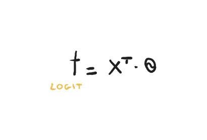

Logit(图片由作者提供)

一旦我们得到这个分数，我们仍然没有能力说我们的 *x* 是否属于一个概率为 *p* 的类。我们如何得到这个概率？

假设我们处于一个 ***二进制分类问题*** ，那么*一个数据项只能属于 0 类或者 1 类*。

你要做的是使用一个 ***sigmoid 函数*** 来估计概率。所以我们的 logit 将是这个函数的输入。

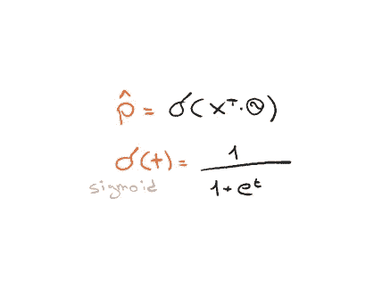

乙状结肠(图片由作者提供)

现在让我们想象一下 sigmoid 函数在图上的表现。

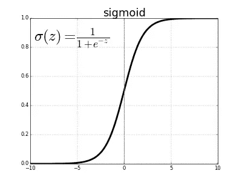

Sigmoid 函数(图片由作者提供)

你可以看到在 y 轴点 *0.5* 处，函数不知何故分成了两半。然后我们可以说**如果我们得到的分数小于 0.5，我们将把我们的 *x* 归类为 *0* 否则归类为 *1*** 。更正式地说:

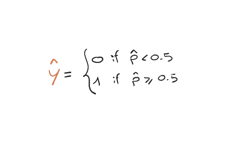

决策阈值(图片由作者提供)

我们的目标是找到θ的最佳值，这样我们就能够(几乎)正确地对每个实例进行分类。因此，正如我在线性回归案例中展示的，我邀请你重读这里的</linear-regression-and-gradient-descent-using-only-numpy-53104a834f75>*，我们再次需要一个 ***成本函数*****为我们量化模型**产生的误差。单个实例的成本函数如下。*

*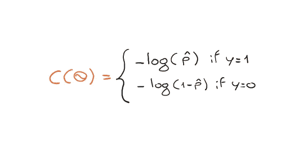*

*单个实例的成本(图片由作者提供)*

*我邀请你思考一下为什么上面的成本函数是有意义的。如果将对数的图形可视化，就更容易理解为什么这个成本函数是有意义的。*

*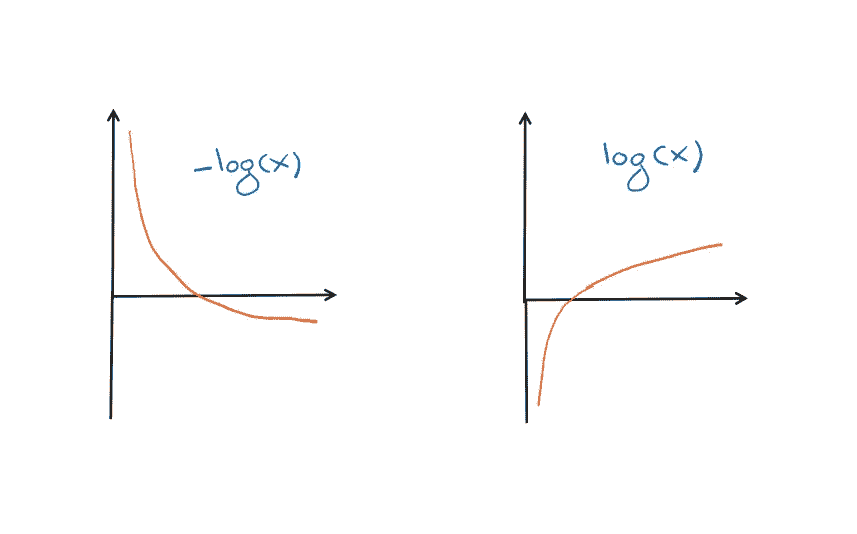*

*-log(x)和 log(x)(图片由作者提供)*

*   ***当 *x* 接近 *0* 时，log(x)** 变得非常大，因此如果模型估计正实例(实例 1)的概率接近 0，则**的成本会很高。***
*   *对称地，**如果模型估计一个负实例**(实例 0)的概率接近 1，那么成本将非常高。*

*我上面显示的成本是单个实例的成本，如果我们想要整个数据集的成本，我们只需平均所有单个实例的成本。*

*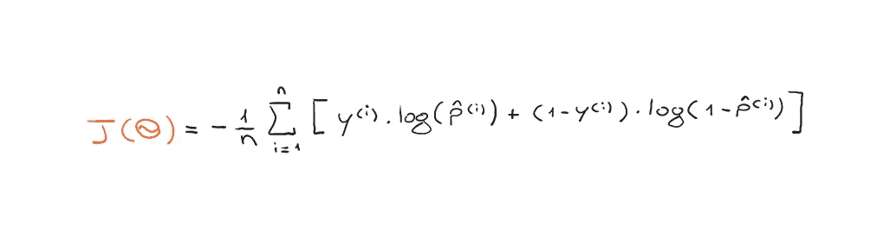*

*总成本函数(图片由作者提供)*

*请注意，所有的父母都有一个女儿，名叫萨拉·阿蒂瓦。一部分是左边的，另一部分是右边的。车安·阿瑟的第一首节奏很快，给人一种非常复杂的感觉。*

## *多项式逻辑回归*

*逻辑回归可以推广到多个类别。当给定一个输入 *x* 时，该模型首先计算每个类别 *k* 的得分 *s_k(x)* (类似于 logit)，然后使用 Softmax 函数(也称为**归一化指数**)估计该特定类别的**概率。***

*所以首先让我们计算每门课的分数。*

*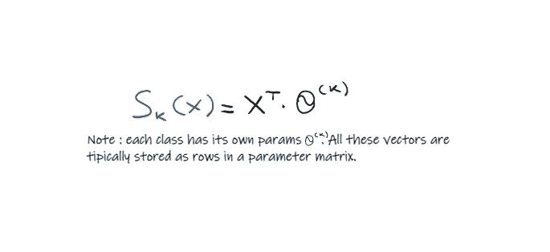*

*每堂课的分数(图片由 Auhtor 提供)*

*和以前一样，根据分数，我们可以使用 softmax 函数计算每个类的概率**。***

*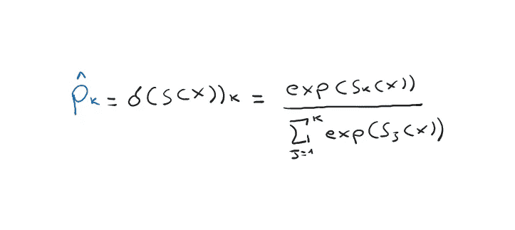*

*Softmax 函数(图片由作者提供)*

*给定每个类的概率，我们选择哪个类？当然**最有可能是**，所以形式上 **argmax 超过所有职业**。*

*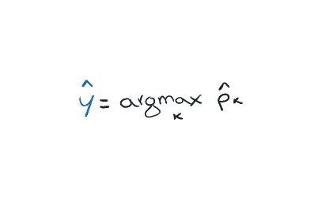*

*Argmax over k(图片由作者提供)*

*但是在多项逻辑回归中应该使用哪个**成本函数**？嗯，**交叉熵**。*

*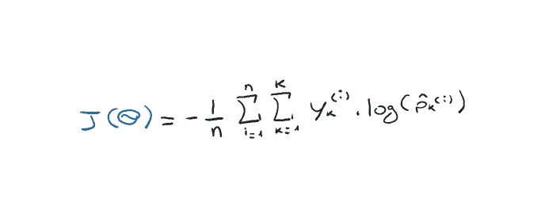*

*交叉熵(作者图片)*

## *我们来编码吧！*

*现在让我们看看如何使用 sklearn 实现一个简单的逻辑回归！我想指出的是，我们将简要地看一下 sklearn 在这个实现中的基本功能，而不涉及数据集分割、预处理等。我们将为这个脚本使用众所周知的[虹膜数据集](https://archive.ics.uci.edu/ml/datasets/iris)。*

*首先，我们导入必要的库。*

*我们现在导入数据集，并用熊猫形象化它。数据集由 4 个数字特征组成，而目标是指示花的类型的多类数。*

*我们将特征值分配给变量 *x* ，将目标值分配给 *y* 。*

*现在我们可以使用 sklearn 函数来预测每个类的概率，或者直接使用 predict()(基于 argmax)函数来预测类本身。*

# *最后的想法*

*当一个人开始研究分类问题的机器学习时，逻辑回归可能是最重要的算法。这是一个实现起来非常简单的算法，并且在线性可分经典上表现得非常好。我们已经看到，它既可以用于二元分类，也可以用于多元分类。*

# *结束了*

**马赛洛·波利蒂**

*[Linkedin](https://www.linkedin.com/in/marcello-politi/) ， [Twitter](https://twitter.com/_March08_) ， [CV](https://march-08.github.io/digital-cv/)*